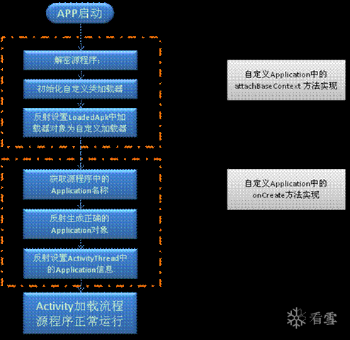
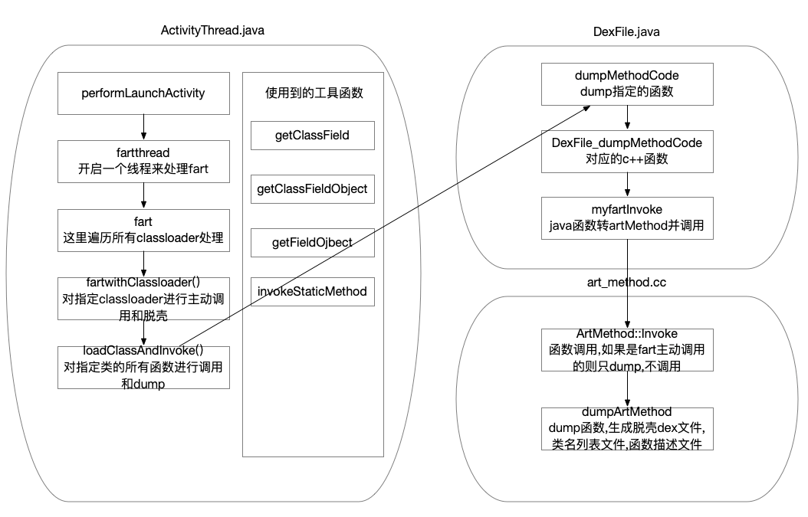

# fart的理解和分析过程

url：http://missking.cc/2020/11/03/fart/


文章内的fart的源码素材均来自看雪搞研网课。安卓源码为8.1

学习了一段时间fart然后整理一下以便哪天忘记了翻翻

fart是一个art环境下基于主动调用的自动化脱壳方案。在定制的fart环境中，只需要运行需要脱壳的apk即可自动脱壳，将脱壳后的dex文件dump在/sdcard/fart/app包名的目录下，那么这个流程是如何实现的呢。

内部的一些原理作者有发过帖子详细进行过讲解，所以这里先是跟着作者的思想进行一步步的深入。先贴上地址

1、[FART：ART环境下基于主动调用的自动化脱壳方案][https://bbs.pediy.com/thread-252630.htm]

2、[FART正餐前甜点：ART下几个通用简单高效的dump内存中dex方法][https://bbs.pediy.com/thread-254028.htm]

3、[拨云见日：安卓APP脱壳的本质以及如何快速发现ART下的脱壳点][https://bbs.pediy.com/thread-254555.htm]

阅读几篇文章后，我简单整理一下收获


ActivityThread.main()是一个app开始的入口，下面先贴下8.1系统的main的代码

```
public static void main(String[] args) {
        SamplingProfilerIntegration.start();
        CloseGuard.setEnabled(false);
        Environment.initForCurrentUser();
        EventLogger.setReporter(new ActivityThread.EventLoggingReporter());
        Security.addProvider(new AndroidKeyStoreProvider());
        File configDir = Environment.getUserConfigDirectory(UserHandle.myUserId());
        TrustedCertificateStore.setDefaultUserDirectory(configDir);
        Process.setArgV0("<pre-initialized>");
        Looper.prepareMainLooper();
        ActivityThread thread = new ActivityThread();
        thread.attach(false);
        if (sMainThreadHandler == null) {
            sMainThreadHandler = thread.getHandler();
        }
        Looper.loop();
        throw new RuntimeException("Main thread loop unexpectedly exited");
    }
```

这里看到主要是创建了一个ActivityThread然后调用了attach，然后就是进入了主线程的事件循环，在attach的里面将这个ActivityThread保存在了一个全局的静态变量中。attach代码比较多，我就只截一点点了。

```
private static ActivityThread sCurrentActivityThread;
public static ActivityThread currentActivityThread() {
        return sCurrentActivityThread;
}
private void attach(boolean system) {
    sCurrentActivityThread = this;
}
```

然后再看看主线程的事件循环做了什么

```
public static void loop() {
        Looper me = myLooper();
        if (me == null) {
            throw new RuntimeException("No Looper; Looper.prepare() wasn't called on this thread.");
        } else {
            MessageQueue queue = me.mQueue;
            Binder.clearCallingIdentity();
            long ident = Binder.clearCallingIdentity();

            while(true) {
                Message msg = queue.next();
                if (msg == null) {
                    return;
                }
                Printer logging = me.mLogging;
                if (logging != null) {
                    logging.println(">>>>> Dispatching to " + msg.target + " " + msg.callback + ": " + msg.what);
                }
                msg.target.dispatchMessage(msg);
                if (logging != null) {
                    logging.println("<<<<< Finished to " + msg.target + " " + msg.callback);
                }

                long newIdent = Binder.clearCallingIdentity();
                if (ident != newIdent) {
                    Log.wtf("Looper", "Thread identity changed from 0x" + Long.toHexString(ident) + " to 0x" + Long.toHexString(newIdent) + " while dispatching to " + msg.target.getClass().getName() + " " + msg.callback + " what=" + msg.what);
                }

                msg.recycleUnchecked();
            }
        }
    }
```

然后看到消息交给dispatchMessage这个函数进行分发处理继续看看这个函数

```
public void dispatchMessage(Message msg) {
        if (msg.callback != null) {
            handleCallback(msg);
        } else {
            if (this.mCallback != null && this.mCallback.handleMessage(msg)) {
                return;
            }
            this.handleMessage(msg);
        }

    }
```

到这里。就进入了handleMessage处理消息分发，这里注意。这个地方的handle使用的是ActivityThread内部的H类，看ActivityThread的以下代码

```
final ActivityThread.H mH = new ActivityThread.H();
final Handler getHandler() {
        return this.mH;
    }
```

所以这里看H类的handleMessage函数，代码太多，这里只贴文章里面所说的bindapplication的处理

```
case 110:
    Trace.traceBegin(64L, "bindApplication");
    ActivityThread.AppBindData data = (ActivityThread.AppBindData)msg.obj;
    ActivityThread.this.handleBindApplication(data);
    Trace.traceEnd(64L);
    break;
```

然后继续看handleBindApplication，我们就可以看到大神所说的重要的点了

```
Application app = data.info.makeApplication(data.restrictedBackupMode, (Instrumentation)null);
this.mInitialApplication = app;
if (!data.restrictedBackupMode) {
  List<ProviderInfo> providers = data.providers;
  if (providers != null) {
    this.installContentProviders(app, providers);
    this.mH.sendEmptyMessageDelayed(132, 10000L);
  }
}

try {
  this.mInstrumentation.onCreate(data.instrumentationArgs);
} catch (Exception var20) {
  throw new RuntimeException("Exception thrown in onCreate() of " + data.instrumentationName + ": " + var20.toString(), var20);
}

try {
  this.mInstrumentation.callApplicationOnCreate(app);
} catch (Exception var26) {
  if (!this.mInstrumentation.onException(app, var26)) {
    throw new RuntimeException("Unable to create application " + app.getClass().getName() + ": " + var26.toString(), var26);
  }
}
```

这里的callApplicationOnCreate就是app的onCreate调用了。再看看前面的makeApplication的代码

```
ContextImpl appContext = ContextImpl.createAppContext(this.mActivityThread, this);
app = this.mActivityThread.mInstrumentation.newApplication(cl, appClass, appContext);
appContext.setOuterContext(app);
```

这里又调用了newApplication,继续看里面

```
public static Application newApplication(Class<?> clazz, Context context) throws InstantiationException, IllegalAccessException, ClassNotFoundException {
    Application app = (Application)clazz.newInstance();
    app.attach(context);
    return app;
}
```

继续再看app的attach

```
final void attach(Context context) {
    this.attachBaseContext(context);
    this.mLoadedApk = ContextImpl.getImpl(context).mPackageInfo;
}
```

到这里就知道了大家都喜欢的attachBaseContext和onCreate分别是在什么时机调用的了

然后就看下面的图



这里的意思就是加壳的app会在attachBaseContext函数和onCreate函数里面对dex进行解密，解密后再用反射修复里面的变量。最后修复成正常的dex。其中最重要的就是Classloader。所有的应用中加载的dex文件最终都在应用的Classloader中。

所以我们只要取到加壳的应用最后修复完，正常加载时的Classloader就脱壳成功了。这种脱壳方式就是所谓的整体dump。

后来的第二代壳所谓的函数抽取，就是为了防止修复后的dex被直接整体dump给脱下来，然后将类和函数的关键流程在调用时，才进行解密修复。而fart的主动调用所有函数，就会触发解密修复，然后再进行dump，从而实现函数抽取壳的脱壳。

fart脱壳的原理下面贴上作者大佬的原话。

```
FART脱壳的步骤主要分为三步：
1.内存中DexFile结构体完整dex的dump
2.主动调用类中的每一个方法，并实现对应CodeItem的dump
3.通过主动调用dump下来的方法的CodeItem进行dex中被抽取的方法的修复
```

一代壳的脱法，就是选择一个已经完成解密加载的时机，然后把完整的dex给dump下来。由于加壳是通过替换attachBaseContext和onCreate函数，在这两个函数里面解密dex。所以时机选在onCreate后的任意函数都可以。作者大佬选择的是performLaunchActivity作为脱壳的时机。下面贴上关键部分代码

```
private Activity performLaunchActivity(ActivityClientRecord r, Intent customIntent) {
    fartthread();
}
public static void fartthread() {
  new Thread(new Runnable() {
    @Override
    public void run() {
      // TODO Auto-generated method stub
      try {
        Log.e("ActivityThread", "start sleep......");
        Thread.sleep(1 * 60 * 1000);
      } catch (InterruptedException e) {
        // TODO Auto-generated catch block
        e.printStackTrace();
      }
      Log.e("ActivityThread", "sleep over and start fart");
      fart();
      Log.e("ActivityThread", "fart run over");
    }
  }).start();
}
```

这里开了一个线程去处理，接着继续看fart做了些啥

```
public static void fart() {
  ClassLoader appClassloader = getClassloader();
  ClassLoader tmpClassloader=appClassloader;
  ClassLoader parentClassloader=appClassloader.getParent();
  //如果当前classloader不是根，就脱他
  if(appClassloader.toString().indexOf("java.lang.BootClassLoader")==-1)
  {
    fartwithClassloader(appClassloader);
  }
  //如果有父节点，并且父节点不是根，就脱他。一直脱到根节点就结束
  while(parentClassloader!=null){
    if(parentClassloader.toString().indexOf("java.lang.BootClassLoader")==-1)
    {
      fartwithClassloader(parentClassloader);
    }
    tmpClassloader=parentClassloader;
    parentClassloader=parentClassloader.getParent();
  }
}
```

这里相当于是从当前classloader一直向上层的遍历，把所有classloader挨个脱一遍。先看看他是怎么获取classloader的

```
public static ClassLoader getClassloader() {
  ClassLoader resultClassloader = null;
  //这里反射获取到的currentActivityThread
  Object currentActivityThread = invokeStaticMethod(
    "android.app.ActivityThread", "currentActivityThread",
    new Class[]{}, new Object[]{});
  //这里反射获取出mBoundApplication
  Object mBoundApplication = getFieldOjbect(
    "android.app.ActivityThread", currentActivityThread,
    "mBoundApplication");
  Application mInitialApplication = (Application) getFieldOjbect("android.app.ActivityThread",
                                                                 currentActivityThread, "mInitialApplication");
  Object loadedApkInfo = getFieldOjbect(
    "android.app.ActivityThread$AppBindData",
    mBoundApplication, "info");
  //反射获取出目标application
  Application mApplication = (Application) getFieldOjbect("android.app.LoadedApk", loadedApkInfo, "mApplication");
  //获取classloader
  resultClassloader = mApplication.getClassLoader();
  return resultClassloader;
}
```

由于我不太了解为什么是获取android.app.LoadedApk里面的mApplication。所以特地的去翻了一下。这个值的来源。

```
public Application makeApplication(boolean forceDefaultAppClass, Instrumentation instrumentation) {
  if (this.mApplication != null) {
    return this.mApplication;
  } else {
    Application app = null;
    //...省略中间app创建的若干代码
    this.mActivityThread.mAllApplications.add(app);
    this.mApplication = app;
    //...省略中间若干代码
    return app;
  }
}
private Activity performLaunchActivity(ActivityClientRecord r, Intent customIntent) {
  Application app = r.packageInfo.makeApplication(false, mInstrumentation);
    //....
  //省略中间的代码
  //add
  fartthread();
  //add
  return activity;
}
```

这样子看，在这个时机的脱壳必然是能取到那个mApplication的。大概就看出这么点原因。

==========================================================================================

里面还有很多地方不太理解。所以这里先从fart中跳出来，先看看android源码中对于获取一个ClassLoader的追溯，看看里面是怎么实现获取一个ClassLoader的。先看看java代码我们要如何获取一个ClassLoader

```
ClassLoader cl = ClassLoader.getSystemClassLoader();
cl.loadClass("com.example.demo");
```

这里可以看到直接通过loadClass取到的classLoader，那么这个函数是怎么做到的呢，下面贴下代码追踪ClassLoader.java中的loadClass

```
public Class<?> loadClass(String name) throws ClassNotFoundException {
  return loadClass(name, false);
}
```

调用了另外一个重载，继续贴第二个重载的代码

```
protected Class<?> loadClass(String name, boolean resolve)
  throws ClassNotFoundException
{
  // First, check if the class has already been loaded
  Class<?> c = findLoadedClass(name);
  if (c == null) {
    try {
      if (parent != null) {
        c = parent.loadClass(name, false);
      } else {
        c = findBootstrapClassOrNull(name);
      }
    } catch (ClassNotFoundException e) {
      // ClassNotFoundException thrown if class not found
      // from the non-null parent class loader
    }

    if (c == null) {
      // If still not found, then invoke findClass in order
      // to find the class.
      c = findClass(name);
    }
  }
  return c;
}
```

这里的意思大概就是，如果曾经获取过，findLoadedClass就直接可以获取到并返回。否则就继续通过findClass查找。

```
protected Class<?> findClass(String name) throws ClassNotFoundException {
throw new ClassNotFoundException(name);
}
```

这个是个默认,好像这个是提供给子类重写的。然后我们再看看父类BaseDexClassLoader也有一个findClass

```
private final DexPathList pathList;
@Override
protected Class<?> findClass(String name) throws ClassNotFoundException {
  List<Throwable> suppressedExceptions = new ArrayList<Throwable>();
  Class c = pathList.findClass(name, suppressedExceptions);
  if (c == null) {
  ClassNotFoundException cnfe = new ClassNotFoundException(
  "Didn't find class \"" + name + "\" on path: " + pathList);
  for (Throwable t : suppressedExceptions) {
  cnfe.addSuppressed(t);
  }
  throw cnfe;
  }
  return c;
}
```

这里可以看到最后返回的Class c又是由pathList.findClass获取的。继续看DexPathList类的findClass，后面fart里面有参考这里的代码。在fart中同样是获取dexElements，然后遍历，然后取出dexFile。然后再进行各种操作。

```
public Class findClass(String name, List<Throwable> suppressed) {
  DexPathList.Element[] arr$ = this.dexElements;
  int len$ = arr$.length;

  for(int i$ = 0; i$ < len$; ++i$) {
    DexPathList.Element element = arr$[i$];
    DexFile dex = element.dexFile;
    if (dex != null) {
      Class clazz = dex.loadClassBinaryName(name, this.definingContext, suppressed);
      if (clazz != null) {
        return clazz;
      }
    }
  }

  if (this.dexElementsSuppressedExceptions != null) {
    suppressed.addAll(Arrays.asList(this.dexElementsSuppressedExceptions));
  }

  return null;
}
```

然后继续看返回值的来源是通过loadClassBinaryName来获取的。继续看看实现的代码

```
public Class loadClassBinaryName(String name, ClassLoader loader, List<Throwable> suppressed) {
  return defineClass(name, loader, this.mCookie, suppressed);
}
```

接着继续看defineClass

```
private static Class defineClass(String name, ClassLoader loader, long cookie, List<Throwable> suppressed) {
  Class result = null;

  try {
    result = defineClassNative(name, loader, cookie);
  } catch (NoClassDefFoundError var7) {
    if (suppressed != null) {
      suppressed.add(var7);
    }
  } catch (ClassNotFoundException var8) {
    if (suppressed != null) {
      suppressed.add(var8);
    }
  }

  return result;
}
```

结果又是从defineClassNative来的。而这个函数就是一个native的函数。再翻就得去c++里面找代码了。下面再回到fart的脱壳函数fartwithClassloader，就会发现不少眼熟的地方了

重新回到fart继续看看fartwithClassloader这个函数如何实现脱classloader的

```
public static void fartwithClassloader(ClassLoader appClassloader) {
  List<Object> dexFilesArray = new ArrayList<Object>();
  //这个是刚刚的findClass的pathList。这里通过反射获取。不过这个下面没使用。
  Field pathList_Field = (Field) getClassField(appClassloader, "dalvik.system.BaseDexClassLoader", "pathList");
  //和上面一样。不过这个是直接获取这个属性的结果出来，比上面多了个field.get()
  Object pathList_object = getFieldOjbect("dalvik.system.BaseDexClassLoader", appClassloader, "pathList");
  //通过反射获取dexElements，这个流程可以直接回顾上面的findClass。基本是一样的。
  Object[] ElementsArray = (Object[]) getFieldOjbect("dalvik.system.DexPathList", pathList_object, "dexElements");
  Field dexFile_fileField = null;
  try {
    dexFile_fileField = (Field) getClassField(appClassloader, "dalvik.system.DexPathList$Element", "dexFile");
  } catch (Exception e) {
    e.printStackTrace();
  } catch (Error e) {
    e.printStackTrace();
  }
  Class DexFileClazz = null;
  try {
    //反射获取dexfile类型
    DexFileClazz = appClassloader.loadClass("dalvik.system.DexFile");
  } catch (Exception e) {
    e.printStackTrace();
  } catch (Error e) {
    e.printStackTrace();
  }
  Method getClassNameList_method = null;
  Method defineClass_method = null;
  Method dumpDexFile_method = null;
  Method dumpMethodCode_method = null;
    //通过反射将4个函数的值填充上
  for (Method field : DexFileClazz.getDeclaredMethods()) {
    //这个应该是用来获取类名称列表的
    if (field.getName().equals("getClassNameList")) {
      getClassNameList_method = field;
      getClassNameList_method.setAccessible(true);
    }
    //这个是我们在上面loadClass流程最后看到的函数
    if (field.getName().equals("defineClassNative")) {
      defineClass_method = field;
      defineClass_method.setAccessible(true);
    }
    //这个用来保存整个dex的,是fart里面的代码
    if (field.getName().equals("dumpDexFile")) {
      dumpDexFile_method = field;
      dumpDexFile_method.setAccessible(true);
    }
    //这个应该是用来保存函数代码的，也是fart里面的代码
    if (field.getName().equals("dumpMethodCode")) {
      dumpMethodCode_method = field;
      dumpMethodCode_method.setAccessible(true);
    }
  }
  //这个是获取mCookie字段。不过后面也是没有用到的
  Field mCookiefield = getClassField(appClassloader, "dalvik.system.DexFile", "mCookie");
  Log.v("ActivityThread->methods", "dalvik.system.DexPathList.ElementsArray.length:" + ElementsArray.length);//5个
  //下面是遍历所有dexfile，然后主动调用所有函数
  for (int j = 0; j < ElementsArray.length; j++) {
    Object element = ElementsArray[j];
    Object dexfile = null;
    try {
      //先是反射取出每个dexfile
      dexfile = (Object) dexFile_fileField.get(element);
    } catch (Exception e) {
      e.printStackTrace();
    } catch (Error e) {
      e.printStackTrace();
    }
    if (dexfile == null) {
      Log.e("ActivityThread", "dexfile is null");
      continue;
    }
    if (dexfile != null) {
      //然后取出dexfile中的mcookie，这里为什么从mInternalCookie可以在android源码中看到mCookie本身就是由mInternalCookie赋值的
      dexFilesArray.add(dexfile);
      Object mcookie = getClassFieldObject(appClassloader, "dalvik.system.DexFile", dexfile, "mCookie");
      if (mcookie == null) {
        Object mInternalCookie = getClassFieldObject(appClassloader, "dalvik.system.DexFile", dexfile, "mInternalCookie");
        if(mInternalCookie!=null)
        {
          mcookie=mInternalCookie;
        }else{
          Log.v("ActivityThread->err", "get mInternalCookie is null");
          continue;
        }

      }
      //再根据mcookie获取dexfile的所有类名
      String[] classnames = null;
      try {
        classnames = (String[]) getClassNameList_method.invoke(dexfile, mcookie);
      } catch (Exception e) {
        e.printStackTrace();
        continue;
      } catch (Error e) {
        e.printStackTrace();
        continue;
      }
      //最后遍历所有类，调用每个类中的所有函数
      if (classnames != null) {
        for (String eachclassname : classnames) {
          loadClassAndInvoke(appClassloader, eachclassname, dumpMethodCode_method);
        }
      }
    }
  }
  return;
}
```

继续看看fart怎么做到的调用每个类中的所有函数

```
public static void loadClassAndInvoke(ClassLoader appClassloader, String eachclassname, Method dumpMethodCode_method) {
  Class resultclass = null;
  Log.i("ActivityThread", "go into loadClassAndInvoke->" + "classname:" + eachclassname);
  try {
    //由于我们反射取到了类名，所以这里直接用我们前面看到的loadClass就可以取到对应的classloader了
    resultclass = appClassloader.loadClass(eachclassname);
  } catch (Exception e) {
    e.printStackTrace();
    return;
  } catch (Error e) {
    e.printStackTrace();
    return;
  }
  //反射遍历所有构造函数，并且调用前面准备好了传过来的保存构造函数代码的方法，直接调用就可以dump每个构造函数的代码了
  if (resultclass != null) {
    try {
      Constructor<?> cons[] = resultclass.getDeclaredConstructors();
      for (Constructor<?> constructor : cons) {
        if (dumpMethodCode_method != null) {
          try {
            dumpMethodCode_method.invoke(null, constructor);
          } catch (Exception e) {
            e.printStackTrace();
            continue;
          } catch (Error e) {
            e.printStackTrace();
            continue;
          }
        } else {
          Log.e("ActivityThread", "dumpMethodCode_method is null ");
        }

      }
    } catch (Exception e) {
      e.printStackTrace();
    } catch (Error e) {
      e.printStackTrace();
    }
    //这里反射获取所有的函数，然后用前面准备的dump方法把所有函数都dump下来
    try {
      Method[] methods = resultclass.getDeclaredMethods();
      if (methods != null) {
        for (Method m : methods) {
          if (dumpMethodCode_method != null) {
            try {
              dumpMethodCode_method.invoke(null, m);
            } catch (Exception e) {
              e.printStackTrace();
              continue;
            } catch (Error e) {
              e.printStackTrace();
              continue;
            }
          } else {
            Log.e("ActivityThread", "dumpMethodCode_method is null ");
          }
        }
      }
    } catch (Exception e) {
      e.printStackTrace();
    } catch (Error e) {
      e.printStackTrace();
    }
  }
}
```

接下来就看看我们提前准备的dumpMethod是如何dump函数的了。找到DexFile里面的native实现的代码

```
private static native void dumpMethodCode(Object m);
static void DexFile_dumpMethodCode(JNIEnv* env, jclass,jobject method) {
    if(method!=nullptr)
    {
        ArtMethod* proxy_method = jobject2ArtMethod(env, method);
        myfartInvoke(proxy_method);
    }
    return;
}
```

这里先是把java传递过来的函数指针转换成了ArtMethod了。然后myfartInvoke来处理每个函数。继续看看里面怎么做的

```
extern "C" void myfartInvoke(ArtMethod* artmethod)  REQUIRES_SHARED(Locks::mutator_lock_) {
  JValue *result=nullptr;
  Thread *self=nullptr;
  uint32_t temp=6;
  uint32_t* args=&temp;
  uint32_t args_size=6;
  artmethod->Invoke(self, args, args_size, result, "fart");
}
```

看到是调用了artmethod的Invoke。然后最后一个参数来告知里面，这是一个fart主动调用的函数。继续看看里面处理。代码有点多，下，面代码只放上和fart相关的处理

```
void ArtMethod::Invoke(Thread* self, uint32_t* args, uint32_t args_size, JValue* result,
                       const char* shorty) {
    if (self== nullptr) {
        dumpArtMethod(this);
        return;
    }
}
```

这里看到。其实他虽然传了个fart字符串进来想作为判断的。但是实际上没有使用。最后还是根据第一个参数self是否为nullptr来判断用不用dump这个函数的。继续看dumpArtMethod的处理

```
extern "C" void dumpArtMethod(ArtMethod* artmethod)  REQUIRES_SHARED(Locks::mutator_lock_) {
        char *dexfilepath=(char*)malloc(sizeof(char)*1000);
        if(dexfilepath==nullptr)
        {
            LOG(ERROR) << "ArtMethod::dumpArtMethodinvoked,methodname:"<<artmethod->PrettyMethod().c_str()<<"malloc 1000 byte failed";
            return;
        }
        int result=0;
        int fcmdline =-1;
        char szCmdline[64]= {0};
        char szProcName[256] = {0};
        int procid = getpid();
            //我查了下，/proc/pid/cmdline 是可以读取到进程的启动参数。启动参数的默认第一个一般都是进程的完整路径
        sprintf(szCmdline,"/proc/%d/cmdline", procid);
        fcmdline = open(szCmdline, O_RDONLY,0644);
        if(fcmdline >0)
        {
            result=read(fcmdline, szProcName,256);
            if(result<0)
            {
                LOG(ERROR) << "ArtMethod::dumpdexfilebyArtMethod,open cmdline file file error";
            }
            close(fcmdline);
        }
                
        if(szProcName[0])
        {
            const DexFile* dex_file = artmethod->GetDexFile();
              //要保存dexfile的起始位置
            const uint8_t* begin_=dex_file->Begin();  // Start of data.
              //要保存dexfile的大小
            size_t size_=dex_file->Size();  // Length of data.

            memset(dexfilepath,0,1000);
            int size_int_=(int)size_;
                        //先初始化目录/sdcard/fart  创建目录并给0777的权限
            memset(dexfilepath,0,1000);
            sprintf(dexfilepath,"%s","/sdcard/fart");
            mkdir(dexfilepath,0777);
                      //然后把cmdline中读取到的路径在fart中同样创建目录，这样就可以区分不同的apk的结果写在不同目录
            memset(dexfilepath,0,1000);
            sprintf(dexfilepath,"/sdcard/fart/%s",szProcName);
            mkdir(dexfilepath,0777);
                        //最后创建要写入保存的文件
            memset(dexfilepath,0,1000);
            sprintf(dexfilepath,"/sdcard/fart/%s/%d_dexfile.dex",szProcName,size_int_);
            int dexfilefp=open(dexfilepath,O_RDONLY,0666);
              //这里相当于是查一下这个文件是否存在。如果fp大于0表示存在，则不用再dump了。
            if(dexfilefp>0){
                close(dexfilefp);
                dexfilefp=0;

            }else{
                int fp=open(dexfilepath,O_CREAT|O_APPEND|O_RDWR,0666);
                if(fp>0)
                {
                      //将要保存的数据写入文件，这种应该是属于整体dump
                    result=write(fp,(void*)begin_,size_);
                    if(result<0)
                    {
                        LOG(ERROR) << "ArtMethod::dumpdexfilebyArtMethod,open dexfilepath file error";

                    }
                    fsync(fp);
                    close(fp);
                      //下面是把所有类名写入文件保存。方便搜索。可能修复的时候也会用到这个文件
                    memset(dexfilepath,0,1000);
                    sprintf(dexfilepath,"/sdcard/fart/%s/%d_classlist.txt",szProcName,size_int_);
                    int classlistfile=open(dexfilepath,O_CREAT|O_APPEND|O_RDWR,0666);
                    if(classlistfile>0)
                    {
                          //这里我瞅着眼熟，然后翻了下。其实就是参考GetClassNames的处理。获取了所有的类名列表，然后写入文件
                        for (size_t ii= 0; ii< dex_file->NumClassDefs(); ++ii)
                        {
                            const DexFile::ClassDef& class_def = dex_file->GetClassDef(ii);
                            const char* descriptor = dex_file->GetClassDescriptor(class_def);
                            result=write(classlistfile,(void*)descriptor,strlen(descriptor));
                            if(result<0)
                            {
                                LOG(ERROR) << "ArtMethod::dumpdexfilebyArtMethod,write classlistfile file error";

                            }
                            const char* temp="\n";
                            result=write(classlistfile,(void*)temp,1);
                            if(result<0)
                            {
                                LOG(ERROR) << "ArtMethod::dumpdexfilebyArtMethod,write classlistfile file error";

                            }
                        }
                        fsync(classlistfile);
                        close(classlistfile);

                    }
                }

            }
              //下面是要对函数进行dump
            const DexFile::CodeItem* code_item = artmethod->GetCodeItem();
            if (LIKELY(code_item != nullptr))
            {
                int code_item_len = 0;
                uint8_t *item=(uint8_t *) code_item;
                  //这里表示是否有try，因为try的数量会影响函数的大小，我们dump需要函数的位置和计算出函数大小。
                if (code_item->tries_size_>0) {
                      //有try的情况计算比较复杂，这个codeitem_end里面封装了一系列的计算，我感觉好像是获取了try的数量，然后再一系列的计算，最终得到的函数大小
                    const uint8_t *handler_data = (const uint8_t *)(DexFile::GetTryItems(*code_item, code_item->tries_size_));
                    uint8_t * tail = codeitem_end(&handler_data);
                    code_item_len = (int)(tail - item);
                }else{
                      //如果没有try的情况。就简单的可以计算出来。
                    code_item_len = 16+code_item->insns_size_in_code_units_*2;
                }
                  //有了函数的大小和位置后，这里又获取了函数的index
                memset(dexfilepath,0,1000);
                int size_int=(int)dex_file->Size();
                uint32_t method_idx=artmethod->GetDexMethodIndexUnchecked();
                  //最后把获取到的相关数据按照特定的格式写入.bin的文件中。这个文件后面就可以拿来做修复dex。因为已经有了对每个函数的详细描述了。
                sprintf(dexfilepath,"/sdcard/fart/%s/%d_ins_%d.bin",szProcName,size_int,(int)gettidv1());
                int fp2=open(dexfilepath,O_CREAT|O_APPEND|O_RDWR,0666);
                if(fp2>0){
                    lseek(fp2,0,SEEK_END);
                    memset(dexfilepath,0,1000);
                    int offset=(int)(item - begin_);
                    sprintf(dexfilepath,"{name:%s,method_idx:%d,offset:%d,code_item_len:%d,ins:",artmethod->PrettyMethod().c_str(),method_idx,offset,code_item_len);
                    int contentlength=0;
                    while(dexfilepath[contentlength]!=0) contentlength++;
                    result=write(fp2,(void*)dexfilepath,contentlength);
                    if(result<0)
                    {
                        LOG(ERROR) << "ArtMethod::dumpdexfilebyArtMethod,write ins file error";

                    }
                    long outlen=0;
                    char* base64result=base64_encode((char*)item,(long)code_item_len,&outlen);
                    result=write(fp2,base64result,outlen);
                    if(result<0)
                    {
                        LOG(ERROR) << "ArtMethod::dumpdexfilebyArtMethod,write ins file error";

                    }
                    result=write(fp2,"};",2);
                    if(result<0)
                    {
                        LOG(ERROR) << "ArtMethod::dumpdexfilebyArtMethod,write ins file error";

                    }
                    fsync(fp2);
                    close(fp2);
                    if(base64result!=nullptr){
                        free(base64result);
                        base64result=nullptr;
                    }
                }
            }
        }
        if(dexfilepath!=nullptr)
        {
            free(dexfilepath);
            dexfilepath=nullptr;
        }

    }
```

再贴一个codeitem_end是怎么计算包含try的函数大小

```
uint8_t* codeitem_end(const uint8_t **pData)
{
  uint32_t num_of_list = DecodeUnsignedLeb128(pData);
  for (;num_of_list>0;num_of_list--) {
    int32_t num_of_handlers=DecodeSignedLeb128(pData);
    int num=num_of_handlers;
    if (num_of_handlers<=0) {
      num=-num_of_handlers;
    }
    for (; num > 0; num--) {
      DecodeUnsignedLeb128(pData);
      DecodeUnsignedLeb128(pData);
    }
    if (num_of_handlers<=0) {
      DecodeUnsignedLeb128(pData);
    }
  }
  return (uint8_t*)(*pData);
}
```

到这里fart的主动调用脱壳流程基本完成。当然还有一些辅助frida的处理函数，下面贴一些大神为了方便我们使用frida来处理而包装的函数

```
//反射获取指定类的指定字段
public static Field getClassField(ClassLoader classloader, String class_name,
                                      String filedName) {
        try {
            Class obj_class = classloader.loadClass(class_name);//Class.forName(class_name);
            Field field = obj_class.getDeclaredField(filedName);
            field.setAccessible(true);
            return field;
        } catch (SecurityException e) {
            e.printStackTrace();
        } catch (NoSuchFieldException e) {
            e.printStackTrace();
        } catch (IllegalArgumentException e) {
            e.printStackTrace();
        } catch (ClassNotFoundException e) {
            e.printStackTrace();
        }
        return null;

    }
        //反射获取指定对象的指定字段的值
    public static Object getClassFieldObject(ClassLoader classloader, String class_name, Object obj,
                                             String filedName) {

        try {
            Class obj_class = classloader.loadClass(class_name);//Class.forName(class_name);
            Field field = obj_class.getDeclaredField(filedName);
            field.setAccessible(true);
            Object result = null;
            result = field.get(obj);
            return result;
        } catch (SecurityException e) {
            e.printStackTrace();
        } catch (NoSuchFieldException e) {
            e.printStackTrace();
        } catch (IllegalArgumentException e) {
            e.printStackTrace();
        } catch (ClassNotFoundException e) {
            e.printStackTrace();
        } catch (IllegalAccessException e) {
            e.printStackTrace();
        }
        return null;

    }
        //反射获取指定对象的指定字段的值。这里注意和上面一个函数的区别是，上面使用了loadClass获取类，这里使用forName获取的，两者获取的class对象是不同的
    public static Object getFieldOjbect(String class_name, Object obj,
                                        String filedName) {
        try {
            Class obj_class = Class.forName(class_name);
            Field field = obj_class.getDeclaredField(filedName);
            field.setAccessible(true);
            return field.get(obj);
        } catch (SecurityException e) {
            e.printStackTrace();
        } catch (NoSuchFieldException e) {
            e.printStackTrace();
        } catch (IllegalArgumentException e) {
            e.printStackTrace();
        } catch (IllegalAccessException e) {
            e.printStackTrace();
        } catch (ClassNotFoundException e) {
            e.printStackTrace();
        } catch (NullPointerException e) {
            e.printStackTrace();
        }
        return null;

    }
        
        //反射调用指定类的指定函数,并返回结果
    public static Object invokeStaticMethod(String class_name,
                                            String method_name, Class[] pareTyple, Object[] pareVaules) {

        try {
            Class obj_class = Class.forName(class_name);
            Method method = obj_class.getMethod(method_name, pareTyple);
            return method.invoke(null, pareVaules);
        } catch (SecurityException e) {
            e.printStackTrace();
        } catch (IllegalArgumentException e) {
            e.printStackTrace();
        } catch (IllegalAccessException e) {
            e.printStackTrace();
        } catch (NoSuchMethodException e) {
            e.printStackTrace();
        } catch (InvocationTargetException e) {
            e.printStackTrace();
        } catch (ClassNotFoundException e) {
            e.printStackTrace();
        }
        return null;

    }
        
```

最后贴一下简单的流程图。

