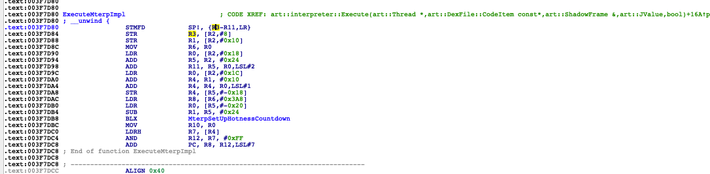
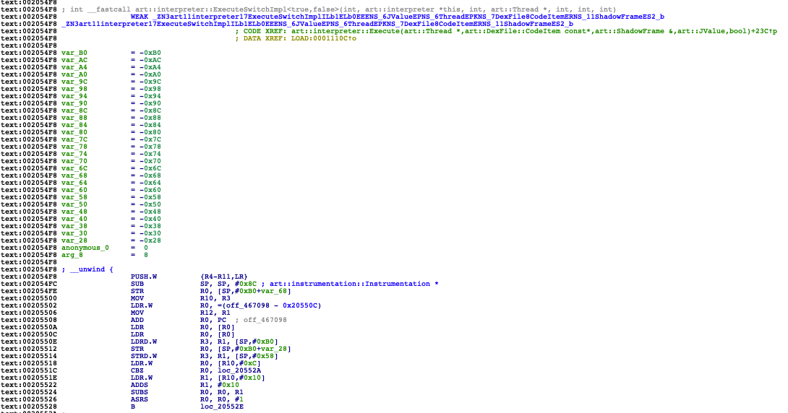

# 使用frida hook解释器Interpreter

url：http://missking.cc/2020/09/03/Hook-Interpreter/


学习的记录

准备hook一下Interpreter解释器的所有执行函数。先看下art/runtime/interpreter/interpreter.cc这个主要文件

```
enum InterpreterImplKind {
  kSwitchImplKind,        // Switch-based interpreter implementation.
  kMterpImplKind          // Assembly interpreter
};

static constexpr InterpreterImplKind kInterpreterImplKind = kMterpImplKind;
```

然后在中间看到了这个枚举，就是说我当前这个8.1的有两种解释器，一个是switch的，另一个是Assembly汇编的，然后看到当前选择的是汇编解释器，继续看下面如果是汇编解释器就怎么处理，代码太长，只截取中间关键的部分了。


```
if (kInterpreterImplKind == kMterpImplKind) {
      if (transaction_active) {
        // No Mterp variant - just use the switch interpreter.
        return ExecuteSwitchImpl<false, true>(self, code_item, shadow_frame, result_register,
                                              false);
      } else if (UNLIKELY(!Runtime::Current()->IsStarted())) {
        return ExecuteSwitchImpl<false, false>(self, code_item, shadow_frame, result_register,
                                               false);
      } else {
        while (true) {
          // Mterp does not support all instrumentation/debugging.
          if (MterpShouldSwitchInterpreters() != 0) {
            return ExecuteSwitchImpl<false, false>(self, code_item, shadow_frame, result_register,
                                                   false);
          }
          bool returned = ExecuteMterpImpl(self, code_item, &shadow_frame, &result_register);
          if (returned) {
            return result_register;
          } else {
            // Mterp didn't like that instruction.  Single-step it with the reference interpreter.
            result_register = ExecuteSwitchImpl<false, false>(self, code_item, shadow_frame,
                                                              result_register, true);
            if (shadow_frame.GetDexPC() == DexFile::kDexNoIndex) {
              // Single-stepped a return or an exception not handled locally.  Return to caller.
              return result_register;
            }
          }
        }
      }
    }
```

可以看到，有些情况会执行ExecuteSwitchImpl来处理，一般都是使用ExecuteMterpImpl进行处理。然后我们看看这两个函数

```
JValue ExecuteSwitchImpl(Thread* self, const DexFile::CodeItem* code_item,
                         ShadowFrame& shadow_frame, JValue result_register,
                         bool interpret_one_instruction)
```

这里看到第三个参数是ShadowFrame，这个对象里面有artmethod，我们可以从这里取到artmethod后再用老办法获取函数名称。先看看ShadowFrame的字段部分

```
ShadowFrame* link_;
ArtMethod* method_;
JValue* result_register_;
const uint16_t* dex_pc_ptr_;
const DexFile::CodeItem* code_item_;
LockCountData lock_count_data_;  // This may contain GC roots when lock counting is active.
const uint32_t number_of_vregs_;
uint32_t dex_pc_;
int16_t cached_hotness_countdown_;
int16_t hotness_countdown_;
```

ShadowFrame这个类没有虚函数，第二个字段就是artmethod。然后我们就知道了这个对象偏移一个指针大小就可以去到想要的artmethod了。

```
var artmethod=ptr(shadow).add(Process.pointerSize).readPointer();
```

然后再看看另一个函数

```
extern "C" bool ExecuteMterpImpl(Thread* self,
                                 const DexFile::CodeItem* code_item,
                                 ShadowFrame* shadow_frame,
                                 JValue* result_register) REQUIRES_SHARED(Locks::mutator_lock_);
```

也是一样的，都是取第三个参数。不过这里有一点不同的区别是。这个函数是汇编实现的。我们再看下汇编的代码

```
ExecuteMterpImpl:
    .cfi_startproc
    SAVE_TWO_REGS_INCREASE_FRAME xPROFILE, x27, 80
    SAVE_TWO_REGS                xIBASE, xREFS, 16
    SAVE_TWO_REGS                xSELF, xINST, 32
    SAVE_TWO_REGS                xPC, xFP, 48
    SAVE_TWO_REGS                fp, lr, 64
    add     fp, sp, #64

    /* Remember the return register */
    str     x3, [x2, #SHADOWFRAME_RESULT_REGISTER_OFFSET]

    /* Remember the code_item */
    str     x1, [x2, #SHADOWFRAME_CODE_ITEM_OFFSET]

    /* set up "named" registers */
    mov     xSELF, x0
    ldr     w0, [x2, #SHADOWFRAME_NUMBER_OF_VREGS_OFFSET]
    add     xFP, x2, #SHADOWFRAME_VREGS_OFFSET     // point to vregs.
    add     xREFS, xFP, w0, lsl #2                 // point to reference array in shadow frame
    ldr     w0, [x2, #SHADOWFRAME_DEX_PC_OFFSET]   // Get starting dex_pc.
    add     xPC, x1, #CODEITEM_INSNS_OFFSET        // Point to base of insns[]
    add     xPC, xPC, w0, lsl #1                   // Create direct pointer to 1st dex opcode
    EXPORT_PC

    /* Starting ibase */
    ldr     xIBASE, [xSELF, #THREAD_CURRENT_IBASE_OFFSET]

    /* Set up for backwards branches & osr profiling */
    ldr     x0, [xFP, #OFF_FP_METHOD]
    add     x1, xFP, #OFF_FP_SHADOWFRAME
    bl      MterpSetUpHotnessCountdown
    mov     wPROFILE, w0                // Starting hotness countdown to xPROFILE

    /* start executing the instruction at rPC */
    FETCH_INST                          // load wINST from rPC
    GET_INST_OPCODE ip                  // extract opcode from wINST
    GOTO_OPCODE ip                      // jump to next instruction
    /* NOTE: no fallthrough */


    .global artMterpAsmInstructionStart
    .type   artMterpAsmInstructionStart, %function
artMterpAsmInstructionStart = .L_op_nop
    .text
```

这样就导致了我们在ida中看到的结果和hook的方式有一些区别。

这里列出我测试的一些区别。





可以看出来ExecuteSwitchImpl这个在export中，而ExecuteMterpImpl这个只在symbol中有。

继续看另外一个区别，下面是ida解析的ExecuteSwitchImpl

```
int __fastcall art::interpreter::ExecuteSwitchImpl<true,true>(int a1, art::interpreter *this, __int64 a3, __int64 a4, int a5)
```

另外就是ida解析的ExecuteMterpImpl

```
void __fastcall ExecuteMterpImpl(int a1, int a2, _DWORD *a3, int a4)
```

可以看出来，前者多了一个参数。看来汇编的函数里面少了最前面的this。那么当我们hook的时候就要注意了，ExecuteSwitchImpl获取shadow_frame需要取args[3]也就是第4个参数，而ExecuteMterpImpl则需要取args[2]也就是第三个参数

接着就是开始frida的代码

```
function callPrettyMethod(artmethod){
    var prettyMethodPtr=Module.getExportByName("libart.so","_ZN3art9ArtMethod12PrettyMethodEb");
    var result=Memory.alloc(0x100);
    var prettyMethod=new NativeFunction(prettyMethodPtr,'pointer',['pointer','pointer','bool']);
    prettyMethod(ptr(result),ptr(artmethod),1);
    var methodName=result.add(0x8).readPointer().readCString()
    return methodName;
}

function hook_interpreter(){
    var module=Process.getModuleByName("libart.so");
    module.enumerateSymbols().forEach(function(symbol){
        if(symbol.name.indexOf("ExecuteSwitchImpl")!=-1){
            console.log(symbol.name,symbol.address);
            Interceptor.attach(symbol.address,{
                onEnter:function(args){
                    var shadow=args[3];
                    var artmethod=ptr(shadow).add(Process.pointerSize).readPointer();
                    var methodName= callPrettyMethod(artmethod);
                    console.log("ExecuteSwitchImpl methodName:",methodName);
                },
                onLeave:function(retval){

                },
            })
        }
        if(symbol.name.indexOf("ExecuteMterpImpl")!=-1){
            console.log(symbol.name,symbol.address);
            Interceptor.attach(symbol.address,{
                onEnter:function(args){
                    var shadow=args[2];
                    var artmethod=ptr(shadow).add(Process.pointerSize).readPointer();
                    var methodName= callPrettyMethod(artmethod);
                    console.log("ExecuteMterpImpl methodName:",methodName);
                },
                onLeave:function(retval){

                },
            })
        }
    })
}

function main(){
    hook_interpreter();
}

setImmediate(main)
```

最后就开始测试

```
frida -U --no-pause -f com.example.classloadertest -l hookInterpreter.js
```

执行结果太长了。我就随便放一段了。

```
ExecuteMterpImpl methodName: void com.android.internal.os.LoggingPrintStream.println(java.lang.Object)
ExecuteMterpImpl methodName: java.lang.String java.lang.String.toString()
ExecuteMterpImpl methodName: void com.android.internal.os.LoggingPrintStream.flush(boolean)
ExecuteMterpImpl methodName: int java.lang.StringBuilder.length()
ExecuteMterpImpl methodName: int java.lang.AbstractStringBuilder.length()
ExecuteMterpImpl methodName: int java.lang.StringBuilder.indexOf(java.lang.String, int)
ExecuteMterpImpl methodName: java.lang.String java.lang.StringBuilder.substring(int)
ExecuteMterpImpl methodName: java.lang.String java.lang.AbstractStringBuilder.substring(int)
ExecuteMterpImpl methodName: java.lang.String java.lang.StringBuilder.substring(int, int)
```