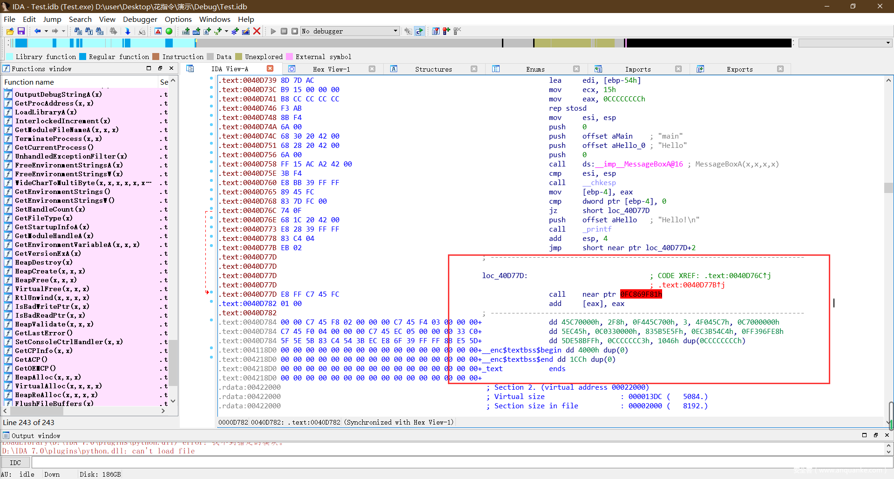
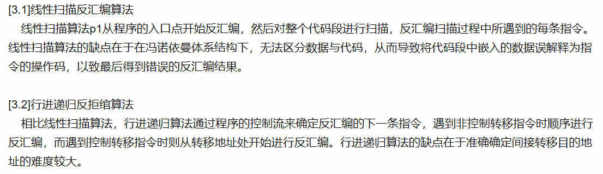
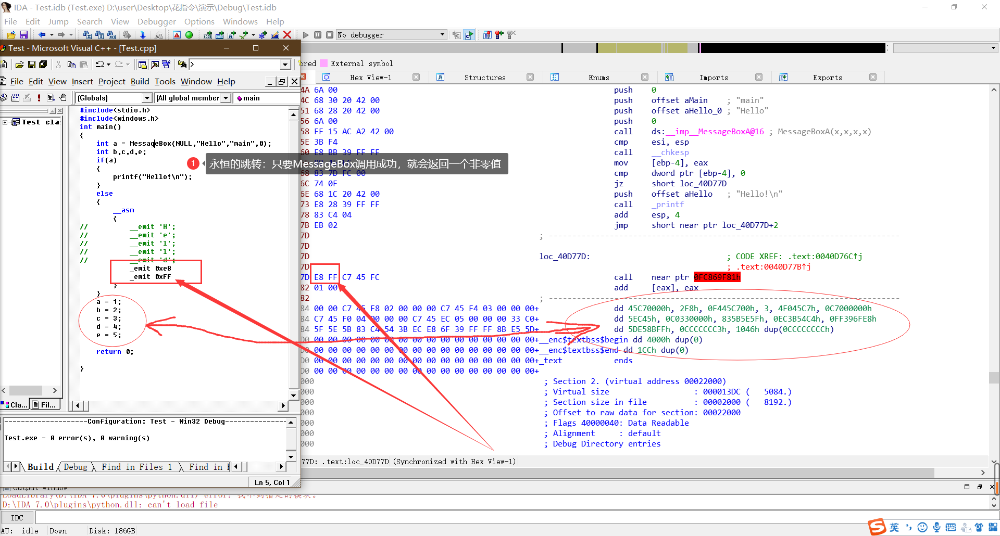
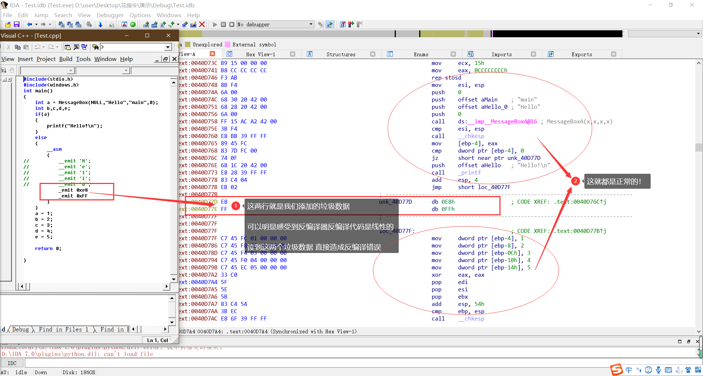
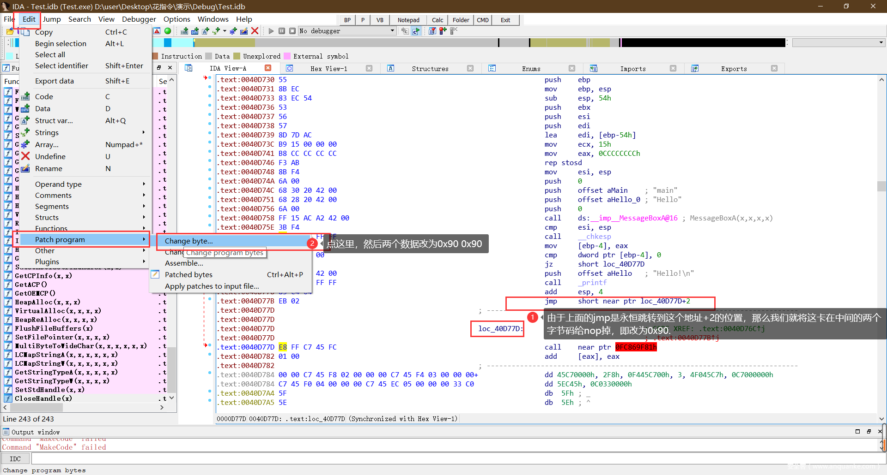
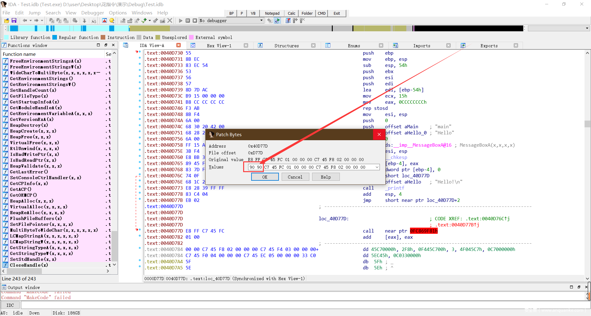
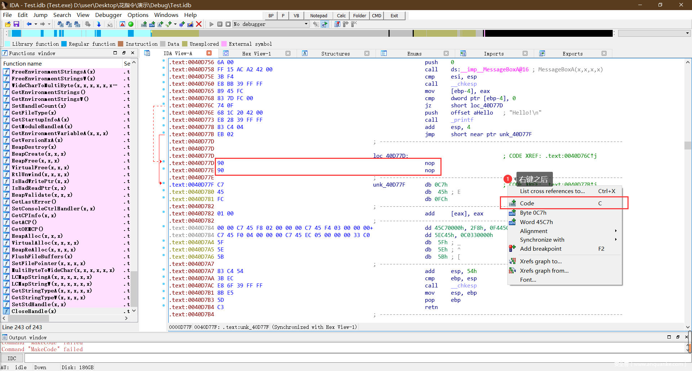
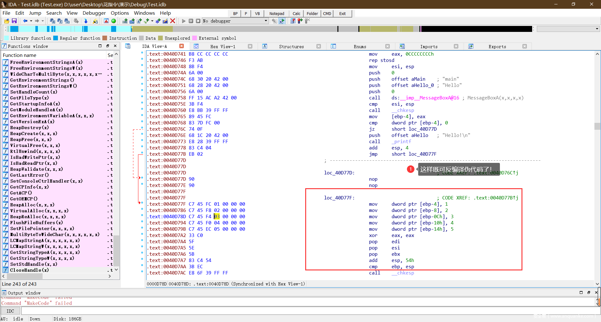
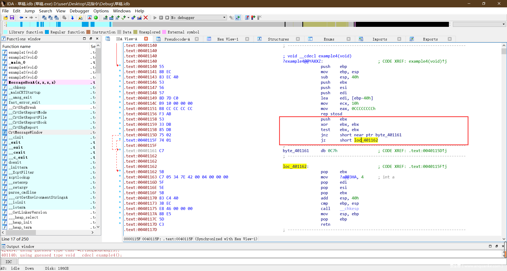
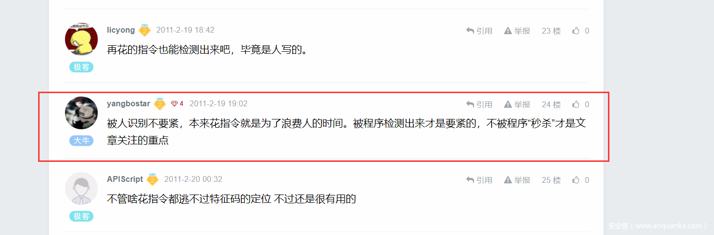

# 花指令总结

url：https://www.anquanke.com/post/id/236490


[](https://p5.ssl.qhimg.com/t015cea2433359f138d.gif)

 

## 0.说明

编译语言：c、x86汇编

编译器：vc++6.0

个人编写的花指令exe练习及源码：链接: https://pan.baidu.com/s/1Y3obCJFD2Gwmddfp37cnvg 提取码: tf8e

 

## 1.花指令简介

一般花指令类似这样，让反编译器无法反编译起到混淆代码的作用。

[](https://p1.ssl.qhimg.com/t01c27e615e67931e10.png)

### 作用

混淆反编译器，让反编译器无法反编译。

### 原理

**a.背景**

由于反编译器的工作原理一般是*线性扫描反汇编算法*或*行进递归反拒绾算法*

[](https://p2.ssl.qhimg.com/t01174e11aa48dfb220.png)

**我的理解是**，反编译器的工作原理是，从exe的入口AddressOfEntryPoint处开始，依序扫描字节码，并转换为汇编，比如第一个16进制字节码是0xE8，一般0xE8代表汇编里的CALL指令，且后面跟着的4个字节数据跟地址有关，那么反编译器就读取这一共5个字节，反编译为`CALL 0x地址` 。

对应的，有些字节码只需要一个字节就可以反编译为一条指令，例如0x55对应的是`push ebp`，这条语句每个函数开始都会有。同样，有些字节码又需要两个、三个、四个字节来反编译为一条指令。

也就是说，如果中间只要一个地方反编译出错，例如两条汇编指令中间突然多了一个字节0xE8，那反编译器就会将其跟着的4个字节处理为CALL指令地址相关数据给反编译成一条`CALL 0x地址`指令。但实际上0xE8后面的四个字节是单独的字节码指令。这大概就是**线性反编译**。

**b.实现**

> 如上面所说，那如何在两条代码之间插入无用的字节就成了问题，而且还要保证字节不会被执行，不然直接乱套了。

1.插入字节：这里就提到汇编里一个关键指令：`_emit 立即数`

```c
//C语言中使用内联汇编
__asm
{
    _emit 0xE8
}
//代表在这个位置插入一个字节数据0xE8
```

2.保证不被执行：通过构造一个永恒的跳转

```c
__asm
{
jmp Label1
  db thunkcode1;  垃圾数据
//垃圾数据例如：_emit 0xE8
Label1:
}
```

例如这样：

[](https://p1.ssl.qhimg.com/t01df6c316e001883e2.png)

我对这反编译器对花指令的反编译稍作修改

[](https://p4.ssl.qhimg.com/t01bac98793ed82b4ac.png)

**c.去掉花指令-> nop(0x90)**

这部分是通过IDA手动去掉花指令，也可以在IDA里用IDApython/IDC写脚本去，或者在OD调试的时候去掉，原理都一样。

[](https://p0.ssl.qhimg.com/t014b0dd22082c54bcd.png)

[](https://p3.ssl.qhimg.com/t01363a348caaec9865.png)

[](https://p5.ssl.qhimg.com/t01b16e1e7317817aef.png)

[](https://p2.ssl.qhimg.com/t0175e838d292c004d4.png)

[](https://p2.ssl.qhimg.com/t01f4513b85a78e801a.png)

**d.花指令经典名言**

------

**构造永恒跳转，添加垃圾数据**

 

## 2.简单花指令

### a.最简单的jmp

```asm
jmp Label1
  db thunkcode1;垃圾数据
Labe1:
```

不过很可惜，反编译器能直接识别这种简单花指令，遇到这种能轻松过掉并反编译。

### b.过时的多节形式与多层乱序

这两周都是通过多次跳转，把垃圾数据和有用代码嵌套在一起，不过这种形式也比较老套了，反编译器依然能够轻松过掉并成功反汇编。

```asm
#多节形式
JMP Label1
  Db thunkcode1
Label1:
  ……
  JMP Label2
  Db thunkcode2
Label2:
  ……
JMP Label1
  Db thunkcode1
Label2:
  ……
  JMP Label3
  Db thunkcode3
Label1:
  …….
  JMP Label2
  Db thunkcode2
Label3:
  ……
```

 

## 3.入门花指令

### a.互补条件代替jmp跳转

```asm
asm
{
  Jz Label
  Jnz Label
  Db thunkcode;垃圾数据
Label:
}
```

类似这种，无论如何都会跳转到label1处，还是能骗过反编译器。

### b.跳转指令构造花指令

```asm
     __asm {
         push ebx;
         xor ebx, ebx;
         test ebx, ebx;
         jnz LABEL7;
         jz    LABEL8;
     LABEL7:
         _emit 0xC7;
     LABEL8:
         pop ebx;
     }
```

很明显，先对ebx进行xor之后，再进行test比较，zf标志位肯定为1，就肯定执行`jz LABEL8`，也就是说中间0xC7永远不会执行。

不过这种一定要注意：记着保存ebx的值先把ebx压栈，最后在pop出来。

[](https://p4.ssl.qhimg.com/t01962142291c823869.png)

### c.call&ret构造花指令

```asm
     __asm {
         call LABEL9;
         _emit 0x83;
     LABEL9:
         add dword ptr ss : [esp] , 8;
         ret;
         __emit 0xF3;
     }
```

> call指令的本质：`push 函数返回地址`然后`jmp 函数地址`
>
> ret指令的本质：`pop eip`

代码中的esp存储的就是函数返回地址，对[esp]+8，就是函数的返回地址+8，正好盖过代码中的函数指令和垃圾数据。（这部分建议自己调试一下）

 

## 4.创意花指令

前面几种花指令都是比较老套的，入门花指令还能勉勉强强骗过反编译器，不过有经验的逆向者一眼就能识破，以下几种花指令形式，可以任由自己构造。

### a.替换ret指令

```asm
    _asm
    {
        call LABEL9;
        _emit 0xE8;
        _emit 0x01;
        _emit 0x00;
        _emit 0x00;
        _emit 0x00;

     LABEL9:
        push eax;
        push ebx;
        lea  eax, dword ptr ds : [ebp - 0x0];
        #将ebp的地址存放于eax        

        add dword ptr ss : [eax-0x50] , 26;
        #该地址存放的值正好是函数返回值，
        #不过该地址并不固定，根据调试所得。
         #加26正好可以跳到下面的mov指令，该值也是调试计算所得

        pop eax;
        pop ebx;
        pop eax;
        jmp eax;
        _emit 0xE8;
        _emit 0x03;
        _emit 0x00;
        _emit 0x00;
        _emit 0x00;
        mov eax,dword ptr ss:[esp-8];
        #将原本的eax值返回eax寄存器
    }
```

由于：

> call指令的本质：`push 函数返回地址`然后`jmp 函数地址`
>
> ret指令的本质：`pop eip`

两者都是对寄存器eip中存放的地址的操作。

所以我们可以在call指令之后，清楚的明白函数返回地址存放于esp，可以将值取出，用跳转指令跳转到该地址，即可代替ret指令。

当然，这种构造跳转指令可以变化多样。

### b.控制标志寄存器跳转

这一部分需要精通标志寄存器，每一个操作码都会对相应的标志寄存器产生相应的影响，如果我们对标志寄存器足够熟练，就可以使用对应的跳转指令**构造永恒跳转**！。

### c.利用函数返回确定值

有些函数返回值是确定的，比如我们自己写的函数，返回值可以是任意非零整数，就可以自己**构造永恒跳转**。

还有些api函数也是如此：

一方面可以传入一些错误的参数，如[LoadLibraryA](https://docs.microsoft.com/en-us/windows/win32/api/libloaderapi/nf-libloaderapi-loadlibrarya)

```apl
HMODULE LoadLibraryA(
  LPCSTR lpLibFileName
);
```

如果我们故意传入一个不存在的模块名称，那么他就会返回一个确定的值**NULL**，我们就可以通过这个**构造永恒跳转**

另一方面，某些api函数，我们既然使用他，肯定就是一定要调用成功的，而这些api函数基本上只要调用成功就就会返回一个确定的零或者非零值，如[MessageBox](https://docs.microsoft.com/en-us/windows/win32/api/winuser/nf-winuser-messagebox)

```apl
int MessageBox(
  HWND    hWnd,
  LPCTSTR lpText,
  LPCTSTR lpCaption,
  UINT    uType
);
```

该api只有在其调用失败的时候才能返回零，那么我们也可以通过这一点**构造永恒跳转**

PS：利用MessageBox实现花指令也是我在**1.花指令简介**中用到的源码

 

## 5.花指令原理另类利用

当我们理解了花指令的原理后，我们可以在将花指令中的垃圾数据替换为一些特定的**特征码**，可以对应的$“定位功能”$，尤其在**[SMC自解码](https://blog.csdn.net/dontbecoder/article/details/8754729?utm_source=app)**这个反调试技术中可以运用。例如：

```asm
asm
{
  Jz Label
  Jnz Label
  _emit 'h'
  _emit 'E'
  _emit 'l'
  _emit 'L'
  _emit 'e'
  _emit 'w'
  _emit 'o'
  _emit 'R'
  _emit 'l'
  _emit 'D'
Label:
}
```

将这串特征码`hElLowoRlD`嵌入到代码中，那我们只需要在当前进程中搜索`hElLowoRlD`字符串，就可以定位到当前代码位置，然后对下面的代码进行SMC自解密。

 

## 6.花指令的看法

重点：**构造永恒跳转，添加垃圾数据！**

重一方面构造一个永恒的跳转，一方面又比较隐蔽，不仅骗过反编译器，更让破解者找不到花指令。

 

## 7.最后

参考文章：[抗去除花指令](https://bbs.pediy.com/thread-129526.htm)

原博主在他文章的评论里讲的的这句话挺有道理的！

[](https://p5.ssl.qhimg.com/t017be7665fd6ac9bb1.png)