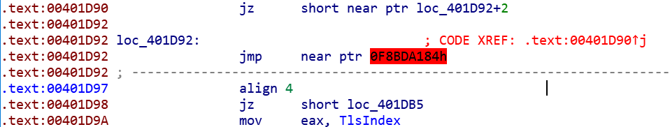
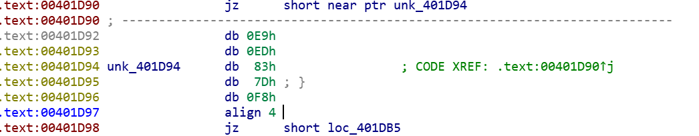
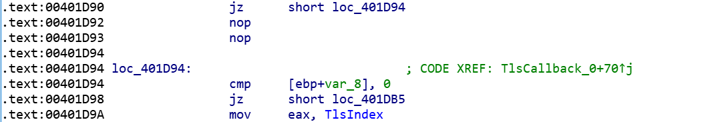
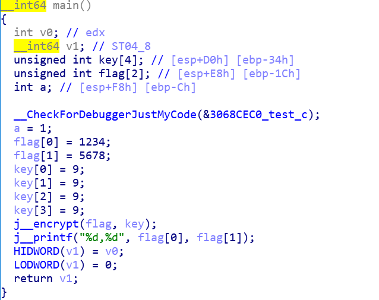
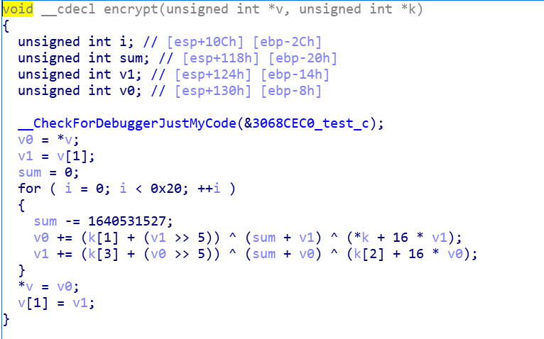
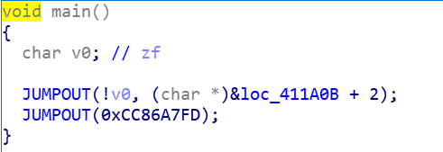
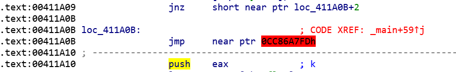
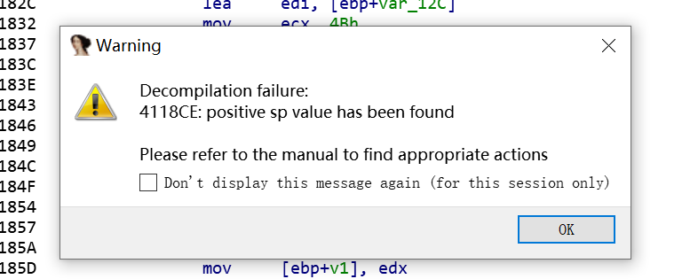
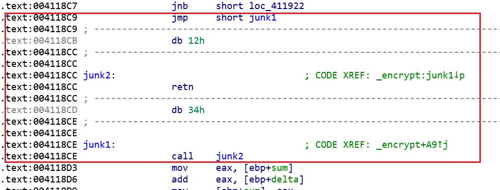
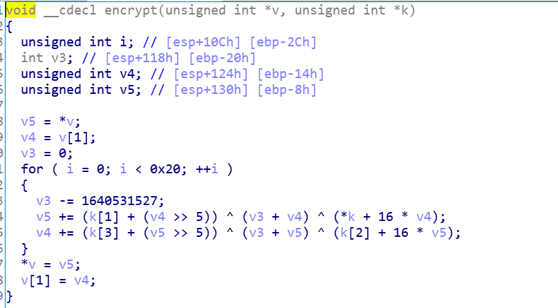

# 逆向学习笔记之花指令

url：https://www.anquanke.com/post/id/208682


## 概念

花指令是企图隐藏掉不想被逆向工程的代码块(或其它功能)的一种方法，在真实代码中插入一些垃圾代码的同时还保证原有程序的正确执行，而程序无法很好地反编译, 难以理解程序内容，达到混淆视听的效果。

简单的说就是在代码中混入一些垃圾数据阻碍你的静态分析。

 

## 花指令分类

花指令大致可以分为可执行花指令和不可执行花指令两类：

### 可执行花指令

可执行花指令指的是这部分花指令代码在程序的正常执行过程中会被执行

- 但执行这些代码没有任何意义
- 执行前后不改变任何寄存器的值(当然eip这种除外)
- 同时这部分代码也会被反汇编器正常识别

**目的**

1. 首先，花指令的首要目的依然是加大静态分析的难度,让你难以识别代码的真正意图
2. 然后，这种花指令可以破坏反编译的分析,使得栈指针在反编译引擎中出现异常。(当然我们知道栈指针实际上是没有问题的,只不过反编译引擎还有待完善的空间)

### 不可执行式花指令

不可执行花指令指的是这部分花指令代码在程序的正常执行过程中不会被执行

不可执行花指令是利用反汇编器线性扫描算法的缺陷使得静态分析的时候会看到一些错误的代码

 

## 最常见的花指令

[](https://i.loli.net/2020/06/16/QKGzB7fnACNy4kS.png)

如图所示,这就是ctf题目中最常见也是最简单花指令之一，一个典型的不可执行花指令。

### patch方法

首先我们将0x00401D92处的代码转换成数据

[](https://i.loli.net/2020/06/16/Cl62vX8Qyu9mz4E.png)

然后将0x00401D94处的数据转换成代码，再把0x00401D92，0x00401D93处的数据nop掉即可

[](https://i.loli.net/2020/06/16/nbgyGfT9C8eNrHw.png)

我们知道E9是jmp指令对应的机器码，当反汇编器读取到E9时，接着会往下读取四个字节的数据作为跳转地址的偏移，所以才会看到错误的汇编代码。

### 编写方法

如果我们在写程序的时候嵌入_asm _emit 0E9，反编译器就会把下一条指令当做地址数据，不管下一条指令实际上的四个字节是地址数据还是操作指令。

```assembly
__asm { 
    _emit 075h    #jmp $+4
    _emit 2h
    _emit 0E9h
    _emit 0EDh
}
```

上面嵌入的4字节数据即可使得程序反汇编反编译出错，注意这里的75是jnz的机器码，所以要求程序执行到这里时Zflag=0。

 

## 具体例子

### 无花指令源程序

这里我写了一个tea加密算法，我们用msvc编译，生成完成pdb文件方便分析，然后ida打开

```c
#include <stdio.h>
#include <stdint.h>

void encrypt(uint32_t* v, uint32_t* k) {
    uint32_t v0 = v[0], v1 = v[1], sum = 0, i;           /* set up */
    uint32_t delta = 0x9e3779b9;                     /* a key schedule constant */
    uint32_t k0 = k[0], k1 = k[1], k2 = k[2], k3 = k[3];   /* cache key */
    for (i = 0; i < 32; i++) {                       /* basic cycle start */
        sum += delta;
        v0 += ((v1 << 4) + k0) ^ (v1 + sum) ^ ((v1 >> 5) + k1);
        v1 += ((v0 << 4) + k2) ^ (v0 + sum) ^ ((v0 >> 5) + k3);
    }                                              /* end cycle */
    v[0] = v0; v[1] = v1;
}
int main() {
    int a = 1;
    uint32_t flag[] = { 1234,5678 };
    uint32_t key[] = { 9,9,9,9 };
    encrypt(flag, key);
    printf("%d,%d", flag[0], flag[1]);
    return 0;
}
```

首先可以看到main函数和源代码差别不大

[](https://i.loli.net/2020/06/16/D9IA7JpvozLSgG1.png)

然后可以看到encrypt函数也和源代码基本一样

[](https://i.loli.net/2020/06/16/C2kvb5D7ZUFd6Lo.png)

### 加入花指令

接下来我们加入两个花指令

第一个花指令在main函数中，就是我们上面提供的最简单的花指令编写方法

第二个花指令在encrypt函数中，是一个可执行花指令，下面我会具体分析这个花指令以及对应的去除方法

```c
#include <stdio.h>
#include <stdint.h>
#define JUNKCODE __asm{
    __asm jmp junk1 
    __asm __emit 0x12 
    __asm junk2: 
    __asm ret 
    __asm __emit 0x34 
    __asm junk1: 
    __asm call junk2  
}

void encrypt(uint32_t* v, uint32_t* k) {
    uint32_t v0 = v[0], v1 = v[1], sum = 0, i;           /* set up */
    uint32_t delta = 0x9e3779b9;                     /* a key schedule constant */
    uint32_t k0 = k[0], k1 = k[1], k2 = k[2], k3 = k[3];   /* cache key */
    for (i = 0; i < 32; i++) {                       /* basic cycle start */
        JUNKCODE
        sum += delta;
        v0 += ((v1 << 4) + k0) ^ (v1 + sum) ^ ((v1 >> 5) + k1);
        v1 += ((v0 << 4) + k2) ^ (v0 + sum) ^ ((v0 >> 5) + k3);
    }                                              /* end cycle */
    v[0] = v0; v[1] = v1;
}
int main() {
    int a = 1;
    uint32_t flag[] = { 1234,5678 };
    uint32_t key[] = { 9,9,9,9 };
    __asm { 
        _emit 075h
        _emit 2h
        _emit 0E9h
        _emit 0EDh
    }
    encrypt(flag, key);
    printf("%d,%d", flag[0], flag[1]);
    return 0;
}
```

**第一个花指令**

首先ida打开查看main函数：

[](https://i.loli.net/2020/06/16/QLenNRbvAsUH4ct.png)

虽然还是反编译成功了，但是可以看到内容已经完全错误，我们再来看main函数的汇编代码，也就是我们加入的第一个花指令

[](https://i.loli.net/2020/06/16/ZLF2XBCcIl8gwzT.png)

可以看到这里出现的红色就是我们的第一处花指令，patch方法同上，我们主要看第二处花指令。

**第二个花指令**

f5反编译直接报错

[](https://i.loli.net/2020/06/17/NFG2ck1tTsA7XwV.png)

可以发现花指令的混淆作用还是很明显的，那我们继续跟进到花指令的反汇编代码处

[](https://i.loli.net/2020/06/17/sEZLmS7FqPkfUJN.png)

这里框出的指令就是我们加入的花指令，逻辑其实特别清晰，就是先跳转到junk1，再call junk2，call junk2的时候会把地址0x004118D3压栈，然后进入junk2中执行retn指令又会把地址0x004118D3 pop到eip中，然后接下来程序继续正常执行。

**去除方法**

这种连续的可执行花指令的去除方法特别简单，直接整块nop掉即可。

但是真正的复杂程序里这种花指令的数量很多，人工nop很耗时，同时极容易出错，所以我们真正应该掌握的是自动化的方法，编写脚本匹配花指令模板进行去除。

### 去除花指令

这里是我们要去除的花指令模板

```assembly
#define JUNKCODE __asm{
    __asm jmp junk1 
    __asm __emit 0x12 
    __asm junk2: 
    __asm ret 
    __asm __emit 0x34 
    __asm junk1: 
    __asm call junk2  
}
```

这里是idapython编写的ida匹配模板去除花指令脚本

```python
def nop(addr, endaddr):
    while addr < endaddr:
        PatchByte(addr, 0x90)
        addr += 1

def undefine(addr, endaddr):
    while addr < endaddr:
        MakeUnkn(addr, 0)
        addr += 1

def dejunkcode(addr, endaddr):
    while addr < endaddr:
        MakeCode(addr)
        # 匹配模板
        if GetMnem(addr) == 'jmp' and GetOperandValue(addr, 0) == addr + 5 and Byte(addr+2) == 0x12:
            next = addr + 10
            nop(addr, next)
            addr = next
            continue
        addr += ItemSize(addr)

dejunkcode(0x00411820, 0x00411957)
undefine(0x00411820, 0x00411957)
MakeFunction(0x00411820, -1)
```

**重要函数解析**

```
MakeCode(ea) #分析代码区，相当于ida快捷键C
ItemSize(ea) #获取指令或数据长度
GetMnem(ea) #得到addr地址的操作码
GetOperandValue(ea,n) #返回指令的操作数的被解析过的值
PatchByte(ea, value) #修改程序字节
Byte(ea) #将地址解释为Byte
MakeUnkn(ea,0) #MakeCode的反过程，相当于ida快捷键U
MakeFunction(ea,end) #将有begin到end的指令转换成一个函数。如果end被指定为BADADDR（-1），IDA会尝试通过定位函数的返回指令，来自动确定该函数的结束地址
```

idapython提供的函数挺多的，这里的函数如果有不太理解意思的，可以在ida的python命令行中自行尝试一下，对照着ida汇编窗口的变化和函数返回值很快就能掌握函数的用法

**运行脚本**

我们在ida中运行脚本，然后可以发现那段花指令已经成功nop掉了，按下f5反编译：

[](https://i.loli.net/2020/06/17/k17OfWKzrqib6GY.png)

可以看到encrypt函数被成功的反编译了。

对于较复杂的程序而言，编写模板匹配脚本去除花指令是十分重要的，可以做到准确无误，同时节省了很多时间。

### 特殊花指令

还有一类较特殊的花指令，它不会影响反汇编和反编译，只是单纯的混淆视听

譬如我们程序需要将某个特定值（这里假设是0x12）压栈，正常操作应该是：

```assembly
push    0x12
```

加入花指令后，这个操作可以变成这样：

```assembly
push    0x26
xor dword ptr ss:[esp], 0x34
```

我们很容易可以看出来这两种写法是等效的，当我们要压栈的数据是一些很明显的特征值的时候，这种花指令可以很好的保护我们的特征值，防止算法特征被迅速识别

当然这里只是一个简单的例子，这种花指令复杂起来将会使得分析难度大大提升。

 

## 总结

花指令还有一些其他的运用方法，包括一些很特殊罕见的运用，本文介绍的是较为常见的花指令，也是我在学习过程中经常碰到的花指令。

逆向的路还好长…慢慢学慢慢学