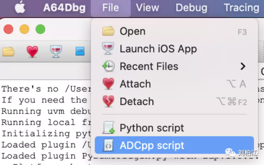

## A64Dbg-ADCpp VS Frida及原理说明

我是2015年开始第一次接触Frida的，当时就惊了，这个JavaScript长得真好看。除了操作void*/C数据结构不方便、不支持汇编、不支持C++、学习门槛高，各方面都很优秀。所以，ADCpp应运而生，就是来和Frida打配合的，毕竟JavaScript永远无法解决有些只有Pure C/C++才能解决的问题。

来个图表直观对比一下：

| 语言          | Frida | ADCpp |
| ------------- | ----- | ----- |
| ARM/ARM64汇编 | No    | Yes   |
| C             | Yes   | Yes   |
| C++           | No    | Yes   |
| ObjC          | Yes   | Yes   |
| ObjC++        | No    | Yes   |
| Java          | Yes   | No    |

再来个实际代码例子对比一下：

```
frida_js_code = '''
    const libuvmdbg = Module.load('%1');
    const uvmdbg_start = new
        NativeFunction(libuvmdbg.getExportByName('uvmdbg_start'),
        'void', ['pointer', 'int', 'int']);
    uvmdbg_start(Memory.allocUtf8String('127.0.0.1'), %2, 0);
    ''' % (path, port)
```

```
adcpp_c_code = '''
    auto libuvmdbg = dlopen("%1");
    auto uvmdbg_start = dlsym(libuvmdbg, "uvmdbg_start");
    ((void (*)(const char *, int ,int))uvmdbg_start)("127.0.0.1", %2, 0);
    ''' % (path, port)
```

可以看到，Frida操作函数和指针数据隔了一层JavaScript的包装，ADCpp是和Navtive C/C++完全一样的，因为它就是Pure C/C++。最终上述代码都会发送到目标进程执行，Frida通过JavaScript V8引擎解释执行，ADCpp通过Clang编译后由UnicornVM解释执行。下面，我们详细阐述一下ADCpp一系列流程背后的原理。

ADCpp暴露给用户的操作接口有如下三种：



通过ADCpp script菜单选择.cc/.mm源文件执行。


通过ADCpp Command输入C/C++表达式执行。

```
# c/c++ expressions or path
def runADCpp(code):
    """
    run a c/c++ expression or source file inside debugee with UnicornVM.
    """
    api_proc('runADCpp', code)

def runadc(code):
    """
    wrapper for runADCpp
    """
    return runADCpp(code)
```

通过ADP runadc输入C/C++表达式或源文件路径执行。

我们以下面这段代码的整个执行流程来阐述整个C/C++的解释执行过程：

```
# adcpp output handler for api send2py
def adcpp_output(data):
    print(data)

# a64dbg debugengine event for python plugin
def adp_on_event(args):
    event = args[adp_inkey_type]
    # run c/c++ code inside debugee
    if event == adp_event_debug_initialized:
        # demo for adcpp api
        plat = curPlatform()
        if plat == adp_local_unicornvm or \
            plat == adp_remote_unicornvm_ios or \
            plat == adp_remote_unicornvm_android:
            runadc(
            '''
            printf("Hello world from PyDemoPlugin's runadc.\\n");
            send2py("adcpp_output", "Hello, ADCpp. My pid in %d.\\n", getpid());
            ''')
            return success()
    return failed(adp_err_unimpl)

```

runadc首先把代码输入到ADP API：

```
  /*
   * added by v1.0.3
   */
  // run the c/c++ code with adcpp
  void (*runADCpp)(const char *code);
```

runADCpp把代码输入到A64Dbg的UVMEngine，生成完整的源文件：


然后调用Clang编译器将adcpp.mm编译为a64dbg.adc二进制文件，编译过程中会自动插入预定义的adcpp.hpp头文件，这里面预包含了常用的C/C++/ObjC等头文件以及定义了adc模块函数adc_main。同时会将所有的外部未定义函数指定为动态加载，所以你不需要手动指定包含头文件以及链接库文件：

```
#ifndef __ADCPP_H__
#define __ADCPP_H__

#define __ADCPP_VERSION__ "1.0.0"
#define __ADCPP_CDECL__ extern "C"

/*
 * standard headers
 */
// pre-include standard c headers
#include <ctype.h>   // Functions to determine the type contained in character data
#include <errno.h>   // Macros reporting error conditions
#include <float.h>   // Limits of float types
#include <inttypes.h>// (C99)  Format conversion of integer types
#include <limits.h>   // Sizes of basic types
#include <locale.h>   // Localization utilities
#include <math.h>   // Common mathematics functions
#include <signal.h>   // Signal handling
#include <stdarg.h>   // Variable arguments
#include <stdbool.h> // Macros for boolean type
#include <stddef.h>   // Common macro definitions
#include <stdint.h>  // Fixed-width integer types
#include <stdio.h>   // Input/output
#include <stdlib.h>   // General utilities: memory management, program utilities, string conversions, random numbers, algorithms
#include <string.h>   // String handling
#include <time.h>   // Time/date utilities

// pre-include unix c headers
#include <pthread.h>
#include <dlfcn.h>
#include <unistd.h>
#include <sys/mman.h>

// pre-include for different platforms
#if __APPLE__
// macos/ios supports objc/stl
// pre-include basic objc framework
#import <Foundation/Foundation.h>
#import <UIKit/UIKit.h>

// pre-include c++ stl headers
#include <string>
#include <vector>
#include <set>
#include <map>
#else
// android only supports pure c/c++
#endif

/*
 * adcpp debugee side api
 */
// redirect printf/puts to a64dbg's log
#define printf send2ad
#define puts send2ad

// add log to a64dbg
void send2ad(const char *format, ...);

// send string to python3 adp, pyfn is the python3 recever function name
void send2py(const char *pyfn, const char *format, ...);

// send buffer to python3 adp, pyfn is the python3 recever function name
void send2py(const char *pyfn, long size, const void *buff);

// a valid adcpp module loaded by UnicornVM must implement one of these functions
// the start entry of adcpp module.
__ADCPP_CDECL__ void adc_main(void);

// the start entry of adcpp module which will interperte it in a new thread.
__ADCPP_CDECL__ void adc_main_thread(void);

#endif // end of __ADCPP_H__

```

如果是通过ADCpp script或者runadc源文件路径执行代码，则需要至少定义adc_main或adc_main_thread函数，用于定义解释执行的起始位置。

A64Dbg解析a64dbg.adc文件的got/lazy-got，然后从符号列表中查找函数的真实运行时地址，实现adc文件的重定位：


这里注意，重点来了，A64Dbg中所有的符号列表中的函数都是可以在ADCpp中调用的，包括sub函数，比如：

```
extern "C" void sub_1208(int guess0, void *guess1);

void adc_main(void) {
  puts("Invoke a sub function.\n");
  sub_1208(0, "Guessed parameter...");
}
```

如果出现重定位找不到函数的情况，尝试在模块列表选中某些模块以加载数据库然后重试即可。重定位adc完成后将整个adc模块通过tcp连接发送给UnicornVM解释执行，代码如下：

```
static vc_callback_return_t adc_callback(vc_callback_args_t *args) {
  switch (args->op) {
    case vcop_call: {
      const char *callee = (char *)args->info.call.callee;
      const ADCModule *adc = (ADCModule *)args->usrctx;
      if (&adc->bin[0] <= callee && callee < &adc->bin[adc->binsize]) {
        return cbret_recursive;
      }
      break;
    }
    default: {
      break;
    }
  }
  return cbret_directcall;
}

static void uvm_run_adc(const ADCModule *adc) {
  vc_context_t uvmctx;
  uvmctx.usrctx = (void *)adc;
  uvmctx.callback = adc_callback;
  memset(&uvmctx.regctx, 0, sizeof(uvmctx.regctx));
  uvmctx.regctx.pc.p = &adc->bin[adc->entry];
  uvm_interp(uvmctx.regctx.pc.p, &uvmctx);
}
```

在解释执行的过程中，如果有printf/puts/send2ad的调用，就会将这些数据写入A64Dbg的日志窗口。如果有send2py的调用，就会将这些数据发送给指定的Python3函数，类似于Frida的on_message回调函数。比如上述事例中的adcpp_output：

```
# adcpp output handler for api send2py
def adcpp_output(data):
    print(data)
    
‘’‘
send2py("adcpp_output", "Hello, ADCpp. My pid in %d.\\n", getpid());
’‘’
```

send2py(const char *pyfn, const char *format, ...)发送的是格式化字符串，回调中的data是一个str实例；

send2py(const char *pyfn, long size, const void *buff)发送的是二进制buffer，回调中的data是一个bytes实例；

至此，整个ADCpp的执行流程就完成了，我们就可以在Log窗口看到如下日志：


那么问题来了，这么直白好用又强大的逆向工程生产力工具还免费自带全功能的底层汇编级调试器，你不来一套么？

LLDB模式与UnicornVM虚拟化模式对比：

| 功能        | LLDB | UnicornVM |
| ----------- | ---- | --------- |
| x86/x64     | Yes  | No        |
| arm/arm64   | Yes  | Yes       |
| 高性能Trace | No   | Yes       |
| ADCpp       | No   | Yes       |

预售开启，明码标价，童叟无欺，么么哒。

| 平台架构      | 单价   | 备注                         |
| ------------- | ------ | ---------------------------- |
| armv7 android | 3万/年 | 支持1台Win，1台Mac           |
| arm64 android | 3万/年 | 支持1台Win，1台Mac           |
| arm64e iOS    | 3万/年 | 支持1台Intel Mac，1台ARM Mac |
| arm64e macOS  | 3万/年 | 支持1台ARM Mac               |