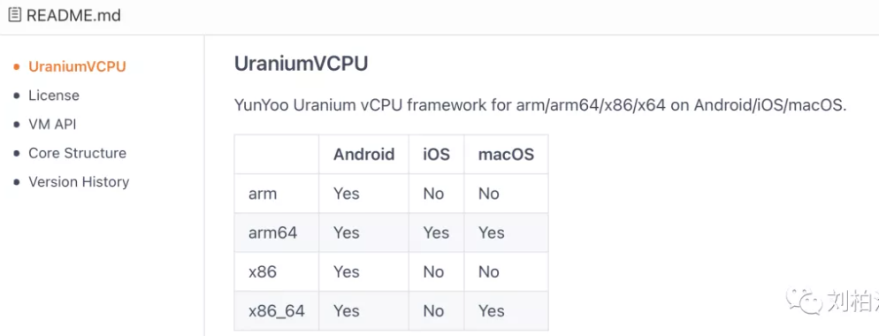

## UraniumVCPU-这个虚拟CPU的故事长达10年

任务繁重，长话短说。

2011年开始，我就开始着手研发基于C/C++模拟执行的虚拟CPU。

2012年支持x86模拟执行的宏汇编模式研发成功，可以将Windows平台的x86算法通过这套模拟执行的方式在arm手机上运行。

2014年在运营gikdbg的过程中支持arm模拟执行的虚拟CPU验证了一种设计思路就暂时搁置了，开始了几维安全的联合创业之路。

2016年为了让公司在众多安全公司中有一些竞争力，成功研发了基于LLVM-IR的全架构全平台白盒虚拟机KiwiVM。这个过程中同时构思了一种黑盒模拟执行arm64的设计思路。

2019年重拾2011年的宏汇编虚拟机，进行大刀阔斧的重构，完整实现了x86/x64的模拟执行。

2020年将2014、2016年构思的arm/arm64虚拟机开始进行实现，完整实现了arm/arm64的模拟执行。同年发布的UnicornVM是这个过程中验证概念的临时项目，现已停止更新维护。

2021年，命名为UraniumVCPU（铀子虚拟CPU），开始正式进行商用服务。它的第一个应用就是UraniumVM（铀子虚拟机），为A64Dbg的ADCpp解释执行引擎。当然，它的应用远不限于此，所以如果你有虚拟CPU的应用场景，欢迎咨询交流，一定把你服务得妥妥的。它目前支持的平台包括：Android、iOS、macOS，架构包括arm、arm64、x86、x64。

同时，我们也在利用这套虚拟CPU架构实现arm64到x64的翻译工作，用于类似于Intel Houdini这样的场景。感谢各位朋友的支持。