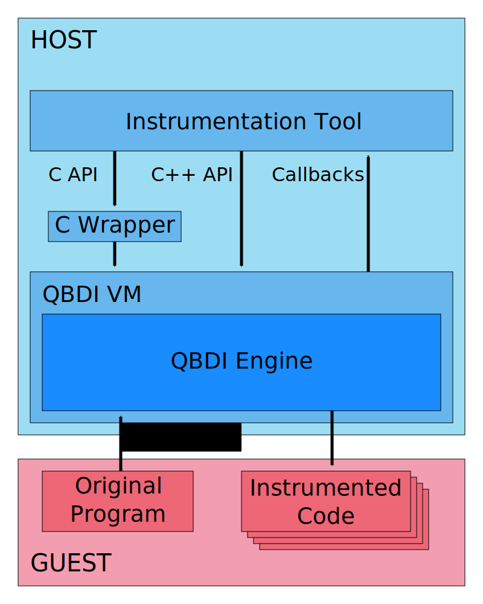

# Introduction

## Why a DBI?

Debuggers are a popular approach to analyze the execution of a binary. While those tools are convenient, they are also quite slow. This performance problem is imperceptible to human users but really takes its toll on automated tools trying to single step through a complete program. Such automated tools are useful for tracking the evolution of the program states, extracting execution statistics and verifying that some runtime conditions hold true. Examples of usage include memory corruption debuggers, profilers, timeless debuggers and side-channel attack tools.

This performance cost is due to the kernel playing the role of a middleman between the debugger and the debuggee. The only way to get rid of the problem is to place the tool inside the binary being analyzed and this is what Dynamic Binary Instrumentation does: injecting instrumentation code inside the binary at runtime.

## Why QBDI?

Existing DBI framework were designed more than 15 years ago, focusing on features and platforms that made sense at the time. Mobile platform support is often unstable or inexistent and instrumentation features are either simplistic or buried in low-level details.

QBDI attempts to retain the interesting features of those frameworks while avoiding their pitfalls and bringing new designs and ideas. Its goal is to be a cross-platform and multi-architectures modular DBI framework. The modular design exposes the DBI engine as a library that can start an instrumented execution anywhere, anytime and easily be incorporated in other tools.

## QBDI : How does it work?

The core of DBI frameworks relies on the Just-In-Time (JIT) recompilation of the original program. This allows to interleave additional assembly code which can instrument any part of the execution. The DBI engine performing the JIT recompilation and the JITed code itself run in the same process but need to each have their own processor context. This requires to perform context switches between the two like a virtual machine would. We thus call the DBI context the **host** and the original program context the **guest**.

The **host** is composed of QBDI components and the **instrumentation tool**. The **instrumentation tool** is the code written by the user which interacts with the **QBDI VM** through a **C API** or a **C++ API**. The **instrumentation tool** can register **callbacks** to occur on specific events triggered either by QBDI or by the instrumentation code inserted inside the original program. The user documentation further details these APIs and how callbacks work.

Inside the VM resides the **QBDI Engine** which manages the instrumented execution. The engine runs the JIT loop which reads the **original program** code and generates the **instrumented code** which is then executed. Each loop iteration operates on a basic block, a sequence of instructions which ends with a branching instruction. This basic block is first patched, to accommodate the JIT process, and then instrumented as instructed by the instrumentation tool. This instrumented basic block is written in executable memory, executed and returns the address of the next basic block to execute. To avoid doing twice the same work, this **instrumented code** is actually written in a code cache.

## Limitations

The **host** and the **guest** share the same process and thus the same resources. This means that they use the same heap and the same libraries and this will cause issues with any non-reentrant code. We could have chosen to shield users from those issues by forbidding instrumentation tools to use any external libraries like some other DBI frameworks have done. However we believe this is an overblown issue and that there are effective mechanisms to mitigate the problem. Nonetheless users need to be aware of this design limitation and the mitigations side-effects.

For example, tracing the heap memory allocator will cause deadlocks because it is not reentrant. There are other problematic cases but they are mostly limited to the standard C library and the OS loader. To avoid such issues we have an execution brokering system that allows to whitelist/blacklist specific pieces of code. These will be executed outside of the instrumentation process via a call hooking mechanism. This execution broker system is documented in the [API description](https://qbdi.readthedocs.io/en/stable/api_description.html#instrumentation-range).

Moreover, the **host** relies on the loader loading and initializing its library dependencies which means the instrumentation process cannot be started before the loader has finished its job. As a result the loader itself cannot be instrumented.