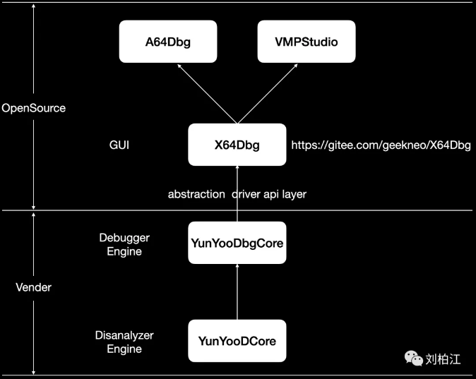

## A64Dbg-开源重构完毕，继续前行

url：https://mp.weixin.qq.com/s/sRHrZIB_gIWzQdBofU4Rsg

受X64Dbg版权方的要求，闭源部分不得依赖X64Dbg的任何一部分（编译成库动态连接或静态连接也不行）。所以，我们做了这样的一个重构，X64Dbg部分全部开源（地址：https://gitee.com/geekneo/X64Dbg），然后添加了一个调试引擎抽象层，任何人都可以独立的基于这个抽象层去实现具体的调试引擎，然后去驱动界面部分的数据渲染和交互。

这个灵感来源于Android的硬件抽象层，比如显卡驱动只要符合定义的OpenGL接口就可以被识别并加载。当然，我们这里没有这么复杂，只需要Vender编译出来的调试驱动模块去替换OpenSource编译出来的Stub模块即可。

今天，已经完整定义了到目前为止需要用到的各种接口。如果你也是一个喜欢折腾工具的大佬，可以直接拷贝abstraction/DebugEngine.cpp根据接口目的去实现对应功能即可。

Have fun～