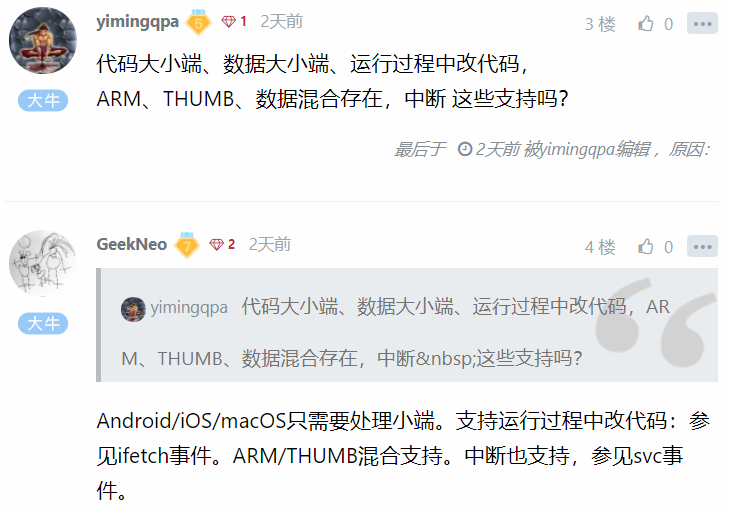
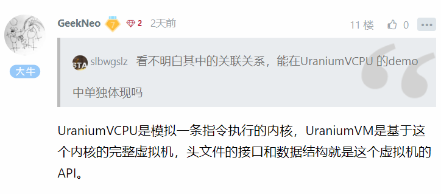
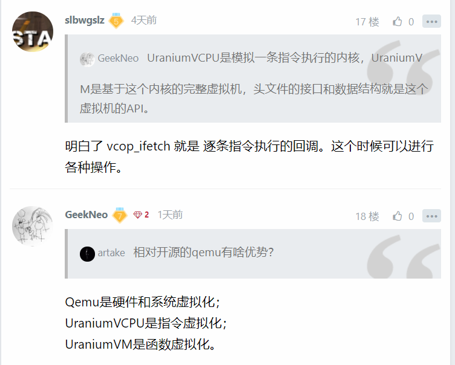

### UraniumVM-适用于Android/iOS/macOS的指令级函数虚拟机 

url：https://bbs.pediy.com/thread-267094.htm


### UraniumVCPU

YunYoo Uranium vCPU framework for arm/arm64/x86/x64 on Android/iOS/macOS.

|        | Android | iOS  | macOS |
| ------ | ------- | ---- | ----- |
| arm    | Yes     | No   | No    |
| arm64  | Yes     | Yes  | Yes   |
| x86    | Yes     | No   | No    |
| x86_64 | Yes     | No   | Yes   |

### License

UraniumVM is developed by YunYoo(云铀子), all rights reserved.

- A.Personal private use is free;
- B.Any other usage should pay for a license;

### VM API

```
// run function 'fn' on UraniumVCPU with 'ctx'
// return value is r[0].sx/rax
long uvm_run_interp(const void *fn, const uvm_context_t *ctx);
```

```
// this api is used to make target's function pointer under your control
//
// make a wrapper for function 'fn' with 'usrctx','callback'
// return value is a new function pointer which will run under our VCPU
// you can replace this pointer to target's function pointer
// like C++-Vtable/Script-Native-Bridge
// if return null, you should check errno
const void *uvm_make_callee(const void *fn, void *usrctx,
                            uvm_interp_callback_t callback);
```

### Core Structure

```
// opcode type for callback args
typedef enum uvm_optype_t {
  vcop_read,    // memory read
  vcop_write,   // memory write
  vcop_call,    // function call
  vcop_return,  // function return
#if __ARM__
  vcop_svc,  // arm syscall
#else
  vcop_syscall,  // intel syscall
#endif
  vcop_ifetch,  // interpreter fetch instruction
} uvm_optype_t;
```

```
// callback args
typedef struct uvm_callback_args_t {
  // your own context passed for uvm_run_interp/uvm_make_callee
  const void *usrctx;
  // uvm execution context
  uvm_regs_t *uvmctx;
  // current opcode
  uvm_optype_t op;
  union {
    // for vcop_read/vcop_write/vcop_ifetch
    struct {
      const void *src;
      void *dst;
      int byte;
    } rw;
    // for vcop_call
    struct {
      const void *callee;
    } call;
    // for vcop_return
    struct {
      const void *hitaddr;  // which address hit return
    } ret;
    // for vcop_svc
    struct {
      // arm
      // parameters are in armctx->r[0...6]
      // syscall number from armctx->r[7]
      //
      // arm64
      // parameters are in arm64ctx->x
      // syscall number
      //
      // x86/x64
      // ...
      int sysno;
    } svc;
  } info;
} uvm_callback_args_t;
```

### Version History

2021/4/18:

- 发布V1.0.0;
- 1.Android x86/x86_64;
- 3.macOS x86_64;

2021/4/15:

- 发布V1.0.0;
- 1.Android arm/arm64;
- 2.iOS arm64/arm64e;
- 3.macOS arm64;

```
https://gitee.com/yunyoo/UraniumVCPU
```





