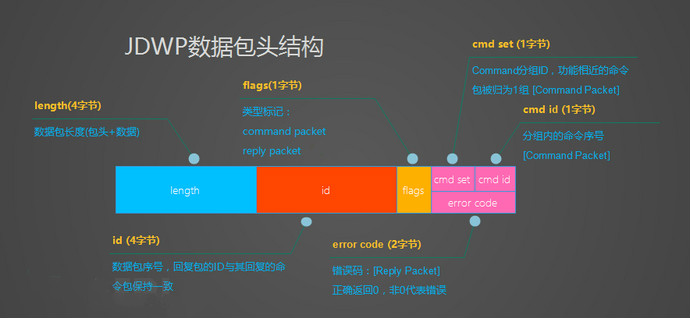
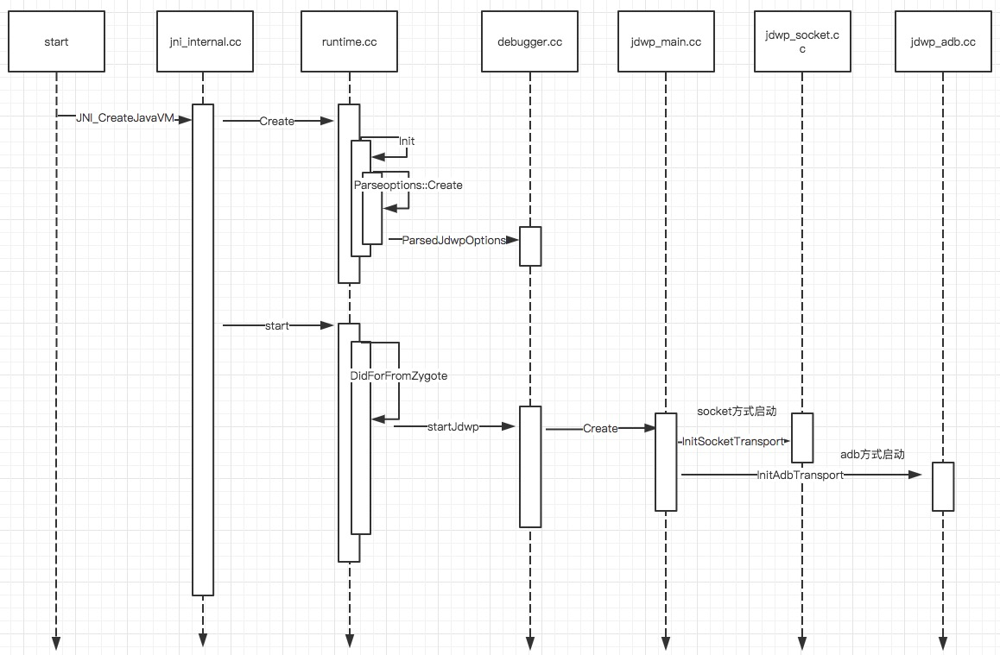
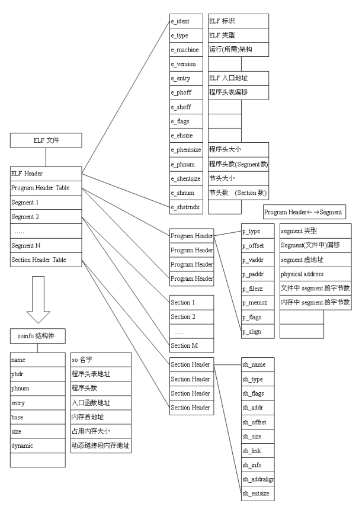
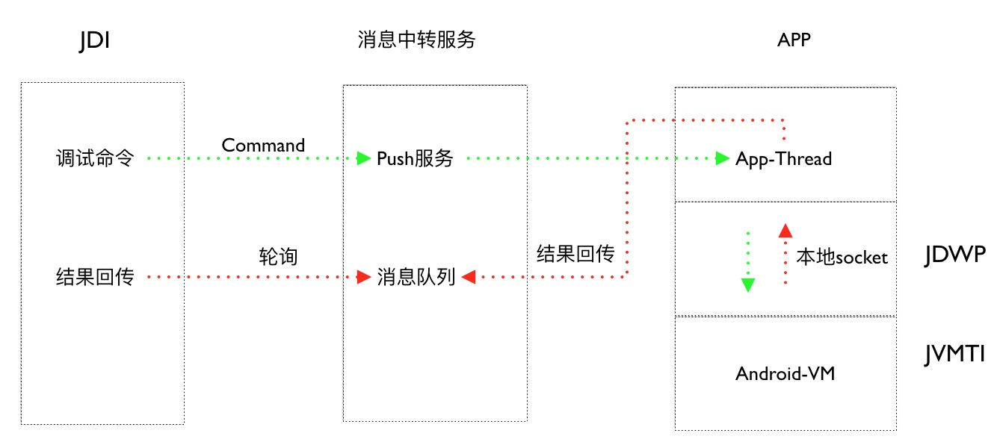
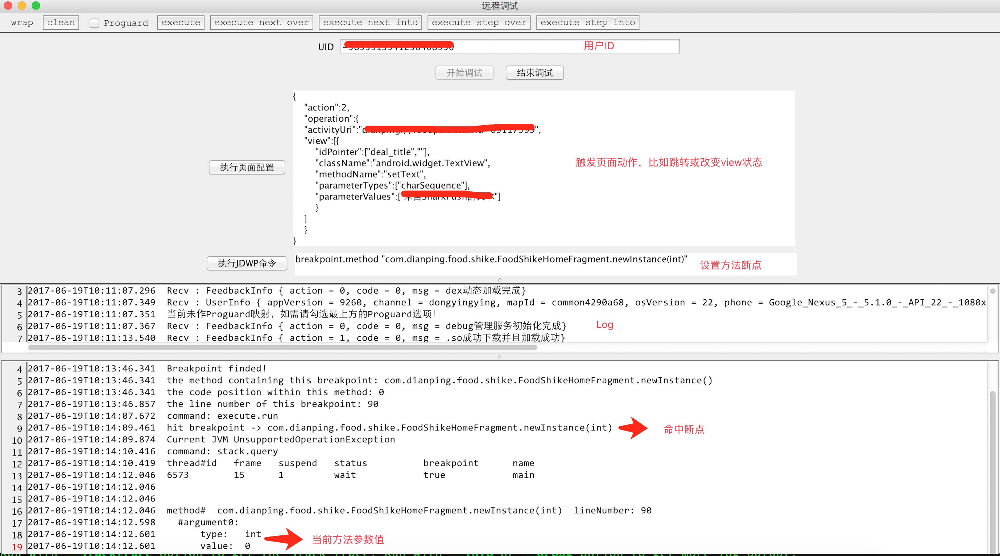

# Android远程调试的探索与实现

url：https://tech.meituan.com/2017/07/20/android-remote-debug.html


作为移动开发者，最头疼的莫过于遇到产品上线以后出现了Bug，但是本地开发环境又无法复现的情况。常见的调查线上棘手问题方式大概如下：

| 方法                                                         | 优点               | 缺点                                               |
| :----------------------------------------------------------- | :----------------- | :------------------------------------------------- |
| 联系用户安装已添加测试日志的APK                              | 方便定位问题       | 需要用户积极配合，如果日志添加不全面还需要反复重试 |
| 提前在一些关键路径设置埋点，在用户出现问题以后上报日志进而定位问题 | 不需要用户深度配合 | 关键路径不好预测                                   |

以上两种方法在之前调查线上问题时都有使用，但因为二者都有明显的缺点，所以效果不是特别理想。

能否开发一种工具，既不需要用户深度配合也不需要提前埋点就能方便、快速地定位线上问题？

作为程序员，查bug一般使用下面几种方式：阅读源码、记录日志或调试程序。一般本地无法复现的问题通过阅读源码很难找到原因，而且大多数情况都和用户本地环境有关。记录日志的缺点之前讲过了，同样不予考虑，那能否像调试本地程序一样调试已经发布出去的程序呢？我们对此做了一些尝试和探索。

先看下调试原理，这里以Java为例（通过IDE调试Android程序也基于此原理）。Java（Android）程序都是运行在Java（Dalvik\ART）虚拟机上的，要调试Java程序，就需要向Java虚拟机请求当前程序运行状态，并对虚拟机发送一定的指令，设置一些回调等等。Java的调试体系，就是虚拟机的一套用于调试的工具和接口。Java SE从1.2.2版本以后推出了[JPDA框架](http://download.oracle.com/otn_hosted_doc/jdeveloper/904preview/jdk14doc/docs/guide/jpda/)（Java Platform Debugger Architecture，Java平台调试体系结构）。

### JPDA框架

JPDA定义了一套独立且完整的调试体系，它由三个相对独立的模块组成，分别为：

- [JVM TI](https://docs.oracle.com/javase/7/docs/platform/jvmti/jvmti.html#whatIs)：Java虚拟机工具接口（被调试者）。
- [JDWP](http://download.oracle.com/otn_hosted_doc/jdeveloper/904preview/jdk14doc/docs/guide/jpda/jdwp-spec.html)：Java Debug Wire Protocol，Java调试协议（通道）。
- [JDI](http://download.oracle.com/otn_hosted_doc/jdeveloper/904preview/jdk14doc/docs/guide/jpda/jdi/index.html)：Java Debug Interface，Java调试接口（调试者）。

这三个模块把调试过程分解成了三个自然的概念：

- 被调试者运行在我们想要调试的虚拟机上，它可以通过JVM TI这个标准接口监控当前虚拟机的信息。
- 调试者定义了用户可以使用的调试接口，用户可以通过这些接口对被调试虚拟机发送调试命令，同时显示调试结果。
- 在调试者和被调试者之间，通过JDWP传输层传输消息。

整个过程如下：

```java
             Components                         Debugger Interfaces

                /    |--------------|
               /     |     VM       |
 debuggee ----(      |--------------|  <------- JVM TI - Java VM Tool Interface
               \     |   back-end   |
                \    |--------------|
                /           |
 comm channel -(            |  <--------------- JDWP - Java Debug Wire Protocol
                \           |
                     |--------------|
                     | front-end    |
                     |--------------|  <------- JDI - Java Debug Interface
                     |      UI      |
                     |--------------|
```

下面重点介绍一下JDWP协议。

### JDWP协议

JDWP协议是用于调试器与目标虚拟机之间进行调试交互的通信协议，它的通信会话主要包含两类数据包：

- Command Packet：命令包。调试器发送给虚拟机Command，用于获取程序状态或控制程序执行；虚拟机发送Command给调试器，用于通知事件触发消息。
- Reply Packet：回复包，虚拟机发送给调试者回复命令的请求或者执行结果。

JDWP的数据包主要包含包头和数据两部分，包头字段含义如下：



数据包部分JDWP协议按照功能分为[18组命令](http://download.oracle.com/otn_hosted_doc/jdeveloper/904preview/jdk14doc/docs/guide/jpda/jdwp-protocol.html)（以Java 7为例），包含了虚拟机、引用类型、对象、线程、方法、堆栈、事件等不同类型的操作命令。

Dalvik虚拟机/ART虚拟机对JDWP协议的支持并不完整，但是大部分关键命令都是支持的，具体信息可以参考[Dalvik-JDWP](https://android.googlesource.com/platform/dalvik/+/eclair-release/vm/jdwp/JdwpHandler.c#1902)和[ART-JDWP](https://android.googlesource.com/platform/art/+/android-cts-7.0_r9/runtime/jdwp/jdwp_handler.cc#1443)中所支持的消息。

### Android调试原理

Android调试模型可以看作JPDA框架的具体实现。其中变化比较大的一个是JVM TI适配了Android设备特有的Dalvik虚拟机/ART虚拟机，另一个是JDWP的实现支持ADB和Socket两种通信方式（ADB全称为Android Debug Bridge，是Android系统的一个很重要的调试工具）。整体的调试模型如下：

```java
             ____________________________________
            |                                    |
            |          ADB Server (host)         |
            |                                    |
 Debugger <---> LocalSocket <----> RemoteSocket  |
            |                           ||       |
            |___________________________||_______|
                                        ||
                              Transport ||
    (TCP for emulator - USB for device) ||
                                        ||
             ___________________________||_______
            |                           ||       |
            |          ADBD  (device)   ||       |
            |                           ||       |
Android-VM  |                           ||       |
JDWP-thread <====> LocalSocket <-> RemoteSocket  |
            |                                    |
            |____________________________________|
```

运行在PC上的ADB Server和运行在Android设备上的ADBD守护进程之间通过USB或者无线网络建立连接，分别负责Debugger和Android设备的虚拟机进行通信。一旦连接建立起来，Debugger和Android VM通过“桥梁”进行数据的交换，ADB Server和ADBD对它们来说是透明的。

综上，要实现远程调试，关键需要实现两部分功能：

- 能够自定义JDWP通道。
- 能模拟ADB和ADBD实现消息的转发。

先看下如何实现自定义JDWP通道。

### JDWP启动过程

我们看下Android 5.0系统在启动一个应用时是如何启动JDWP Thread的。

[
](https://ws3.sinaimg.cn/large/006tNc79ly1fgqe0zx3t6j30w60l3dkk.jpg)

*点击图片查看大图*


通过上图可以看到，Android在创建虚拟机的同时会创建一个JDWP-Thread，JDWP默认有ADB和Socket两种通信方式。要实现远程调试，ADB这种方式肯定不适用，所以能否实现一个自定义的Socket通道来实现JDWP的消息转发成了问题的关键。

### Hack-Native-JDWP

通过阅读[JDWP启动源码](https://android.googlesource.com/platform/art/+/android-cts-5.0_r9/runtime/debugger.cc#641)（Android-API-21）发现，要想让JDWP通过自定义的Socket通道进行通信，需要满足两个条件：

- 能够修改全局变量[gJdwpOptions](https://android.googlesource.com/platform/art/+/android-cts-7.0_r9/runtime/debugger.cc#281)的值，使其配置为Socket模式，并指明对应的端口号。
- 使用新的gJdwpOptions参数重新启动JDWP-Thread。

在Android中，JDWP相关代码分别被编译成libart.so（Art）和libdvm.so（Dalvik）。修改或调用其他so库中的代码需要用到动态加载，使用动态加载，应用程序需要先指定要加载的库，然后将该库作为一个可执行程序来使用（即调用其中的函数）。[动态加载](http://tldp.org/HOWTO/Program-Library-HOWTO/dl-libraries.html)API 就是为了动态加载而存在的，它允许共享库对用户空间程序可用。下面表格展示了这个完整的 API：

| 函数    | 描述                                             |
| :------ | :----------------------------------------------- |
| dlopen  | 使对象文件可被程序访问                           |
| dlsym   | 获取执行了 `dlopen` 函数的对象文件中的符号的地址 |
| dlerror | 返回上一次出现错误的字符串                       |
| dlclose | 关闭目标文件                                     |

在介绍如何调用动态加载功能之前，先介绍一下C/C++编译器在编译目标文件时所进行的[名字修饰](https://zh.wikipedia.org/wiki/名字修饰)（符号化）。

### 符号化

上文提到要想自定义JDWP-Thread，首先需要修改gJdwpOptions的值，该值是在[debugger.cc](https://android.googlesource.com/platform/art/+/android-cts-5.0_r9/runtime/debugger.cc)中通过[Dbg::ParseJdwpOptions](https://android.googlesource.com/platform/art/+/android-cts-5.0_r9/runtime/debugger.cc#614)方法来设置的，所以只要用新的配置重新调用一次ParseJdwpOptions即可。

如何找到Dbg::ParseJdwpOptions这个函数地址呢？为了保证每个函数、变量名都有唯一的标识，编译器在将源代码编译成目标文件时会对变量名或函数名进行[名字修饰](https://zh.wikipedia.org/wiki/名字修饰)。

先看一个例子，下面的C++程序中两个f()的定义：

```c
int  f (void) { return 1; }
int  f (int)  { return 0; }
void g (void) { int i = f(), j = f(0); }
```

这些是不同的函数，除了函数名相同以外没有任何关系。如果不做任何改变直接把它们当成C代码，结果将导致一个错误：C语言不允许两个函数同名。所以，C++编译器将会把它们的类型信息编码成符号名，结果类似下面的代码：

```C++
int  __f_v (void) { return 1; }
int  __f_i (int)  { return 0; }
void __g_v (void) { int i = __f_v(), j = __f_i(0); }
```

可以通过nm命令查看so文件中的符号信息。

```
 nm -D libart.so | grep ParseJdwpOptions
001778d0 T _ZN3art3Dbg16ParseJdwpOptionsERKNSt3__112basic_stringIcNS1_11char_traitsIcEENS1_9allocatorIcEEEE
```

这样就得到了ParseJdwpOptions函数在动态链接库文件中符号化以后的函数名。

找到符号化了的函数名后，就可以通过调用动态链接库中的函数重新启动JDWP-Thread。部分代码如下（以下代码只针对Android-API-21和Android-API-22版本有效）：

```c++
    void *handler = dlopen("/system/lib/libart.so", RTLD_NOW);
    if(handler == NULL){
        LOGD(LOG_TAG,env->NewStringUTF(dlerror()));
    }
	//对于debuggable false的配置，重新设置为可调试
    void (*allowJdwp)(bool);
    allowJdwp = (void (*)(bool)) dlsym(handler, "_ZN3art3Dbg14SetJdwpAllowedEb");
    allowJdwp(true);

    
    void (*pfun)();
	//关闭之前启动的jdwp-thread
    pfun = (void (*)()) dlsym(handler, "_ZN3art3Dbg8StopJdwpEv");
    pfun();

	//重新配置gJdwpOptions
    bool (*parseJdwpOptions)(const std::string&);
    parseJdwpOptions = (bool (*)(const std::string&)) dlsym(handler,
                                                            "_ZN3art3Dbg16ParseJdwpOptionsERKNSt3__112basic_stringIcNS1_11char_traitsIcEENS1_9allocatorIcEEEE");
    std::string options = "transport=dt_socket,address=8000,server=y,suspend=n";
    parseJdwpOptions(options);

    //重新startJdwp
    pfun = (void (*)()) dlsym(handler, "_ZN3art3Dbg9StartJdwpEv");
    pfun();
```

以上代码关闭了之前可能存在的JDWP-Thread，同时开启一个本地的Socket通道来进行通信，这样就能通过本地的Socket通道来进行JDWP消息的传递。

### 突破7.0动态链接的限制

通过上面代码可知，实现自定义的JDWP通道主要是采用动态调用libart.so/libdvm.so中的函数实现。但从 Android 7.0 开始，系统将阻止应用动态链接非公开 NDK库，详情请参考《[Android 7.0行为变更](https://developer.android.com/about/versions/nougat/android-7.0-changes.html?hl=zh-cn#ndk#NDK 应用链接至平台库)》，强制调用会产生如下Crash：

```java
java.lang.UnsatisfiedLinkError: dlopen failed: library "/system/lib/libart.so" needed or dlopened by "/system/lib/libnativeloader.so" is not accessible for the namespace "classloader-namespace"
```

如何绕过这个限制来动态调用libart.so中的方法？既然直接调用dlopen会失败，那是不是可以模拟dlopen和dlsym的实现来绕过这个限制？

dlopen和dlsym分别返回动态链接库在内存中的句柄和某个符号的地址，所以只要能找到dlopen返回的句柄并通过句柄找到dlsym符号对应的地址，就相当于实现了这两个函数的功能。libart.so会在程序启动之后就被加载到内存中，可以在/proc/self/[maps](http://man7.org/linux/man-pages/man5/proc.5.html#)找到当前进程中libart.so在内存中映射的地址：

```
vbox86p:/ # cat /proc/1665/maps | grep libart.so                                                                                              

e2d50000-e3473000 r-xp 00000000 08:06 1087                               /system/lib/libart.so
e3474000-e347c000 r--p 00723000 08:06 1087                               /system/lib/libart.so
e347c000-e347e000 rw-p 0072b000 08:06 1087                               /system/lib/libart.so
```

这里libart.so被分成了三个连续子空间，从e2d50000开始。

如何才能在内存中找到想要打开的函数地址？我们先看下[ELF文件结构](https://docs.oracle.com/cd/E19455-01/816-0559/6m71o2afs/index.html)：



要实现dlsym，首先要保证查找的符号在动态符号表中能找到，在ELF文件中，SHT_DYNSYM对应的Section定义了当前文件中的动态符号；SHT_STRTAB定义了动态库中所有字符串；SHT_PROGBITS则定义了动态库中定义的信息。如何找到这些Section：

1. 通过内存映射的方式把libart.so映射到内存中；
2. 按照ELF文件结构解析映射到内存中的libart.so；
3. 解析SHT_DYNSYM，并把当前section复制到内存中；
4. 解析SHT_STRTAB，并把当前section复制到内存中（后面需要根据SHT_STRTAB来找到特定的符号）；
5. 解析SHT_PROGBITS，得到当前内存映射的偏移地址，这里要注意：不同进程中相同动态库的同一个函数的偏移地址是一样的。

以上逻辑的部分代码片段如下：

```c++
    fd = open(libpath, O_RDONLY);
    size = lseek(fd, 0, SEEK_END);
    if(size <= 0) fatal("lseek() failed for %s", libpath);

    elf = (Elf_Ehdr *) mmap(0, size, PROT_READ, MAP_SHARED, fd, 0);
    close(fd);
    fd = -1;
    if(elf == MAP_FAILED) fatal("mmap() failed for %s", libpath);

    ctx = (struct ctx *) calloc(1, sizeof(struct ctx));
    if(!ctx) fatal("no memory for %s", libpath);

    //通过/proc/self/proc 找到的libart.so的起始地址
    ctx->load_addr = (void *) load_addr;
    shoff = ((char *) elf) + elf->e_shoff;

    for(k = 0; k < elf->e_shnum; k++)  {
        shoff = (char *)shoff + elf->e_shentsize;
        Elf_Shdr *sh = (Elf_Shdr *) shoff;
        log_dbg("%s: k=%d shdr=%p type=%x", __func__, k, sh, sh->sh_type);

        switch(sh->sh_type) {
            case SHT_DYNSYM:
                if(ctx->dynsym) fatal("%s: duplicate DYNSYM sections", libpath); /* .dynsym */
                ctx->dynsym = malloc(sh->sh_size);
                if(!ctx->dynsym) fatal("%s: no memory for .dynsym", libpath);
                memcpy(ctx->dynsym, ((char *) elf) + sh->sh_offset, sh->sh_size);
                //ctx->nsyms 动态符号表的个数
                ctx->nsyms = (sh->sh_size/sizeof(Elf_Sym)) ;
                break;
            case SHT_STRTAB:
                if(ctx->dynstr) break;	/* .dynstr is guaranteed to be the first STRTAB */
                ctx->dynstr = malloc(sh->sh_size);
                if(!ctx->dynstr) fatal("%s: no memory for .dynstr", libpath);
                memcpy(ctx->dynstr, ((char *) elf) + sh->sh_offset, sh->sh_size);
                break;

            //当前段内容为program defined information：程序定义区
            case SHT_PROGBITS:
                if(!ctx->dynstr || !ctx->dynsym) break;
                //得到偏移地址
                ctx->bias = (off_t) sh->sh_addr - (off_t) sh->sh_offset;
                break;
        }
    }

    //关闭内存映射
    munmap(elf, size);
```

接下来就可以根据要找的符号名在SHT_DYNSYM中对应的位置得到具体的函数指针，部分代码如下：

```c++
void *fake_dlsym(void *handle, const char *name)
{
    int k;
    struct ctx *ctx = (struct ctx *) handle;
    Elf_Sym *sym = (Elf_Sym *) ctx->dynsym;
    char *strings = (char *) ctx->dynstr;

    for(k = 0; k < ctx->nsyms; k++, sym++)
        if(strcmp(strings + sym->st_name, name) == 0) {
          	//动态库的基地址 + 当前符号section地址 - 偏移地址
            return  (char *)ctx->load_addr + sym->st_value - ctx->bias;
        }
    return 0;
}
```

通过以上模拟dlopen和dlsym的逻辑，我们成功绕过了[系统将阻止应用动态链接非公开 NDK库](https://developer.android.com/about/versions/nougat/android-7.0-changes.html?hl=zh-cn#ndk#NDK 应用链接至平台库)的限制。

### 消息转发

完成上面逻辑以后就可以通过本地Socket在虚拟机和用户进程之间传递JDWP消息。但是要实现远程调试，还需要远程下发虚拟机的调试指令并回传执行结果。我们通过App原有Push通道加上线上消息转发服务，实现了整个调试工具的消息转发功能：



### Proguard对调试的影响

正常发布到市场的项目都会通过Proguad进行混淆，不同力度的混淆配置会生成不同的字节码文件。对调试功能影响比较大的配置有两个：

- LineNumberTable
- LocalVariableTable

如果Proguard中没有对这两个属性进行Keep，那经过Proguard处理的方法字节码中会缺失这两个模块，对调试的影响分别是无法在方法的某一行设置断点和无法获取当前本地变量的值（但能获取到方法参数变量和类成员变量）。一般为了在应用发生崩溃时能获取到调用栈中每个函数对应的行号，需要保留LineNumberTable，同时为了减少包体积会放弃LocalVariableTable。在没有LocalVariableTable的情况下，可以通过调用Execute命令得到一些运行时结果间接得获取到本地变量。

### JDI的实现

整个消息交互流程跑通以后，接下来要做的就是根据JDI规范作进一步的封装。为了方便快速调试，目前调试工具的前端实现主要参考了[LLDB](https://lldb.llvm.org/tutorial.html)的调试流程，通过设置命令的方式进行调试，整体样式如下图所示：

[
](https://ws1.sinaimg.cn/large/006tNc79ly1fgqdwol881j31kw0vp1ia.jpg)

*点击图片查看大图*


本文从调查线上问题的常见手段入手，介绍了到店餐饮移动团队在实现远程调试过程中的尝试和探索。通过远程调试可以方便快捷地获取用户当前App运行时的状态，助力开发者快速定位线上问题。

1. [Java Debug Write Protocol](http://download.oracle.com/otn_hosted_doc/jdeveloper/904preview/jdk14doc/docs/guide/jpda/jdwp-protocol.html).
2. [Android虚拟机调试器原理与实现](http://www.freebuf.com/articles/terminal/114869.html).
3. [Linux 动态库剖析](https://www.ibm.com/developerworks/cn/linux/l-dynamic-libraries/).
4. [Nougat_dlfunctions](https://github.com/avs333/Nougat_dlfunctions).
5. [Dynamic Linking](https://docs.oracle.com/cd/E19455-01/816-0559/6m71o2aft/index.html).

武智，Android高级开发工程师，2013年7月校招加入美团，目前负责维护大众点评App的美食频道。

莹莹，2015年校招加入美团，主要参与大众点评美食频道的日常开发工作，专注于通过工具自动化地提高开发效率和质量。

周佳、卢晟、永锋，2016年校招加入美团，主要参与大众点评美食频道的日常开发工作。

到店餐饮技术部交易与信息技术中心，负责美团美食用户端业务，服务于数以亿计用户，通过更好的榜单、真实的评价和完善的信息为用户提供更好的决策支持，致力于提升用户体验。我们同时承载所有餐饮商户端线上流量，为餐饮商户提供多种营销工具，提升餐饮商户营销效率，最终达到让国人“Eat Better、Live Better”的美好愿景！我们的团队包含且不限于Android、iOS、FE、Java、PHP等技术方向，已完备覆盖前后端技术栈。只要你来，就能点亮全栈开发技能树。诚挚欢迎投递简历至wangying49#meituan.com。