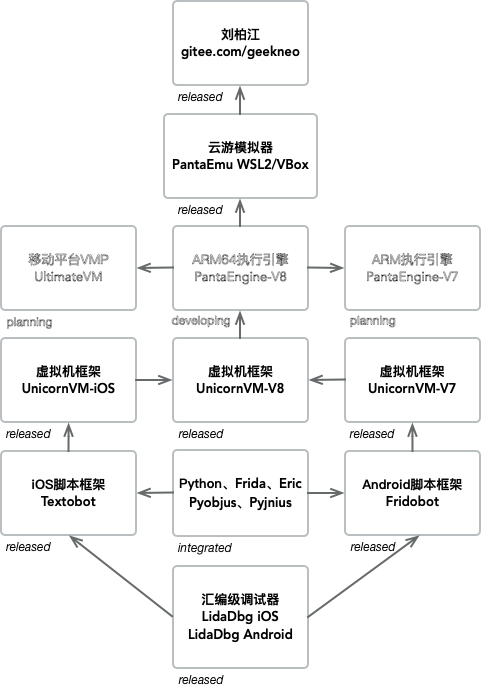
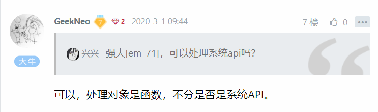
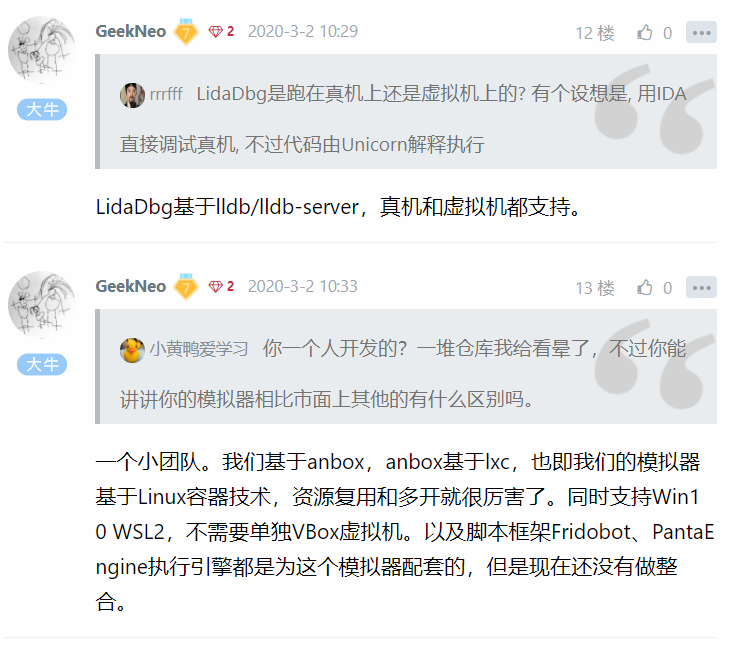
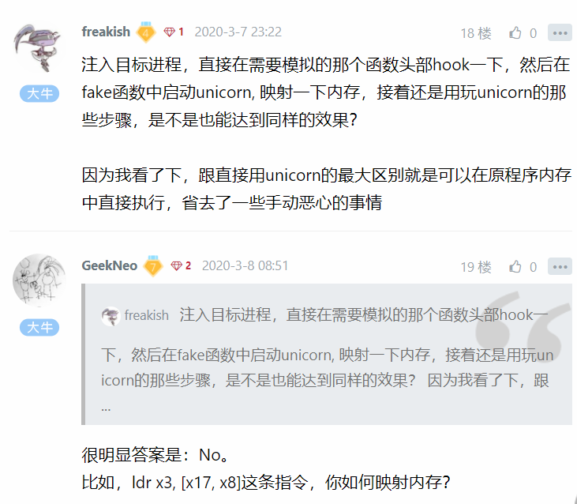
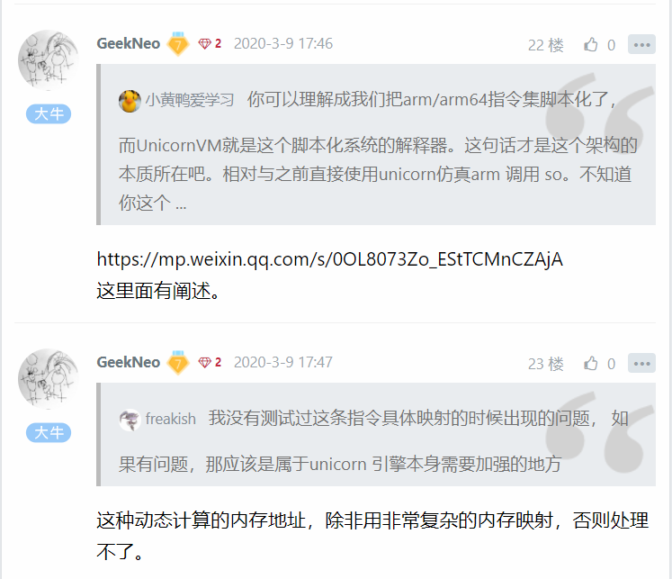

# UnicornVM-全平台全架构正式发布

url：https://bbs.pediy.com/thread-257881.htm




这个月初，我们发布了适用于Android armeabi-v7a的UnicornVM，月中陆陆续续发布了适用于Android arm64-v8a、iOS arm64的版本。这三个版本原计划是3、4、5月逐步发布的，但是特殊时期我们需要响应国家号召居家不出门不添乱，所以咱们只有老实居家使出洪荒之力加油搞开发写代码了。结果就是，我们整整提前了2个月完成UnicornVM的测试和发布，可喜可贺。

今天，我们修复了arm64版本若干崩溃的问题，也达到了比较好的稳定性，所以arm32/arm64两个架构、Android/iOS两个平台目前都处于稳定版本的状态。

从年前1月份提出UnicornVM这个新产品概念到现在已经有2个月的时间了，可能很多朋友还不是很了解这个框架到底有什么作用，可以拿来干嘛？那么，今天这篇文章，我们将详细介绍一下它的结构和用法。

首先从字面UnicornVM上理解，拆成两部分Unicorn、VM。其中Unicorn是由越南大佬Nguyen Anh Quynh开发的虚拟CPU框架，底层基于Qemu，而VM是指Virtual Machine也即虚拟机。虚拟机一般有两种解释，一种是指系统虚拟机，比如VMWare、VirtualBox，一种是指软件虚拟机，比如Python解释器，此处我们的UnicornVM指第二种情况。那么UnicornVM与Unicorn区别在哪里呢？

我们都知道，有意义的程序要正常运行起来，需要代码、数据两部分。把代码、数据这两者统一起来看其实它们都是内存，即便是存放在文件系统里面的数据也是需要加载到内存里面才能访问。但是由于Unicorn是基于Qemu开发而来的，因此它自带虚拟内存管理。所以我们想要正常让它模拟执行函数代码时，还需要手动处理内存映射的问题，这为我们在某些场景使用带来了各种不方便。
所以，我们可以直接让Unicorn与程序的运行内存交互，而抛弃它的Qemu虚拟内存吗？这其实就是UnicornVM解决的核心问题。你只需要丢一个合法的函数地址给它，然后它就可以达到像直接执行这个函数一样的效果。同时，由于这是一个虚拟机架构，所以我们可以在指令级别控制这个函数的执行过程，你可以理解成我们把arm/arm64指令集脚本化了，而UnicornVM就是这个脚本化系统的解释器，就像Python解释器、JavaScript解释器执行它们各自的字节码一样。目前，UnicornVM框架导出了2个API以及若干数据结构，如下：

```
// run function 'fn' on our VCPU with 'ctx'
// return value is x0
VCAPI long vc_run_interp(const void *fn, const vc_context_t *ctx);
 
// make a wrapper for function 'fn' with 'usrctx','callback'
// return value is a new function pointer which will run under our VCPU
// you can replace this pointer to target's function pointer
// like C++-Vtable/Script-Native-Bridge
// if return null, you should check errno
VCAPI const void *vc_make_callee(const void *fn, void *usrctx,
                                 fn_vc_callback_t callback);
```


vc_run_interp表示直接将函数跑在虚拟机解释器里面，第一个参数fn代表要执行的函数地址，第二个参数ctx是执行这个函数时候由调用者提供的上下文，包括寄存器参数、回调函数等信息。

vc_make_callee表示对指定的函数生成一个包装函数，而这个包装函数就跑在虚拟机解释器里面，第一个参数fn代表要执行的函数地址，第二个参数usrctx是调用者自定义的上下文，第三个参数callback是解释器的回调函数。

我们重点看一下解释器回调相关的结构，它的定义如下：

```
// callback prototype
typedef vc_callback_return_t (*fn_vc_callback_t)(vc_callback_args_t *args);
 
// callback return type
typedef enum vc_callback_return_t {
  cbret_continue,    // let interp continue
  cbret_processed,   // already processed by callback implementation
  cbret_recursive,   // interp this function recursively
  cbret_directcall,  // call this function directly
} vc_callback_return_t;
 
// opcode type for callback args
typedef enum vc_optype_t {
  vcop_read,    // memory read
  vcop_write,   // memory write
  vcop_call,    // function call
  vcop_return,  // function return
  vcop_svc,     // arch syscall
} vc_optype_t;
 
// callback args
typedef struct vc_callback_args_t {
  // your own context passed for vc_run_interp/vc_make_callee
  const void *usrctx;
  // arm64 execution context
  vc_arm64ctx_t *arm64ctx;
  // current opcode
  vc_optype_t op;
  union {
    // for vcop_read/vcop_write
    struct {
      const void *src;
      void *dst;
      int byte;
    } rw;
    // for vcop_call
    struct {
      const void *callee;
    } call;
    // for vcop_return
    struct {
      const void *hitaddr;  // which address hit return
    } ret;
    // for vcop_svc
    struct {
      int sysno;  // syscall number
    } svc;
  } info;
} vc_callback_args_t;
```

它的作用是虚拟机解释器在执行到内存读写、函数调用/返回、系统调用等指令时，调用由用户指定的这个回调，从而达到用户可控的目的。回调函数的返回值用于告诉虚拟机解释器该如何处理本条指令，比如递归调用、忽略、默认处理等，如果调用者已经处理了这条指令，则可以返回cbret_processed。我们看一下sample里面的代码片段，如下：

```
// run interpretee directly
int vrun_print_message(const char *reason, const char **argv, FILE *cblogfp, fn_vc_callback_t cb) {
  vc_context_t ctx;
  memset(&ctx, 0, sizeof(ctx));
  ctx.usrctx = cblogfp;
  ctx.callback = cb;
  ctx.regctx.r[0].p = reason;
  ctx.regctx.r[1].p = (void *)argv;
  return (int)(long)vc_run_interp((void *)print_message, &ctx);
}
```

这是sample里面的例子代码，将函数print_message直接跑在解释器下面。

```
// run interpretee with a wrapper
int wrapper_print_message(const char *reason, const char **argv, FILE *cblogfp,
                          fn_vc_callback_t cb) {
  const void *fnptr = vc_make_callee((void *)print_message, cblogfp, cb);
  return ((int (*)(const char *, const char **))fnptr)(reason, argv);
}
```

这是sample里面的例子代码，将函数print_message生成一个代理函数指针，然后直接调用这个指针，代理函数将会执行在虚拟机解释器里面。
好了，看到这里，我想朋友们已经学会并理解了UnicornVM的核心理念和功能，如果你在使用它的过程中有任何疑问、建议、问题，欢迎反馈，么么哒。









