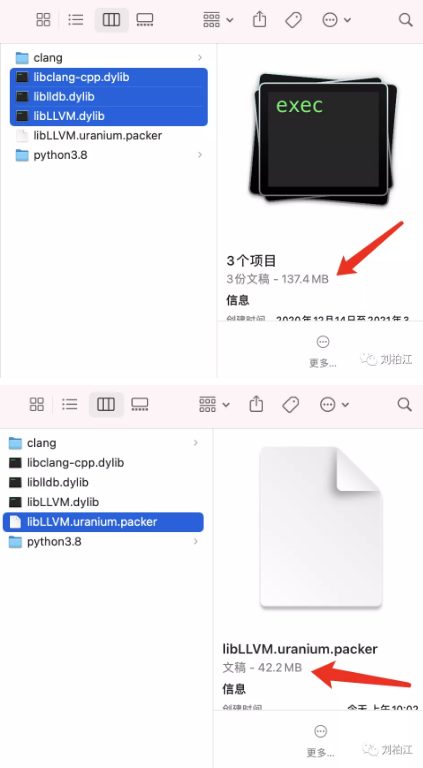
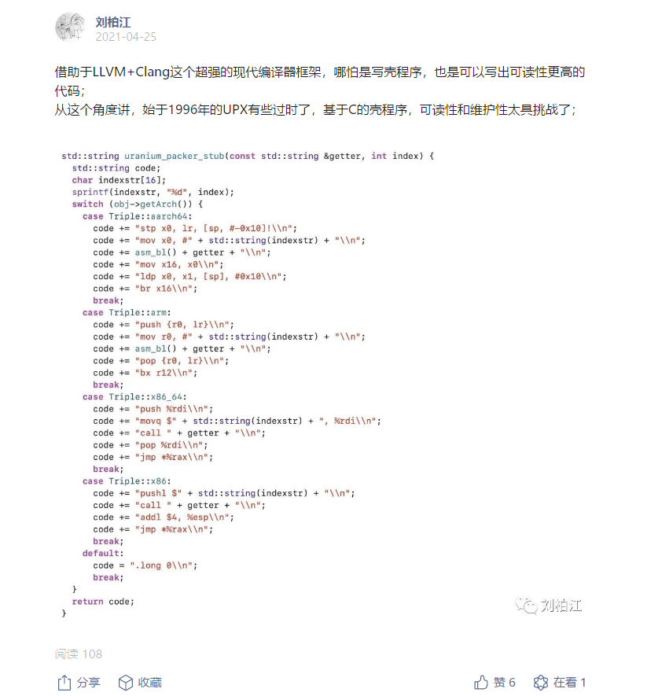

## UraniumPacker-一个可以多合一的MachO/ELF免费压缩壳

url：https://mp.weixin.qq.com/s/s5__9pGBTaQxBCypS9-ghw

关键词：多合一、压缩、免费。

最有名的压缩壳是UPX，不改官方源码的前提下也是允许商用的。但是很遗憾，UPX并不能满足我们的需求：

1. 只能压缩，不能将多个动态库打包成一个，而我们的黑盒虚拟机PhoneVMP是需要将目标文件和VMP Runtime合并在一起的，就像VMProtect的运行时VMProtectSDK是集成进目标文件了一样；
2. Android加了UPX后linker报无效字段的错误，没法用，也即UPX对MachO/ELF的支持没有PE那么好；
3. 如果为了多合一和修复Bug改了UPX的代码商用就需要开源，毕竟貌似它和X64Dbg一样，属于个人开源作品，怕了；

另外，到目前为止我们的产品几乎都是面对开发者和逆向工程师，借用了gitee这个开源平台（用开源平台但是大部分产品不开源的确很无耻，但是朋友们要理解一个各方面都有限的小公司为了省成本也只能暂时背负这样的骂名了），利用git的方式clone下载和pull更新产品时，产品文件当然是越小越好了。比如我们依赖的LLVM、Clang、LLDB都是超级大块头，轻轻松松单个文件达100MB，加一个UraniumPacker瞬间变30MB，多香。

UraniumPacker已经设计并验证完毕，稍等几天，它就可以免费为你的MachO/ELF服务了。

