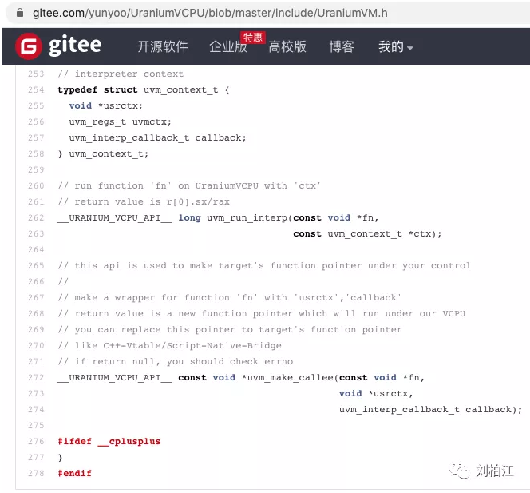

## UraniumVCPU-10年青春化作这一个头文件了

url：https://mp.weixin.qq.com/s/tZjRMvCxI4Y_LtDRP5eyow

```
https://gitee.com/yunyoo/UraniumVCPU/blob/master/include/UraniumVM.h
```

```
///////////////////////////////////YUNYOO.CN//////////////////////////////////////
//                                                                               *
// Uranium Virtual Machine HEADER FILE                                           *
//                                                                               *
// Copyright(C) 2021 YunYoo Corp., ALL RIGHTS RESERVED.                          *
//                                                                               *
// Internet: yunyoo.cn                                                           *
//                                                                               *
// This code is distributed "as is", part of UraniumVM and without warranty of   *
// any kind, expressed or implied, including, but not limited to warranty of     *
// fitness for any particular purpose. In no event will UraniumVM be liable to   *
// you for any special, incidental, indirect, consequential or any other         *
// damages caused by the use, misuse, or the inability to use of this code,      *
// including anylost profits or lost savings, even if UraniumVM has been advised *
// of the possibility of such damages.                                           *
//                                                                               *
///////////////////////////////////////*//////////////////////////////////////////

#pragma once

// arch difinition
#if __arm__ || __thumb__
#define __a32__ 1
#elif __arm64__ || __aarch64__
#define __a64__ 1
#elif __i386__ || __x86__
#define __x32__ 1
#elif __x86_64__
#define __x64__ 1
#else
#error Uranium vCPU only supports arm/arm64/x86/x64 arch.
#endif

// vendor difinition
#if __a32__ || __a64__
#define __ARM__ 1
#else
#define __INTEL__ 1
#endif

#ifdef __cplusplus
extern "C" {
#endif

#ifdef _WIN32
// Windows
#ifdef URANIUM_VCPU_IMPL
#define __URANIUM_VCPU_API__ __declspec(dllexport)
#else
#define __URANIUM_VCPU_API__ __declspec(dllimport)
#endif // end of URANIUM_VCPU_IMPL
#else
// macOS/iOS/Android
#define __URANIUM_VCPU_API__ __attribute__((visibility("default")))
#endif // end of _WIN32

// arm common register like r0 r1 ... lr sp pc
typedef union arm_cmmreg_t {
  unsigned int w;
  unsigned int x;  // make the same name as arm64
  int sw;
  int sx;
  const void *p;
  const char *s;
} arm_cmmreg_t;

// arm neon register like s0 d0 ...
typedef union arm_neonreg_t {
  unsigned int i[2];
  unsigned long long l;
  int si[2];
  long long sl;
  float f[2];
  double d;
} arm_neonreg_t;

// special register wrapper
#define ARM_FP(c) (c).r[12]
#define ARM_SP(c) (c).r[13]
#define ARM_LR(c) (c).r[14]
#define ARM_PC(c) (c).pc

// arm execution context
typedef struct arm_regs_t {
  arm_cmmreg_t r[16];  // 0-12, 13-sp, 14-lr, 15-reserved
  arm_neonreg_t v[32];
  arm_cmmreg_t pc;
} arm_regs_t;

// arm64 common register like x0 x1 ... lr sp pc
typedef union arm64_cmmreg_t {
  unsigned int w;
  unsigned long long x;
  int sw;
  long long sx;
  const void *p;
  const char *s;
  unsigned int ws[2];
  int sws[2];
} arm64_cmmreg_t;

// arm64 neon register like s0 d0 q0 ...
typedef union arm64_neonreg_t {
  unsigned int i[4];
  unsigned long long l[2];
  int si[4];
  long long sl[2];
} arm64_neonreg_t;

// special register wrapper
#define ARM64_FP(c) (c).r[29]
#define ARM64_LR(c) (c).r[30]
#define ARM64_SP(c) (c).r[31]
#define ARM64_PC(c) (c).pc

// arm64 execution context
typedef struct arm64_regs_t {
  arm64_cmmreg_t r[32];  // 0-28,29-fp,30-lr,31-sp
  arm64_neonreg_t v[32];
  arm64_cmmreg_t pc;
} arm64_regs_t;

// x86/x64 common register like eax/rax ...
typedef union intel_cmmreg_t {
  void *p;
  char *s;
  unsigned long long q;
  long long sq;
  unsigned long long x;
  long long sx;
  unsigned int l;
  int sl;
  unsigned int w[2];
  int sw[2];
  unsigned short h[4];
  short sh[4];
  unsigned char b[8];
  char sb[8];
} intel_cmmreg_t;

// x86/x64 sse register like xmm0 ...
typedef union intel_ssereg_t {
  intel_cmmreg_t i[2];
  double d[2];
  float f[4];
} intel_ssereg_t;

// x86/x64 float register like mm0/st(0) ...
typedef union intel_floatreg_t {
  intel_cmmreg_t i;
  char fp80[10];
  double d;
} intel_floatreg_t;

// x86/x64 execution context
typedef struct intel_regs_t {
  intel_cmmreg_t rax;
  intel_cmmreg_t rbx;
  intel_cmmreg_t rcx;
  intel_cmmreg_t rdx;
  intel_cmmreg_t rbp;
  intel_cmmreg_t rsi;
  intel_cmmreg_t rdi;
  intel_cmmreg_t r8;
  intel_cmmreg_t r9;
  intel_cmmreg_t r10;
  intel_cmmreg_t r11;
  intel_cmmreg_t r12;
  intel_cmmreg_t r13;
  intel_cmmreg_t r14;
  intel_cmmreg_t r15;
  intel_ssereg_t xmm[16];
  intel_floatreg_t stmmx[8];
  intel_cmmreg_t rsp;
  intel_cmmreg_t pc;
} intel_regs_t;

// uvm execution context
#if __a32__
typedef arm_regs_t uvm_regs_t;
#elif __a64__
typedef arm64_regs_t uvm_regs_t;
#else
typedef intel_regs_t uvm_regs_t;
#endif

// opcode type for callback args
typedef enum uvm_optype_t {
  vcop_read,    // memory read
  vcop_write,   // memory write
  vcop_call,    // function call
  vcop_return,  // function return
#if __ARM__
  vcop_svc,  // arm syscall
#else
  vcop_syscall,  // intel syscall
#endif
  vcop_ifetch,  // interpreter fetch instruction
} uvm_optype_t;

// callback args
typedef struct uvm_callback_args_t {
  // your own context passed for uvm_run_interp/uvm_make_callee
  const void *usrctx;
  // uvm execution context
  uvm_regs_t *uvmctx;
  // current opcode
  uvm_optype_t op;
  union {
    // for vcop_read/vcop_write/vcop_ifetch
    struct {
      const void *src;
      void *dst;
      int byte;
    } rw;
    // for vcop_call
    struct {
      const void *callee;
    } call;
    // for vcop_return
    struct {
      const void *hitaddr;  // which address hit return
    } ret;
    // for vcop_svc
    struct {
      // arm
      // parameters are in armctx->r[0...6]
      // syscall number from armctx->r[7]
      //
      // arm64
      // parameters are in arm64ctx->x
      // syscall number
      //
      // x86/x64
      // ...
      int sysno;
    } svc;
  } info;
} uvm_callback_args_t;

// callback return type
typedef enum uvm_callback_return_t {
  cbret_continue,    // let interp continue
  cbret_processed,   // already processed by callback implementation
  cbret_recursive,   // interp this function recursively
  cbret_directcall,  // call this function directly
} uvm_callback_return_t;

// callback prototype
typedef uvm_callback_return_t (*uvm_interp_callback_t)(
    uvm_callback_args_t *args);

// interpreter context
typedef struct uvm_context_t {
  void *usrctx;
  uvm_regs_t uvmctx;
  uvm_interp_callback_t callback;
} uvm_context_t;

// run function 'fn' on UraniumVCPU with 'ctx'
// return value is r[0].sx/rax
__URANIUM_VCPU_API__ long uvm_run_interp(const void *fn,
                                         const uvm_context_t *ctx);

// this api is used to make target's function pointer under your control
//
// make a wrapper for function 'fn' with 'usrctx','callback'
// return value is a new function pointer which will run under our VCPU
// you can replace this pointer to target's function pointer
// like C++-Vtable/Script-Native-Bridge
// if return null, you should check errno
__URANIUM_VCPU_API__ const void *uvm_make_callee(const void *fn,
                                                 void *usrctx,
                                                 uvm_interp_callback_t callback);

#ifdef __cplusplus
}
#endif
```

