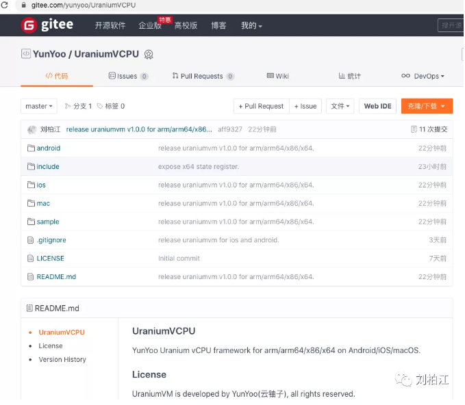

## UraniumVM-arm/arm64/x86/x64指令级函数虚拟机

url：https://mp.weixin.qq.com/s/2hdjD6raRwf7ikQphER10w

今天，我们补上了指令级函数虚拟机的最后一块阵地：x86、x64。现在UraniumVM是一套可以完备模拟执行ARM和Intel指令集的进程函数虚拟机。你可以用它做很多有意思的事情，其中一件就是A64Dbg的C/C++/ObjC脚本系统ADCpp。

它与Unicorn最大的区别就是：一个是仿真环境一个是真实环境，各有优略：

|               | UraniumVM   | Unicorn  |
| ------------- | ----------- | -------- |
| 执行环境      | 真实进程    | 仿真环境 |
| 虚拟机CPU内核 | UraniumVCPU | Qemu     |

目前支持的平台和架构列表如下：

|        | Android | iOS  | macOS |
| ------ | ------- | ---- | ----- |
| arm    | Yes     | No   | No    |
| arm64  | Yes     | Yes  | Yes   |
| x86    | Yes     | No   | No    |
| x86_64 | Yes     | No   | Yes   |

UraniumVM导出的两个API分别是：

```
https://gitee.com/yunyoo/UraniumVCPU/blob/master/include/UraniumVM.h
```

```
// run function 'fn' on UraniumVCPU with 'ctx'
// return value is r[0].sx/rax
__URANIUM_VCPU_API__ long uvm_run_interp(const void *fn,
                                         const uvm_context_t *ctx);

// this api is used to make target's function pointer under your control
//
// make a wrapper for function 'fn' with 'usrctx','callback'
// return value is a new function pointer which will run under our VCPU
// you can replace this pointer to target's function pointer
// like C++-Vtable/Script-Native-Bridge
// if return null, you should check errno
__URANIUM_VCPU_API__ const void *uvm_make_callee(const void *fn,
                                                 void *usrctx,
                                                 uvm_interp_callback_t callback);
```

用法如下：

 

```
// run interpretee directly
int vrun_print_message(const char *reason, const char **argv, FILE *cblogfp,
                       uvm_interp_callback_t cb) {
  uvm_context_t ctx;
  memset(&ctx, 0, sizeof(ctx));
  ctx.usrctx = cblogfp;
  ctx.callback = cb;
#if __ARM__
  ctx.uvmctx.r[0].p = reason;
  ctx.uvmctx.r[1].p = (void *)argv;
#else
#if __x64__
  ctx.uvmctx.rdi.p = (void *)reason;
  ctx.uvmctx.rsi.p = (void *)argv;
#else
  // x86 uses stack to pass parameter
  void *args[3];
  args[0] = (void *)vrun_print_message; // simulate call return address
  args[1] = (void *)reason;
  args[2] = (void *)argv;
  ctx.uvmctx.rsp.p = (void *)&args[0];
#endif
#endif
  return (int)(long)uvm_run_interp((void *)print_message, &ctx);
}

// run interpretee with a wrapper
int wrapper_print_message(const char *reason, const char **argv, FILE *cblogfp,
                          uvm_interp_callback_t cb) {
  const void *fnptr = uvm_make_callee((void *)print_message, cblogfp, cb);
  return ((int (*)(const char *, const char **))fnptr)(reason, argv);
}
```

UraniumVCPU Framework可用于任何C/C++执行环境，接受各种形式的定制，欢迎咨询交流。

如果你在使用UraniumVM的过程中有任何问题，欢迎反馈提交。Have fun～



