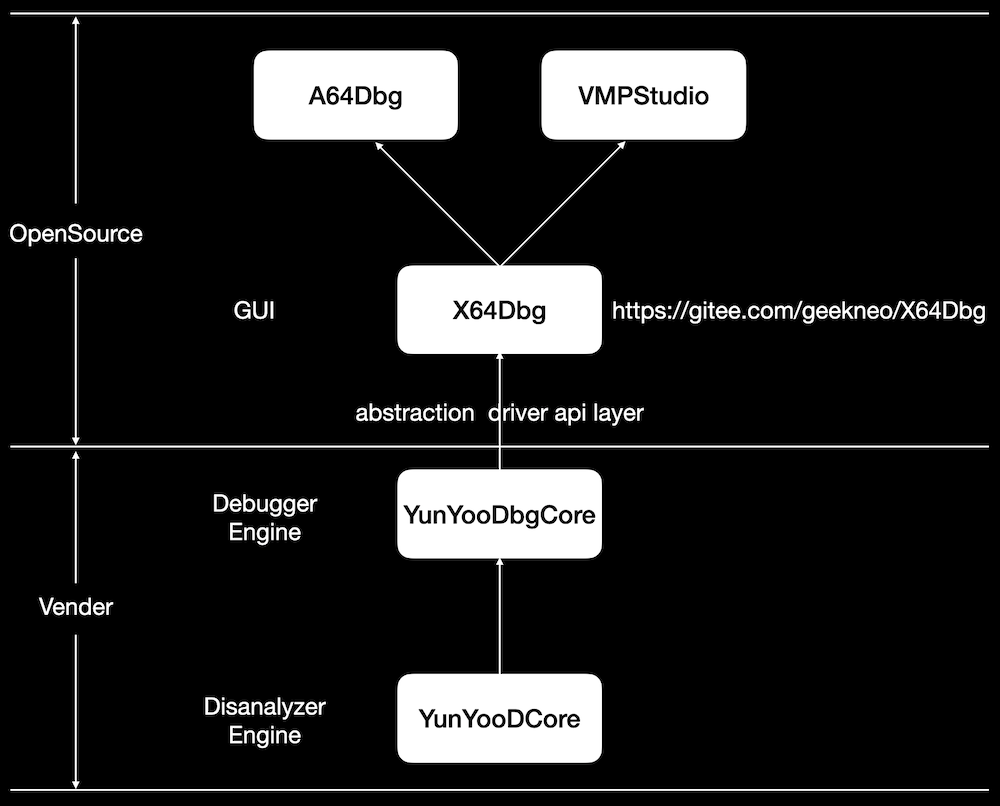

# X64Dbg-构建属于你的逆向工程操作平台 

url：https://bbs.pediy.com/thread-267054.htm

今天，我们正式开源了裁剪过的X64Dbg，它是一个跨平台的通用调试器、反汇编器的前端界面框架。目前支持的平台包括：Windows、Intel macOS、ARM macOS。
调试引擎、反汇编引擎、分析引擎的接口定义在abstraction文件夹下面：

```
2021/04/16  10:03             1,677 CommDef.h     
2021/04/16  10:19            11,525 DebugEngine.cpp
2021/04/16  10:13             4,549 DebugEngine.hpp
2021/04/16  10:03             3,122 Disassembler.h
2021/04/16  10:03             4,716 LLDBEngine.hpp
2021/04/16  10:21             9,713 MagicAna.hpp
2021/04/16  10:03             4,521 ManaFile.h
```

## X64Dbg

The GUI frontend project of A64Dbg and VMPStudio.

 

Support running on the following platforms:

- Windows;
- Intel macOS;
- ARM macOS;

## Build

- 1.open YunYooDbgCore.pro to build the abstract debug engine dynalic library;

- 2.open gui/x64dbglib.pro to build the x64dbg common gui controls static library;

- 3.open A64Dbg.pro to build the A64Dbg main program;

- 4.open VMPStudio.pro to build the VMPStudio main program;

- NOTE: on windows, 2/3/4 need the extra qmake parameter:

  ```
  QMAKE: -spec win32-clang-msvc
  ```

  

## DebugEngine

We make an abstraction layer for X64Dbg, you can implement the API in abstrasction/*.h to customize your debug core.

## License

See ./README.X64DBG.md and the modified GPL3 license at ./LICENSE.


## X64Dbg

The GUI frontend project of A64Dbg and VMPStudio.

Support running on the following platforms:

- Windows x86_64;
- Intel macOS x86_64;
- ARM macOS arm64;



## Build

- 1.open YunYooDbgCore.pro to build the abstract debug engine dynalic library;
- 2.open gui/x64dbglib.pro to build the x64dbg common gui controls static library;
- 3.open A64Dbg.pro to build the A64Dbg main program;
- 4.open VMPStudio.pro to build the VMPStudio main program;
- NOTE: on Windows, 2/3/4 need the extra qmake parameter, and must select the x64 build kit:

```
 QMAKE: -spec win32-clang-msvc
```

## DebugEngine

We make an abstraction layer for X64Dbg, you can implement the API in abstrasction/*.h to customize your debug core.

## License

See ./README.X64DBG.md and the modified GPL3 license at ./LICENSE.