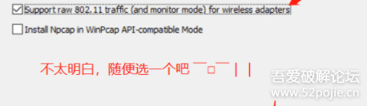

# Unidbg学习笔记

url：https://www.52pojie.cn/thread-1367840-1-1.html

# unidbg学习（一）

## `unidbg`是什么？

[unidbg](https://github.com/zhkl0228/unidbg)是`unicorn`的一个实现，它可以让你在电脑上跑`arm`的可执行文件或共享库文件。

以上是我的理解。

## `unidbg`的优点？

最大的优点就是让你在电脑上可以调用`apk/ipa`中的`native`方法。

作者完成了对`android/ios`环境的模拟，提供了对方法`hook`的`api`接口，然后你就可以通过简单的几行代码，完成对`native`层函数的调用。

## 先把demo跑起来

电脑安装`IntelliJ IDEA`

```
git clone https://github.com/zhkl0228/unidbg.git
```

使用`idea`打开，等待他加载完毕，请保持网络畅通。

加载完成之后，随便打开一个例子，我们尝试跑一下`unidbg-android/src/test/java/com/kanxue/test2/MainActivity.java`


等一等，这是个爆破题，过一会就有答案了。

```
load offset=1844ms
Found: XuE, off=190673ms

Process finished with exit code 0
```


## 第一个例子，让你自己写的例子跑起来

使用`android studio`开始第一次尝试：

```
extern "C" JNIEXPORT jstring JNICALL
Java_com_example_nativetest_MainActivity_stringFromJNI(
        JNIEnv *env,
        jobject /* this */, jobject context) {
    std::string hello = "Hello from C++";
    LOGE("Hello from C++ => %s", hello.c_str());
    for (int i = 0; i < hello.length(); i++) {
        hello[i] = hello[i] ^ hello.length();
    }
    LOGE("Hello from C++ => %s", hello.c_str());
    return env->NewStringUTF(hello.c_str());
}
```

编译成`so`文件，我们来尝试让这个so在电脑上跑起来：

首先，把`so`文件从`apk`中拖出来，我们新建一个文件夹来保存它`unidbg-android/src/test/resources/example`：


编写第一个`java`代码，让你的`so`中的`Java_com_example_nativetest_MainActivity_stringFromJNI`方法跑起来。

```
unidbg-android/src/test/java/com/example/nativetest/Test01.java
```

```
package com.example.nativetest;

import com.github.unidbg.AndroidEmulator;
import com.github.unidbg.LibraryResolver;
import com.github.unidbg.linux.android.AndroidARM64Emulator;
import com.github.unidbg.linux.android.AndroidResolver;
import com.github.unidbg.linux.android.dvm.*;
import com.github.unidbg.memory.Memory;

import java.io.File;
import java.io.IOException;

/**
* 第一个例子，让so跑起来
*/
public class Test01 extends AbstractJni {

    private final VM vm;
    private final DvmClass dvmClass;
    private AndroidEmulator emulator;
    private String processName = "com.example.nativetest";
    private String className = "com/example/nativetest/MainActivity";
    private Memory memory;

    public Test01() {
        // 1. 创建一个Android虚拟机
        emulator = createAndroidEmulator();
        // 2. 获取虚拟机的内存
        memory = emulator.getMemory();
        // 3. 配置Android sdk api版本
        memory.setLibraryResolver(createLibraryResolver(23));
        // 4. 创建Dalvik虚拟环境
        vm = createVM(null);
        // 5. 设置jni
        vm.setJni(this);
        // 6. 设置log
        vm.setVerbose(true);
        // 7. 加载目标so文件
        DalvikModule dalvikModule = vm.loadLibrary(new File("unidbg-android/src/test/resources/example/arm64-v8a/libnative-lib01.so"), false);
        // 8. 配置native方法类名
        dvmClass = vm.resolveClass(className);
    }

    private LibraryResolver createLibraryResolver(int ver) {
        return new AndroidResolver(ver);
    }

    public static void main(String[] args) throws IOException {
        // 测试
        Test01 test01 = new Test01();
        test01.start();
        test01.stop();
    }

    private AndroidEmulator createAndroidEmulator() {
        if (emulator == null) {
            return new AndroidARM64Emulator(processName);
        }
        return emulator;
    }

    private VM createVM(File apk) {
        return emulator.createDalvikVM(apk);
    }

    private void start() {
        // 9. 调用jni方法
        DvmObject result = dvmClass.callStaticJniMethodObject(emulator, "stringFromJNI()Ljava/lang/String");
        // 10. 打印结果
        System.out.println("result = " + result.getValue());
    }

    private void stop() throws IOException {
        emulator.close();
    }
}
```

结果：

```
Find native function Java_com_example_nativetest_MainActivity_Java_com_example_nativetest_MainActivity_stringFromJNI()Ljava/lang/String => RX@0x4001d6b8[libnative-lib.so]0x1d6b8
[main]E/TAG: Hello from C++ => Hello from C++
[main]E/TAG: Hello from C++ => Fkbba.h|ac.M%%
JNIEnv->NewStringUTF("Fkbba.h|ac.M%%") was called from RX@0x4001d98c[libnative-lib.so]0x1d98c
result = Fkbba.h|ac.M%%

Process finished with exit code 0
```


# unidbg学习（二）

## 第二个例子，如果`native`中有`java`方法调用怎么办？

给你的代码加几行

```
public native String stringFromJNI(Context context);
```


```
extern "C" JNIEXPORT jstring JNICALL
Java_com_example_nativetest_MainActivity_stringFromJNI(
        JNIEnv *env,
        jobject /* this */, jobject context) {
    std::string hello = "Hello from C++";
    LOGE("Hello from C++ => %s", hello.c_str());
    for (int i = 0; i < hello.length(); i++) {
        hello[i] = hello[i] ^ hello.length();
    }
    LOGE("Hello from C++ => %s", hello.c_str());
    const char *pkgname = get_packagename(env, context);

    if (strcmp(pkgname, "com.example.nativetest") != -1) {
        LOGE("pkg name => %s", pkgname);
    }
    return env->NewStringUTF(hello.c_str());
}

const char *get_packagename(JNIEnv *env, jobject context) {
    jclass content_class = env->FindClass("android/content/Context");
    if (content_class == nullptr) {
        LOGE("find class error");
        return "";
    }
    jmethodID getPackageName_method = env->GetMethodID(content_class, "getPackageName",
                                                       "()Ljava/lang/String;");
    if (getPackageName_method == nullptr) {
        LOGE("find method error");
        return "";
    }
    if (env->ExceptionCheck()) {
        return "";
    }
    jstring pkgname_string = (jstring) env->CallObjectMethod(context, getPackageName_method);
    const char *ret = env->GetStringUTFChars(pkgname_string,
                                             JNI_FALSE);
    LOGE("pkgname => %s", ret);
    return ret;
}
```


老样子，我们编译成`so`文件，尝试调用一下`unidbg-android/src/test/java/com/example/nativetest/Test02.java`：

```
package com.example.nativetest;

import com.github.unidbg.AndroidEmulator;
import com.github.unidbg.LibraryResolver;
import com.github.unidbg.linux.android.AndroidARM64Emulator;
import com.github.unidbg.linux.android.AndroidResolver;
import com.github.unidbg.linux.android.dvm.*;
import com.github.unidbg.memory.Memory;
import org.apache.log4j.Level;
import org.apache.log4j.Logger;

import java.io.File;
import java.io.IOException;

/**
* 第二个例子，so中有java方法调用，如何处理
*/
public class Test02 extends AbstractJni {

    private final VM vm;
    private final DvmClass dvmClass;
    private AndroidEmulator emulator;
    private String processName = "com.example.nativetest";
    private String className = "com/example/nativetest/MainActivity";
    private Memory memory;

    public Test02() {
//        Logger.getRootLogger().setLevel(Level.DEBUG);
        emulator = createAndroidEmulator();
        memory = emulator.getMemory();
        memory.setLibraryResolver(createLibraryResolver(23));
        vm = createVM(null);
        vm.setJni(this);
        vm.setVerbose(true);

        DalvikModule dalvikModule = vm.loadLibrary(new File("unidbg-android/src/test/resources/example/arm64-v8a/libnative-lib02.so"), false);
        dvmClass = vm.resolveClass(className);
//        emulator.traceCode();
    }

    private LibraryResolver createLibraryResolver(int ver) {
        return new AndroidResolver(ver);
    }

    public static void main(String[] args) throws IOException {
        Test02 Test02 = new Test02();
        Test02.start();
        Test02.stop();
    }

    private AndroidEmulator createAndroidEmulator() {
        if (emulator == null) {
            return new AndroidARM64Emulator(processName);
        }
        return emulator;
    }

    private VM createVM(File apk) {
        return emulator.createDalvikVM(apk);
    }

    private void start() {
        // native方法有个参数，我们在这里创建一个context
        DvmObject result = dvmClass.callStaticJniMethodObject(emulator,
                "Java_com_example_nativetest_MainActivity_stringFromJNI(Landroid/content/Context;)Ljava/lang/String",
                vm.resolveClass("android/content/Context").newObject(null));
        System.out.println("result = " + result.getValue());
    }

    private void stop() throws IOException {
        emulator.close();
    }
}

```


报错了

```
JNIEnv->FindClass(android/content/Context) was called from RX@0x4001df3c[libnative-lib.so]0x1df3c
[10:44:14 688]  WARN [com.github.unidbg.linux.ARM64SyscallHandler] (ARM64SyscallHandler:275) - handleInterrupt intno=2, NR=-1073744360, svcNumber=0x113, PC=unidbg@0xfffe01c4, LR=RX@0x4001e084[libnative-lib.so]0x1e084, syscall=null
java.lang.UnsupportedOperationException: android/content/Context->getPackageName()Ljava/lang/String;
        at com.github.unidbg.linux.android.dvm.AbstractJni.callObjectMethodV(AbstractJni.java:330)
        at com.github.unidbg.linux.android.dvm.AbstractJni.callObjectMethodV(AbstractJni.java:197)
        at com.github.unidbg.linux.android.dvm.DvmMethod.callObjectMethodV(DvmMethod.java:85)
        at com.github.unidbg.linux.android.dvm.DalvikVM64$20.handle(DalvikVM64.java:376)
        at com.github.unidbg.linux.ARM64SyscallHandler.hook(ARM64SyscallHandler.java:82)
        at com.github.unidbg.arm.backend.UnicornBackend$6.hook(UnicornBackend.java:291)
        at unicorn.Unicorn$NewHook.onInterrupt(Unicorn.java:128)
        at unicorn.Unicorn.emu_start(Native Method)
        at com.github.unidbg.arm.backend.UnicornBackend.emu_start(UnicornBackend.java:316)
        at com.github.unidbg.AbstractEmulator.emulate(AbstractEmulator.java:398)
        at com.github.unidbg.AbstractEmulator.eFunc(AbstractEmulator.java:475)
        at com.github.unidbg.arm.AbstractARM64Emulator.eFunc(AbstractARM64Emulator.java:219)
        at com.github.unidbg.Module.emulateFunction(Module.java:154)
        at com.github.unidbg.linux.android.dvm.DvmObject.callJniMethod(DvmObject.java:128)
        at com.github.unidbg.linux.android.dvm.DvmClass.callStaticJniMethodObject(DvmClass.java:297)
        at com.example.nativetest.Test02.start(Test02.java:63)
        at com.example.nativetest.Test02.main(Test02.java:47)
[10:44:14 688]  WARN [com.github.unidbg.AbstractEmulator] (AbstractEmulator:417) - emulate RX@0x4001daa8[libnative-lib.so]0x1daa8 exception sp=unidbg@0xbffff510, msg=android/content/Context->getPackageName()Ljava/lang/String;, offset=36ms
        at com.example.nativetest.Test02.start(Test02.java:66)
        at com.example.nativetest.Test02.main(Test02.java:47)
```


从错误信息可以看出，他没找到`android/content/Context->getPackageName()Ljava/lang/String;`这个方法，我们需要重写一下这个方法，让他返回正确的值，这样应该就不报错了。

观察一个这个方法，没有参数，返回`string`，所以我们需要在我们的调用代码中添加如下代码：

```
    @Override
    public DvmObject<?> callObjectMethodV(BaseVM vm, DvmObject<?> dvmObject, String signature, VaList vaList) {
        if (signature.equals("android/content/Context->getPackageName()Ljava/lang/String;")) {
            //添加代码，让他返回一个争取的值。
            return new StringObject(vm, processName);
        }
        return super.callObjectMethodV(vm, dvmObject, signature, vaList);
    }
```

现在就正常了。

```
[main]E/TAG: Hello from C++ => Hello from C++
[main]E/TAG: Hello from C++ => Fkbba.h|ac.M%%
[main]E/TAG: pkgname => com.example.nativetest
[main]E/TAG: pkg name => com.example.nativetest
JNIEnv->FindClass(android/content/Context) was called from RX@0x4001df3c[libnative-lib.so]0x1df3c
JNIEnv->CallObjectMethodV(android.content.Context@192d3247, getPackageName() => "com.example.nativetest") was called from RX@0x4001e084[libnative-lib.so]0x1e084
JNIEnv->GetStringUtfChars("com.example.nativetest") was called from RX@0x4001e0f4[libnative-lib.so]0x1e0f4
JNIEnv->NewStringUTF("Fkbba.h|ac.M%%") was called from RX@0x4001df04[libnative-lib.so]0x1df04
result = Fkbba.h|ac.M%%
```

从这个例子中，我们可以看到，`unidbg`会拦截`java`层的方法调用，如果没有重写这些方法调用的话，对报错退出，所以我们要自己分析`native`函数调用，如果遇到`java`层方法调用的话，需要自己实现部分逻辑的。

# unidbg学习（三）

## 第三个例子，尝试`hook`函数

为你的`native`代码加几行代码

```
JNIEXPORT jint JNI_OnLoad(JavaVM *vm, void *reserved) {
    LOGE("unhook");
    ptrace(PTRACE_TRACEME, 0, 0, 0);
    JNIEnv *env;

    if (vm->GetEnv((void **) &env, JNI_VERSION_1_6) != JNI_OK) {
        return -1;
    }
    return JNI_VERSION_1_6;
}
```

编译成so，开始尝试`hook`代码

翻看`unidbg`介绍，我们发现

> - Inline hook, thanks to [HookZz](https://github.com/jmpews/Dobby).
> - Android import hook, thanks to [xHook](https://github.com/iqiyi/xHook).

那么我们先用`xHook`做第一次尝试：

```
package com.example.nativetest;

import com.github.unidbg.AndroidEmulator;
import com.github.unidbg.Emulator;
import com.github.unidbg.LibraryResolver;
import com.github.unidbg.arm.HookStatus;
import com.github.unidbg.hook.HookContext;
import com.github.unidbg.hook.ReplaceCallback;
import com.github.unidbg.hook.xhook.IxHook;
import com.github.unidbg.linux.android.AndroidARM64Emulator;
import com.github.unidbg.linux.android.AndroidResolver;
import com.github.unidbg.linux.android.XHookImpl;
import com.github.unidbg.linux.android.dvm.*;
import com.github.unidbg.memory.Memory;
import com.sun.jna.Pointer;
import org.apache.log4j.Level;
import org.apache.log4j.Logger;

import java.io.File;
import java.io.IOException;

/**
* 第三个例子，第一次尝试hook so方法
*/
public class Test03 extends AbstractJni {

    private final VM vm;
    private final DvmClass dvmClass;
    private AndroidEmulator emulator;
    private String processName = "com.example.nativetest";
    private String className = "com/example/nativetest/MainActivity";
    private Memory memory;

    public Test03() {
//        Logger.getRootLogger().setLevel(Level.DEBUG);
        emulator = createAndroidEmulator();
        memory = emulator.getMemory();
        memory.setLibraryResolver(createLibraryResolver(23));
        vm = createVM(null);
        vm.setJni(this);
        vm.setVerbose(true);

        DalvikModule dalvikModule = vm.loadLibrary(new File("unidbg-android/src/test/resources/example/arm64-v8a/libnative-lib03.so"), false);

        // 支持got表hook
        IxHook xHook = XHookImpl.getInstance(emulator); // 加载xHook，支持Import hook，文档看https://github.com/iqiyi/xHook
        xHook.register("libnative-lib03.so", "ptrace", new ReplaceCallback() { // hook libttEncrypt.so的导入函数strlen
            @Override
            // 类似与xposed的beforehookmethod
            public HookStatus onCall(Emulator<?> emulator, HookContext context, long originFunction) {
                int ptrace_args0 = context.getIntArg(0);
                System.out.println("ptrace=" + ptrace_args0);
                context.push(ptrace_args0);
                return HookStatus.RET(emulator, originFunction);
            }

            @Override
             // 类似与xposed的afterhookmethod
            public void postCall(Emulator<?> emulator, HookContext context) {
                System.out.println("ptrace=" + context.pop() + ", ret=" + context.getIntArg(0));
            }
        }, true);
        xHook.refresh(); // 使Import hook生效
        dalvikModule.callJNI_OnLoad(emulator);
        dvmClass = vm.resolveClass(className);
//        emulator.traceCode();
    }

    private LibraryResolver createLibraryResolver(int ver) {
        return new AndroidResolver(ver);
    }

    public static void main(String[] args) throws IOException {
        Test03 Test02 = new Test03();
        Test02.start();
        Test02.stop();
    }

    private AndroidEmulator createAndroidEmulator() {
        if (emulator == null) {
            return new AndroidARM64Emulator(processName);
        }
        return emulator;
    }

    private VM createVM(File apk) {
        return emulator.createDalvikVM(apk);
    }

    private void start() {
        DvmObject result = dvmClass.callStaticJniMethodObject(emulator,
                "Java_com_example_nativetest_MainActivity_stringFromJNI(Landroid/content/Context;)Ljava/lang/String",
                vm.resolveClass("android/content/Context").newObject(null));
        System.out.println("result = " + result.getValue());
    }

    private void stop() throws IOException {
        emulator.close();
    }

    @Override
    public DvmObject<?> callObjectMethodV(BaseVM vm, DvmObject<?> dvmObject, String signature, VaList vaList) {
        if (signature.equals("android/content/Context->getPackageName()Ljava/lang/String;")) {
            return new StringObject(vm, processName);
        }
        return super.callObjectMethodV(vm, dvmObject, signature, vaList);
    }
}

```

好了，测试一下：

```
ptrace=0
[11:13:25 135]  INFO [com.github.unidbg.linux.ARM64SyscallHandler] (ARM64SyscallHandler:1017) - ptrace request=0x0, pid=0, addr=null, data=null
ptrace=0, ret=0
```

# unidbg学习（四）

## 第四个例子，尝试`hook`函数

为你的`native`代码添加几行

```
void function_check() {
    int pid = getpid();
    std::string file_name = "/proc/pid/status";
    std::string line;
    file_name.replace(file_name.find("pid"), 3, to_string(pid));
    LOGE("replace file name => %s", file_name.c_str());
    ifstream myfile(file_name, ios::in);
    if (myfile.is_open()) {
        while (getline(myfile, line)) {
            size_t TracerPid_pos = line.find("TracerPid");
            if (TracerPid_pos == 0) {
                line = line.substr(line.find(":") + 1);
                LOGE("file line => %s", line.c_str());
                if (std::stoi(line.c_str()) != 0) {
                    LOGE("trace pid => %s, i want to exit.", line.c_str());
//                    kill(pid, 9);
                    break;
                }
            }
        }
        myfile.close();
    }
}

void system_getproperty_check() {
    char man[256], mod[156];
    /* A length 0 value indicates that the property is not defined */
    int lman = __system_property_get("ro.product.manufacturer", man);
    int lmod = __system_property_get("ro.product.model", mod);
    int len = lman + lmod;
    char *pname = NULL;
    if (len > 0) {
        pname = static_cast<char *>(malloc(len + 2));
        snprintf(pname, len + 2, "%s/%s", lman > 0 ? man : "", lmod > 0 ? mod : "");
    }
    LOGE("[device]: [%s]\n", pname ? pname : "N/A");
    if (pname) free(pname);
}

void create_thread_check_traceid() {
    pthread_t t_id;
    int err = pthread_create(&t_id, NULL, reinterpret_cast<void *(*)(void *)>(function_check),
                             NULL);
    if (err != 0) {
        LOGE("create thread fail: %s\n", strerror(err));
    }
}

JNIEXPORT jint JNI_OnLoad(JavaVM *vm, void *reserved) {
    LOGE("unhook");
    create_thread_check_traceid();
    ptrace(PTRACE_TRACEME, 0, 0, 0);
    system_getproperty_check();
    JNIEnv *env;

    if (vm->GetEnv((void **) &env, JNI_VERSION_1_6) != JNI_OK) {
        return -1;
    }
    return JNI_VERSION_1_6;
}

```

我们来看看`unidbg`调用`so`的方法怎么写

```
package com.example.nativetest;

import com.github.unidbg.*;
import com.github.unidbg.Module;
import com.github.unidbg.arm.HookStatus;
import com.github.unidbg.arm.context.RegisterContext;
import com.github.unidbg.debugger.DebuggerType;
import com.github.unidbg.hook.HookContext;
import com.github.unidbg.hook.ReplaceCallback;
import com.github.unidbg.hook.hookzz.*;
import com.github.unidbg.hook.whale.IWhale;
import com.github.unidbg.hook.whale.Whale;
import com.github.unidbg.linux.android.AndroidARM64Emulator;
import com.github.unidbg.linux.android.AndroidResolver;
import com.github.unidbg.linux.android.dvm.*;
import com.github.unidbg.memory.Memory;

import java.io.File;
import java.io.IOException;

/**
* 第四个例子，学习hookso中的native方法
*/
public class Test04 extends AbstractJni {

    private final VM vm;
    private final DvmClass dvmClass;
    private final Module module;
    private AndroidEmulator emulator;
    private String processName = "com.example.nativetest";
    private String className = "com/example/nativetest/MainActivity";
    private Memory memory;

    public Test04() {
//        Logger.getRootLogger().setLevel(Level.DEBUG);
        emulator = createAndroidEmulator();
        memory = emulator.getMemory();
        memory.setLibraryResolver(createLibraryResolver(23));
        vm = createVM(null);
        vm.setJni(this);
        vm.setVerbose(true);

        DalvikModule dalvikModule = vm.loadLibrary(new File("unidbg-android/src/test/resources/example/arm64-v8a/libnative-lib04.so"), false);
        module = dalvikModule.getModule();

        // 1. 获取HookZz对象
        IHookZz hookZz = HookZz.getInstance(emulator); // 加载HookZz，支持inline hook，文档看https://github.com/jmpews/HookZz
        // 2. enable hook
        hookZz.enable_arm_arm64_b_branch(); // 测试enable_arm_arm64_b_branch，可有可无
        // 3. 尝试hook ptrace
        hookZz.wrap(module.findSymbolByName("ptrace"), new WrapCallback<RegisterContext>() { // inline wrap导出函数
            @Override
            // 4. 方法执行前
            public void preCall(Emulator<?> emulator, RegisterContext ctx, HookEntryInfo info) {
                int ptrace_args0 = ctx.getIntArg(0);
                System.out.println("ptrace=" + ptrace_args0);
            }

            @Override
            // 5. 方法执行后
            public void postCall(Emulator<?> emulator, RegisterContext ctx, HookEntryInfo info) {
                System.out.println("ptrace ret=" + ctx.getIntArg(0));
            }
        });
        hookZz.disable_arm_arm64_b_branch();
        // 1. 尝试hook
        Dobby dobby = Dobby.getInstance(emulator);
        // 2. 使用ida pro查看导出方法名，尝试hook
        dobby.replace(module.findSymbolByName("_Z27create_thread_check_traceidv"), new ReplaceCallback() { // 使用Dobby inline hook导出函数
            @Override
            // 3. contextk可以拿到参数，originFunction是原方法的地址
            public HookStatus onCall(Emulator<?> emulator, HookContext context, long originFunction) {
                System.out.println("create_thread_check_traceid.onCall function address => 0x" + Long.toHexString(originFunction));
                return HookStatus.RET(emulator, originFunction);
            }

            @Override
            // 4. 这里可以修改返回值
            public void postCall(Emulator<?> emulator, HookContext context) {
                System.out.println("create_thread_check_traceid.postCall ");
            }
        }, true);

        // 1. 尝试使用whale
        IWhale whale = Whale.getInstance(emulator);
        Symbol system_property_get = module.findSymbolByName("__system_property_get");
        // 2. 只是简单的hook打印了参数
        whale.inlineHookFunction(system_property_get, new ReplaceCallback() {
            @Override
            public HookStatus onCall(Emulator<?> emulator, long originFunction) {
                System.out.println("WInlineHookFunction system_property_get = " + emulator.getContext().getPointerArg(0).getString(0));
                return HookStatus.RET(emulator, originFunction);
            }
        });

        // 调用so文件的JNI_OnLoad方法
        dalvikModule.callJNI_OnLoad(emulator);
        dvmClass = vm.resolveClass(className);
    }

    private LibraryResolver createLibraryResolver(int ver) {
        return new AndroidResolver(ver);
    }

    public static void main(String[] args) throws IOException {
        Test04 Test02 = new Test04();
        Test02.start();
        Test02.stop();
    }

    private AndroidEmulator createAndroidEmulator() {
        if (emulator == null) {
            return new AndroidARM64Emulator(processName);
        }
        return emulator;
    }

    private VM createVM(File apk) {
        return emulator.createDalvikVM(apk);
    }

    private void start() {
        DvmObject result = dvmClass.callStaticJniMethodObject(emulator,
                "Java_com_example_nativetest_MainActivity_stringFromJNI(Landroid/content/Context;)Ljava/lang/String",
                vm.resolveClass("android/content/Context").newObject(null));
        System.out.println("result = " + result.getValue());
    }

    private void stop() throws IOException {
        emulator.close();
    }

    @Override
    public DvmObject<?> callObjectMethodV(BaseVM vm, DvmObject<?> dvmObject, String signature, VaList vaList) {
        if (signature.equals("android/content/Context->getPackageName()Ljava/lang/String;")) {
            return new StringObject(vm, processName);
        }
        return super.callObjectMethodV(vm, dvmObject, signature, vaList);
    }
}

```

测试一下

```
create_thread_check_traceid.onCall function address => 0x400d4000
[11:41:19 433]  INFO [com.github.unidbg.linux.ARM64SyscallHandler] (ARM64SyscallHandler:372) - pthread_clone child_stack=RW@0x4076e438, thread_id=1, fn=RX@0x40287c70[libc.so]0x67c70, arg=unidbg@0x4076e44000000000, flags=[CLONE_VM, CLONE_FS, CLONE_FILES, CLONE_SIGHAND, CLONE_THREAD, CLONE_SYSVSEM, CLONE_SETTLS, CLONE_PARENT_SETTID, CLONE_CHILD_CLEARTID]
create_thread_check_traceid.postCall 
ptrace=0
[11:41:19 447]  INFO [com.github.unidbg.linux.ARM64SyscallHandler] (ARM64SyscallHandler:1017) - ptrace request=0x0, pid=0, addr=null, data=null
ptrace ret=0
WInlineHookFunction system_property_get = ro.product.manufacturer
WInlineHookFunction system_property_get = ro.product.model
Find native function Java_com_example_nativetest_MainActivity_Java_com_example_nativetest_MainActivity_stringFromJNI(Landroid/content/Context;)Ljava/lang/String => RX@0x4005f5b0[libnative-lib.so]0x5f5b0
JNIEnv->FindClass(android/content/Context) was called from RX@0x4005fa74[libnative-lib.so]0x5fa74
JNIEnv->CallObjectMethodV(android.content.Context@32a068d1, getPackageName() => "com.example.nativetest") was called from RX@0x4005fbbc[libnative-lib.so]0x5fbbc
[main]E/NativeTestNative: system_getproperty_check: [device]: [LGE/Nexus 5X]
```

# unidbg学习（五）

## 第五个例子，尝试调用`native`中的非`jni`函数

我们的目标是尝试调用`__system_property_get`函数

先看看`native`代码：

```
#include <jni.h>
#include <string>
#include <android/log.h>
#include <sys/ptrace.h>
#include <pthread.h>
#include <unistd.h>
#include <fstream>
#include <sys/syscall.h>

using namespace std;
#define TAG "NativeTestNative"
#define LOGE(fmt, ...)  ((void)__android_log_print(ANDROID_LOG_ERROR, TAG, "%s: " fmt, __FUNCTION__, ## __VA_ARGS__))

const char *get_packagename(JNIEnv *pEnv, jobject pJobject);

void system_getproperty_check();

void function_check();

void create_thread_check_traceid();

extern "C" JNIEXPORT jstring JNICALL
Java_com_example_nativetest_MainActivity_stringFromJNI(
        JNIEnv *env,
        jobject /* this */, jobject context) {
    std::string hello = "Hello from C++";
    LOGE("Hello from C++ => %s", hello.c_str());
    for (int i = 0; i < hello.length(); i++) {
        hello[i] = hello[i] ^ hello.length();
    }
    LOGE("Hello from C++ => %s", hello.c_str());
    const char *pkgname = get_packagename(env, context);

    if (strcmp(pkgname, "com.example.nativetest") != -1) {
        LOGE("pkg name => %s", pkgname);
    }
    return env->NewStringUTF(hello.c_str());
}

const char *get_packagename(JNIEnv *env, jobject context) {
    jclass content_class = env->FindClass("android/content/Context");
    if (content_class == nullptr) {
        LOGE("find class error");
        return "";
    }
    jmethodID getPackageName_method = env->GetMethodID(content_class, "getPackageName",
                                                       "()Ljava/lang/String;");
    if (getPackageName_method == nullptr) {
        LOGE("find method error");
        return "";
    }
    if (env->ExceptionCheck()) {
        return "";
    }
    jstring pkgname_string = (jstring) env->CallObjectMethod(context, getPackageName_method);
    const char *ret = env->GetStringUTFChars(pkgname_string,
                                             JNI_FALSE);
    LOGE("pkgname => %s", ret);
    return ret;
}

void system_getproperty_check() {
    char man[256], mod[156];
    /* A length 0 value indicates that the property is not defined */
    int lman = __system_property_get("ro.product.manufacturer", man);
    int lmod = __system_property_get("ro.product.model", mod);
    int len = lman + lmod;
    char *pname = NULL;
    if (len > 0) {
        pname = static_cast<char *>(malloc(len + 2));
        snprintf(pname, len + 2, "%s/%s", lman > 0 ? man : "", lmod > 0 ? mod : "");
    }
    LOGE("[device]: [%s]\n", pname ? pname : "N/A");
    if (pname) free(pname);
}

void function_check() {
    int pid = getpid();
    std::string file_name = "/proc/pid/status";
    std::string line;
    file_name.replace(file_name.find("pid"), 3, to_string(pid));
    LOGE("replace file name => %s", file_name.c_str());
    ifstream myfile(file_name, ios::in);
    if (myfile.is_open()) {
        while (getline(myfile, line)) {
            size_t TracerPid_pos = line.find("TracerPid");
            if (TracerPid_pos == 0) {
                line = line.substr(line.find(":") + 1);
                LOGE("file line => %s", line.c_str());
                if (std::stoi(line.c_str()) != 0) {
                    LOGE("trace pid => %s, i want to exit.", line.c_str());
//                    kill(pid, 9);
                    break;
                }
            }
        }
        myfile.close();
    }
}

void create_thread_check_traceid() {
    pthread_t t_id;
    int err = pthread_create(&t_id, NULL, reinterpret_cast<void *(*)(void *)>(function_check),
                             NULL);
    if (err != 0) {
        LOGE("create thread fail: %s\n", strerror(err));
    }
}

jboolean Native_doTest(JNIEnv *env, jobject thiz) {
    pid_t pid = syscall(__NR_getpid);
    LOGE("pid => %d", pid);
    return JNI_FALSE;
}

static JNINativeMethod gMethods[] = {
        {"doTest", "()Z", (void *) Native_doTest}
};

int register_android_native_method(JNIEnv *env) {
    jclass mainActivity_class = env->FindClass("com/example/nativetest/MainActivity");
    return env->RegisterNatives(mainActivity_class, gMethods,
                                sizeof(gMethods) / sizeof(JNINativeMethod));
}

JNIEXPORT jint JNI_OnLoad(JavaVM *vm, void *reserved) {
    LOGE("unhook");
    create_thread_check_traceid();
//    ptrace(PTRACE_TRACEME, 0, 0, 0);
    system_getproperty_check();
    JNIEnv *env;

    if (vm->GetEnv((void **) &env, JNI_VERSION_1_6) != JNI_OK) {
        return -1;
    }
    register_android_native_method(env);
    return JNI_VERSION_1_6;
}

```

编译成`so`文件

我们来看看`unidbg`的测试代码怎么写

```
        // 1. 先找到目标函数
        Symbol system_property_get_native = module.findSymbolByName("__system_property_get", true);
        // 2. int __system_property_get(const char* __name, char* __value);
        // 观察函数原型，第一个参数是要取的值，第二个参数是返回值，所以我们要调用后拿到第二个值
        // 这里创建一个buf用来存储返回值。
        MemoryBlock block = null;
        try {
            // 设置buf大小
            block = memory.malloc(0x100, true);
            // 3. 调用system_property_get函数
            Number ret = system_property_get_native.call(emulator, "ro.build.fingerprint", block.getPointer())[0];
            // 4. 从内存中把结果取出来
            System.out.println("Number => " + ret.intValue() + ", ro.build.fingerprint => " + block.getPointer().getString(0));
        } finally {
            if (block != null) {
                // 5. 释放内存
                block.free();
            }
        }
```

测试一下：

```
Number => 61, ro.build.fingerprint => google/bullhead/bullhead:6.0/MDA89E/2296692:user/release-keys
```

好了，看起来没问题，一切OK

# unidbg学习（六）

## 第六个例子，尝试模拟`ida pro`的`trace`功能

用过`ida pro trace`功能的人，都知道，`ida pro`可以帮你把每一步汇编执行后寄存器的变化记录下来，方便后期分析算法。

`unidbg`是基于`unicorn`的，他天生就支持`trace`，我们是否可以通过`unidbg`来模拟`ida pro`的`trace`功能呢？

感谢`unidbg`的开发者，已经提供了相关`api`接口

```
// trace保存到文件
emulator.redirectTrace(new File("out.log"));
// trace 读
emulator.traceRead();
// trace 写
emulator.traceWrite();
// trace insn
emulator.traceCode();
```

另外，提一下开启日志模式的方法，方便出错了调试

```
Logger.getRootLogger().setLevel(Level.DEBUG);
```

先随便找一个例子尝试一下，看一下输出

```
### Trace Instruction [         libc.so] [0x017b64] [ 11 f6 40 f9 ] 0x40237b64: ldr x17, [x16, #0x1e8]
### Trace Instruction [         libc.so] [0x017b68] [ 10 a2 07 91 ] 0x40237b68: add x16, x16, #0x1e8
### Trace Instruction [         libc.so] [0x017b6c] [ 20 02 1f d6 ] 0x40237b6c: br x17
```

标准`unicorn`的输出。

我们想看汇编执行后寄存器的值，看来还需要改一下代码：

先解决第一个问题，我们希望每次`trace`时创建一个日志文件，所以需要先改改代码：

`unidbg-api/src/main/java/com/github/unidbg/AbstractEmulator.java`

```
    @Override
    public void redirectTrace(File outFile) {
        if(outFile.exists() && outFile.isFile()){
            outFile.delete();
        }
        this.traceOutFile = outFile;
    }
```

下面全局搜一下`### Trace Instruction`找到打印汇编代码的地方。

`unidbg-api/src/main/java/com/github/unidbg/arm/AbstractARM64Emulator.java`

修改代码添加打印


我们先再打印汇编下面添加一个函数用来打印寄存器的值

在`unidbg-api/src/main/java/com/github/unidbg/arm/ARM.java`中创建一个函数

```
// 配置汇编开始执行时打印所有寄存器的值
private static boolean showAllRegs = true;    
public static String showArm64RegsInfo(Emulator<?> emulator, Capstone.CsInsn ins) {
        if (showAllRegs) {
            showAllRegs = false;
            // 配置汇编开始执行时打印所有寄存器的值
            return showRegs64(emulator, ARM64_REGS);
        } else if ("br".equals(ins.mnemonic)
                || "blr".equals(ins.mnemonic)
                || "bl".equals(ins.mnemonic)
                || "blx".equals(ins.mnemonic)
                || "bx".equals(ins.mnemonic)
                || "ret`".equals(ins.mnemonic)) {
            showAllRegs = true;
            return showRegs64(emulator, new int[]{getArm64Regs(ins)});
        } else {
            // 配置打印特定的寄存器的值
            return showRegs64(emulator, new int[]{getArm64Regs(ins)});
        }
    }

```

在`showRegs64`中添加打印`W`寄存器的方法：

```
......                
case Arm64Const.UC_ARM64_REG_W4:
    number = backend.reg_read(reg);
    value = number.longValue();
    builder.append(String.format(Locale.US, " w4=0x%x", value));
    break;
......  
```

改一下`showRegs64`让他返回`string`

改一下`unidbg-api/src/main/java/com/github/unidbg/AssemblyCodeDumper.java`

```
   private long startAddr = -1;
   // 修改逻辑打印寄存器的值
   @Override
    public void hook(Backend backend, long address, int size, Object user) {
        if (canTrace(address)) {
            try {
                PrintStream out = System.out;
                if (redirect != null) {
                    out = redirect;
                }

                if (startAddr != -1) {
                    Capstone.CsInsn[] insns = emulator.printAssemble(out, startAddr, size);
                    if (listener != null) {
                        if (insns == null || insns.length != 1) {
                            throw new IllegalStateException("insns=" + Arrays.toString(insns));
                        }
                        listener.onInstruction(emulator, startAddr, insns[0]);
                    }

                }
                startAddr = address;

            } catch (BackendException e) {
                throw new IllegalStateException(e);
            }
        }
    }
```

测试一下：

```
### Trace Instruction [libnative-lib.so] [0x05f7b8] [ ff 03 03 d1 ] 0x4005f7b8: sub sp, sp, #0xc0 >>> x0=0xfffe0d30(-127696) x1=0x1e04791a x2=0x3891771e x3=0x1 x4=0x3 x5=0x5 x6=0x6 x7=0x402c6000 x8=0x10006 x9=0x0 x10=0x0 x11=0x1010 x12=0x0 x13=0x40306000 x14=0x0>>> x15=0x402f8000 x16=0x400ce8a0 x17=0x40060a58 x18=0x40309f50 x19=0x0 x20=0x0 x21=0x0 x22=0x0 x23=0x0 x24=0x0 x25=0x0 x26=0x0 x27=0x0 x28=0x0 fp=0x0>>> q0=0xbffff47800000000bffff510 q1=0xffffff80ffffffe000000000bffff450 q2=0x63202c745f72616863773c656d616e79 q3=0x20000000200002 q4=0x0 q5=0x0 q6=0x0 q7=0x80200802802008028020080280200802 q8=0x0 q9=0x0 q10=0x0 q11=0x0 q12=0x0 q13=0x0 q14=0x0 q15=0x0>>> q16=0x40100401401004014010040140100401 q17=0x2022 q18=0x0 q19=0x0 q20=0x0 q21=0x0 q22=0x0 q23=0x0 q24=0x0 q25=0x0 q26=0x0 q27=0x0 q28=0x0 q29=0x0 q30=0x0 q31=0x0LR=unidbg@0x7ffff0000SP=0xbffff6b0PC=RX@0x4005f7bc[libnative-lib.so]0x5f7bcnzcv: N=0, Z=1, C=1, V=0, EL0, use SP_EL0
### Memory WRITE at 0xbffff760, data size = 8, data value = 0x0 pc=RX@0x4005f7bc[libnative-lib.so]0x5f7bc lr=unidbg@0x7ffff0000
### Memory WRITE at 0xbffff768, data size = 8, data value = 0x7ffff0000 pc=RX@0x4005f7bc[libnative-lib.so]0x5f7bc lr=unidbg@0x7ffff0000
### Trace Instruction [libnative-lib.so] [0x05f7bc] [ fd 7b 0b a9 ] 0x4005f7bc: stp x29, x30, [sp, #0xb0] >>> fp=0x0
### Trace Instruction [libnative-lib.so] [0x05f7c0] [ fd c3 02 91 ] 0x4005f7c0: add x29, sp, #0xb0 >>> fp=0xbffff760
### Trace Instruction [libnative-lib.so] [0x05f7c4] [ 48 d0 3b d5 ] 0x4005f7c4: mrs x8, tpidr_el0 >>> x8=0xbffff778
### Memory READ at 0xbffff7a0, data size = 8, data value = 0000000000000000 pc=RX@0x4005f7c8[libnative-lib.so]0x5f7c8 lr=unidbg@0x7ffff0000
### Trace Instruction [libnative-lib.so] [0x05f7c8] [ 08 15 40 f9 ] 0x4005f7c8: ldr x8, [x8, #0x28] >>> x8=0x0
### Memory WRITE at 0xbffff758, data size = 8, data value = 0x0 pc=RX@0x4005f7cc[libnative-lib.so]0x5f7cc lr=unidbg@0x7ffff0000
### Trace Instruction [libnative-lib.so] [0x05f7cc] [ a8 83 1f f8 ] 0x4005f7cc: stur x8, [x29, #-8] >>> x8=0x0
### Memory WRITE at 0xbffff738, data size = 8, data value = 0xfffe0d30 pc=RX@0x4005f7d0[libnative-lib.so]0x5f7d0 lr=unidbg@0x7ffff0000
### Trace Instruction [libnative-lib.so] [0x05f7d0] [ a0 83 1d f8 ] 0x4005f7d0: stur x0, [x29, #-0x28] >>> x0=0xfffe0d30(-127696)
### Memory WRITE at 0xbffff730, data size = 8, data value = 0x1e04791a pc=RX@0x4005f7d4[libnative-lib.so]0x5f7d4 lr=unidbg@0x7ffff0000
### Trace Instruction [libnative-lib.so] [0x05f7d4] [ a1 03 1d f8 ] 0x4005f7d4: stur x1, [x29, #-0x30] >>> x1=0x1e04791a
### Memory WRITE at 0xbffff728, data size = 8, data value = 0x3891771e pc=RX@0x4005f7d8[libnative-lib.so]0x5f7d8 lr=unidbg@0x7ffff0000
### Trace Instruction [libnative-lib.so] [0x05f7d8] [ a2 83 1c f8 ] 0x4005f7d8: stur x2, [x29, #-0x38] >>> x2=0x3891771e
### Trace Instruction [libnative-lib.so] [0x05f7dc] [ 41 ff ff 90 ] 0x4005f7dc: adrp x1, #0x40047000 >>> x1=0x40047000
### Trace Instruction [libnative-lib.so] [0x05f7e0] [ 21 d8 14 91 ] 0x4005f7e0: add x1, x1, #0x536 >>> x1=0x40047536
### Trace Instruction [libnative-lib.so] [0x05f7e4] [ a8 83 00 d1 ] 0x4005f7e4: sub x8, x29, #0x20 >>> x8=0xbffff740
### Trace Instruction [libnative-lib.so] [0x05f7e8] [ e0 03 08 aa ] 0x4005f7e8: mov x0, x8 >>> x0=0xbffff740(-1073744064)
### Memory WRITE at 0xbffff708, data size = 8, data value = 0xbffff740 pc=RX@0x4005f7ec[libnative-lib.so]0x5f7ec lr=unidbg@0x7ffff0000
### Trace Instruction [libnative-lib.so] [0x05f7ec] [ e8 2f 00 f9 ] 0x4005f7ec: str x8, [sp, #0x58] >>> x8=0xbffff740
### Trace Instruction [libnative-lib.so] [0x05f7f0] [ c4 97 01 94 ] 0x4005f7f0: bl #0x400c5700 >>>
### Trace Instruction [libnative-lib.so] [0x0c5700] [ 50 00 00 b0 ] 0x400c5700: adrp x16, #0x400ce000 >>> x0=0xbffff740(-1073744064) x1=0x40047536 x2=0x3891771e x3=0x1 x4=0x3 x5=0x5 x6=0x6 x7=0x402c6000 x8=0xbffff740 x9=0x0 x10=0x0 x11=0x1010 x12=0x0 x13=0x40306000 x14=0x0>>> x15=0x402f8000 x16=0x400ce000 x17=0x40060a58 x18=0x40309f50 x19=0x0 x20=0x0 x21=0x0 x22=0x0 x23=0x0 x24=0x0 x25=0x0 x26=0x0 x27=0x0 x28=0x0 fp=0xbffff760>>> q0=0xbffff47800000000bffff510 q1=0xffffff80ffffffe000000000bffff450 q2=0x63202c745f72616863773c656d616e79 q3=0x20000000200002 q4=0x0 q5=0x0 q6=0x0 q7=0x80200802802008028020080280200802 q8=0x0 q9=0x0 q10=0x0 q11=0x0 q12=0x0 q13=0x0 q14=0x0 q15=0x0>>> q16=0x40100401401004014010040140100401 q17=0x2022 q18=0x0 q19=0x0 q20=0x0 q21=0x0 q22=0x0 q23=0x0 q24=0x0 q25=0x0 q26=0x0 q27=0x0 q28=0x0 q29=0x0 q30=0x0 q31=0x0LR=RX@0x4005f7f4[libnative-lib.so]0x5f7f4SP=0xbffff6b0PC=RX@0x400c5704[libnative-lib.so]0xc5704nzcv: N=0, Z=1, C=1, V=0, EL0, use SP_EL0
### Memory READ at 0x400ce788, data size = 8, data value = d4f9054000000000 pc=RX@0x400c5704[libnative-lib.so]0xc5704 lr=RX@0x4005f7f4[libnative-lib.so]0x5f7f4
```

# unidbg学习（七）

## 娱乐之尝试`ida debug so`

`unidbg`提供了对`ida android_server`的支持，只需要在测试代码中添加如下

```
emulator.attach(DebuggerType.ANDROID_SERVER_V7).addBreakPoint(module.base + 0xAC8); // 可以通过addBreakPoint配置断点
```

原版本支持的是`ida 7.4`我们来修改一下，让他支持`ida 7.5`

打开`ida7.5`,配置`ip and port`，尝试连接，报错：


我们来修改一下`DebugServer.java`配置：

```
byte IDA_PROTOCOL_VERSION_V7 = 0x1A; // IDA Pro v7.x
```

还是连不上，`ida`也没报啥错误，`debug`发现跑到`AndroidServer.java`如下代码后就`gg`了

```
            case 0xa: {
                long value = Utils.unpack_dd(buffer);
                long b = Utils.unpack_dd(buffer);
                if (log.isDebugEnabled()) {
                    log.debug("processCommand value=0x" + Long.toHexString(value) + ", b=" + b);
                }
                sendAck((byte) 0x5);
                break;
            }
```

发现这里是向`ida pro`发送`tcp`数据的，于是最好的方法就是抓一下正常的`tcp`数据包，对比一下，看看到底哪里出了问题。

安装`wireshark`，安装`Npcap`勾选


打开`wireshark`选网卡


配置过滤条件`tcp.port == 23946`

手机上传入`android_server`，`ida pro`尝试连接，抓取`tcp`数据流量，然后抓取`unidbg`与`ida pro`通讯数据流量，对比


发现这一条`tcp`消息不同，查看上下报文，发现应该是`ida pro`请求`server`给他发送正在运行的程序列表，

尝试分析一下`unidbg`中的实现，修改一下`AndroidServer.java`中发送数据

```
            case 0xa: {
                long value = Utils.unpack_dd(buffer);
                long b = Utils.unpack_dd(buffer);
                if (log.isDebugEnabled()) {
                    log.debug("processCommand value=0x" + Long.toHexString(value) + ", b=" + b);
                }
                sendAck(new byte[]{0x1, 0x5});
                break;
            }
```

重新测试：OK然后使用`ida pro`尝试`debug`，然后修改了`arch`为`arm`还是识别不正常，被自己蠢哭了:confused:真是个悲伤的故事。

