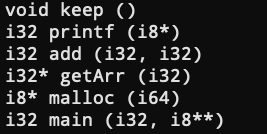

# LLVM入门笔记

url：https://zhuanlan.zhihu.com/p/102028114


# （一）LLVM概述——介绍与安装


## 一、介绍

*官方定义*：**LLVM是一个模块化和可重用的编译器和工具链技术的集合**

LLVM最初是在2000年由伊利诺伊大学香槟分校(UUIC)的学生Chris Lattner及其硕士顾问Vikram Adve创建的研究项目，并在2003年发布第一个正式版本，目的是提供一种基于SSA的现代编译策略，这种策略能够支持任何编程语言的静态和动态编译。

LLVM是当今最流行的开源编译器框架项目，你可以使用它编写自己的编译器。

> LLVM的命名最早源自于底层虚拟机（Low Level Virtual Machine）的首字母缩写，由于这个项目的范围并不局限于创建一个虚拟机，这个缩写导致了广泛的疑惑。LLVM开始成长之后，成为众多编译工具及低端工具技术的统称，使得这个名字变得更不贴切，开发者因而决定放弃这个缩写的意涵，现今LLVM已单纯成为一个品牌，适用于LLVM下的所有项目


## 二、安装

### 快速安装

### 使用官方预编译二进制安装

> 以在Ubuntu 18.04安装LLVM 9.0.0为例

```bash
sudo mkdir -p /usr/local
cd /usr/local
sudo wget http://releases.llvm.org/9.0.0/clang+llvm-9.0.0-x86_64-linux-gnu-ubuntu-18.04.tar.xz
sudo tar xvf clang+llvm-9.0.0-x86_64-linux-gnu-ubuntu-18.04.tar.xz
sudo mv clang+llvm-9.0.0-x86_64-linux-gnu-ubuntu-18.04 llvm-9.0.0
export PATH="$PATH:/usr/local/llvm-9.0.0/bin"
```

### 使用包管理器安装

```bash
# 在Debian/Ubuntu发行版本上
sudo apt install llvm clang

# 在Fedora发行版上
sudo dnf install llvm clang

# 在macOS上
sudo brew install llvm
```

> Debian/Ubuntu自带源安装LLVM版本较老,如要安装最新版本，请参考[https://apt.llvm.org/](https://link.zhihu.com/?target=https%3A//apt.llvm.org/)
> CentOS建议从源码安装

### 从源码编译安装

> 以LLVM 9.0.0为例

### 预置条件

编译LLVM需要事先在系统中安装符合以下条件的软件

- CMake >= 3.4.3
- GCC >= 5.1.0
- Python >= 2.7
- zlib >= 1.2.3.4
- GNU Make >= 3.79

### 获取并组织源码

```bash
wget http://releases.llvm.org/9.0.0/llvm-9.0.0.src.tar.xz
wget http://releases.llvm.org/9.0.0/cfe-9.0.0.src.tar.xz
wget http://releases.llvm.org/9.0.0/clang-tools-extra-9.0.0.src.tar.xz
tar xvf llvm-9.0.0.src.tar.xz
tar xvf cfe-9.0.0.src.tar.xz
tar xvf clang-tools-extra-9.0.0.src.tar.xz
mv llvm-9.0.0.src llvm-src
mv cfe-9.0.0.src llvm-src/tool/clang
mv clang-tools-extra-9.0.0.src llvm-src/tools/clang/tools/extra
```

### 编译并安装

```bash
sudo mkdir -p /usr/local/llvm
sudo mkdir -p llvm-src/build
cd llvm-src/build
cmake -G "Unix Makefiles" -DLLVM_TARGETS_TO_BUILD=X86 -DCMAKE_BUILD_TYPE="Release"  -DCMAKE_INSTALL_PREFIX="/usr/local/llvm" ..
make && make install
```

> /usr/local/llvm是安装目录, llvm-src是源码目录, llvm-src/build是编译目录


（因笔者才疏学浅、水平有限，文章中错谬之处在所难免，若蒙读者诸君不吝告知，将不胜感激）

# （二）LLVM概述——基础架构

url：https://zhuanlan.zhihu.com/p/102250532


## LLVM IR

传统的静态编译器分为三个阶段：前端、中端（优化）、后端。

而大名鼎鼎的GCC编译器在设计的时候没有做好层次划分，导致很多数据在前端和后端耦合在了一起，所以GCC支持一种新的编程语言或新的目标架构特别困难。

有了GCC的前车之鉴，LLVM进行了如下图所示的三阶段设计


这样支持一种新的编程语言只需重新实现一个前端，支持一种新的目标架构只需重新实现一个后端，前端和后端连接枢纽就是LLVM IR。

LLVM IR本质上一种与源编程语言和目标机器架构无关的通用中间表示，是LLVM项目的核心设计和最大的优势。

> LLVM IR是一种类似于RISC的低级虚拟指令集

LLVM IR使用静态单赋值（SSA）策略，具有以下两个特征：

- 以三地址码形式组织指令
- 假设有无数的寄存器可用

假设已经写好一个名为`main.c`的C程序代码，使用以下命令可以得到其LLVM IR

```bash
# 二进制代码形式
clang -emit-llvm -c main.c -o main.bc

# 可读文本代码形式
clang -S -emit-llvm -c main.c -o main.ll
```

> 除了上面两种形式之外，LLVM IR还有一种形式是在内存中的编译中间语言

下图是一段add函数对应的LLVM IR示例


## LLVM的含义

在不同的语义环境下，LLVM具有以下几种不同的含义：

- LLVM基础架构：即一个完整编译器项目的集合，包括但不限于前端、后端、优化器、汇编器、链接器、libc++标准库、Compiler-RT和JIT引擎
- 基于LLVM构建的编译器：部分或完全使用LLVM构建的编译器
- LLVM库：LLVM基础架构可重用代码部分
- LLVM核心：在LLVM IR上进行的优化和后端算法
- LLVM IR：LLVM中间表示

## LLVM基础架构的组成部分

- 前端：将程序源代码转换为LLVM IR的编译器步骤，包括词法分析器、语法分析器、语义分析器、LLVM IR生成器。Clang执行了所有与前端相关的步骤，并提供了一个插件接口和一个单独的静态分析工具来进行更深入的分析
- 中间表示：LLVM IR可以以可读文本代码和二进制代码两种形式呈现。LLVM库中提供了对IR进行构造、组装和拆卸的接口。LLVM优化器也在IR上进行操作，并在IR上进行了大部分优化。
- 后端：负责汇编码或机器码生成的步骤，将LLVM IR转换为特定机器架构的汇编代码或而二进制代码，包括寄存器分配、循环转换、窥视孔优化器、特定机器架构的优化和转换等步骤

下面这张图展示了使用LLVM基础架构时各个组件之间的关系


除此之外，各个组件之间的协作关系也可以以下面这种方式组织


> 两种方式的主要区别是程序源代码内部的链接是由LLVM或系统链接器完成的还是由LLVM IR链接器完成的，前者是默认方式，后者一般在开启链接优化（Link-Time Optimization）时采用

## LLVM中间数据结构

在LLVM中并不只存在LLVM IR一种中间表现形式，LLVM在不同编译阶段采用以下不同的中间数据结构：

- LLVM IR：见文章开头
- 抽象语法树（AST）：将源代码转换为LLVM IR时，Clang前端语法分析器和语义分析器的产出数据结构
- 有向无环图（DAG）：将LLVM IR转换为特定机器架构的汇编代码时，LLVM首先将其转换为有向无环图（DAG）的形式，以方便进行指令选择，然后将其转换回三地址码的形式以进行指令调度
- MCModule类：为了实现汇编器和链接器，LLVM使用MCModule类将程序表示保存在对象文件（可重定向文件的一种，通常文件名以.o结尾）的上下文中

不同编译阶段的中间数据结构有以下两种存在方式：

- 内存中：需要编译驱动程序的帮助，将一个阶段的输出数据结构作为下一个阶段的输入数据结构
- 文件中：独立命令之间多数以文件为媒介进行交互，比如汇编器与链接器通过可重定向的`.o`对象文件进行交互


（因笔者才疏学浅、水平有限，文章中错谬之处在所难免，若蒙读者诸君不吝告知，将不胜感激）


# （三）LLVM概述——第一个LLVM项目

url：https://zhuanlan.zhihu.com/p/102270840


这篇文章，我们将编写我们的第一个具有Hello World意义的LLVM项目。

在这个项目中，我们会利用LLVM库来寻找并打印一段C语言程序中的所有函数签名。

## 函数签名

C语言中的函数签名由以下几部分组成：

- 返回类型
- 函数名
- 参数个数及参数类型

比如

```c
int add(int a, int b) {
    return a + b;
}
```

这段C程序代码中的add函数的函数签名就是`int add(int, int)`

## 待处理的C程序代码

```c
#include <stdio.h>
#include <stdlib.h>

void keep() {
    printf("\n");
}

int add(int a, int b) {
    return a + b;
}

int* getArr(int n) {
    return (int*)malloc(sizeof(int) * n);
}

int main(int argc, char** argv) {
    return 0;
}
```

项目运行结果是



> 具体运行步骤看下文

我们在待处理的代码中定义了包括main函数在内的四个函数，但是最终结果却是六个函数，这是因为我们调用了C标准库中的printf函数和malloc函数，编译器在预处理阶段将这两个函数的声明加入到了代码中。

另外一个值得关注之处是，与C语言中`int`、`char`等类型不同，打印出来的函数签名中的类型是`i32`、`i8`，这其实是因为我们首先需要把待处理的C程序代码转换为LLVM IR字节码，然后才会用我们自己写的LLVM项目对其进行处理，打印出来的类型其实是LLVM IR的类型，除此之外，`long`对应`i64`、`float`对应`f32`、`double`对应`f64`，不过LLVM IR `void`和指针两种类型还是与C语言相同的。

## 项目代码

```cpp
// 引入相关LLVM头文件
#include <llvm/IR/LLVMContext.h>
#include <llvm/IR/Function.h>
#include <llvm/IR/Module.h>
#include <llvm/IRReader/IRReader.h>
#include <llvm/Support/SourceMgr.h>
#include <llvm/Support/CommandLine.h>

using namespace llvm;

// LLVM上下文全局变量
static ManagedStatic<LLVMContext> GlobalContext;

// 命令行位置参数全局变量, 这个参数的含义是需要处理的LLVM IR字节码的文件名
static cl::opt<std::string> InputFilename(cl::Positional, cl::desc("<filename>.bc"), cl::Required);

int main(int argc, char **argv) {
    // 诊断实例
    SMDiagnostic Err;
    // 格式化命令行参数,
    cl::ParseCommandLineOptions(argc, argv);
    // 读取并格式化LLVM IR字节码文件, 返回LLVM Module(Module是LLVM IR的顶级容器)
    std::unique_ptr<Module> M = parseIRFile(InputFilename, Err, *GlobalContext);
    // 错误处理
    if (!M) {
        Err.print(argv[0], errs());
        return 1;
    }
    // 遍历Module中的每一个Function
    for (Function &F:*M) {
        // 过滤掉那些以llvm.开头的无关函数
        if (!F.isIntrinsic()) {
            // 打印函数返回类型
            outs() << *(F.getReturnType());
            // 打印函数名
            outs() << ' ' << F.getName() << '(';
            // 遍历函数的每一个参数
            for (Function::arg_iterator it = F.arg_begin(), ie = F.arg_end(); it != ie; it++) {
                // 打印参数类型
                outs() << *(it->getType());
                if (it != ie - 1) {
                    outs() << ", ";
                }
            }
            outs() << ")\n";
        }
    }
}
```

## 项目编译运行

在编译项目之前，我们需要确认一下编译运行环境 :

- 操作系统：Ubuntu 18.04 64位
- LLVM版本：9.0.0
- 待处理的C程序代码文件：`test.c`
- 项目代码文件：`main.cpp`

然后获取待处理的C程序代码的LLVM IR字节码

```text
clang -emit-llvm -c test.c -o test.bc
```

再编译项目代码

```bash
clang++ $(llvm-config --cxxflags --ldflags --libs) main.cpp -o main
```

最后运行得到上文图示的结果

```text
./main test.bc
```


（因笔者才疏学浅、水平有限，文章中错谬之处在所难免，若蒙读者诸君不吝告知，将不胜感激）


# （四）LLVM IR概述

url：https://zhuanlan.zhihu.com/p/102716482


在前面的文章中我们已经对LLVM IR做了简单的介绍，本文将更细致地介绍LLVM IR（具体指令部分将留到后面的文章）

## 获取LLVM IR

LLVM IR有三种形式，分别是内存中的编译中间表示、磁盘上的二进制码和可读汇编文本，后两种形式可以通过以下命令获取

```bash
# 二进制码形式
clang -emit-llvm -c main.c -o main.bc

# 可读汇编文本形式
clang -emit-llvm –S -c main.c -o main.ll
```

所得LLVM IR可读汇编文本形式的示例如下图所示


> 分号是注释
> 第7-11行是main函数
> 第14-23行是add函数
> 第25行是函数属性
> 第27-32行是模块元信息

## LLVM IR结构


我们需要首先理解四个具有依次包含关系的基本概念：

- Module（模块）是一份LLVM IR的顶层容器，对应于编译前端的每个翻译单元（TranslationUnit）。每个模块由目标机器信息、全局符号（全局变量和函数）及元信息组成。
- Function（函数）就是编程语言中的函数，包括函数签名和若干个基本块，函数内的第一个基本块叫做入口基本块。
- BasicBlock（基本块）是一组顺序执行的指令集合，只有一个入口和一个出口，非头尾指令执行时不会违背顺序跳转到其他指令上去。每个基本块最后一条指令一般是跳转指令（跳转到其它基本块上去），函数内最后一个基本块的最后条指令是函数返回指令。
- Instruction（指令）是LLVM IR中的最小可执行单位，每一条指令都单占一行

LLVM IR头部是一些Target Information，在前文图中所示为

```llvm
; ModuleID = 'add.c'
source_filename = "add.c"
target datalayout = "e-m:o-i64:64-f80:128-n8:16:32:64-S128"
target triple = "x86_64-apple-macosx10.14.0"
```

每一行分别是，

- `ModuleID`：编译器用于区分不同模块的ID
- `source_filename`：源文件名
- `target datalayout`：目标机器架构数据布局
- `target triple`：用于描述目标机器信息的一个元组，一般形式是`<architecture>-<vendor>-<system>[-extra-info]`

需要关注的是`target datalayout`，它由`-`分隔的一列规格组成

- `e`：内存存储模式为小端模式
- `m:o`：目标文件的格式是Mach格式
- `i64:64`：64位整数的对齐方式是64位，即8字节对齐
- `f80:128`：80位扩展精度浮点数的对齐方式是128位，即16字节对齐
- `n8:16:32:64`：整型数据有8位的、16位的、32位的和64位的
- `S128`：128位栈自然对齐

> 更多细节请阅读

[LLVM IR Data Layoutllvm.org](https://link.zhihu.com/?target=https%3A//llvm.org/docs/LangRef.html%23data-layout)

## 标识符与变量

LLVM IR中的标识符有两种基本类型：全局标识符（以`@`开头）和局部标识符（以`%`开头）

> LLVM IR要求标识符以前缀开头有两个原因：一个是无需担心带有保留字的名称冲突，并且将来可以扩展保留字的集合而不会带来任何损失 ；另一个是未命名的标识符使编译器可以快速提出一个临时变量，而不必避免符号表冲突。

全局标识符，包括全局变量、全局常量和函数，比如

```llvm
@globalVar = global i32 20, align 4

@c = constant i32 100, align 4

define i32 @main() {
    ret i32 0
}
```

> globalVar其实是个指针

局部标识符，即局部变量。LLVM IR中的局部变量有两种分类方案：

按照是否命名分类：

- 命名局部变量：顾名思义，比如`%tmp`
- 未命名局部变量：以带前缀的无符号数字值表示，比如`%1`、`%2`，按顺序编号，函数参数、未命名基本块都会增加计数

按照分配方式分类：

- 寄存器分配的局部变量：此类局部变量多采用`%1 = some value`形式进行分配，一般是接受指令返回结果的局部变量 ，
- 栈分配的局部变量：使用`alloca`指令在栈帧上分配的局部变量，比如`%2 = alloca i32`，`%2`也是个指针，访问或存储时必须使用`load`和`store`指令

例如以下一段LLVM IR

```llvm
define i32 @main() {
    %1 = alloca i32, align 4
    %tmp = alloca i32, align 4
    store i32 1, i32* %1, align 4
    store i64 2, i32* %tmp, align 8
    %2 = add nsw i32 %1, %tmp
    %result = add nsw i32 %1, %2
}
```

其中`%1`是栈分配的未命名局部变量，`%tmp`是栈分配的命名局部变量，`%2`是寄存器分配的未命名局部变量，`%result`是寄存器分配的命名局部变量


（因笔者才疏学浅、水平有限，文章中错谬之处在所难免，若蒙读者诸君不吝告知，将不胜感激）


# （五）LLVM IR语法——类型系统

url：https://zhuanlan.zhihu.com/p/103674744

类型系统是LLVM IR最重要的特性之一，强类型有利于在LLVM IR上开启大量优化。

## void类型

void类型代表无类型，与C/C++中的`void`同义，例如下面这段IR中定义了一个名为`nop`的`void`函数

```llvm
define void nop() {

}
```

## 函数类型

可以将函数类型看做函数签名，它由返回类型和形参类型列表组成，返回类型可以是`void`类型或除`label`和`metadata`类型以外的一等类型

格式如下

```llvm
<returntype> (<parameter list>)
```

其中`<parameter list>`是逗号分隔的类型列表，其中可能包括`...`类型（可变数量参数类型）

以下列举了几种函数类型的示例

```llvm
; 返回类型为i32且只有一个i32参数的函数
i32 (i32)

; 一个返回类型为float且参数类型为i16和i32*的函数指针
float (i16, i32 *) *

; 可变数量参数的函数, 这其实是printf函数的签名
i32 (i8*, ...)

; 返回类型为包含两个i32的结构体，参数类型为一个i32的函数
{i32, i32} (i32)
```

## [一等类型](https://link.zhihu.com/?target=https%3A//llvm.org/docs/LangRef.html%23t-firstclass)

在LLVM IR中，一等类型的值只能由指令运算得出；一等类型包括：

- 单值类型

- - 整数类型
  - 浮点类型
  - `X86_mmx`类型
  - 指针类型
  - 向量类型

- 标签类型

- 令牌类型

- 元数据类型

- 复杂类型

- - 数组类型
  - 结构体类型
  - 抽象结构体类型

> 显然，`void`类型和函数类型就不是一等类型，因为它们不能通过指令运算得出

## 单值类型

这些类型是从CodeGen的角度看来在寄存器中有效的类型

## 整数类型

整数类型是一个非常简单的类型，它简单地为所需的整数类型指定一个任意的数据宽度。可以指定从1到2^23 -1（约8百万）位的任何数据宽度。

语法格式

```llvm
iN
```

其中的`N`就是数据宽度，例如

```llvm
; 单位整数类型, 可以表示布尔类型
i1

; 最常见的32位整数类型
i32

; 数据宽度超过100万位的超级大整数类型
i1942652
```

## 浮点数类型

- `half`：16位浮点数
- `float`：32位浮点数
- `double`：64位浮点数
- `fp128`：128位浮点数（其中112位尾数）
- `x86_fp80`：80位浮点数（X87）
- `ppc_fp128`：128位浮点数（两个64位）

`half`，`float`，`double`和`fp128`的二进制格式分别对应于IEEE-754-2008标准的binary16，binary32，binary64和binary128。

## x86_mmx类型

x86_mmx类型表示在x86机器上的MMX寄存器中保存的值。允许的操作相当有限：参数和返回值，`load`指令和`store`指令以及`bitcast`指令。用户指定的MMX指令表示为具有此类型的参数和结果的内部调用或asm调用。不存在这种类型的数组、向量或常量。

语法格式

```llvm
x86_mmx
```

## 指针类型

指针类型用于指定内存位置。指针通常用于引用内存中的对象。

指针类型可能有一个可选的地址空间属性，该属性定义指向对象所在的编号地址空间。默认地址空间是数字零。非零地址空间的语义是特定于目标的。

请注意，LLVM不允许指向`void(void*)`的指针，也不允许指向标签`(label*)`的指针，如有相关需要，请使用`i8*`代替

语法格式

```llvm
<type> *
```

示例

```llvm
; 4个的i32的数组的指针
[4 x i32]*

; 函数指针，它接受一个i32*类型参数，返回类型是i32
i32 (i32*) *

; i32值的指针，指向驻留在地址空间#5中的值
i32 addrspace(5)*
```

## 向量类型

向量类型是表示元素向量的简单派生类型，用于单个指令并行操作多个基本数据（SIMD）。 向量类型需要指定大小、基础原始数据类型和可伸缩属性，以表示在编译时确切硬件向量长度未知的向量。

语法格式

```llvm
< <# elements> x <elementtype> >          ; 定长向量
< vscale x <# elements> x <elementtype> > ; 可伸缩向量（弹性向量）
```

向量中的元素数量必须是一个大于0的整型常量，元素的原始类型只能是整型、浮点型和指针型。

对于可伸缩向量，元素的总数量必须是其对应的定长向量元素数量的整数倍（这个倍数称之为vscale）。vscale在编译期未知，在运行期对于所有的可伸缩向量它是一个相同硬件相关常数。虽然可伸缩向量类型的值所占用字节大小直到运行时候才能被检测出来，但在LLVM IR里它的尺寸就是个常量（只是在运行前我们无法得知这个常量罢了）

示例

```llvm
; 4个32位整数值的向量
<4 x i32>

; 8个32位浮点值的向量
<8 x float> 

; 2个64位整数值的向量
<2 x i64>

; 4个64位整数值指针的向量
<4 x i64*>

; 4个32位整数值的倍数的可伸缩向量
<vscale x 4 x i32>
```

## 令牌类型

当值与指令相关联时使用token类型，但该值的所有用法不得试图反思或模糊它。因此，具有phi或select类型令牌是不合适的。

语法格式

```llvm
token
```

## 元数据类型

元数据类型表示嵌入的元数据。除函数参数外，不得从元数据创建派生类型。

语法格式

```llvm
metadata
```

## 聚合类型

聚合类型是派生类型的一个子集，可以包含多个成员类型。数组和结构是聚合类型，而向量不是聚合类型。

## 数组类型

数组类型是一种非常简单的派生类型，它将元素按顺序排列在内存中，需要指定大小（元素数量）和元素类型。

语法格式

```llvm
[<# elements> x <elementtype>]
```

`elements`是一个常数整数值; `elementtype`可以是任何尺寸的类型

示例

```llvm
; 包含40个32位整数值的数组
[40 x i32]

; 41个32位整数值的数组
[41 x i32]

; 包含4个8位整数值的数组 
[4 x i8]

; 下面是多维数组

; 3x4的32位整数值数组
[3 x [4 x i32]]

; 12×10的单精度浮点数组
[12 x [10 x float]]

; 2x3x4的16位整数值数组
[2 x [3 x [4 x i16]]]
```

除了静态类型隐含的数组末尾之外，没有对索引的限制（尽管在某些情况下索引超出了分配对象的范围）。这意味着可以在零长度数组类型的LLVM中实现单维“可变大小数组”。例如，在LLVM中实现"pascal样式数组"可以使用类型`{ i32, [0 x float]}`。

## 结构体类型（Structure Type）

结构体类型用于表示内存中一组数据成员的集合，结构体中的数据成员可以是任何具有大小的类型。

通过`getelementptr`指令获取指向结构体中某个字段的指针，然后使用`load`和`store`指令访问这个指针指向的内存。寄存器中的结构体可使用`extractvalue`指令和`insertvalue`指令进行访问。

还有一种稠密结构体（packed structure），按单字节对齐（也就是没有进行内存对对齐），在内存中成员字段之间没有空白填充。与之相比，一般的结构体为了按照`target-datalayout`进行内存对齐，成员字段之间可能插入了一些空白填充。

结构体既可以是字面量，也可以赋给标识符： - 字面量结构体以内联的方式进行定义，而标识符结构体始终在LLVM IR顶层使用名称进行定义 - 字面量结构体被其内容唯一标识，既不能是递归的，也不能是抽象的（opaque）；而标识符结构体恰恰相反，既可以是递归的，也可以是抽象的

语法格式

```llvm
%T1 = type { <type list> }     ; 一般结构体类型
%T2 = type <{ <type list> }>   ; 稠密结构体类型
```

示例

```llvm
{ i32, i32, i32 }       ; 包含3个i32类型的结构体

{ float, i32 (i32) * }  ; 成员是float类型和函数指针类型的结构体

<{ i8, i32 }>           ; 5个字节大小的稠密结构体
```

## 抽象结构体类型（Opaque Structure Types）

抽象结构体类型用于表示没有实体的命名结构体类型，比如C语言中的前置结构体声明

> 关于Opaque Pointer的详情, 请查看[https://en.wikipedia.org/wiki/Opaque_pointer](https://link.zhihu.com/?target=https%3A//en.wikipedia.org/wiki/Opaque_pointer)

语法格式

```llvm
%X = type opaque
%52 = type opaque
```

## 总结

此处插入一张宫文学老师《编译原理之美》中介绍LLVM IR类型系统的归纳图


（本文对一些没有权威翻译的英文短语进行了合乎情理的翻译，比如packed structure和opaque structure，但因笔者才疏学浅、水平有限，错谬之处在所难免，若蒙读者诸君不吝告知，将不胜感激）

