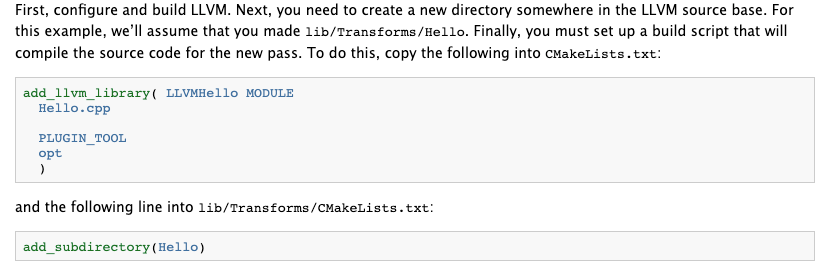
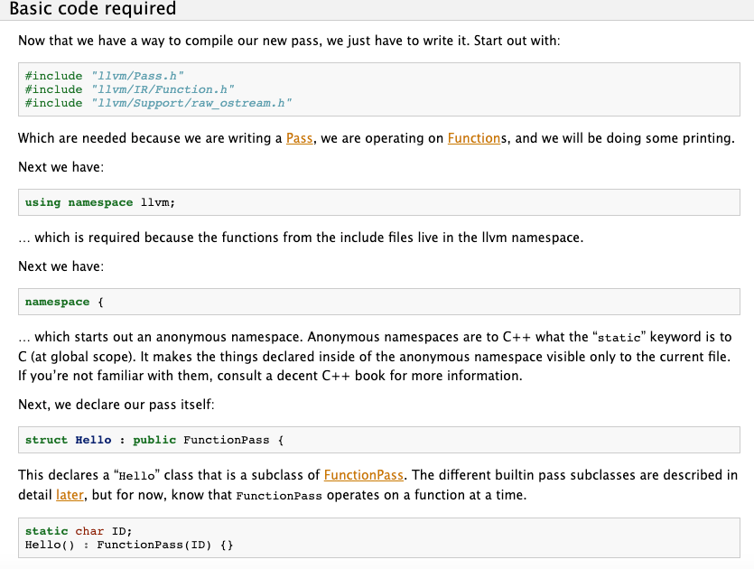
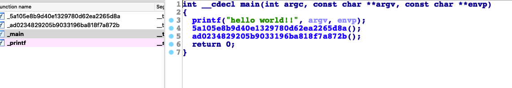
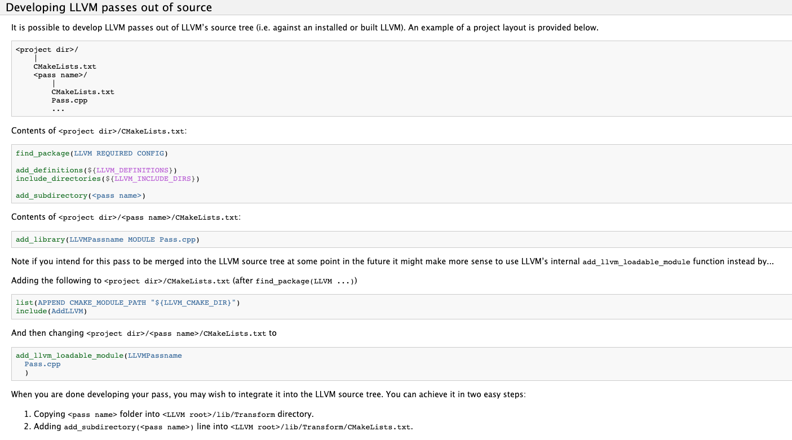
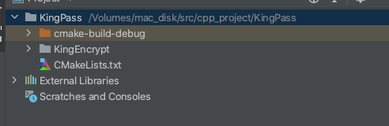

## llvm中的pass例子

url：http://missking.cc/2020/09/11/llvm2/


llvm中最重要的部分就是pass，llvm主要就是通过pass来对代码进行优化工作。然后先看怎么使用pass。官方有默认注册很多种pass。所有pass都是在`llvm/lib/Transforms`目录下，可以通过opt来使用pass,先看官方例子最简单的pass,路径是`llvm/lib/Transforms/Hello/Hello.cpp`

```
#include "llvm/ADT/Statistic.h"
#include "llvm/IR/Function.h"
#include "llvm/Pass.h"
#include "llvm/Support/raw_ostream.h"
using namespace llvm;

#define DEBUG_TYPE "hello"

STATISTIC(HelloCounter, "Counts number of functions greeted");

namespace {
  // Hello - The first implementation, without getAnalysisUsage.
  struct Hello : public FunctionPass {
    static char ID; // Pass identification, replacement for typeid
    Hello() : FunctionPass(ID) {}

    bool runOnFunction(Function &F) override {
      ++HelloCounter;
      errs() << "Hello: ";
      errs().write_escaped(F.getName()) << '\n';
      return false;
    }
  };
}

char Hello::ID = 0;
static RegisterPass<Hello> X("hello", "Hello World Pass");
```

这里最重要的就是runOnFunction函数，所有函数都会经过里进行处理，这个例子只是简单的打印了一个hello和函数名。下面的RegisterPass是这个pass的名称和描述，然后可以搜一下这个例子编译的文件路径，我的该文件路径如下，由于我是mac的，所以是dylib的动态库


```
/llvm/cmake-build-debug/lib/LLVMHello.dylib
```

然后写一个简单的项目测试一下

```
#include <stdio.h>
void test1(){
    printf("test1");
}
void test2(){
    printf("test2");
}
int main(int argc,char** argv){
    printf("hello world!!");
    test1();
    test2();
    return 0;
}
```

然后把c文件编译成bc二进制

```
clang -emit-llvm -c main.c -o main.bc
```

然后用opt指定pass来处理这个main.bc，格式如下 opt -load <pass动态库路径> -pass名称 要进行优化的对象

```
opt -load /Volumes/my_source/ollvm/llvm-project-llvmorg-9.0.1/llvm/cmake-build-debug/lib/LLVMHello.dylib -hello /Volumes/mac_disk/src/vscode_project/main.bc
```

最后看到的结果如下

```
Hello: test1
Hello: test2
Hello: main
```

## 自己写一个pass加密函数名称

先贴个官网文档的地址https://releases.llvm.org/9.0.0/docs/WritingAnLLVMPass.html

在官方文档中有详细描述怎么写个pass，下面先贴一下原文






按照文档的的描述，大概就是，在Transforms下新建一个目录，用来存放我们自己的pass，这里我建一个KingEncode目录，然后在这个目录下面创建两个文件,KingEncode.cpp和CMakeLists.txt。

然后一顿复制粘贴，将Hello的地方替换成我们自己的pass名称即可,下面贴上我的两个文件内容，我们自己的这个pass简单的用md5对函数名加密了一下。然后再设置回去。

```
//
// Created by king on 2020/9/10.
//

#include "llvm/Pass.h"
#include "llvm/IR/Function.h"
#include "llvm/Support/raw_ostream.h"
#include "llvm/IR/LegacyPassManager.h"
#include "llvm/Transforms/IPO/PassManagerBuilder.h"

using namespace llvm;

namespace {

struct KingEncode : public FunctionPass {

  static char ID;
  KingEncode() : FunctionPass(ID) {

  }

  bool runOnFunction(Function &F) override {
    errs() << "KingEncode: ";
    MD5 Hasher;
    MD5::MD5Result Result;
    Hasher.update(F.getName());
    Hasher.final(Result);
    std::string md5=Result.digest().str().str();
    F.setName(md5);
    errs().write_escaped(F.getName()) <<"-->"<<md5<< '\n';
    return false;
  }

};

char KingEncode::ID = 0;

static RegisterPass<KingEncode> X("kingencode", "king encode Pass",
                             false /* Only looks at CFG */,
                             false /* Analysis Pass */);
static llvm::RegisterStandardPasses Y(
    llvm::PassManagerBuilder::EP_EarlyAsPossible,
[](const llvm::PassManagerBuilder &Builder,
   llvm::legacy::PassManagerBase &PM) { PM.add(new KingEncode()); });

}
```

另外一个CMakeLists.txt的文件如下

```
add_llvm_library( LLVMKingEncode MODULE
        KingEncode.cpp

        PLUGIN_TOOL
        opt
        )
```

除了这两个外，再修改下Transforms下的CMakeLists.txt，在最后的位置将我们这个新增的pass加进去

```
add_subdirectory(KingEncode)
```

然后单独编译一下ninja LLVMKingEncode

编译完后，再用opt使用这个pass处理我们的简单例子，先把例子编译成IR文件

```
clang -emit-llvm -S main.c -o main.ll
```

然后使用opt生成bc文件

```
opt -load /Volumes/my_source/ollvm/llvm-project-llvmorg-9.0.1/llvm/cmake-build-debug/lib/LLVMKingEncode.dylib -kingencode /Volumes/mac_disk/src/vscode_project/main.ll -o /Volumes/mac_disk/src/vscode_project/main.bc
```

然后贴上执行的结果

```
KingEncode: test1-->5a105e8b9d40e1329780d62ea2265d8a
KingEncode: test2-->ad0234829205b9033196ba818f7a872b
KingEncode: main-->fad58de7366495db4650cfefac2fcd61
```

最后用clang编译成可执行程序

```
clang main.bc -o main
```

意外发生了，编译失败，看看错误信息

```
Undefined symbols for architecture x86_64:
  "_main", referenced from:
     implicit entry/start for main executable
ld: symbol(s) not found for architecture x86_64
clang-9: error: linker command failed with exit code 1 (use -v to see invocation)
```

这个错误是因为，所有函数都会进入到runOnFunction，然后都被修改了名称，但是main函数是个特殊的函数，名称被修改后，就找不到入口了。所以这里得修改下pass，判断函数名非main的情况，我才进行修改，下面是修正的代码

```
#include "llvm/Pass.h"
#include "llvm/IR/Function.h"
#include "llvm/Support/raw_ostream.h"
#include "llvm/IR/LegacyPassManager.h"
#include "llvm/Transforms/IPO/PassManagerBuilder.h"

using namespace llvm;

namespace {

struct KingEncode : public FunctionPass {

  static char ID;
  KingEncode() : FunctionPass(ID) {

  }

  bool runOnFunction(Function &F) override {
    errs() << "KingEncode: ";
    if(F.getName().compare("main")!=0){
      MD5 Hasher;
      MD5::MD5Result Result;
      Hasher.update(F.getName());
      Hasher.final(Result);
      std::string md5=Result.digest().str().str();
      errs().write_escaped(F.getName()) <<"-->"<<md5<< '\n';
      F.setName(md5);
    }else{
      errs().write_escaped(F.getName()) << '\n';
    }
    return false;
  }

};

char KingEncode::ID = 0;

static RegisterPass<KingEncode> X("kingencode", "king encode Pass",
                             false /* Only looks at CFG */,
                             false /* Analysis Pass */);
static llvm::RegisterStandardPasses Y(
    llvm::PassManagerBuilder::EP_EarlyAsPossible,
[](const llvm::PassManagerBuilder &Builder,
   llvm::legacy::PassManagerBase &PM) { PM.add(new KingEncode()); });

}
```

然后我们重新来一次编译

```
ninja LLVMKingEncode
clang -emit-llvm -S main.c -o main.ll
opt -load /Volumes/my_source/ollvm/llvm-project-llvmorg-9.0.1/llvm/cmake-build-debug/lib/LLVMKingEncode.dylib -kingencode /Volumes/mac_disk/src/vscode_project/main.ll -o main.bc
clang main.bc -o main
```

编译完后，再用ida打开这个main看看我们处理过的函数是什么样子



可以看到这个函数名称就被加密成MD5了。

## 外部项目写pass

很多时候开发pass都是想单独在外面新建一个项目，并不是想直接在llvm内部写一个pass。这样也是可以的。并且这样更方便调试。这里官方文档也是有说明，同样先贴一段官方文档的描述



这里有清楚描述项目的层级，新建一个项目叫MyPass，然后在KingPass下新建一个CMakeList.txt和一个空目录KingEncrypt，结构如下图



然后把以下代码复制到KingPass下的CMakeList.txt中

```
cmake_minimum_required(VERSION 3.15.3)
project(KingEncrypt)
set(LLVM_DIR /home/king/ollvm/llvm-project-llvmorg-9.0.1/llvm/cmake-build-debug/lib/cmake/llvm)
set(CMAKE_CXX_FLAGS "${CMAKE_CXX_FLAGS} -std=c++11")
find_package(LLVM REQUIRED CONFIG)
list(APPEND CMAKE_MODULE_PATH "${LLVM_CMAKE_DIR}")
include(AddLLVM)
add_definitions(${LLVM_DEFINITIONS})
include_directories(${LLVM_INCLUDE_DIRS})
add_subdirectory(KingEncrypt)
```

然后把之前上面写的pass和CMakeLists.txt直接放到KingEncrypt目录中即可，这里有个坑是不要在mac环境中搭建。否则会出现各种意外的错误。另外就是注意LLVM_DIR如果没有设置，虽然可以编译成功，但是使用时会报异常。

这样子编译后虽然可以用。但是每次使用都要用opt -load so的路径，这种方式太麻烦，所以最好还是在clang里面直接注册这个pass。注册后，就可以直接`clang -mllvm -king_encode main.cpp`这种方式来编译

主要是要改两点：编译成静态库、注册pass。

先是调整成静态库，修改KingEncode下的cmake

```
add_llvm_library( LLVMKingEncode
        KingEncode.cpp

        ADDITIONAL_HEADER_DIRS
        ${LLVM_MAIN_INCLUDE_DIR}/llvm/Transforms
        ${LLVM_MAIN_INCLUDE_DIR}/llvm/Transforms/KingEncode

        DEPENDS
        intrinsics_gen
        )
```

然后再KingEncode目录下新增LLVMBuild.txt文件，下面是文件的内容

```
[component_0]
type = Library
name = KingEncode
parent = Transforms
library_name = KingEncode
```

然后修改Transforms下的LLVMBuild.txt，在里面加上KingEncode

```
[common]
subdirectories = AggressiveInstCombine Coroutines IPO InstCombine Instrumentation Scalar Utils Vectorize ObjCARC KingEncode

[component_0]
type = Group
name = Transforms
parent = Libraries
```

然后这个pass是要在IPO中注册，所以Transforms/IPO下的LLVMBuild.txt也要修改，加上KingEncode

```
[component_0]
type = Library
name = IPO
parent = Transforms
library_name = ipo
required_libraries = AggressiveInstCombine Analysis BitReader BitWriter Core InstCombine IRReader Linker Object ProfileData Scalar Support TransformUtils Vectorize Instrumentation KingEncode
```

静态编译的大概就是改这些地方，然后就是加上注册的逻辑，注册是在Transforms/IPO/PassManagerBuilder.cpp中处理

首先是在PassManagerBuilder.cpp中新增一个opt的参数判断

```
static cl::opt<bool> EnableKingEncode(
        "king_encode", cl::init(false), cl::Hidden,
        cl::desc("king encode (default = off)"));
```

调用EnableKingEncode则会获取到是否有设置使用king_encode这个参数，如果有设置，我们就注册这个pass

为了方便给注册的地方调用，新增一个头文件KingEncode.h在目录/llvm/include/llvm/Transforms/KingEncode/中

```
#ifndef LLVM_KINGENCODE_H
#define LLVM_KINGENCODE_H

#include <llvm/Pass.h>
namespace llvm{
    Pass* createKingEncode(bool flag);
}
#endif //LLVM_KINGENCODE_H
```

然后修改我们的pass提供一个注册的函数，以及使用参数进行判断，是否要使用该pass。下面是修改后的代码

```
#include "llvm/Pass.h"
#include "llvm/IR/Function.h"
#include "llvm/Support/raw_ostream.h"
#include "llvm/IR/LegacyPassManager.h"
#include "llvm/Transforms/IPO/PassManagerBuilder.h"
#include "llvm/Transforms/KingEncode/KingEncode.h"
using namespace llvm;
namespace {

struct KingEncode : public FunctionPass {

  static char ID;
  bool enable_flag;
  KingEncode() : FunctionPass(ID) {}

  KingEncode(bool flag) : FunctionPass(ID) {
      enable_flag=flag;
  }

  bool runOnFunction(Function &F) override {
    if(enable_flag){
        errs() << "KingEncode: ";
        if(F.getName().compare("main")!=0){
            MD5 Hasher;
            MD5::MD5Result Result;
            Hasher.update(F.getName());
            Hasher.final(Result);
            std::string md5=Result.digest().str().str();
            errs().write_escaped(F.getName()) <<"-->"<<md5<< '\n';
            F.setName(md5);
            return true;
        }else{
            errs().write_escaped(F.getName()) << '\n';
        }
    }
    return false;
  }

};
char KingEncode::ID = 0;
}
Pass* llvm::createKingEncode(bool flag){ return new KingEncode(flag);}
```

当我们注册的使用就是调用createKingEncode来返回一个pass。写好调用的函数后，再写注册的逻辑

注册的逻辑可以写在PassManagerBuilder.cpp里面的populateModulePassManager函数中，直接新增一段代码即可

```
MPM.add(createKingEncode(EnableKingEncode));
```

最后编译后直接调用命令即可

```
clang -mllvm -king_encode main.cpp
```

结果如下

```
KingEncode: _Z5test1v-->40219bf854b4ca32a3c34d9c4b5abade
KingEncode: main
```