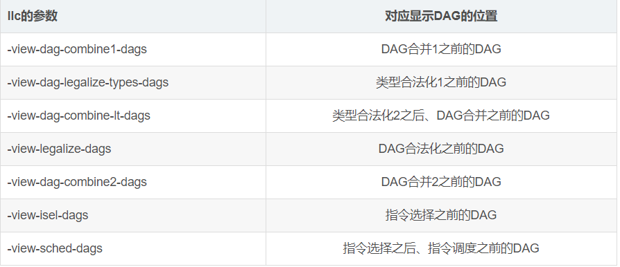

# 跟随一条指令来看LLVM的基本结构

url：https://blog.csdn.net/SiberiaBear/article/details/103836318


LLVM是一个很复杂的软件，了解LLVM的工作原理不是很容易，然而，对于刚开始接触LLVM整个框架的工作原理来说，详细而深入，不如广泛而浅显，所以有了这一篇文章。

通过跟随一条指令在LLVM中的各个passes中的状态变化，从源程序开始，到目标代码结束，可以让我们对LLVM的整体框架有个大致的认识。

这篇文章基于Life of an instruction in LLVM，文章大部分内容与参考文章一致，但由于参考文章编辑于2012年11月，当时的LLVM版本是3.2，距现在新的LLVM版本已有一些差异，所以有部分内容我做了调整。

这篇文章不会详细讲解各个passes中的实现，尽量易于理解，尽量紧贴指令的变化过程。

有关于LLVM中的一些基本概念，可以参考：https://blog.csdn.net/SiberiaBear/article/details/103111028。

## 输入代码

使用的输入代码与参考文章一致，选择一段C语言来开始：

```
int foo(int aa, int bb, int cc) {
	int sum = aa + bb;
	return sum / cc;
}
```

我们focus的指令是除法指令，不关注其他代码。

## Clang

Clang是LLVM框架的前端，用来将C、C++、ObjectC的源代码转换为LLVM IR结构，它最复杂的实现是处理C++中的一些特殊语法，对于我们这个简单的C代码来说，处理很简单，按照词法+语法+语义的方式走就可以。

Clang的parser会构建一个AST，并作为它的中间表示，对于我们的除法操作，在AST中会生成一个BinaryOperator节点，承载一个B0_div的操作码类型。通过clang自带的ast dump插件，命令为clang -Xclang -ast-dump -fsyntax-only test.c，可以查看AST的情况（参考文章中需更新）。Clang的代码生成器会将AST转换为一个LLVM IR，这时我们的指令会生成为一个sdiv的LLVM IR指令，这是一个有符号的除法指令。

## LLVM IR

经过Clang处理后，输出的是LLVM的IR表示：

```
define i32 @foo(i32 %aa, i32 %bb, i32 %cc) nounwind {
entry:
  %add = add nsw i32 %aa, %bb
  %div = sdiv i32 %add, %cc
  ret i32 %div
}
```

在LLVM IR中，sdiv是一个BinaryOperator对象，这是一个带有SDiv操作数的Instruction类的子类。就像其他指令一样，LLVM IR可以被LLVM的解析和转换pass来处理，最终会通过LLVM代码生成，进入下一个环节。

**代码生成器（Code Generator）**是LLVM中一个很复杂的部分。它的工作是将高层级的、目标无关的LLVM IR下降为低层级的、目标相关的机器指令，代码生成通常也就认为是LLVM的后端（注意不是LLVM/Clang的后端，LLVM的前端被认为是LLVM IR的parser）。

代码生成器有多个阶段组成，包括指令选择、指令调度、寄存器分配、寄存器分配后指令调度以及各阶段可能有的优化和调整过程。其中很重要的一个步骤是类型合法化和指令合法化，使用了目标特殊的处理方法来将所有的指令和类型都转换为目标能够支持的模式。从输入LLVM IR之后，代码生成器首先调用SelectionDAGBuilder将LLVM IR转换为SelectDAG，直到指令调度之前都是SelectionDAG格式表示作为中间表示，之后到代码发射之前，都是MI格式，代码发射步骤中，会把MI翻译为MCInst，进而翻译为目标代码文件或汇编代码文件。

在下降的过程中，LLVM IR的指令会先变成selection DAG，下一节将会讲解这一部分知识。

## SelectionDAG

SelectionDAG是由SelectionDAGBuilder类生成的，它服务于SelectionDAGISel类，而这个类是用于指令选择的重要类。SelectionDAGISel遍历所有的LLVM IR指令，调用SelectionDAGBuilder::visit方法来解析它们。处理我们SDiv指令的方法是SelectionDAGBuilder::visitSDiv方法，它请求一个操作数为ISD::SDIV的SDNode（SelectionDAG node），并添加到DAG中。

DAG叫做有向无环图，是编译器原理中很重要的数据结构，可以协助完成很多指令选择中重要的工作，这里它是我们代码的一种中间表示，指令选择的算法依赖于DAG形式作为中间表示。

初始化DAG的过程是部分目标相关的，在LLVM的术语中，叫做非法的（illegal），原因是这时的DAG中还包含一部分目标无关的节点，这些节点对于目标来说不支持。

LLVM中支持一些显示DAG的方法。一种方法是在llc中指定-debug参数，这可以在编译时输出各阶段的DAG的文本信息（需要注意LLVM编译时指定为debug模式）。另一种方法是指定-view选项，这一类选项有很多，分别对应不同阶段（这里的不同阶段是指从LLVM IR输入代码生成器，到指令调度之前的阶段，这个阶段的中间表示是DAG，同时这个阶段也分为好多步骤，后边小节会讲到，所以会有不同阶段的DAG如是说）的DAG形式，它可以自动启动系统的image浏览软件，展示图形化的DAG结构。比如：



## x86平台上合法化sdiv到sdivrem

在x86平台上，除法指令会同时计算商和余数，并将结果分别存在两个独立的寄存器中。因为在LLVM的指令选择中，计算商的节点操作为ISD::SDIV，而计算余数的节点操作是另一个ISD::SDIVREM，所以我们需要使用合法化（legalized）来针对x86做特殊操作。

代码生成的一个很重要的任务就是将目标无关的信息转换为目标相关的信息，这些算法通过TargetLowering类来实现，而这个过程就叫做合法化，DAG会从非法DAG变为合法DAG，最终的合法DAG中的全部节点都是目标能够支持的（这部分代码很难理解）。x86平台上这个实现类是X86TargetLowering，它的构造函数中指定了哪些操作数需要合法化展开，ISD::SDIV就是其中之一。代码中有这么一段注释：

```
// 标量整数除法和求余操作被下降为能够生成两个结果的操作，用以匹配可用的指令。这将两个结果的模式交由普通CSE处理，CSE能够将x/y和x%y组合成一条指令。
```

SDIV节点中会包含有Expand标记，当SelectionDAGLegalize::LegalizeOp检查到这个标记时，它将会用ISD::SDIVREM来替换ISD::SDIV节点。在合法化过程中，这是一个比较特殊且很有意思的例子，合法化在SelectionDAG结构阶段多次出现，是为了最优处理程序。


## 指令选择

下一个步骤是指令选择。LLVM提供了一套基于查询表的指令选择机制，这套查询表通过TableGen来生成。很多目标平台后端也会选择编写自定义的代码来手动处理一些指令，通常在SelectionDAGISel::Select中实现。其他能够自动生成的指令都是通过TableGen来完成，并且通过SelectCode来完成调用。

可以参考：https://blog.csdn.net/SiberiaBear/article/details/103319595简单了解TableGen的概念。

x86平台后端是手动处理ISD::SDIVREM节点的，主要是考虑到一些特殊的情况和优化。DAG节点在这个阶段MachineSDNode，这个类是SDNode的子类，定义了一些与真实机器平台相关的成员，但依然是DAG节点。经过指令选择阶段，我们的除法指令被选择为X86::IDIV32r。

## 指令调度及发射MI

到目前为止，我们的代码依然是DAG格式，但是CPU不处理DAG，所以我们需要把DAG转换为线性的指令序列。指令调度的目的是序列化DAG，并且调整指令之间的先后顺序，它使用一些启发式的编排算法，比如register pressure reduction来尝试输出最佳的指令序列。

指令调度阶段会尽可能的提高指令并行度，使用尽可能多的虚拟寄存器（虚拟寄存器后边会讲到），其目的是使代码运行效率更高（插播一句，后边的寄存器分配倾向于使指令串行化，这样可以尽量少的使用寄存器，所以，指令调度和寄存器分配是两个相互对立的阶段，编译器在双手博弈中，实现编译目标的最优化）。

目标特殊的一些调度实现算法会加在该过程中，从而影响调度的结果。

最终，指令调度会通过InstrEmitter发射出指令序列，这些序列放到一个MachineBasicBlock中，这种代码表现形式叫做MachineInstr，简称为MI，之后，DAG格式的代码信息被销毁。

通过给llc指定-print-machineinstrs参数可以指定打印出MI的信息：

```
# After Instruction Selection:
# Machine code for function foo: SSA
Function Live Ins: %EDI in %vreg0, %ESI in %vreg1, %EDX in %vreg2
Function Live Outs: %EAX

BB#0: derived from LLVM BB %entry
    Live Ins: %EDI %ESI %EDX
        %vreg2<def> = COPY %EDX; GR32:%vreg2
        %vreg1<def> = COPY %ESI; GR32:%vreg1
        %vreg0<def> = COPY %EDI; GR32:%vreg0
        %vreg3<def,tied1> = ADD32rr %vreg0<tied0>, %vreg1, %EFLAGS<imp-def,dead>; GR32:%vreg3,%vreg0,%vreg1
        %EAX<def> = COPY %vreg3; GR32:%vreg3
        CDQ %EAX<imp-def>, %EDX<imp-def>, %EAX<imp-use>
        IDIV32r %vreg2, %EAX<imp-def>, %EDX<imp-def,dead>, %EFLAGS<imp-def,dead>, %EAX<imp-use>, %EDX<imp-use>; GR32:%vreg2
        %vreg4<def> = COPY %EAX; GR32:%vreg4
        %EAX<def> = COPY %vreg4; GR32:%vreg4
        RET

# End machine code for function foo.

```


MI格式表示是一种类似于汇编代码的形式，它采用三地址形式来表现指令信息，并序列化存储信息，每一条MI指令包括有指令操作码、以及一系列操作数。

## 寄存器分配

除了一些例外的情况，指令选择步骤之后输出的大多数DAG节点是SSA格式的，指令调度之后输出的是SSA格式的MI序列，SSA格式全称是static single assignment form，叫做静态单赋值形式，是一种很常见的编译器中间形式，在SSA中，UD链（use-define chain）是非常明确的，变量不会重复定义和赋值。比如：

```
x1 = y1 + 1;
x2 = y2 + 1;
x1 = x2;
```


上边这个不是SSA形式，因为x1被重复赋值，而下边这个是SSA格式：

```
x2 = y2 + 1;
x1 = x2;
```

指令选择时，使用了无限的虚拟寄存器集，但是目标平台不可能识别这些虚拟寄存器，所以寄存器调度的一个工作就是将虚拟寄存器全部替换为物理寄存器（它的另一个工作是一些优化过程）。

在一些目标架构下，一些指令需要使用指定的固定寄存器。一个例子就是我们X86平台下的除法指令，这条除法指令要求它的输入必须是EDX和EAX寄存器。指令选择时就已经知道这个信息，并且输出时就是物理寄存器，这个过程由X86DAGToDAGISel::Select完成。

寄存器分配处理所有的虚拟寄存器，并且会做一些优化，比如说伪指令展开，本文不详细展开讲解。同样，这里也不讨论寄存器分配之后的一些步骤，这些步骤不会再改动代码的表现形式（一直是MI），后续的步骤有寄存器分配后的指令调度、一些合法化的工作，目的是进一步的降级代码，使之更接近目标指令，同时这中间还会涉及一些优化passes，通过在工程代码中查找TargetPassConfig::addMachinePasses，能了解这些passes。

## 代码发射

到现在为止，我们已经将C源程序翻译为MI格式代码。我们知道，目标代码分为汇编代码和二进制可执行代码。而现在的LLVM还提供了一种（传统的）JIT的方式，这种JIT的目标输出代码可以直接在内存中执行，我理解为类似Java字节码的东西，而且，最初的LLVM（Low Level Virtual Machine）的目的也是做一个类似Java虚拟机的东西来研究优化问题，所以，这个输出方式就保留下来了。另一种输出方式是MC架构，这是一种非常赞的目标文件和汇编文件输出框架，曾经的LLVM的汇编器功能很单一，后来，为了兼顾目标码的输出，就重新设计了这一套MC框架，替代了之前的汇编器。现在大多数的用法都是从MC框架输出目标码，较少会走传统JIT那条，可能是因为LLVM不把Java作为自己的竞争对手吧。

### JIT

JIT代码的输出是通过LLVMTargetMachine::addPassesToEmitMachineCode来完成，它调用addPassesToGenerateCode，这个函数中定义了所有这篇文章提到的从IR到MI的各个passes。然后，它调用addCodeEmitter，这是一个目标特殊的pass，用来将MI转换为真实机器指令（当前CPU可执行的），实际上JIT执行的机器指令和MI已经很相似了，所以这部分的翻译工作很直接。对于X86平台，这些代码写在lib/Target/X86/X86CodeEmitter.cpp中，对于我们的除法指令，这里没有什么特殊要讲的，因为MI指令中已经包含了最终目标相关的操作码和操作数。最终，所有指令通过emitInstruction发射。

### MCInst

另一种输出是MC框架，它的中间表示被称为MCInst。当LLVM被看作静态编译器时（比如clang的一部分），MI序列还会下降到MC层，用来输出静态编译器会输出的目标码或汇编码。MC框架的介绍可以参考官方的文章：Introduce to LLVM MC project，不过这篇文章也比较旧了，也仅供参考学习。

LLVMTargetMachine::addPassesToEmitFile方法负责定义发射目标代码的passes，真正将MI翻译为MCInst的pass是AsmPrinter::EmitInstruction接口，虽然这个类看着像是汇编码输出的类，然而不是，我一直不是很喜欢MC框架的一些类的命名。对于X86平台，会有个子类继承这个AsmPrinter类，叫做X86AsmPrinter，从而发射MCInst的方法为X86AsmPrinter::EmitInstruction，这个过程需要X86MCInstLower类的协助。和前边DAG时期的Lower不一样，当时协助的下降类是X86TargetLowering，用来提前下降一些必要DAG的，而这里是MC框架下的InstLower，其实一些比较关键的算法都在这几个类里边。

对于我们的除法指令，这里也没有什么特殊要处理的地方。

通过给llc指定-show-mc-inst参数，可以打印出MC指令信息和汇编代码：


```
foo:                                    # @foo
# BB#0:                                 # %entry
        movl    %edx, %ecx              # <MCInst #1483 MOV32rr
                                        #  <MCOperand Reg:46>
                                        #  <MCOperand Reg:48>>
        leal    (%rdi,%rsi), %eax       # <MCInst #1096 LEA64_32r
                                        #  <MCOperand Reg:43>
                                        #  <MCOperand Reg:110>
                                        #  <MCOperand Imm:1>
                                        #  <MCOperand Reg:114>
                                        #  <MCOperand Imm:0>
                                        #  <MCOperand Reg:0>>
        cltd                            # <MCInst #352 CDQ>
        idivl   %ecx                    # <MCInst #841 IDIV32r
                                        #  <MCOperand Reg:46>>
        ret                             # <MCInst #2227 RET>
.Ltmp0:
        .size   foo, .Ltmp0-foo

```

通过指定-show-mc-encoding参数，可以打印汇编代码和二进制编码（目标码）的信息。

目标代码或者汇编代码发射是在MCStreamer类中实现的，这个类被两个子类继承，分别是发射目标代码的MCObjectStreamer和发射汇编代码的MCAsmStreamer。对于发射目标代码，因为我们针对不同操作系统平台有不同的目标文件格式，比如Windows的COFF、Linux的ELF等，所以MCObjectStreamer被进一步继承为MCCOFFStreamer、MCELFStreamer等子类。在这些子类中都重写了父类的MCObjectStreamer::EmitInstruction，这个方法实现发射目标代码的工作。输出目标文件的过程还需要MCCodeEmitter的支持，最终输出目标可执行文件。

到这一步，我们的除法指令就被输出成汇编码或者二进制编码格式了，相对应的可执行文件也可以在X86平台下跑起来（需要对应到操作系统），这条指令在LLVM的行程也就结束了。


## 汇编器与反汇编器

MCInst是一种简单的代码表现形式，它尽量屏蔽了语义上的信息，仅保留指令编码和指令操作数，以及一些指令位置信息。和LLVM IR一样，它是多种可能编码形式的中间表示，可以理解为LLVM后端的一种IR，比如说汇编代码和二进制目标代码都可以由它来表示。

llvm-mc工具是MC框架下边的一个工具，clang工具在一次性驱动编译器输出汇编码和二进制目标码时不会调用llvm-mc，因为我们知道LLVM的设计思想是一切都是库，clang驱动工具和llvm-mc调用的是一样的MC框架下的库，而llvm-mc可以便于我们直接调用MC框架下的库来实现功能，比如说汇编器和反汇编器（另外还有一些目标文件分析工具，比如llvm-objdump和llvm-readobj，也是调用了MC框架下边的库），所以，llvm-mc被可以看作是通常意义下的汇编器和反汇编器，对标gcc下的as和dis，可以输入汇编码吐出二进制可执行文件，或者输入二进制可执行文件吐出汇编码。