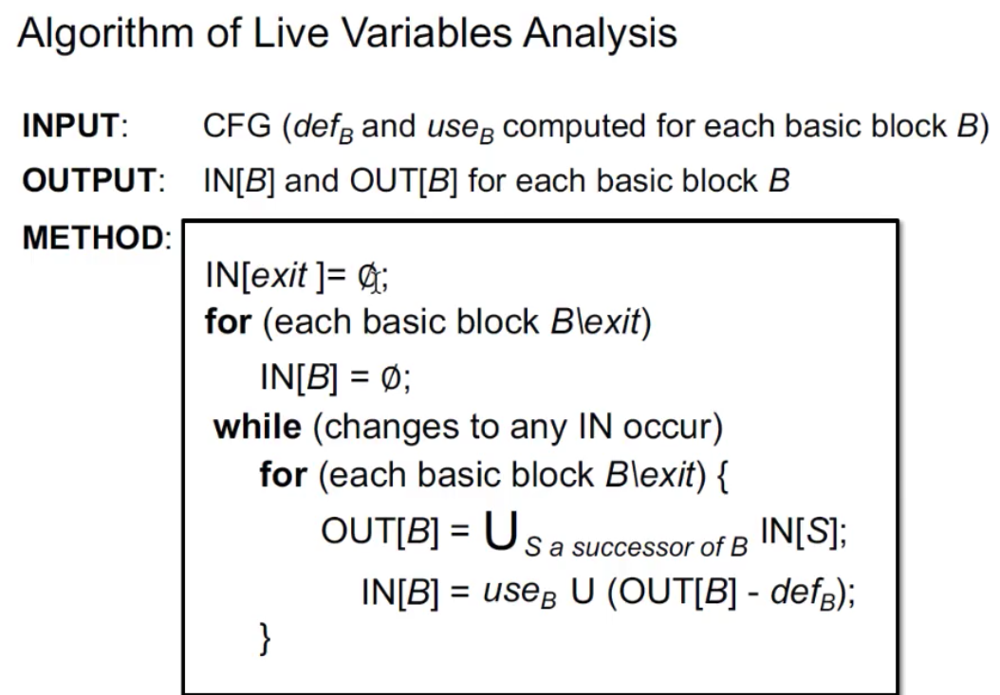

# 基于 llvm 实现活跃变量分析

url：https://panda0s.top/2021/04/06/LLVM-Liveness-Analysis/


## 活跃变量分析

活跃变量分析是最典型的数据流分析的算法之一，它的作用是确定变量在程序中的活跃性。

变量在某个程序点有两种状态，`live` 或 `dead`。对于变量 x 和程序点 p，判断 x 在点 p 上的值是否会在 CFG 中的某条从点 p 出发的路径中使用。如果是，就说 x 在 p 上 `live`；否则就说x在p上是 `dead`。

活跃变量分析主要作用

1. 寄存器分配
2. 死代码删除

## 活跃变量计算算法

[image-20210406154854014](https://panda0s.top/2021/04/06/LLVM-Liveness-Analysis/image-20210406154854014.png)

## 实现思路

整体思路

1. 单独计算每个基本块的 useB 与 defB 集合 （是否可以先把基本块转为DAG形式？）
2. 后序遍历分析函数的基本块，对每个基本块应用 TransferFunction
3. 一直迭代，直到 IN 集合不再改变

细节思路

1. 集合运算采用 llvm::BitVector 加速分析
2. OUT[B]−defB 位运算等价于 OUT[B]&Not(defB)

## 测试样例程序

```
#include <stdio.h>
int sum (int a, int b) {
    int i;
    int res = 1;
    for (i = a; i < b; i++)
    {
        res *= i;
    }
    return res;
}

int main(int argc, char * argv[]) {
    sum(1, 100);
	return 0;
}

Copy
```

只分析 sum 函数

```
define i32 @_Z3sumii(i32, i32) #0 {
  %3 = alloca i32, align 4
  %4 = alloca i32, align 4
  %5 = alloca i32, align 4
  %6 = alloca i32, align 4
  store i32 %0, i32* %3, align 4
  store i32 %1, i32* %4, align 4
  store i32 1, i32* %6, align 4
  %7 = load i32, i32* %3, align 4
  store i32 %7, i32* %5, align 4
  br label %8

8:                                                ; preds = %16, %2
  %9 = load i32, i32* %5, align 4
  %10 = load i32, i32* %4, align 4
  %11 = icmp slt i32 %9, %10
  br i1 %11, label %12, label %19

12:                                               ; preds = %8
  %test = alloca i32, align 4                     ; 用于测试活跃性手动添加
  %13 = load i32, i32* %5, align 4
  %14 = load i32, i32* %6, align 4
  %15 = mul nsw i32 %14, %13
  store i32 %15, i32* %6, align 4
  br label %16

16:                                               ; preds = %12
  %test2 = load i32, i32* %test, align 4          ; 用于测试活跃性手动添加
  %17 = load i32, i32* %5, align 4
  %18 = add nsw i32 %17, 1
  store i32 %18, i32* %5, align 4
  br label %8

19:                                               ; preds = %8
  %20 = load i32, i32* %6, align 4
  %aa = load i32, i32* %3, align 4                ; 用于测试活跃性手动添加
  ret i32 %20
}
Copy
```

## 映射 BitVec 与定值的关系

```
void InitializeBitVector() {
    int allocaCounter = 0;
    errs() << "BitVec map:\n";
	
    // 处理函数的参数，给参数分配位向量
    for (auto arg = targetFunc->arg_begin(); arg != targetFunc->arg_end(); arg++) {
        Value * v = dyn_cast<Value>(arg);
        InstBitMap[v] = allocaCounter;
        errs() << allocaCounter << "  ";
        allocaCounter++;
        v->dump();
    }
	// 处理所有定值指令
    for(auto bb : this->bbList) {
        for(BasicBlock::iterator insIter = bb->begin(); insIter != bb->end(); insIter++) {
            Value * v = dyn_cast<Value>(insIter);
            if (isDefFocusInst(v)) {
                InstBitMap[v] = allocaCounter;
                errs() << allocaCounter;
                allocaCounter++;
                v->dump();
            }
        }
    }
    ......................
}

Copy
```

输出样本如下

```
BitVec map:
0  i32 %0
1  i32 %1
2  %test2 = load i32, i32* %test, align 4
3  %17 = load i32, i32* %5, align 4
4  %18 = add nsw i32 %17, 1
5  %test = alloca i32, align 4
6  %13 = load i32, i32* %5, align 4
7  %14 = load i32, i32* %6, align 4
8  %15 = mul nsw i32 %14, %13
9  %20 = load i32, i32* %6, align 4
10  %aa = load i32, i32* %3, align 4
11  %9 = load i32, i32* %5, align 4
12  %10 = load i32, i32* %4, align 4
13  %11 = icmp slt i32 %9, %10
14  %3 = alloca i32, align 4
15  %4 = alloca i32, align 4
16  %5 = alloca i32, align 4
17  %6 = alloca i32, align 4
18  %7 = load i32, i32* %3, align 4
Copy
```

测试样例一共有 19 个定值，每一个定值对应 BitVector 中的一个二进制位。

## use 与 def 的计算

有一种特殊情况，需要考虑，例如某个基本块如下

```
a = 1
b = a
d = c
Copy
```

use = {c}, def = {a, b, d}

因为 `a` 的定值在当前基本块内且在引用之前，所以 use 集合中没有 `a`

在 llvm 分析中，分析基本块 def 的时候应该去掉有“定值”作用的指令，例如 `BranchInst`, `StoreInst`, `ReturnInst`等….

分析 use 的时候，应该去掉对 `BranchInst`,`Contant` 等…

```
void AnalysisDefAndUseSet() {
    for(auto bb : this->bbList) {
        auto & defSets = this->DefSet[bb];
        auto & useSets = this->UseSet[bb];
        for(BasicBlock::iterator insIter = bb->begin(); insIter != bb->end(); insIter++) {
            Value * val = dyn_cast<Value>(insIter);

            for (auto & op : insIter->operands()) {
                Value * opValue = op.get();
                if (
                    !dyn_cast<Constant>(opValue)
                    && !dyn_cast<BasicBlock>(opValue)
                    && InstBitMap.count(opValue) >= 1
                    && !defSets[InstBitMap[opValue]]
                    && !useSets[InstBitMap[opValue]]) {
                    useSets[InstBitMap[opValue]] = true;
                }
            }
            if (this->isDefFocusInst(val)) {
                defSets[InstBitMap[val]] = true;
            }
        }
        errs() << "defs:\n";
        printSET(defSets);
        errs() << "uses:\n";
        printSET(useSets);
        errs() << "================ \n";
    }
}
Copy
```

测试样例某基本块输出如下:

```
defs:
0   %test2 = load i32, i32* %test, align 4
1   %17 = load i32, i32* %5, align 4
2   %18 = add nsw i32 %17, 1
uses:
3   %test = alloca i32, align 4
14   %5 = alloca i32, align 4
Copy
```

该基本块生成有 3个定值，引用外部两个定值 `%test2` 和 `%5` 均不在该基本块，因此属于 use 集合。

Entry 基本块的 use 集合只有参数，因为对于 Entry 来说，参数是外部的。

```
defs:
14   %3 = alloca i32, align 4
15   %4 = alloca i32, align 4
16   %5 = alloca i32, align 4
17   %6 = alloca i32, align 4
18   %7 = load i32, i32* %3, align 4
uses:
0 i32 %0
1 i32 %1
Copy
```

## 迭代计算活跃性

迭代计算，直到所有基本块的IN集合不再改变。

```
bool TransferBB(BasicBlock * bb) {
    bool changed = false;
    for( BasicBlock * succ: successors(bb))
        this->BBOUTSet[bb] |= this->BBINSet[succ];
    BitVector bv = this->UseSet[bb];
    BitVector df = this->DefSet[bb];
    df.flip();
    df &= this->BBOUTSet[bb];
    bv |= df;
    if (this->BBINSet[bb] != bv){
        this->BBINSet[bb] = bv;
        changed = true;
    }
    return changed;
}
Copy
```

### 数据样例

第一次迭代16基本块：

```
current bb:
16:                                               ; preds = %12
  %test2 = load i32, i32* %test, align 4
  %17 = load i32, i32* %5, align 4
  %18 = add nsw i32 %17, 1
  store i32 %18, i32* %5, align 4
  br label %8

Before IN:

After IN:
5 16 
Copy
```

第二次迭代16基本块

```
current bb:
16:                                               ; preds = %12
  %test2 = load i32, i32* %test, align 4
  %17 = load i32, i32* %5, align 4
  %18 = add nsw i32 %17, 1
  store i32 %18, i32* %5, align 4
  br label %8

Before IN:
5 16 
After IN:
5 14 15 16 17 
Copy
```

第三次迭代16基本块

```
3 iteration:
current bb:
16:                                               ; preds = %12
  %test2 = load i32, i32* %test, align 4
  %17 = load i32, i32* %5, align 4
  %18 = add nsw i32 %17, 1
  store i32 %18, i32* %5, align 4
  br label %8

Before IN:
5 14 15 16 17 
After IN:
5 14 15 16 17 
Copy
```

集合不再发生变化.

最终所有全局活跃变量的并集

```
Live Variables:
0 i32 %0
1 i32 %1
5   %test = alloca i32, align 4
14   %3 = alloca i32, align 4
15   %4 = alloca i32, align 4
16   %5 = alloca i32, align 4
17   %6 = alloca i32, align 4
Copy
```

这给死代码删除提供了一个思路，如果某一个变量全局不活跃，并且在基本块内无引用，则为死代码可以删掉。

## 完整代码

```
class LivenessAnalysis {
    private:
        Function * targetFunc;
        typedef BitVector  INSTSET;
        typedef std::map<BasicBlock *, INSTSET> BBSET;
        std::map<Value*, int> InstBitMap;
        BBSET DefSet;
        BBSET UseSet;
        BBSET BBINSet;
        BBSET BBOUTSet;

        std::vector<BasicBlock *> bbList;
        void PostOrderTraverse(std::vector<BasicBlock *> & result, std::vector<BasicBlock *> & visited, BasicBlock * curBB) {
            assert(targetFunc);
            visited.push_back(curBB);
            for (BasicBlock * succ : successors(curBB)) {
                if (std::find(visited.begin(), visited.end(), succ) == visited.end()) {
                    PostOrderTraverse(result, visited, succ);
                }
            }

            result.push_back(curBB);
        }

        bool isDefFocusInst(Value * inst) {
            return !dyn_cast<BranchInst>(inst) && !dyn_cast<StoreInst>(inst) && !dyn_cast<ReturnInst>(inst);
        }

        void InitializeBitVector() {
            int allocaCounter = 0;
            errs() << "BitVec map:\n";

            for (auto arg = targetFunc->arg_begin(); arg != targetFunc->arg_end(); arg++) {
                Value * v = dyn_cast<Value>(arg);
                InstBitMap[v] = allocaCounter;
                errs() << allocaCounter << "  ";
                allocaCounter++;
                v->dump();
            }

            for(auto bb : this->bbList) {
                for(BasicBlock::iterator insIter = bb->begin(); insIter != bb->end(); insIter++) {
                    Value * v = dyn_cast<Value>(insIter);
                    if (isDefFocusInst(v)) {
                        InstBitMap[v] = allocaCounter;
                        errs() << allocaCounter;
                        allocaCounter++;
                        v->dump();
                    }
                }
            }
            for(auto bb : this->bbList) {
                DefSet[bb] = BitVector(allocaCounter);
                UseSet[bb] = BitVector(allocaCounter);
                BBINSet[bb] = BitVector(allocaCounter);
                BBOUTSet[bb] = BitVector(allocaCounter);
            }
        }


        void printSET(INSTSET & set) {
            for (int i = 0; i < set.size(); i++) {
                if (set[i]) {
                    errs() << i << " ";
                    for (auto  item : this->InstBitMap) {
                        if (item.second == i) {
                            item.first->dump();
                            break;
                        }
                    }
                }
            }
        }

        void printSET2(INSTSET & set) {
            for (int i = 0; i < set.size(); i++) {
                if (set[i])
                    errs() << i << " ";
            }
            errs() << "\n";
        }

        bool TransferBB(BasicBlock * bb) {
            bool changed = false;
            for( BasicBlock * succ: successors(bb))
                this->BBOUTSet[bb] |= this->BBINSet[succ];
            BitVector bv = this->UseSet[bb];
            BitVector df = this->DefSet[bb];
            df.flip();
            df &= this->BBOUTSet[bb];
            bv |= df;
            if (this->BBINSet[bb] != bv){
                this->BBINSet[bb] = bv;
                changed = true;
            }
            return changed;
        }

    public:
        explicit LivenessAnalysis(Function * targetFunction) : targetFunc(targetFunction) {
            std::vector<BasicBlock *> tmp;
            this->PostOrderTraverse(bbList, tmp, &this->targetFunc->getEntryBlock());
            errs() << "Baisc Block nums:" << bbList.size() << "\n";
            this->InitializeBitVector();
            this->AnalysisDefAndUseSet();
        };


        void AnalysisDefAndUseSet() {

            for(auto bb : this->bbList) {
                auto & defSets = this->DefSet[bb];
                auto & useSets = this->UseSet[bb];

                for(BasicBlock::iterator insIter = bb->begin(); insIter != bb->end(); insIter++) {
                    Value * val = dyn_cast<Value>(insIter);


                    for (auto & op : insIter->operands()) {
                        Value * opValue = op.get();

                        if (
                            !dyn_cast<Constant>(opValue)
                            && !dyn_cast<BasicBlock>(opValue)
                            && InstBitMap.count(opValue) >= 1
                            && !defSets[InstBitMap[opValue]]
                            && !useSets[InstBitMap[opValue]]) {
                            useSets[InstBitMap[opValue]] = true;
                        }
                    }

                    if (this->isDefFocusInst(val)) {
                        defSets[InstBitMap[val]] = true;
                    }
                }
                errs() << "defs:\n";
                printSET(defSets);
                errs() << "uses:\n";
                printSET(useSets);
                errs() << "================ \n";
            }
        }

        void DoAnalysis() {
            bool  changed = true;
            int count = 1;
            while (changed)
            {
                changed = false;
                errs() << count++ << " iteration:\n";
                for( BasicBlock * bb: this->bbList) {
                    errs() << "current bb:";
                    bb->dump();

                    errs() << "Before IN:\n";
                    printSET2(this->BBINSet[bb]);
                    changed |= TransferBB(bb);
                    errs() << "After IN:\n";
                    printSET2(this->BBINSet[bb]);
                    errs() << "\n\n";
                }
            }
            errs() << "================== result ================\n";
            for( BasicBlock * bb: this->bbList) {
                errs() << "Basic Block:";
                bb->dump();
                errs() << "IN for bb:\n";
                printSET2(this->BBINSet[bb]);
            }

        }

        void FindAllLiveVariables() {
            INSTSET bitmap = BitVector(InstBitMap.size());
            for (auto bb : bbList) {
                bitmap |= BBINSet[bb];
            }
            errs() << "Live Variables:\n";
            printSET(bitmap);
        }
    };
Copy
```

调用代码

```
bool runOnFunction(Function &F) override {
    if (F.getName().compare("main") == 0) {
        return false;
    }
    auto * live = new LivenessAnalysis(&F);
    live->DoAnalysis();
    live->FindAllLiveVariables();
    return false;
}
Copy
```

## 参考

[1] https://www.bilibili.com/video/BV19741197zA?t=2059 “南京大学《软件分析》课程04（Data Flow Analysis II）”

[2] https://panda0s.top/2021/02/20/Register-Allocation/ “Register Allocation”