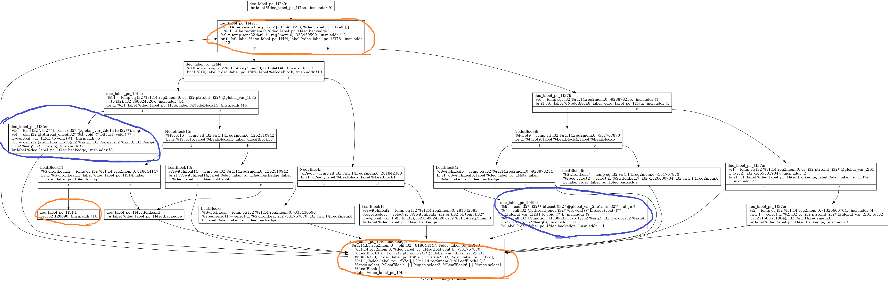
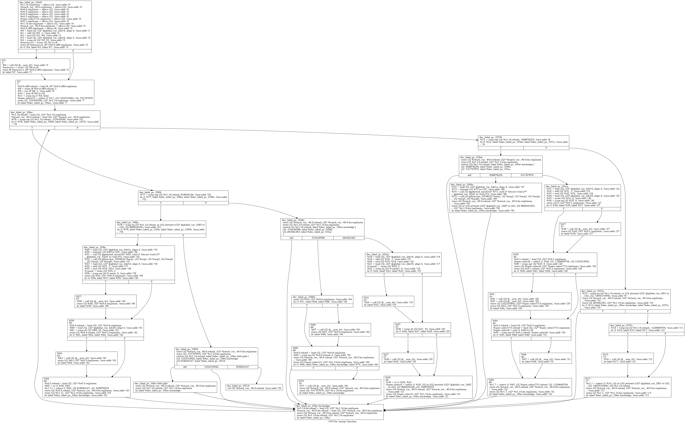

# 利用编译器优化干掉控制流平坦化flatten 

url：https://bbs.pediy.com/thread-266323.htm


上一篇在这里https://bbs.pediy.com/thread-265335.htm利用编译器优化干掉虚假控制流

上一篇我们通过优化去除了类似x * (x + 1) % 2 == 0的虚假控制流，这里的混淆去除bcf之后如下图，很明显的平坦化混淆

图上已经比较清晰了，黄色圈住的块是进入平坦化，离开平坦化return，选择控制流的switch混淆块，

蓝色的两块如果执行到的话就是真实块，其余基本都是case混淆块

具体算法过程如下，这里参考了大佬的思路，看到大佬又发了一篇vmp的，下面必须抽空继续学习


一种通过后端编译优化脱混淆壳的方法https://bbs.pediy.com/thread-260626.htm


0.把ir中所有switch指令转换为cmp+br指令

1.遍历所有block，如果某个block的Predecessor >6,可能是混淆节点，也就是switch块，标记为ob

2.获取ob的Successor后续块的Terminator指令，如果是条件跳转cmp+br，getOperand(0)就得到switchvar

3.根据switchvar这个Value类的实例，遍历所有使用这个值的Users ，挑出其中指令为cmp且switchvar为op0的Users，标记为case分发块

4.紧随case分发块之后一直到ob混淆块或者return的为真实块。这里大概有这几种情况

4.1赋值->多个case分发块->1个或多个真实块->ob块->赋值->下一次循环 这种是包含了真实块的有用执行路径

4.2赋值->多个case分发块->赋值->ob块->下一次循环 这种是只改变switchvar的无用路径

4.3赋值->多个case分发块->ob块->下一次循环 这种在ob块的phi节点上没有赋值，是永远不可能执行的路径，在分析ob块的phi节点时可以直接删掉

5.根据所有分发块建立二叉树，根节点为ob节点，往下遍历block寻找结尾cmp+br指令，左节点为true，右为false，直到没有br指令或者cmp不为switchvar，就到达真实块开头，它正对着的混淆phi节点前驱块为真实块结尾

6.从混淆phi节点开始，根据switchvar的Use往上追踪所有赋值，遇到phi继续追踪直到定值，建立混淆phi节点前驱块与switchvar赋值一一对应，没有switchvar赋值的phi路径肯定不会执行

7.模拟执行，第一次switchvar的值在进入switch时赋予，也就是ob块的后继块的phi左值，其余的在到达ob混淆节点后由phi指令赋予，最后一次必然到达return指令，理清楚整个路径的顺序

8.把真实块通过br连接起来，优化，这个函数其实只有一个真实块


# 1.runOnFunction函数

```
  bool runOnFunction(Function &F) override {
      Function *tmp=&F;
      BasicBlock *ob=NULL;
      bool flatOrNot=hasFlatten(*tmp,&ob);
      // errs() << "混淆block:" << *ob << '\n';
      if(flatOrNot){
        Instruction *var=getSwitchVar(*ob);
        //errs() << "getSwitchVar:" << *var << '\n';
        match(*tmp,*var);
      }
      return false;
    }
```

# 2.1是否有平坦化并获得switch混淆块

遍历所有block，如果某个block的Predecessor >6,可能是混淆节点，也就是switch块，标记为ob

```
 bool hasFlatten(Function &F,BasicBlock **ob){
      Function *tmp=&F;
      bool flat=false;
      for (Function::iterator bb = tmp->begin(); bb != tmp->end(); ++bb) {
          BasicBlock *tmp=&*bb;        
          int numPre=0;
          pred_iterator PI = pred_begin(tmp), E = pred_end(tmp);
          for (;PI != E; ++PI) {
            numPre+=1;
          }
          if(numPre>=6){
            flat=true;
            static BasicBlock *obb=&*tmp;
            *ob=&*tmp; 
            // errs() << "混淆blockterm:" << *obb<< '\n';
          }
      }
      return flat;
    }
```

# 

# 2.2获得switchvar

获取ob混淆块的Successor后续块的Terminator指令，如果是条件跳转cmp+br，getOperand(0)就得到switchvar

```
   Instruction* getSwitchVar(BasicBlock &ob){
        BasicBlock *tmp=&ob;
        BasicBlock *succ = tmp->getTerminator()->getSuccessor(0);
        // errs() << "混淆block succe:" << *succ << '\n';   
        BranchInst *br = NULL;
        br = cast<BranchInst>(succ->getTerminator());  
        if(br->isConditional()){  //收集所有case和phi控制点
            ICmpInst *ins=NULL;
            ins = cast<ICmpInst>(br->getOperand(0));
            Instruction *op0=NULL;
            op0 = cast<Instruction>(ins->getOperand(0));//op0就是switchvar
          return op0;
        }
        else{
          return NULL;
        }
 
    }
```

# 3.获得case分发块

根据switchvar这个Value类的实例，遍历所有使用这个值的Users ，挑出其中指令为cmp且switchvar为op0的Users，标记为case分发块

```
     for (User *U : op0->users()) {//这里保存所有switch控制块
        if (Instruction *Inst = dyn_cast<Instruction>(U)) {
          // errs() << Inst->getParent()->getName()<< "\n";
          if(ICmpInst *Inst = dyn_cast<ICmpInst>(U)){
            inst.push_back(Inst);
            blk.push_back(Inst->getParent());
            num.push_back(dyn_cast<Constant>(Inst->getOperand(1)));
            predicate.push_back(Inst->getPredicate());
            }
          else if(PHINode *Inst = dyn_cast<PHINode>(U)){
            phi=Inst;
            // errs() <<"phi:"<< phi->getParent()<< '\n';
            }
          }
        }
```


# 4.获得真实块 

紧随case分发块之后一直到ob混淆块或者return的为真实块

```
     for(int i=0;i<blk.size();i++){//这里从控制块往下走，直到找到真实块
          succ_iterator PI = succ_begin(blk[i]), E = succ_end(blk[i]);
          for (;PI != E; ++PI) {
            // errs() << *blk[i]<< '\n';
            // errs() << **PI<< '\n';//iterator指针指向block指针指向block
            // BasicBlock* blk_now=cast<BasicBlock*>(&(**PI));
            vector<BasicBlock*>::iterator it=find(blk.begin(), blk.end(), *PI);
            bool switch_=(*PI!=dyn_cast<BasicBlock>(phi->getParent()));
            if(switch_&&(it == blk.end())){
               blk2.push_back(*PI);
            }
            // if(it == blk.end()){
            //   if(*PI!=dyn_cast<BasicBlock>(phi->getParent())){
            //     blk2.push_back(*PI);
            //   }
            // }
          }
        }
```

# 5.获得混淆phi节点前驱块与switchvar赋值的一一对应

遍历ob块phi节点获取所有switchvar，这里有一些retdec识别错误的ConstantExpr我们把它替换成Constant

```
vector<Constant*>phinum;
        vector<BasicBlock*>blk3;
        int a=phi->getNumIncomingValues();
        for(int i=0;i<phi->getNumIncomingValues();i++){//这里根据phi节点确定每条路径的SwitchVar值
          // blk3.push_back(phi->getIncomingBlock(i));
          Value* a=phi->getIncomingValue(i);
          // errs() << *a<< '\n';
          int j=0;
          while((!isa<Constant>(a))&&(j<5)){
            j+=1;
            a=cast<Instruction>(a)->getOperand(1);
          }
          if(dyn_cast<Constant>(a)){
            phinum.push_back(dyn_cast<Constant>(a));
            blk3.push_back(phi->getIncomingBlock(i));
            }
        }
          for(int i=0;i<phinum.size();i++)
          {
            // errs() << "blk3:" <<blk3[i]->getName()<< '\n';
            if(dyn_cast<ConstantExpr>(phinum[i])){
              ConstantExpr* exp=cast<ConstantExpr>(phinum[i]);
              ConstantInt *b=(ConstantInt *)ConstantInt::get(exp->getType(),0);
              Constant* cons=exp->getWithOperandReplaced(0,b);
              // errs() << "getAsInstruction:" <<*cons<< '\n';
              phinum[i]=cons;
            }
            // errs() << "num:" <<*phinum[i]<< '\n';
          }
```

# 6.模拟执行

本来想学着用klee的，破单位网速太差一直下一半断掉，没办法只能自己试着写

blk向量存储了所有判断状态变量switchvar的的block，blk2向量存储了所有ob混淆block的前驱块，excute向量存储了所有执行过的block，

很明显每次执行首先获得switchvar，然后沿着路径根据blk的br一直执行到blk2也就是ob混淆block的前驱块，

通过ob混淆块的phi节点更改switchvar，执行下一条路径

这么执行几次后，最后一条路径到达return，混淆结束，是一个单进单出的大循环

遍历得到所有路径之后，直接连接所有的真实块，把blk和ob都忽略掉，就可以干掉平坦化了

```
     Constant* x1=dyn_cast<Constant>(dyn_cast<PHINode>(op0)->getIncomingValue(0));
      BasicBlock* blknow=(phi->getParent())->getSingleSuccessor();
      BasicBlock* rtn;
      // errs() << "blknow:" <<*blknow<< '\n';
      APInt a1=x1->getUniqueInteger();
      bool branch;int pre;
      int i=1;
      errs() << "switch_var:" <<a1<< '\n';
      vector<BasicBlock*>excute;
    loop:
        ICmpInst* inst1=cast<ICmpInst>(blknow->getTerminator()->getOperand(0));   
        // errs() << "inst1:" <<*inst1<< '\n';
        APInt b;     
        //b=dyn_cast<Constant>(inst1->getOperand(1))->getUniqueInteger(); 
        if(dyn_cast<ConstantExpr>(inst1->getOperand(1))){
          ConstantExpr* exp=cast<ConstantExpr>(inst1->getOperand(1));
          ConstantInt *bb=(ConstantInt *)ConstantInt::get(exp->getType(),0);
          Constant* cons=exp->getWithOperandReplaced(0,bb);
          b=dyn_cast<Constant>(cons)->getUniqueInteger();
        }
        else{
          b=dyn_cast<Constant>(inst1->getOperand(1))->getUniqueInteger(); 
        }
        pre=inst1->getPredicate();
        APInt rlt=a1-b;      
        int c=rlt.getSExtValue();
        succ_iterator SI = succ_begin(blknow);
        BasicBlock *PI = *SI;
        BasicBlock *E=*(++SI);
        // errs() << "PI:" <<*PI<< '\n';
        // errs() << "E:" <<*E<< '\n';
        if(c>0){          
          if(pre==33||pre==34||pre==35||pre==38||pre==39){branch=true;}
          else{branch=false;}  
        }
        else if(c==0){
          if(pre==32||pre==35||pre==37||pre==39||pre==41){branch=true;}
          else{branch=false;}  
        }
        else if(c<0){
          if(pre==33||pre==36||pre==37||pre==40||pre==41){branch=true;}
          else{branch=false;} 
        }
         
        // errs() << "branch:" <<branch<< '\n';
        if(branch==true){
          // errs() << "PI:" <<**PI<< '\n';
          blknow=PI;
        }
        else{
          // errs() << "E:" <<**E<< '\n';
          blknow=E;
        }
 
        errs() << "block_pass:" <<blknow->getName()<< '\n';
        vector<BasicBlock*>::iterator it=find(blk.begin(), blk.end(), blknow);
        vector<BasicBlock*>::iterator itt=find(blk3.begin(), blk3.end(), blknow);
        if((it != blk.end())&&(itt == blk3.end())){
          excute.push_back(blknow);
          goto loop;
        }
        else{
          if(isa<ReturnInst>(blknow->getTerminator())){
            errs() << "return_get:" <<blknow->getTerminator()<< '\n';
            rtn=blknow;
            goto stop;
          }
          errs() << "block_end:" <<blknow->getName()<< '\n';
          vector<BasicBlock*>::iterator it2=find(blk3.begin(), blk3.end(), blknow);
          int pos=std::distance(blk3.begin(), it2);
          errs() << "phi_into:" <<pos<< '\n';
          a1=phinum[pos]->getUniqueInteger();
          errs() << "switch_var:" <<a1<< '\n';
          if(pos<phinum.size()){
            i+=1;  
          }
          else{
            goto stop;
          }
          blknow=(phi->getParent())->getSingleSuccessor();
          goto loop;
          // a1=phinum[i]->getUniqueInteger();
        }
        stop:    
          errs() << "cycle_count:" <<i<< '\n';      
          errs() << "cycle_end:" <<blknow->getName()<< '\n';

```

执行结果：

switch_var:-333430598
block_pass:dec_label_pc_1f4f4
block_pass:NodeBlock
block_pass:LeafBlock
block_end:LeafBlock
phi_into:7
switch_var:-531767870
block_pass:dec_label_pc_1f376
block_pass:NodeBlock8
block_pass:LeafBlock6
block_end:LeafBlock6
phi_into:6
switch_var:-1326600704
block_pass:dec_label_pc_1f376
block_pass:dec_label_pc_1f37a
block_end:dec_label_pc_1f37a
phi_into:3
switch_var:281842383
block_pass:dec_label_pc_1f4f4
block_pass:NodeBlock
block_pass:LeafBlock1
block_end:LeafBlock1
phi_into:5
switch_var:868024320
block_pass:dec_label_pc_1f4f4
block_pass:dec_label_pc_1f4fa
block_pass:dec_label_pc_1f3fe
block_end:dec_label_pc_1f3fe
phi_into:0
switch_var:818644147
block_pass:dec_label_pc_1f4f4
block_pass:dec_label_pc_1f4fa
block_pass:NodeBlock15
block_pass:LeafBlock11
block_pass:dec_label_pc_1f514
return_get:0x22098a8
cycle_count:6
cycle_end:dec_label_pc_1f514
excute block:dec_label_pc_1f4f4
excute block:NodeBlock
excute block:dec_label_pc_1f376
excute block:NodeBlock8
excute block:dec_label_pc_1f376
excute block:dec_label_pc_1f4f4
excute block:NodeBlock
excute block:dec_label_pc_1f4f4
excute block:dec_label_pc_1f4fa
excute block:dec_label_pc_1f4f4
excute block:dec_label_pc_1f4fa
excute block:NodeBlock15
excute block:LeafBlock11

这个函数除了return只有dec_label_pc_1f3fe这个block是真实块

# 7.连接真实块 

然后，从excute中过滤出所有真实块存入excute_real

```
        vector<BasicBlock*>excute_real;
        for(int i=0;i<excute.size();i++){
          // errs() <<"excute block:"<< excute[i]->getName()<< '\n';
          vector<BasicBlock*>::iterator it=find(blk_real.begin(), blk_real.end(),excute[i]);
          if(it != blk.end()){
            excute_real.push_back(excute[i]);
          }
        }
        excute_real.push_back(rtn);
        for(int i=0;i<excute_real.size()-1;i++){
          inst_iterator  E = inst_end(excute_real[i]);
          BranchInst* br=BranchInst::Create(excute_real[i+1],E);          
        }
```

最后直接把excute_real里的block用br连接起来，再用opt -sccp -ipsccp -simplifycfg -adce优化就可以还原了，这个函数比较简单，优化完只剩1个块了

对比一下刚开始的cfg



# 附录

1.获取后续块数量

```
         pred_iterator PI = pred_begin(tmp), E = pred_end(tmp);
          for (;PI != E; ++PI) {
            numPre+=1;
          }
```

2.phi指令遍历

```
        int a=phi->getNumIncomingValues();
        for(int i=0;i<phi->getNumIncomingValues();i++){//这里根据phi节点确定每条路径的SwitchVar值
          Value* a=phi->getIncomingValue(i);
          // errs() << *a<< '\n';
          int j=0;
          while((!isa<Constant>(a))&&(j<5)){
            j+=1;
            a=cast<Instruction>(a)->getOperand(1);
          }
          if(dyn_cast<Constant>(a)){
            phinum.push_back(dyn_cast<Constant>(a));
            blk3.push_back(phi->getIncomingBlock(i));
            }
        }
```

3.替换识别错误的ConstantExpr为Constant，把那个错误识别的globalvalue替换为0就可以了

```
           if(dyn_cast<ConstantExpr>(phinum[i])){
              ConstantExpr* exp=cast<ConstantExpr>(phinum[i]);
              ConstantInt *b=(ConstantInt *)ConstantInt::get(exp->getType(),0);
              Constant* cons=exp->getWithOperandReplaced(0,b);
              // errs() << "getAsInstruction:" <<*cons<< '\n';
              phinum[i]=cons;
            }
```

4.Constant总结

ConstantExpr常量表达式，在Constants.h里查看它的相关函数，介绍在这里[https://llvm.org/docs/LangRef.html#constant-expressions](https://llvm.org/docs/LangRef.html#constant-expressions，)

长的像一个Instruction，可以通过getAsInstruction转换为Instruction就可以getOperand和opCode了

```
          ConstantExpr* exp=cast<ConstantExpr>(inst1->getOperand(1));//把value转换为常量表达式
          ConstantInt *bb=(ConstantInt *)ConstantInt::get(exp->getType(),0);//声明一个值为0的常量
          Constant* cons=exp->getWithOperandReplaced(0,bb);//把常量表达式ConstantExpr第一个operand替换为0
          
          APInt a1=dyn_cast<Constant>(cons)->getUniqueInteger()->getUniqueInteger();//获得Constant的整数值存储为APInt类型，不能直接为int类型
```

5.整体代码

```
#include "llvm/ADT/Statistic.h"
#include "llvm/IR/Function.h"
#include "llvm/Pass.h"
#include "llvm/Support/raw_ostream.h"
#include "llvm/IR/Intrinsics.h"
#include "llvm/IR/LLVMContext.h"
#include "llvm/Support/raw_ostream.h"
#include "llvm/IR/Constants.h"
#include "llvm/IR/Instruction.h"
#include "llvm/Support/raw_ostream.h"
#include "llvm/IR/Operator.h"
#include "llvm/IR/Intrinsics.h"
#include "llvm/IR/Function.h"
#include "llvm/IR/Instructions.h"
#include "llvm/Transforms/Utils/Local.h" 
#include "llvm/Transforms/Utils/BasicBlockUtils.h"//辣鸡注释少个s，浪费我2个小时
#include "llvm/IR/BasicBlock.h"
#include "llvm/ADT/Statistic.h"
#include "llvm/Transforms/IPO.h"
#include "llvm/IR/Module.h"
#include "llvm/Support/CommandLine.h"
#include "llvm/Support/Debug.h"
#include "llvm/IR/CFG.h"
#include "llvm/ADT/PostOrderIterator.h"
#include "llvm/IR/InstrTypes.h"
#include "llvm/IR/Metadata.h"
#include <vector> 
#include <set>
#include <algorithm>
using namespace std;
using namespace llvm;
 
#define DEBUG_TYPE "dflat"
 
STATISTIC(dflat, "Counts number of functions greeted");
 
namespace {
  // dflat - The first implementation, without getAnalysisUsage.
  struct dflat : public FunctionPass {
    static char ID; // Pass identification, replacement for typeid
    dflat(): FunctionPass(ID) {}
 
    bool runOnFunction(Function &F) override {
      Function *tmp=&F;
      BasicBlock *ob=NULL;
      bool flatOrNot=hasFlatten(*tmp,&ob);
      // errs() << "混淆block:" << *ob << '\n';
      if(flatOrNot){
        Instruction *var=getSwitchVar(*ob);
        // errs() << "getSwitchVar:" << *var << '\n';
        match(*tmp,*var);
      }
      return false;
    }
    bool hasFlatten(Function &F,BasicBlock **ob){
      Function *tmp=&F;
      bool flat=false;
      for (Function::iterator bb = tmp->begin(); bb != tmp->end(); ++bb) {
          BasicBlock *tmp=&*bb;        
          int numPre=0;
          pred_iterator PI = pred_begin(tmp), E = pred_end(tmp);
          for (;PI != E; ++PI) {
            numPre+=1;
          }
          if(numPre>=6){
            flat=true;
            static BasicBlock *obb=&*tmp;
            *ob=&*tmp; 
            // errs() << "混淆blockterm:" << *obb<< '\n';
          }
      }
      return flat;
    }
 
    Instruction* getSwitchVar(BasicBlock &ob){
        BasicBlock *tmp=&ob;
        BasicBlock *succ = tmp->getTerminator()->getSuccessor(0);
        // errs() << "混淆block succe:" << *succ << '\n';   
        BranchInst *br = NULL;
        br = cast<BranchInst>(succ->getTerminator());  
        if(br->isConditional()){  //收集所有case和phi控制点
            ICmpInst *ins=NULL;
            ins = cast<ICmpInst>(br->getOperand(0));
            Instruction *op0=NULL;
            op0 = cast<Instruction>(ins->getOperand(0));//op0就是switchvar
          return op0;
        }
        else{
          return NULL;
        }
 
    }
    void match(Function &F,Instruction& op){
      Function *tmp=&F;
      Instruction *op0=&op;
      vector<ICmpInst*>inst;
      vector<BasicBlock*>blk;
      vector<BasicBlock*>blk2;//真实块起点
      vector<Constant*>num;
      vector<int>predicate;
      PHINode* phi;
      for (User *U : op0->users()) {//这里保存所有switch控制块
        if (Instruction *Inst = dyn_cast<Instruction>(U)) {
          // errs() << Inst->getParent()->getName()<< "\n";
          if(ICmpInst *Inst = dyn_cast<ICmpInst>(U)){
            inst.push_back(Inst);
            blk.push_back(Inst->getParent());
            num.push_back(dyn_cast<Constant>(Inst->getOperand(1)));
            predicate.push_back(Inst->getPredicate());
            }
          else if(PHINode *Inst = dyn_cast<PHINode>(U)){
            phi=Inst;
            // errs() <<"phi:"<< phi->getParent()<< '\n';
            }
          }
        }
          // for(int i=0;i<inst.size();i++)
          // {
          //   errs() << "inst:" <<*inst[i]<< '\n';
          //   errs() << "blk:" <<*(blk[i]->getTerminator())->getOperand(0)<< '\n';
          //   errs() << "num:" <<*num[i]<< '\n';
          //   errs() << "predicate:" <<predicate[i]<< '\n';
          // }          
 
      for(int i=0;i<blk.size();i++){//这里从控制块往下走，直到找到真实块
          succ_iterator PI = succ_begin(blk[i]), E = succ_end(blk[i]);
          for (;PI != E; ++PI) {
            // errs() << *blk[i]<< '\n';
            // errs() << **PI<< '\n';//iterator指针指向block指针指向block
            // BasicBlock* blk_now=cast<BasicBlock*>(&(**PI));
            vector<BasicBlock*>::iterator it=find(blk.begin(), blk.end(), *PI);
            bool switch_=(*PI!=dyn_cast<BasicBlock>(phi->getParent()));
            if(switch_&&(it == blk.end())){
               blk2.push_back(*PI);
            }
          }
        }
        vector<BasicBlock*>blk_real;
        for(int i=0;i<blk2.size();i++){
          errs() <<"real block:"<< *blk2[i]<< '\n';
          int num=0;
          BasicBlock& BB = *blk2[i];
          for (Instruction &I : BB)num+=1;
          if(num>1){
            blk_real.push_back(blk2[i]);}
          }        
          // for(int i=0;i<blk_real.size();i++)
          // {
          //   errs() << "blk_real:" <<*blk_real[i]<< '\n';
          // }   
        vector<Constant*>phinum;
        vector<BasicBlock*>blk3;
        for(int i=0;i<phi->getNumIncomingValues();i++){//这里根据phi节点确定每条路径的SwitchVar值
          // blk3.push_back(phi->getIncomingBlock(i));
          Value* a=phi->getIncomingValue(i);
          // errs() << *a<< '\n';
          int j=0;
          while((!isa<Constant>(a))&&(j<5)){
            j+=1;
            a=cast<Instruction>(a)->getOperand(1);
          }
          if(dyn_cast<Constant>(a)){
            phinum.push_back(dyn_cast<Constant>(a));
            blk3.push_back(phi->getIncomingBlock(i));
            }
        }
          for(int i=0;i<phinum.size();i++)
          {
            // errs() << "blk3:" <<blk3[i]->getName()<< '\n';
            if(dyn_cast<ConstantExpr>(phinum[i])){
              ConstantExpr* exp=cast<ConstantExpr>(phinum[i]);
              ConstantInt *b=(ConstantInt *)ConstantInt::get(exp->getType(),0);
              Constant* cons=exp->getWithOperandReplaced(0,b);
              // errs() << "getAsInstruction:" <<*cons<< '\n';
              phinum[i]=cons;
            }
            // errs() << "num:" <<*phinum[i]<< '\n';
          }  
//开始  
      Constant* x1=dyn_cast<Constant>(dyn_cast<PHINode>(op0)->getIncomingValue(0));
      BasicBlock* blknow=(phi->getParent())->getSingleSuccessor();
      BasicBlock* rtn;
      // errs() << "blknow:" <<*blknow<< '\n';
      APInt a1=x1->getUniqueInteger();
      bool branch;int pre;
      int i=1;
      errs() << "switch_var:" <<a1<< '\n';
      vector<BasicBlock*>excute;
    loop:
        ICmpInst* inst1=cast<ICmpInst>(blknow->getTerminator()->getOperand(0));   
        // errs() << "inst1:" <<*inst1<< '\n';
        APInt b;     
        //b=dyn_cast<Constant>(inst1->getOperand(1))->getUniqueInteger(); 
        if(dyn_cast<ConstantExpr>(inst1->getOperand(1))){
          ConstantExpr* exp=cast<ConstantExpr>(inst1->getOperand(1));
          ConstantInt *bb=(ConstantInt *)ConstantInt::get(exp->getType(),0);
          Constant* cons=exp->getWithOperandReplaced(0,bb);
          b=dyn_cast<Constant>(cons)->getUniqueInteger();
        }
        else{
          b=dyn_cast<Constant>(inst1->getOperand(1))->getUniqueInteger(); 
        }
        pre=inst1->getPredicate();
        APInt rlt=a1-b;      
        int c=rlt.getSExtValue();
        succ_iterator SI = succ_begin(blknow);
        BasicBlock *PI = *SI;
        BasicBlock *E=*(++SI);
        if(c>0){ //这里enum Predicate定义在llvm/InstrTypes.h，不同版本可能不一样     
          if(pre==33||pre==34||pre==35||pre==38||pre==39){branch=true;}
          else{branch=false;}  
        }
        else if(c==0){
          if(pre==32||pre==35||pre==37||pre==39||pre==41){branch=true;}
          else{branch=false;}  
        }
        else if(c<0){
          if(pre==33||pre==36||pre==37||pre==40||pre==41){branch=true;}
          else{branch=false;} 
        }        
        // errs() << "branch:" <<branch<< '\n';
        if(branch==true){
          // errs() << "PI:" <<**PI<< '\n';
          blknow=PI;
        }
        else{
          // errs() << "E:" <<**E<< '\n';
          blknow=E;
        }
        errs() << "block_pass:" <<blknow->getName()<< '\n';
        vector<BasicBlock*>::iterator it=find(blk.begin(), blk.end(), blknow);
        vector<BasicBlock*>::iterator itt=find(blk3.begin(), blk3.end(), blknow);
        if((it != blk.end())&&(itt == blk3.end())){
          excute.push_back(blknow);
          goto loop;
        }
        else{
          if(isa<ReturnInst>(blknow->getTerminator())){
            errs() << "return_get:" <<blknow->getTerminator()<< '\n';
            rtn=blknow;
            goto stop;
          }
          errs() << "block_end:" <<blknow->getName()<< '\n';
          vector<BasicBlock*>::iterator it2=find(blk3.begin(), blk3.end(), blknow);
          int pos=std::distance(blk3.begin(), it2);
          errs() << "phi_into:" <<pos<< '\n';
          a1=phinum[pos]->getUniqueInteger();
          errs() << "switch_var:" <<a1<< '\n';
          if(pos<phinum.size()){
            i+=1;  
          }
          else{
            goto stop;
          }
          blknow=(phi->getParent())->getSingleSuccessor();
          goto loop;
        }
        stop:    
          errs() << "cycle_count:" <<i<< '\n';      
          errs() << "cycle_end:" <<blknow->getName()<< '\n';
//结束
        vector<BasicBlock*>excute_real;
        for(int i=0;i<excute.size();i++){
          // errs() <<"excute block:"<< excute[i]->getName()<< '\n';
          vector<BasicBlock*>::iterator it=find(blk_real.begin(), blk_real.end(),excute[i]);
          if(it != blk.end()){
            excute_real.push_back(excute[i]);
          }
        }
        excute_real.push_back(rtn); 
        for(int i=0;i<excute_real.size();i++){
          inst_iterator  E = inst_end(excute_real[i]);
          BranchInst* br=BranchInst::Create(excute_real[i+1],E);          
        }
      }
  };
}
 
char dflat::ID = 0;
static RegisterPass<dflat> X("dflat", "dflat Pass");
```