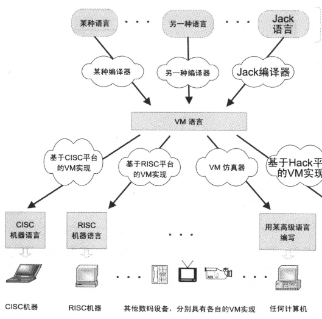

# 手把手教你构建 C 语言编译器（解释器）学习笔记

url：https://eternalsakura13.com/2018/03/14/lotabout/


# 手把手教你构建 C 语言编译器（解释器）学习笔记

## 虚拟机

### 背景

高级语言程序能够在目标计算机上运行之前，它必须被翻译成机器语言，这个翻译过程，也就是编译。
通常必须对任意给定的高级程序和与其对应的机器语言编写专用的编译器，但是这样每种编译器编译的高级语言与编译之后的机器语言之间就存在很强的依赖性。
减少这种依赖的方法之一是，将整个编译过程划分为几乎独立的两个阶段。
在第一个阶段，高级语言被解析出来，其命令被翻译成一种中间处理结果——既不是高级，也不是低级的结果。
在第二个阶段，这些中间结果被进一步翻译成目标硬件的机器语言。
从软件工程的角度来分解是十分吸引人的，第一阶段仅依赖于高级语言的细节，第二阶段仅依赖于目标机器语言的细节。
当然，两个编译阶段之间的接口十分重要，甚至应该单独抽象成一种语言。
实际上我们可以明确的描述这种虚拟机，其指令就是由高级语言分解成的中间处理步骤。
这种模型的范例有java(java->byte code(run in JVM))、c#(.NET->IL(run in CLR))
[](https://sakura-1252236262.cos.ap-beijing.myqcloud.com/2018-03-14-185642.png)

### 实现

1. 我们只设置代码段、数据段（只存放字符串）和栈

2. 理论上当用户需要分配内存的时候，理论上我们的虚拟机需要维护一个堆用于内存分配，但实际实现上较为复杂且与编译无关，故我们引入一个指令MSET，使我们能直接使用编译器（解释器）中的内存。

3. 这里为了简化实现过程，大量实现了自己的指令集。

4. 使用顺序入栈，而不是逆序。

   ```
   sub_function(arg1, arg2, arg3);
   
   |    ....       | high address
   +---------------+
   | arg: 1        |    new_bp + 4
   +---------------+
   | arg: 2        |    new_bp + 3
   +---------------+
   | arg: 3        |    new_bp + 2
   +---------------+
   |return address |    new_bp + 1
   +---------------+
   | old BP        | <- new BP
   +---------------+
   | local var 1   |    new_bp - 1
   +---------------+
   | local var 2   |    new_bp - 2
   +---------------+
   |    ....       |  low address
   ```

   ### 测试

   运行时候的一些坑点

   一开始在mac上测试一直segment fault，我就调试了一下。

   然后注意到比如这个地方

   ```
   bp = sp = (int *) ((int) stack + poolsize);// stack grow from high to low
   ```

   明显是按照32位地址空间去算的，(int)stack是4字节。

   所以放进虚拟机里，加上-m32编译。

   ```
   sakura@ubuntu:~/logcat$ gcc main.c -m32 -o main
   sakura@ubuntu:~/logcat$ ls
   main  main.c
   sakura@ubuntu:~/logcat$ ./main
   exit(30)
   ```

   ## 词法分析器

   前面的环境准备好之后，我们就可以开始写我们的解释器了。

   词法分析器对源码字符串做预处理，举例：

   ```
   2 + 3 * (4 - 5)
   =>
   (Number, 2) Add (Number, 3) Multiply Left-Bracket (Number, 4) Subtract (Number, 5) Right-Bracket
   ```

   ```
                      +-------+                      +--------+
   -- source code --> | lexer | --> token stream --> | parser | --> assembly
                      +-------+                      +--------+
   ```

   要是深入词法分析器，你就会发现，它的本质上也是编译器。我们的编译器是以标记流为输入，输出汇编代码，而词法分析器则是以源码字符串为输入，输出标记流。

### 标识符与符号表

标识符（identifier）可以理解为变量名。对于语法分析而言，我们并不关心一个变量具体叫什么名字，而只关心这个变量名代表的唯一标识。例如 int a; 定义了变量 a，而之后的语句 a = 10，我们需要知道这两个 a 指向的是同一个变量。

基于这个理由，词法分析器会把扫描到的标识符全都保存到一张表中，遇到新的标识符就去查这张表，如果标识符已经存在，就返回它的唯一标识。

```
Symbol table:
----+-----+----+----+----+-----+-----+-----+------+------+----
 .. |token|hash|name|type|class|value|btype|bclass|bvalue| ..
----+-----+----+----+----+-----+-----+-----+------+------+----
    |<---       one single identifier                --->|
```

后面的内容虽然是懂的。。但是写笔记太长了，暂时END吧。
TODO