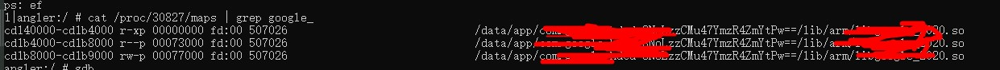

# 在linux环境下使用lldb调试，以及 dump 安卓内存

url：https://my.oschina.net/u/4263893/blog/4349408

已知android某进程 so文件 在maps中如下：



**我期望是按照 映射的内存点 cd140000-cd1b4000 dump出文件，而不是将整个so pull下来**。所以本文开始（root android手机一台+linux系统环境）：


## 一、将lldb push到手机，并执行

```
adb push "E:\Android\sdk\lldb\3.0\android\arm64-v8a\lldb-server" /data/local/tmp/
adb shell
su
cd /data/local/tmp/
chmod 755 lldb-server

#启动lldb
 ./lldb-server platform --listen "*:10086" --server
```


## 二、转发端口


\#新开sh，执行

```
adb forward tcp:10086 tcp:10086
```


## 三、连接android设备上的lldb   

首先你需要在你的linux系统上安装lldb，然后执行lldb。进入后执行以下命令

```
platform select remote-android

#ENU7N16709000458 是adb devices显示的设备名称
platform connect connect://ENU7N16709000458:10086
attach -p 30827
```

本来是想用LLDBFrontend.exe 的，然而这个工具似乎一直抛锚？所以就在linux上来做了。


## 四、dump内存

```
#执行成功后，dump出来的文件存储在linux服务器 /home/目录里
memory read --outfile /home/xxx.so --force -b cd100000 cd174000
```

如果你知道字节数，也可以这样 memory read --outfile /home/xxx.so --count 512 cd100000 (**我这里dump的内存和图上不一样，是因为我杀死进程，重新打开app 了，所以有点差别**)


# **完成！**

**-------------------------------------------------------**


### 其他常用命令推荐

1、查看寄存器信息 

> re r

2、打印某个寄存器值

> p $r0
>
> p (char*)$r0

3、进程恢复

> process continue

4、进程中断

> process interrupt

5、查看线程

> thread list

**更对命令请查看：**


## [https://lldb.llvm.org/use/map.html](https://www.oschina.net/action/GoToLink?url=https%3A%2F%2Flldb.llvm.org%2Fuse%2Fmap.html)

 

参考：

[https://lldb.llvm.org/use/remote.html](https://www.oschina.net/action/GoToLink?url=https%3A%2F%2Flldb.llvm.org%2Fuse%2Fremote.html)