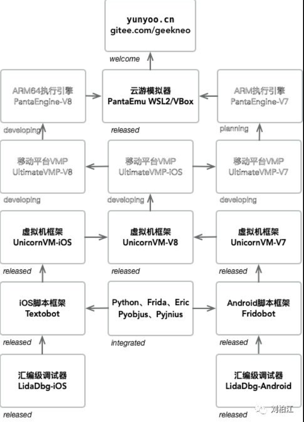
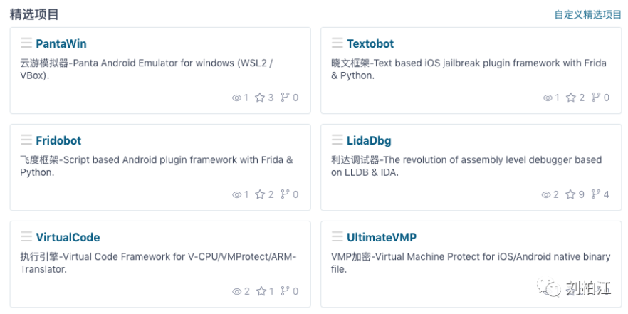

## UnicornVM-回调事件添加指令获取操作码

url：https://mp.weixin.qq.com/s/0OL8073Zo_EStTCMnCZAjA






首先，非常感谢朋友们对UnicornVM这个免费产品的喜爱，我们将再接再厉，不断完善朋友们反馈的任何问题。

然后，我们来看两个疑问，这是一个用户朋友私信问我的，我觉得挺有代表性，就专门阐述一下了。

Q1.UnicornVM是降低了Unicorn的使用门槛，并且去掉了Qemu虚拟内存，所以可能在不同架构下面有不同的处理方式，可以这么理解吗？

A1.

“UnicornVM是降低了Unicorn的使用门槛”：这个表述完全正确，我再进一步说说为什么降低了使用Unicorn的门槛。现在Unicorn最常用的使用场景是在PC平台模拟执行iOS/Android平台的代码片段，对于简单程序还好，对于超级复杂的程序（比如苹果iOS系统核心加密代码），简单模拟代码片段根本没有什么实际意义。但是，如果我们把模拟执行的上下文直接放在真实的手机环境，那么再复杂的代码也可以全量模拟跑完，而且还不需要设置任何虚拟内存。所以，UnicornVM导出的两个函数，就是降低了Unicorn使用门槛以及扩展了它的使用场景。

“并且去掉了Qemu虚拟内存”：这个表述完全正确，Qemu有自己虚拟出来的MMU内存管理单元，我认为这完全就是累赘，所以去掉了，然后让模拟代码直接与真实的程序内存交互，简单、粗暴、好用。

“所以可能在不同架构下面有不同的处理方式，可以这么理解吗”：可以这么理解，不碍事。

Q2.这种处理以后对性能影响大吗？有没有对应的demo对比？

A2.

要理解UnicornVM对性能的影响，我们需要看回调函数的返回值，如下：

```
// callback return type
typedef enum vc_callback_return_t {
  cbret_continue,    // let interp continue
  cbret_processed,   // already processed by callback implementation
  cbret_recursive,   // interp this function recursively
  cbret_directcall,  // call this function directly
} vc_callback_return_t;
```

对性能影响极大的返回值是cbret_recursive，它表示递归模拟执行，这就意味着遇到函数会一直递归到系统调用syscall为止，这个返回值要慎用。推荐的用法是系统函数代码区间使用cbret_directcall，直接让解释器切换到Native模式执行，那这个性能就与直接执行一摸一样了。

然后我们再看看非递归模式的函数执行，性能影响是怎么回事。这个问题其实可以这样理解，Python文本代码可以通过Python编译器编译成pyc字节码，然后Python解释器就可以逐条解析pyc并执行它。与此类似可以这样理解，C/C++文本代码通过Clang编译器编译成arm字节码，然后UnicornVM解释器对这个arm字节码逐条解析并执行它，那么与直接执行一条arm指令相比，所耗费的CPU时间单纯从数量级来看那肯定是多几百几千倍，但是从最终的执行结果来看，只要不是重度递归模拟执行，这个时间对人来说并不”肉眼可见“，所以性能其实大可不必关心。至于真实的demo对比，感兴趣的朋友自己写吧，毕竟头文件和库文件都免费开放出来了。

最后，今天我们更新了头文件，添加了UnicornVM虚拟机解释器在读取汇编指令时调用用户指定回调的功能，对应到头文件即是vcop_ifetch操作码，它的用法和vcop_read是一样的，区别在于ifetch是解释器读取汇编指令，read是解释器VCPU读取程序内存。

```
// opcode type for callback args
typedef enum vc_optype_t {
  vcop_read,    // memory read
  vcop_write,   // memory write
  vcop_call,    // function call
  vcop_return,  // function return
  vcop_svc,     // arch syscall
  vcop_ifetch,  // interpreter fetch instruction
} vc_optype_t;

// callback args
typedef struct vc_callback_args_t {
  // your own context passed for vc_run_interp/vc_make_callee
  const void *usrctx;
  // arch execution context
  vc_armctx_t *armctx;
  // current opcode
  vc_optype_t op;
  union {
    // for vcop_read/vcop_write/vcop_ifetch
    struct {
      const void *src;
      void *dst;
      int byte;
    } rw;
    ...
  }
  ...
  }
```

