# 逆向工具之unidbg

url：https://code.newban.cn/151.html


 昨天在逆向某`App`的时候，发现有个加密工具类中的`native`方法是用`C语言`编写的，隐藏在`so`文件中。某大佬推荐逆向工具`unidbg`，能在`pc`端直接调用`so`文件中的函数，最终成功解决了问题。

# 一、`unidbg`引入

  逆向某`App`，反编译`dex`得到`Java`代码，但是有两个加密工具类中的方法放到`so`文件中。
[](https://cdn.jsdelivr.net/gh/songjianzaina/SavePicGoPic/img/20201027141909.png)
[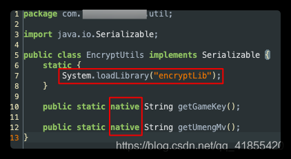](https://cdn.jsdelivr.net/gh/songjianzaina/SavePicGoPic/img/20201027141856.png)
[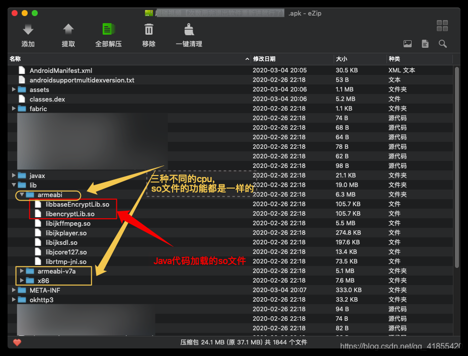](https://cdn.jsdelivr.net/gh/songjianzaina/SavePicGoPic/img/20201027141819.png)
  方法的实现用的`C语言`编写的，放在了`so`文件中。在`Java`中，动态加载`so`文件，使用`native`方法的形式隐藏了方法的方法体。难道伟大的逆向工程就此放弃？这显然不符合我们技术人的性格，肯定要想方设法弄出来。

# 二、`unidbg`概述

  `unidbg` 是一个基于 `unicorn` 的逆向工具，可以直接调用`Android`和`iOS`中的 `so` 文件。项目的`GitHub`地址为`https://github.com/zhkl0228/unidbg`
  我使用`unidbg`，直接调用`libbaseEncryptLib.so`、`libencryptLib.so`中的方法，这样就不用想破脑袋去逆向`so`文件了。

备 注 : \color{red}备注:备注:`so`文件是`unix`系统中的动态连接库，属于二进制文件，作用相当于`windows`系统中的`.dll`文件。在`Android`中也可调用动态库文件(*.so)，一般会将加密算法、密码等重要的方法、信息使用`C语言`编写，然后编译成`so`文件，增强了软件的`安全性`。

# 三、`unidbg`使用姿势

## 1、下载`unidbg`项目

  **下载地址：`https://github.com/zhkl0228/unidbg`**
[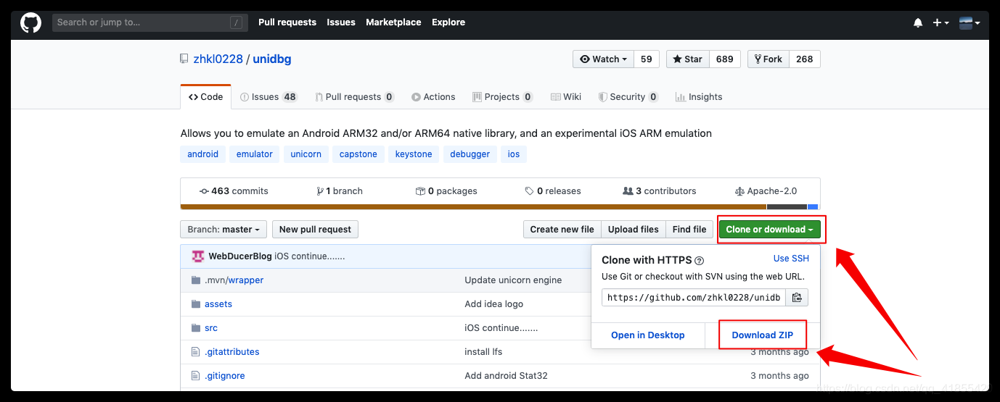](https://cdn.jsdelivr.net/gh/songjianzaina/SavePicGoPic/img/20201027141803.png)

## 2、导入到IDEA中

  `unidbg`项目用`Java`编写，并且上面下载的是一个标准的`maven`项目。我这里演示导入到`IDEA`中，如果你熟悉其它的`IDE`，也可以自己去弄。（顺带一提，如果你之前没接触过Java语言，要确保电脑安装好`JDK`、`maven`）

### ①、解压压缩包

[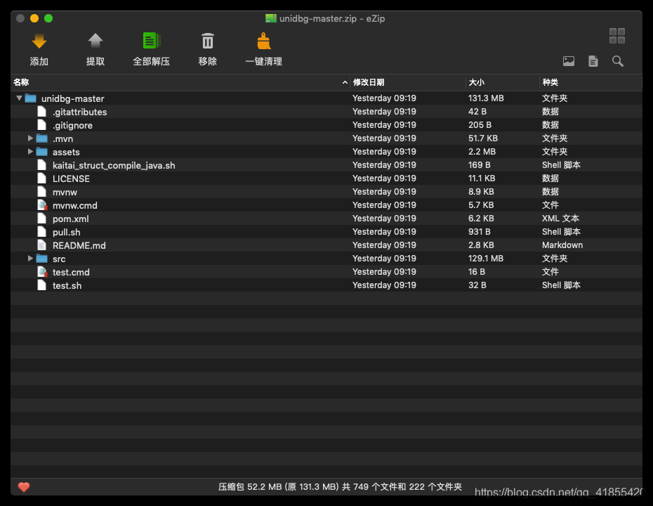](https://cdn.jsdelivr.net/gh/songjianzaina/SavePicGoPic/img/20201027141749.png)

### ②、打开`IDEA`，导入解压的项目

[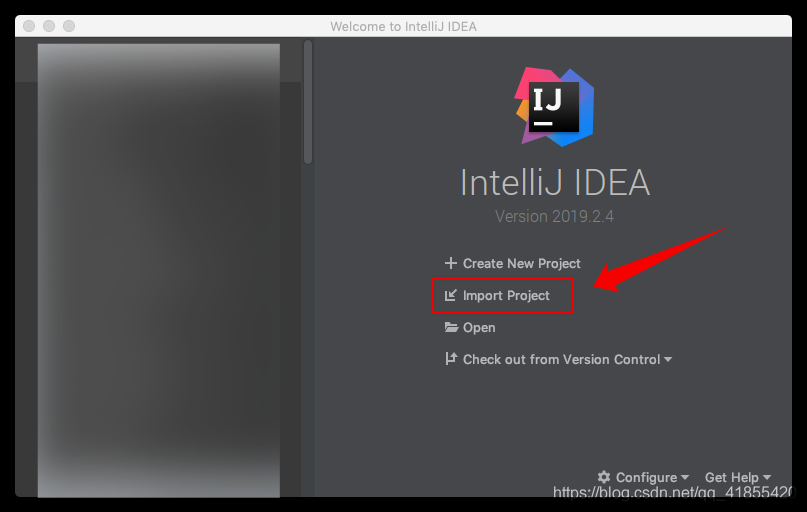](https://cdn.jsdelivr.net/gh/songjianzaina/SavePicGoPic/img/20201027141736.png)
  浏览到刚刚解压好的文件夹
[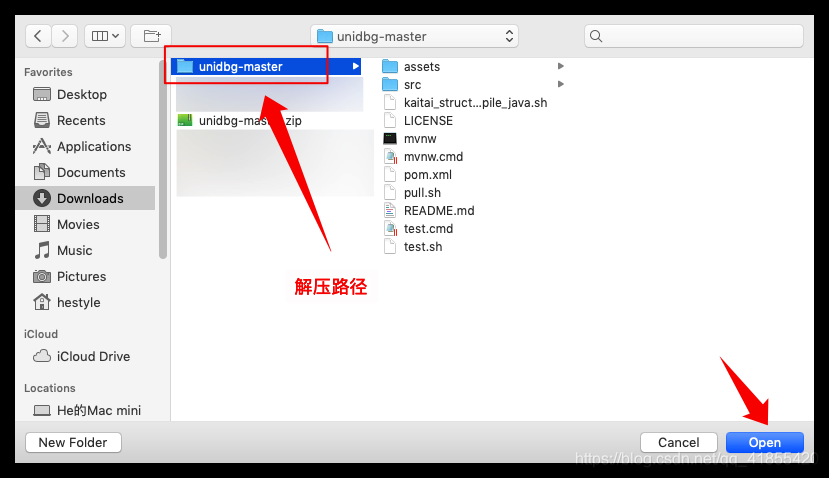](https://cdn.jsdelivr.net/gh/songjianzaina/SavePicGoPic/img/20201027142632.png)
[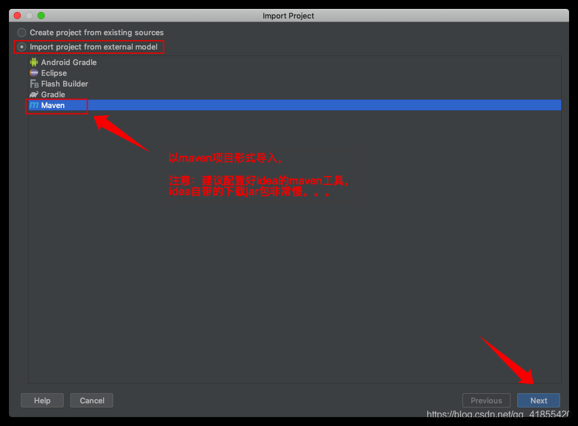](https://cdn.jsdelivr.net/gh/songjianzaina/SavePicGoPic/img/20201027141655.png)
  后面一路无脑`next`即可。。。
[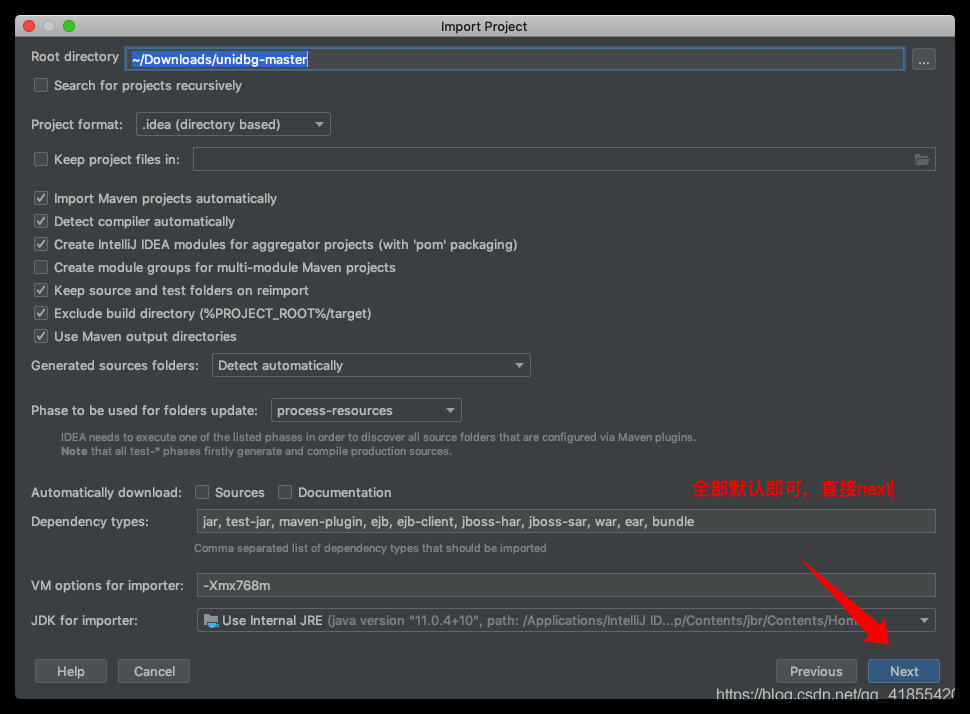](https://cdn.jsdelivr.net/gh/songjianzaina/SavePicGoPic/img/20201027141641.png)
[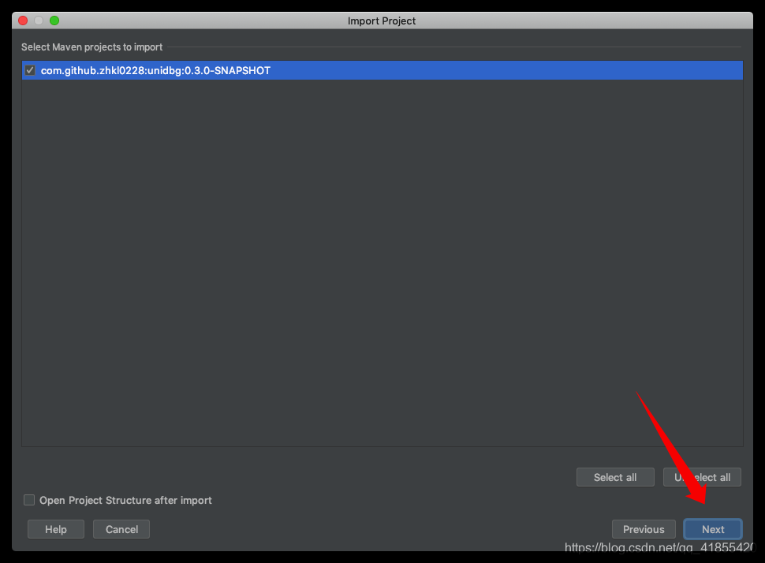](https://cdn.jsdelivr.net/gh/songjianzaina/SavePicGoPic/img/20201027141629.png)
[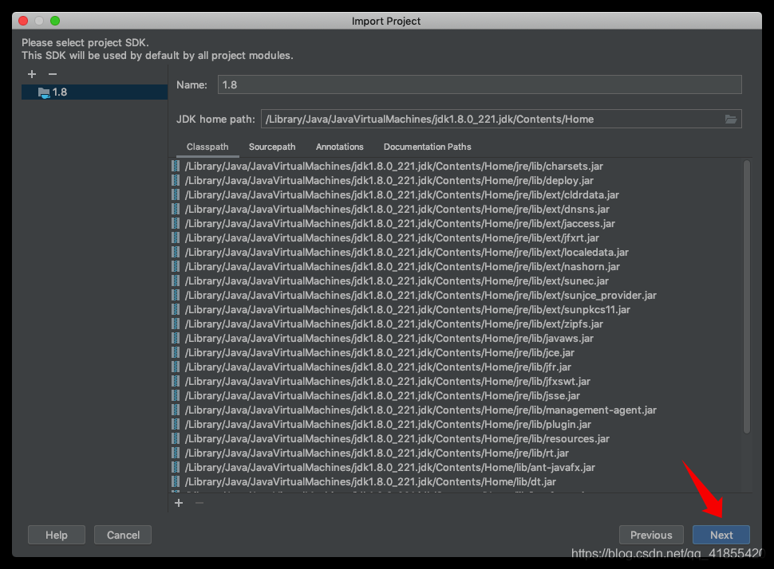](https://cdn.jsdelivr.net/gh/songjianzaina/SavePicGoPic/img/20201027141613.png)
[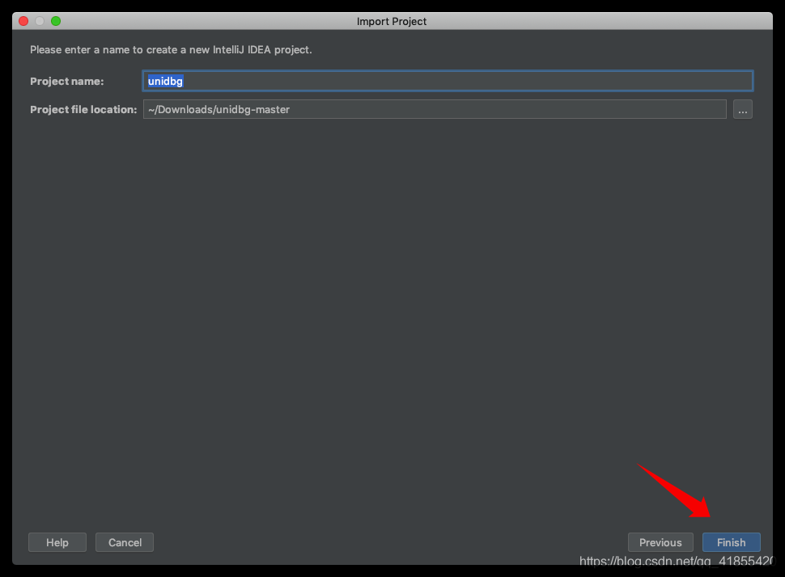](https://cdn.jsdelivr.net/gh/songjianzaina/SavePicGoPic/img/20201027141556.png)
  第一次导入此项目会自动下载一些`jar`包，和网速、`maven`服务器有关，耐心等待吧。
[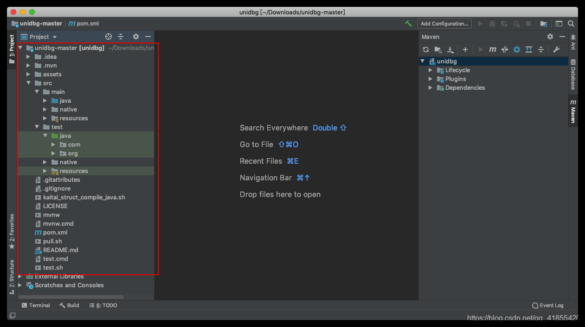](https://cdn.jsdelivr.net/gh/songjianzaina/SavePicGoPic/img/20201027141534.png)

## 3、测试`unidbg`

  项目中的`src/test/java/com/xxxx/frameworks/core/encrypt`路径中有一个`TTEncrypt`测试用例，直接执行其中的`main`方法。
[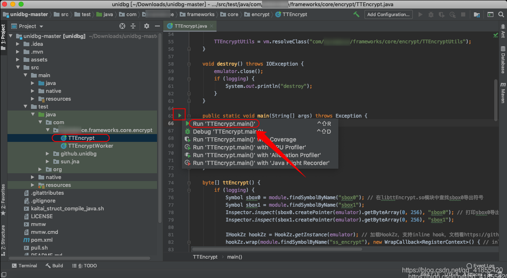](https://cdn.jsdelivr.net/gh/songjianzaina/SavePicGoPic/img/20201027141521.png)

  控制台打印相关调用信息，说明项目导入成功。
[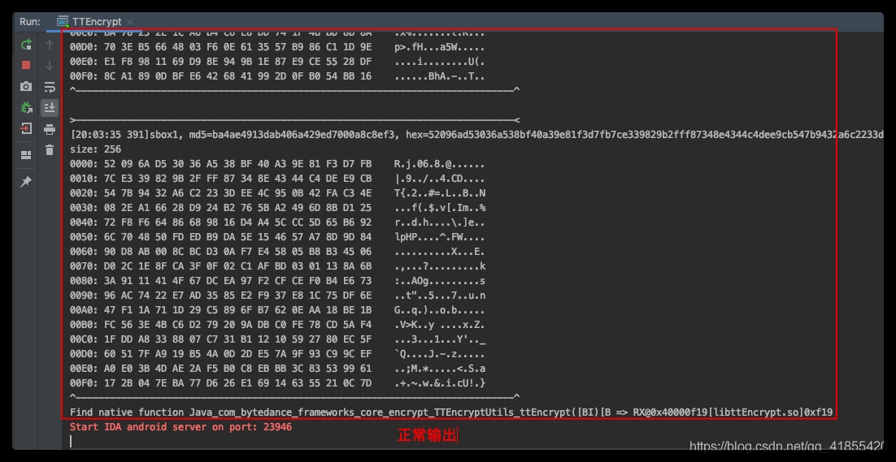](https://cdn.jsdelivr.net/gh/songjianzaina/SavePicGoPic/img/20201027141507.png)

## 4、运行自己的`so`文件

  在前面，我们不是遇到了`libbaseEncryptLib.so`、`libencryptLib.so`文件么，利用`unidbg`直接调用`so`文件中 的方法。下面演示调用`libencryptLib.so`文件中的`getGameKey`函数。

### ①、编写`EncryptUtilsJni`类

```
package cn.hestyle;

import com.github.unidbg.Module;
import com.github.unidbg.arm.ARMEmulator;
import com.github.unidbg.linux.android.AndroidARMEmulator;
import com.github.unidbg.linux.android.AndroidResolver;
import com.github.unidbg.linux.android.dvm.*;
import com.github.unidbg.memory.Memory;


import java.io.File;
import java.io.IOException;

/**
 * description: EncryptUtils调用so
 *
 * @author hestyle
 * @version 1.0
 * @className unidbg->EncryptUtilsJni
 * @date 2020-05-20 22:01
 **/
public class EncryptUtilsJni extends AbstractJni {
    // ARM模拟器
    private final ARMEmulator emulator;
    // vm
    private final VM vm;
    // 载入的模块
    private final Module module;

    private final DvmClass TTEncryptUtils;

    /**
     *
     * @param soFilePath   需要执行的so文件路径
     * @param classPath    需要执行的函数所在的Java类路径
     * @throws IOException
     */
    public EncryptUtilsJni(String soFilePath, String classPath) throws IOException {
        // 创建app进程，包名可任意写
        emulator = new AndroidARMEmulator("cn.hestyle");
        Memory memory = emulator.getMemory();
        // 作者支持19和23两个sdk
        memory.setLibraryResolver(new AndroidResolver(23));
        // 创建DalvikVM，利用apk本身，可以为null
        vm = ((AndroidARMEmulator) emulator).createDalvikVM(null);
        // （关键处1）加载so，填写so的文件路径
        DalvikModule dm = vm.loadLibrary(new File(soFilePath), false);
        // 调用jni
        dm.callJNI_OnLoad(emulator);
        module = dm.getModule();
        // （关键处2）加载so文件中的哪个类，填写完整的类路径
        TTEncryptUtils = vm.resolveClass(classPath);
    }

    /**
     * 调用so文件中的指定函数
     * @param methodSign 传入你要执行的函数信息，需要完整的smali语法格式的函数签名
     * @param args       是即将调用的函数需要的参数
     * @return 函数调用结果
     */
    private String myJni(String methodSign, Object ...args) {
        // 使用jni调用传入的函数签名对应的方法（）
        Number ret = TTEncryptUtils.callStaticJniMethod(emulator, methodSign, args);
        // ret存放返回调用结果存放的地址，获得函数执行后返回值
        StringObject str = vm.getObject(ret.intValue() & 0xffffffffL);
        return str.getValue();
    }

    /**
     * 关闭模拟器
     * @throws IOException
     */
    private void destroy() throws IOException {
        emulator.close();
        System.out.println("emulator destroy...");
    }

    public static void main(String[] args) throws IOException {
        // 1、需要调用的so文件所在路径
        String soFilePath = "src/test/resources/myso/libencryptLib.so";
        // 2、需要调用函数所在的Java类完整路径，比如a/b/c/d等等，注意需要用/代替.
        String classPath = "com/.../EncryptUtils";
        // 3、需要调用函数的函数签名，我这里调用EncryptUtils中的getGameKey方法，由于此方法没有参数列表，所以不需要传入
        String methodSign = "getGameKey()Ljava/lang/String;";

        EncryptUtilsJni encryptUtilsJni = new EncryptUtilsJni(soFilePath, classPath);
        // 输出getGameKey方法调用结果
        System.err.println(encryptUtilsJni.myJni(methodSign));
        encryptUtilsJni.destroy();
    }
}
123456789101112131415161718192021222324252627282930313233343536373839404142434445464748495051525354555657585960616263646566676869707172737475767778798081828384858687888990
```

### ②、参数说明

  `EncryptUtilsJni`类中最重要的设置为`main`方法中的`soFilePath`、`classPath`、`methodSign`三个参数，它们的作用在main方法中已经注释过了，这里再次解释一下。

`soFilePath`，填写你需要调用的so文件路径
`classPath`，填写你需要调用的函数所在Java类的完整类路径。
[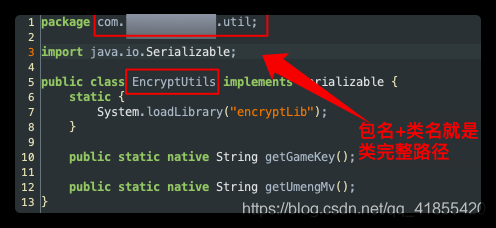](https://cdn.jsdelivr.net/gh/songjianzaina/SavePicGoPic/img/20201027141448.png)
`methodSign`，填写你要调用的函数签名，语法为smali。（在`jadx`中，直接可以看`smali`代码）


[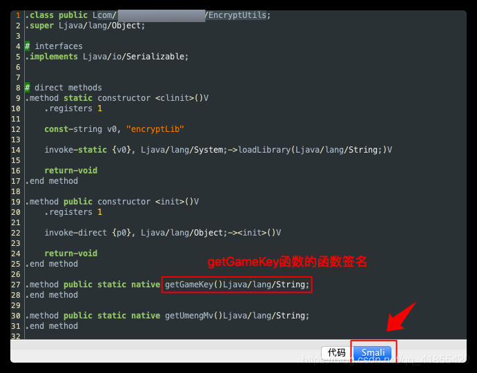](https://cdn.jsdelivr.net/gh/songjianzaina/SavePicGoPic/img/20201027141434.png)
备 注 : \color{red}备注:备注:如果你要调用的函数还需要传入参数，直接传入`myJni`方法中即可，`myJni`方法中省略`args`参数就是供你传入参数。

### ③、执行结果

[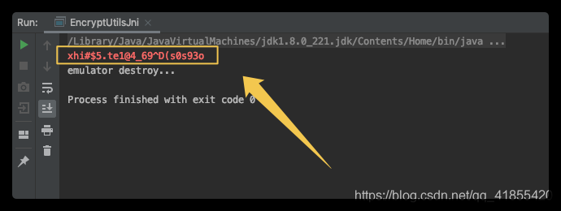](https://cdn.jsdelivr.net/gh/songjianzaina/SavePicGoPic/img/20201027141422.png)

# 四、分析`so`文件的`IDA`工具

  `IDA`工具是反汇编`so`文件的强大工具，由于`libencryptLib.so`文件比较简单，并且`getGameKey`函数返回的是一个常量，并没有复杂的处理过程，所以可以直接查看。

  首先用`IDA`打开`libencryptLib.so`文件
[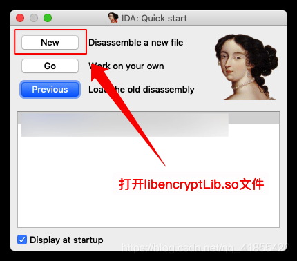](https://cdn.jsdelivr.net/gh/songjianzaina/SavePicGoPic/img/20201027141409.png)
[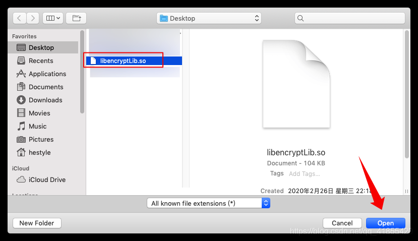](https://cdn.jsdelivr.net/gh/songjianzaina/SavePicGoPic/img/20201027141356.png)
[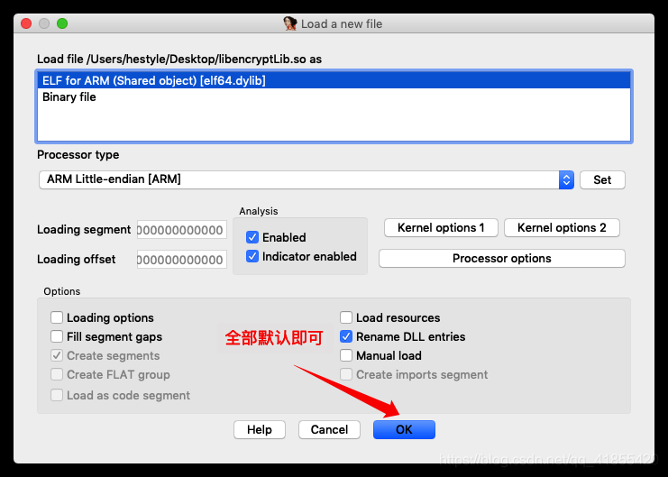](https://cdn.jsdelivr.net/gh/songjianzaina/SavePicGoPic/img/20201027141341.png)
  查看反汇编得到的代码。
[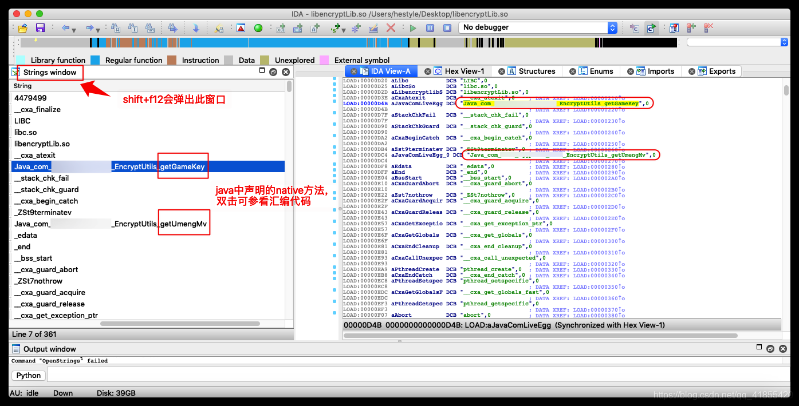](https://cdn.jsdelivr.net/gh/songjianzaina/SavePicGoPic/img/20201027141326.png)
[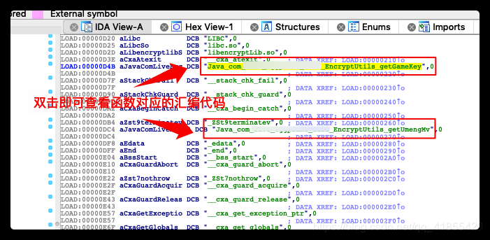](https://cdn.jsdelivr.net/gh/songjianzaina/SavePicGoPic/img/20201027141309.png)
[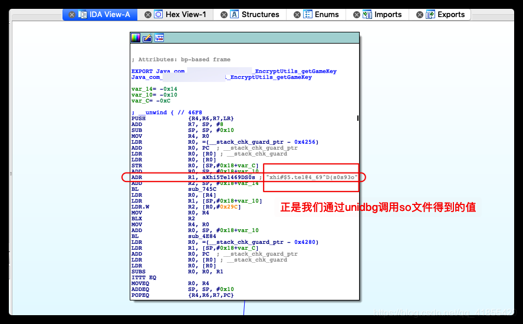](https://cdn.jsdelivr.net/gh/songjianzaina/SavePicGoPic/img/20201027141242.png)

# 五、总结

  `unidbg`确实很强大，直接在`pc`端模拟调用`so`文件，省去了反汇编逆向`so`文件的麻烦。上面的教程只演示了`unidbg`项目的导入、封装自己的调用`so`文件的`API`，其实这只是入门了，`unidbg`还支持断点调试`so`文件，也能导入到`IDA`中进行动态调试