# Radare2从入门到放弃

url：https://xz.aliyun.com/t/7265


## 0x00 前言

之前一直使用IDA、OD、x64dbg，没接触过Radare2，故有此次学习之旅。本文仅介绍Radare2框架及radare2基础操作，后续将以radare2实操为主。

## 0x01 环境&&安装

- 环境：Ubuntu 18.04 LTS(内核版本:5.0.0-23-generic)
- 安装详见[Github](https://github.com/radareorg/radare2#install--update)/[官网](https://rada.re/n/)

## 0x02 Radare2框架概述

若想了解更多，见[Radare2 Book](https://radare.gitbooks.io/radare2book/content/).

#### 0x02.1 rabin2

从各种可执行文件(e.g.:ELF、PE、Java Class...)中获取基本信息。

[](https://xzfile.aliyuncs.com/media/upload/picture/20200220194843-f1d07dcc-53d6-1.png)

#### 0x02.2 rasm2

支持多种架构(包括但不限于Intel x86及x86-64、 MIPS、 ARM、 PowerPC、Java)的汇编以及反汇编。`rasm2`各项参数如下：

[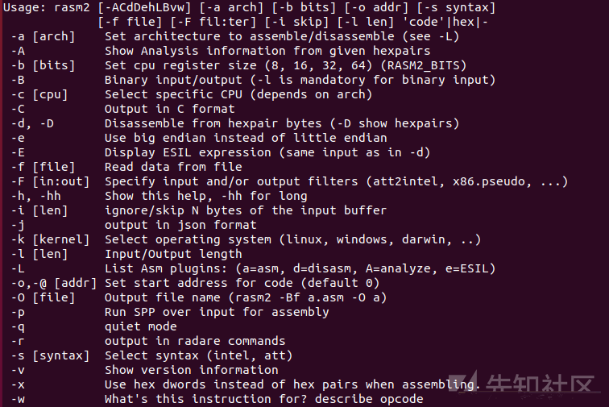](https://xzfile.aliyuncs.com/media/upload/picture/20200220194845-f2e26b26-53d6-1.png)

使用示例：

[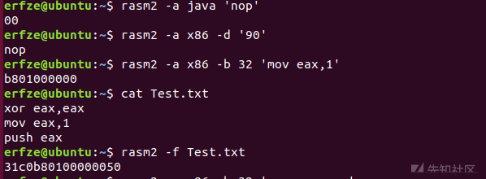](https://xzfile.aliyuncs.com/media/upload/picture/20200220194846-f3dfb420-53d6-1.png)

#### 0x02.3 rahash2

支持多种哈希算法(包括但不限于MD4、 MD5、 CRC16、CRC32、 SHA1、SHA256)的哈希值计算工具。使用示例：

[](https://xzfile.aliyuncs.com/media/upload/picture/20200220194848-f4d8b994-53d6-1.png)

#### 0x02.4 radiff2

比较二进制文件之间的不同。使用示例：


每行中间是数据变化，两端是位置。

#### 0x02.5 rafind2

于文件中查找指定内容。`rafind2`各项参数如下：

[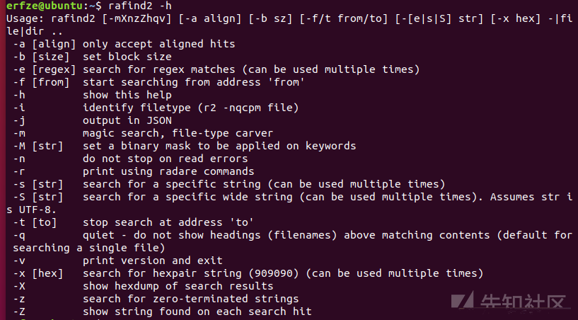](https://xzfile.aliyuncs.com/media/upload/picture/20200220194852-f761a3d8-53d6-1.png)

使用示例：

[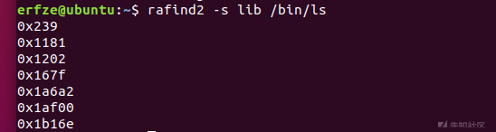](https://xzfile.aliyuncs.com/media/upload/picture/20200220194854-f838180a-53d6-1.png)

#### 0x02.6 ragg2

Radare2自行实现的高级语言编译器，默认语言是`ragg2`，但可以通过`.c`后缀实现C程序编译，示例如下：

[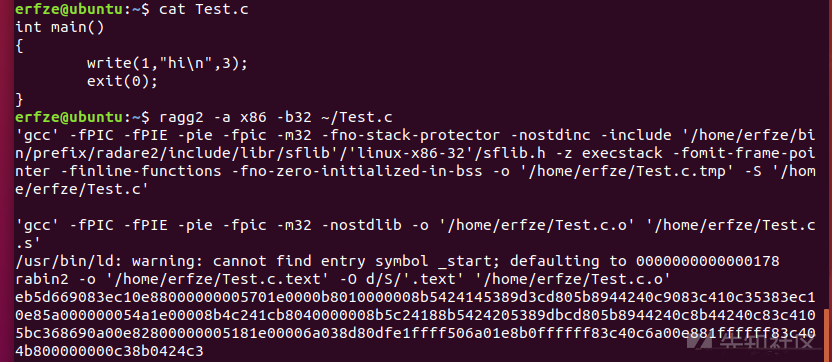](https://xzfile.aliyuncs.com/media/upload/picture/20200220194856-f9819f88-53d6-1.png)

编译`.r`后缀(`ragg2`语言)：

[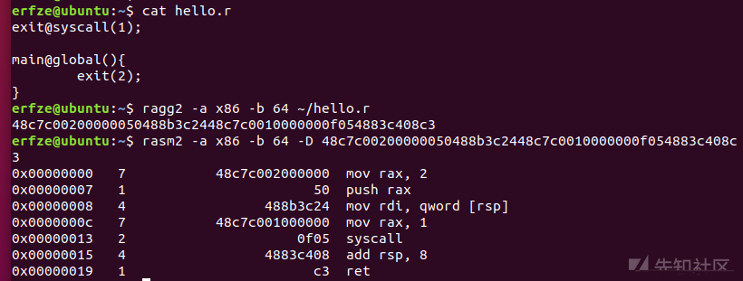](https://xzfile.aliyuncs.com/media/upload/picture/20200220194857-fa87ac1a-53d6-1.png)

#### 0x02.7 rarun2

通过`.rr`文件为程序执行设定环境(e.g.:重定义`stdin/stdout`、改变环境变量...)，`.rr`文件简单示例如下：

```
program=/bin/ls
arg1=/bin
# arg2=hello
# arg3="hello\nworld"
# arg4=:048490184058104849
# arg5=:!ragg2 -p n50 -d 10:0x8048123
# arg6=@arg.txt
# arg7=@300@ABCD # 300 chars filled with ABCD pattern
# system=r2 -
# aslr=no
setenv=FOO=BAR
# unsetenv=FOO
# clearenv=true
# envfile=environ.txt
timeout=3
# timeoutsig=SIGTERM # or 15
# connect=localhost:8080
# listen=8080
# pty=false
# fork=true
# bits=32
# pid=0
# pidfile=/tmp/foo.pid
# #sleep=0
# #maxfd=0
# #execve=false
# #maxproc=0
# #maxstack=0
# #core=false
# #stdio=blah.txt
# #stderr=foo.txt
# stdout=foo.txt
# stdin=input.txt # or !program to redirect input from another program
# input=input.txt
# chdir=/
# chroot=/mnt/chroot
# libpath=$PWD:/tmp/lib
# r2preload=yes
# preload=/lib/libfoo.so
# setuid=2000
# seteuid=2000
# setgid=2001
# setegid=2001
# nice=5
```

下面示例相当于`ls /bin`(没有颜色是因为`bashrc`文件中`alias`命令所致)：

[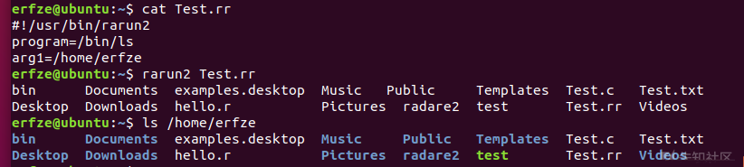](https://xzfile.aliyuncs.com/media/upload/picture/20200220194859-fb905800-53d6-1.png)

#### 0x02.8 rax2

综合进制/浮点数/ASCII码转换，输出ASCII表等功能，小巧实用。各项参数说明如下：

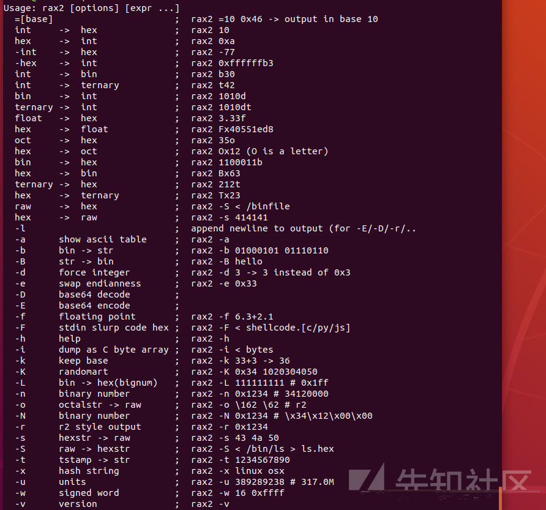


示例如下：

[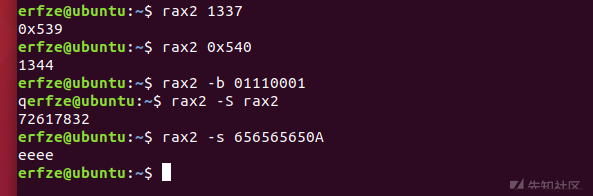](https://xzfile.aliyuncs.com/media/upload/picture/20200220194903-fdd546f2-53d6-1.png)

#### 0x02.9 radare2

整合上述所有功能，下文详述。

## 0x03 radare2

通过XCTF平台上的一道题目来说明`radare2`基本功能。[下载地址](https://adworld.xctf.org.cn/media/task/attachments/b5c583c7d2664a4da42ef2d790732f09.exe)。

------

使用`rabin2 -I`获取其信息(`rabin2`其他功能可通过`-h`参数自行查阅，不再赘述)：

[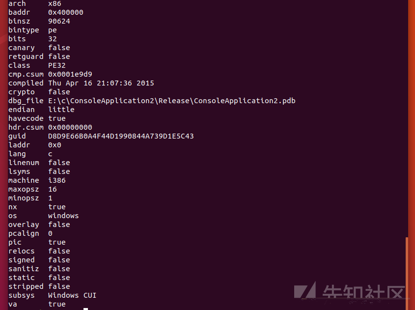](https://xzfile.aliyuncs.com/media/upload/picture/20200220194905-fef8c04a-53d6-1.png)

亦可使用`rabin2 -Ir`命令：

[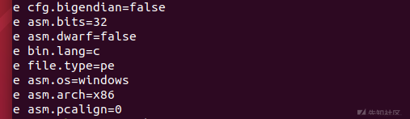](https://xzfile.aliyuncs.com/media/upload/picture/20200220194906-ffc85e2c-53d6-1.png)

------

`r2 Filename`启动`radare2`：

[](https://xzfile.aliyuncs.com/media/upload/picture/20200220194908-00852002-53d7-1.png)

命令交互界面类似gdb，左端`[]`内是当前所处位置，即entrypoint地址。

#### 0x03.1 `i`/`a`/`f`/`s`系列命令

- `i`系列命令用于获取信息，可通过`i?`查看(不用专门去记忆，方便快捷)：

[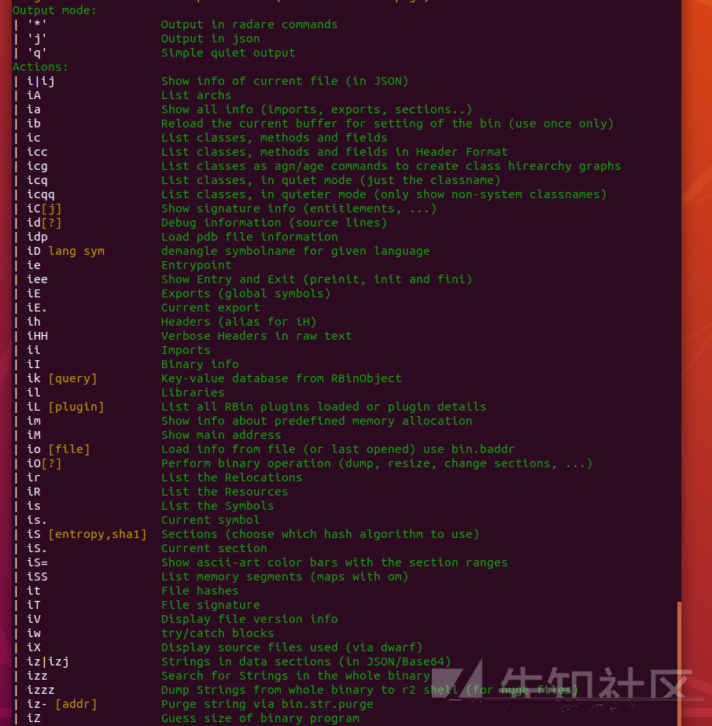](https://xzfile.aliyuncs.com/media/upload/picture/20200220194910-01b60504-53d7-1.png)

- `a`系列命令用于分析当前程序(`radare2`不会自动分析，原因见[radareorg](https://radareorg.github.io/blog/posts/analysis-by-default/))，可通过`a?`查看该系列命令，`aaa`命令并不推荐使用(下图绿色区域是此命令功能，黄色方框内是此命令执行的操作)：

  

  因为执行`aaa`命令是一项繁重的任务，在面对体积不大的程序时可以选择使用`aaa`。但如果程序体积庞大，则要按需进行分析(e.g.:`aac`、`aap`、`aas`...)。

- `f`系列命令与`flagspace`相关。`radare2`分析完后，会建立诸多`offset-flag`(`offset`可以是`class[类]`、 `function[函数]` 、 `string[字符串]`... )，`flags`是相同`offset`(即`offsets`)的集合，名其为`flagspace`；`flagspaces`是`flagspace`的集合。关系如下所示：

  [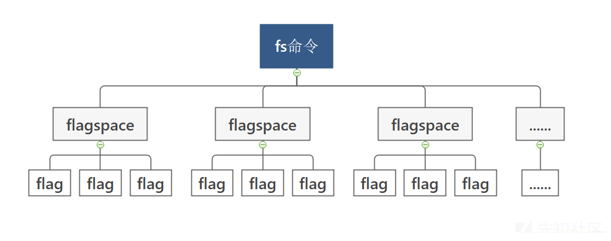](https://xzfile.aliyuncs.com/media/upload/picture/20200220194914-04356522-53d7-1.png)

  可使用`fs`命令查看`flagspaces`：

  [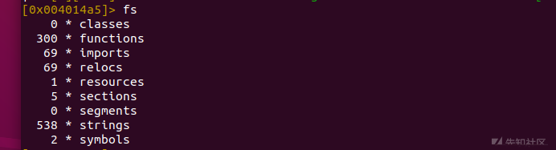](https://xzfile.aliyuncs.com/media/upload/picture/20200220194915-04fe5734-53d7-1.png)

  `fs flagspace_name`命令可选择`flagspace`，之后`f`命令会显示选中`flagspace`内`flags`：

  [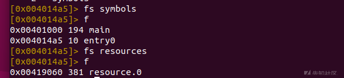](https://xzfile.aliyuncs.com/media/upload/picture/20200220194916-05d6d6f4-53d7-1.png)

- `s`系列命令用于快速定位，`s?`查阅：

  [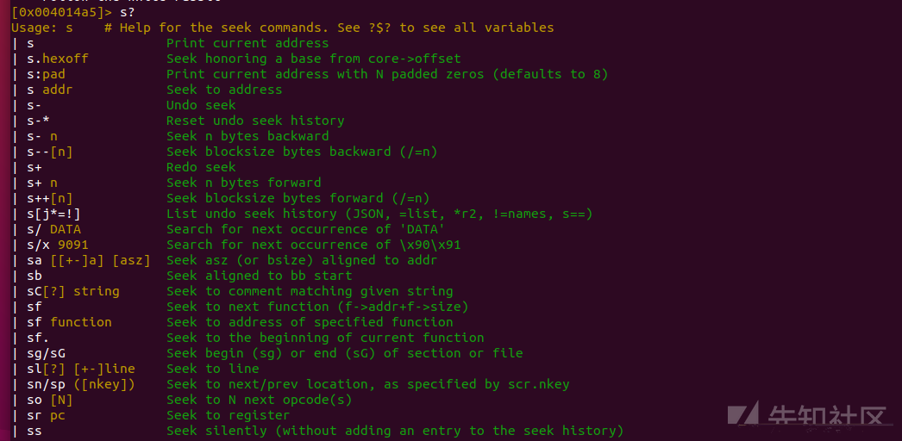](https://xzfile.aliyuncs.com/media/upload/picture/20200220194919-07407f9a-53d7-1.png)

#### 0x03.2 Strings

- 查看字符串

  使用`iz`/`izz`(二者区别可通过`iz?`查阅)：

  [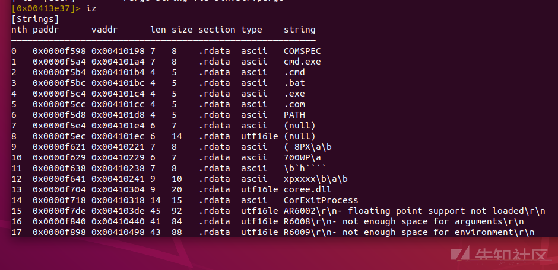](https://xzfile.aliyuncs.com/media/upload/picture/20200220194921-0850262e-53d7-1.png)

  困扰在于字符串过多，如需定位特定字符串，见下。

- 查找字符串

  1. 通过`s addr`或者其他定位命令定位到指定位置

  2. `s/ DATA`向下查找'DATA'第一次出现位置并定位于此

  3. `ps`(C语言中字符串以`\0`结尾，故用`psz`命令)显示字符串

     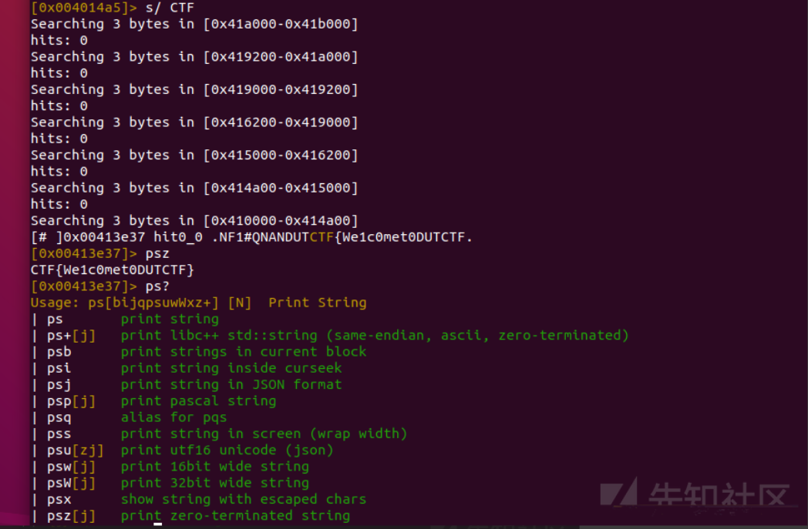

     到此，该题目已解决，Flag如上。

#### 0x03.3 Refs/Xrefs

`ax`系列命令用于查看数据/代码间相互调用关系，`ax?`查阅：

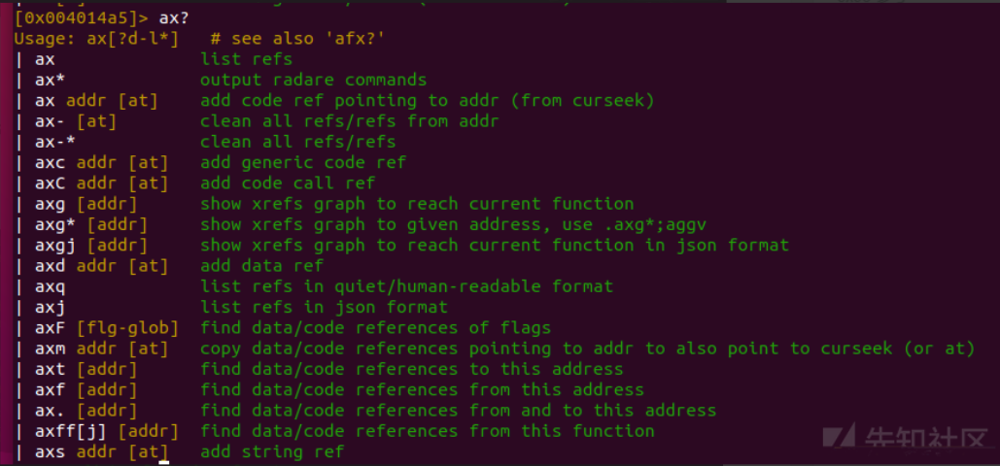

#### 0x03.4 `@@`系列

`@@`与命令搭配使用，效果极佳。`@@?`查阅：

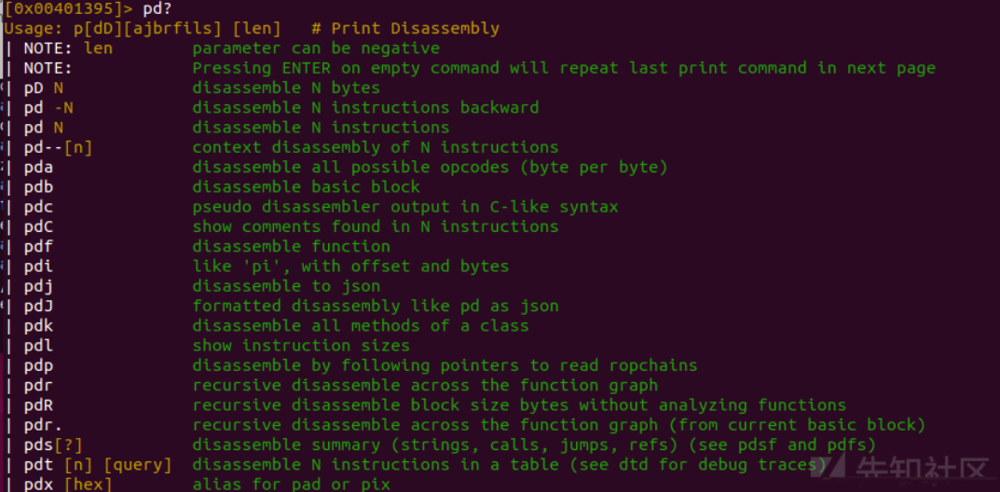

笼统概括其功能：对于每一匹配项执行某命令。注意：使用`x @@ sym.*`命令前应确定当前`flagspace`是否正确，通配符`sym.*`中的`str.`可通过`f`命令确定。

#### 0x03.5 Function

- 查看所有函数

  查看所有函数使用`afl`系列命令。可通过`afl?`查阅，这里不一一列举，以下常用：

  1. `afl`:查看函数列表

  2. `afl.`:查看当前所处位置的函数

  3. `aflt`:以表格形式列出函数

  4. `afls`:以地址或名字或大小给函数列表排序(但不输出)

     [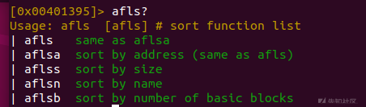](https://xzfile.aliyuncs.com/media/upload/picture/20200220194927-0c5dddce-53d7-1.png)

- 反汇编某一函数

  `pd`系列命令功能是反汇编并显示，`pd?`查阅：

  [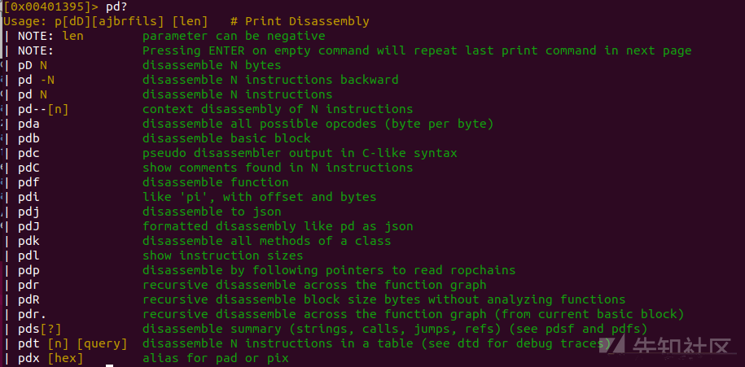](https://xzfile.aliyuncs.com/media/upload/picture/20200220194929-0d6b1b46-53d7-1.png)

  可以指自行指定字节(`len`可正亦可负)反汇编并显示，亦能够根据分析反汇编某一具体函数并显示。示例如下：

  1. `aaa`分析程序并自动命名函数

  2. `afl`查看函数列表

  3. `s Function_Name`定位到`Function_Name`函数的起始位置(`Function_Name`通过上一步骤得知)

  4. `pdf`反汇编该函数并显示结果(步骤3,4可以整合为一条命令`pdf @Function_Name`,因为`@ 0`等同于`s 0`)

     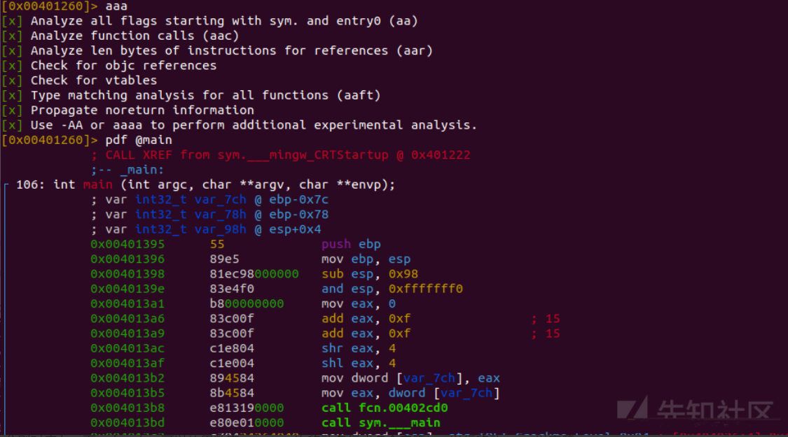

- 反编译某一函数

  `pdc`用于反编译某一函数，类似IDA中F5键功能。

#### 0x03.6 Visual Mode

命令行模式下输入`V`进入`radare2`的视图模式，视图模式下`q`键即可退出。视图模式下的操作如下：

1. `HJKL`分别对应左、下、上、右，可以使用数字+`HJKL`一次移动多行或多个字符(`JK`以行移动，`HL`以字符移动)

2. 视图模式下`p`键可以切换不同面板，顺序(前三个常用)：

   > **Hex** -> **Disassembly** → **Debug** → **Words** → **Buf**

3. `g`键用于定位。弹出`[offset]>`后，输入函数名称可定位到该函数；定位`flag`时可在输入部分之后通过Tab键进行选择，如下所示：

   [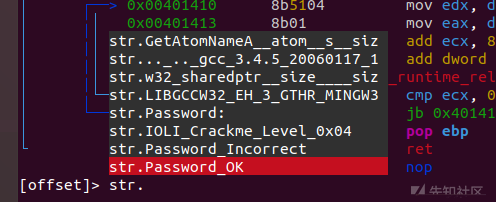](https://xzfile.aliyuncs.com/media/upload/picture/20200220194932-0f570582-53d7-1.png)

4. `[0-9]`键用于跟踪某一跳转或调用，下图情形下`3`键可定位到`printf()`函数，`u`键回到之前位置，`U`键用于重复此次定位：

   [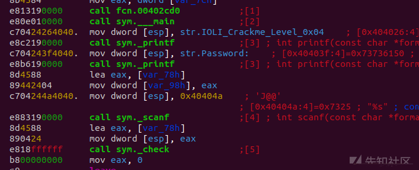](https://xzfile.aliyuncs.com/media/upload/picture/20200220194934-1091e020-53d7-1.png)

5. `d`键用于改变当前位置的数据类型，类似于IDA中`d`键功能，但比其强大。

6. `c`键进入光标模式。选中字节会高亮显示，选择多个字节使用`Shift`+`HJKL`；该模式下`f`键用于为某一位置自定义一`flag`，方便定位：

   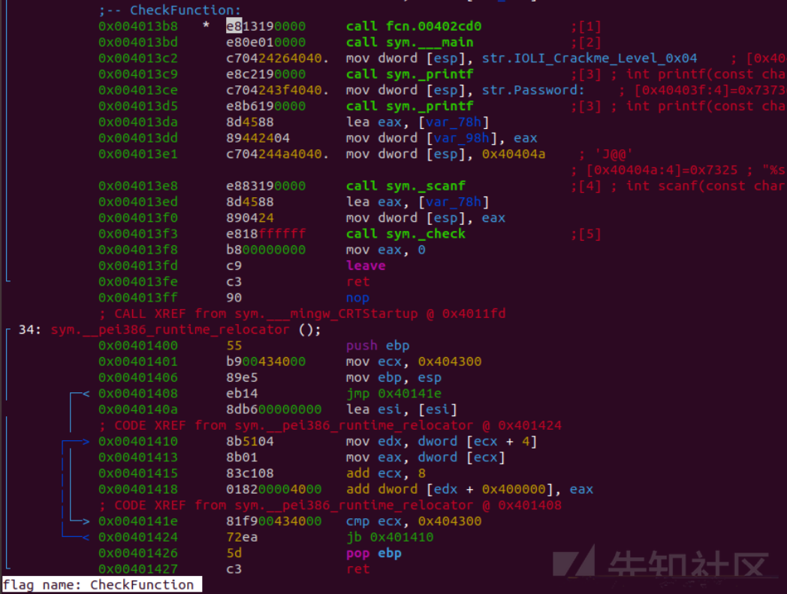

7. `i`键用于修改选定数据(前提是打开文件时使用`-w`参数，否则文件是只读状态，无法修改)

8. `A`键用于在修改时提供实时预览：

   [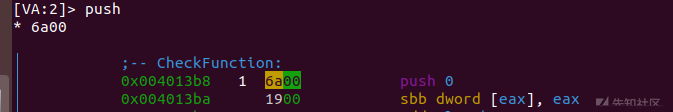](https://xzfile.aliyuncs.com/media/upload/picture/20200220194938-12cc468c-53d7-1.png)

9. `:`用于键入命令

10. `;`键用于添加注释

11. `/`键用于高亮指定字符串：

    

> 注：`!`键进入**Visual Panels**，详见[Radare2 Book](https://radare.gitbooks.io/radare2book/content/visual_mode/visual_panels.html)。`V`键进入**Visual Graphs**(类似于IDA的图形化模式)。

#### 0x03.7 Debugger

打开时使用`-d`参数进入Debugger模式，常用命令：

- `db flag/address/function name`: 设置断点
- `db - flag/address/function name`: 删除断点
- `db`: 列出所有断点
- `dc`:运行程序
- `dcu address`:运行程序直到某一处为止
- `dr`: 显示寄存器状态
- `ds`: 单步步进(等同于OD中F7)
- `dso`: 单步步过(等同于OD中F8)
- `dm`: 显示内存
- `ood`:重新以Debugger模式打开程序(类似OD中Ctrl+F2，但该命令只打开不运行)
- `ood arg1 arg2`: 带参数重新打开

## 0x04 rahash2

`rahash2`虽然只是Radare2框架的一部分，但因其功能强大可以单独拿出来作为加解密工具使用。其常用功能如下(更多功能请通过`rahash2 -h`自行探索)：

1. 其支持算法可通过`rahash2 -L`查阅，算法种类已经可以满足大多需求：

   

2. `-a`参数用于指定算法，如果后面是`all`，则会列出所有哈希算法的结果

3. `-E`与`-D`分别对应加密与解密，其后通过`-S`指定Key，`-I`指定初始化向量(IV)

4. `-f`与`-t`用于指定起始与结束地址

5. `-s`用于将其后字符串作为明文

------

使用示例如下：

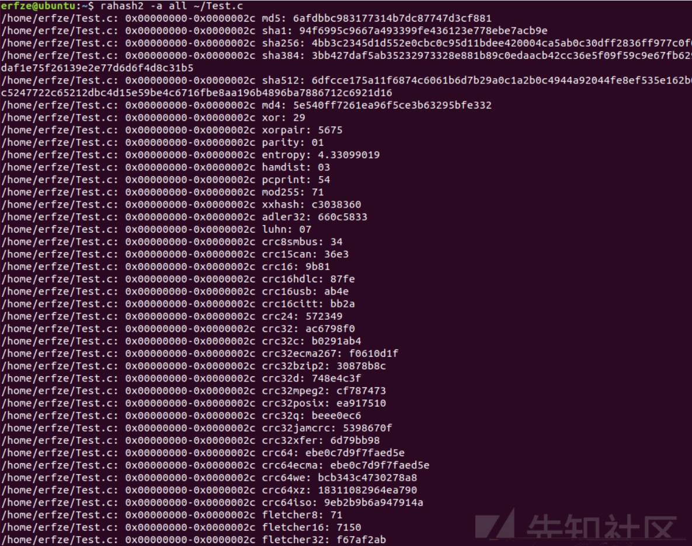

[](https://xzfile.aliyuncs.com/media/upload/picture/20200220194946-17af84a2-53d7-1.png)

## 0x05 总结

Radare2不应该只是IDA在Linux平台上的替代品而已，其中某些功能是Radare2所独有的，熟悉Radare2的使用将使得进行逆向分析时事半功倍。附一张对比表：[IDA Pro、radare2、GDB、WinDgb](https://radare.gitbooks.io/radare2book/content/debugger/migration.html#shortcuts).

## 0x06 参考

- [Megabeets](https://www.megabeets.net/a-journey-into-radare-2-part-1/)
- [Radre2 Book](https://radare.gitbooks.io/radare2book/content/)