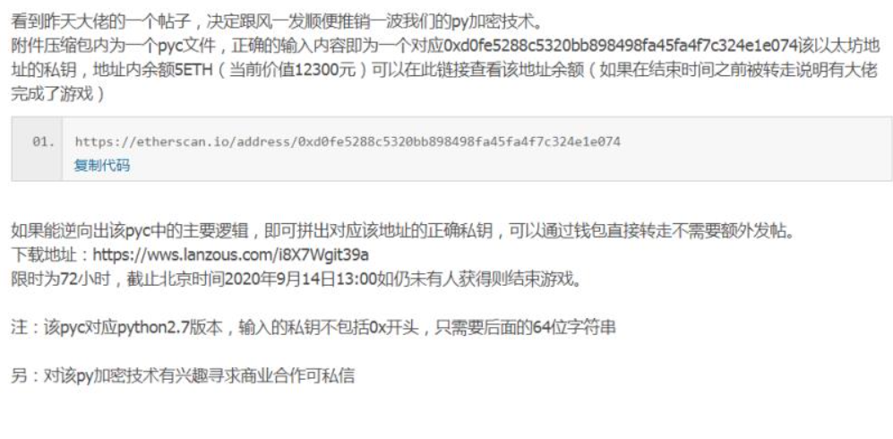
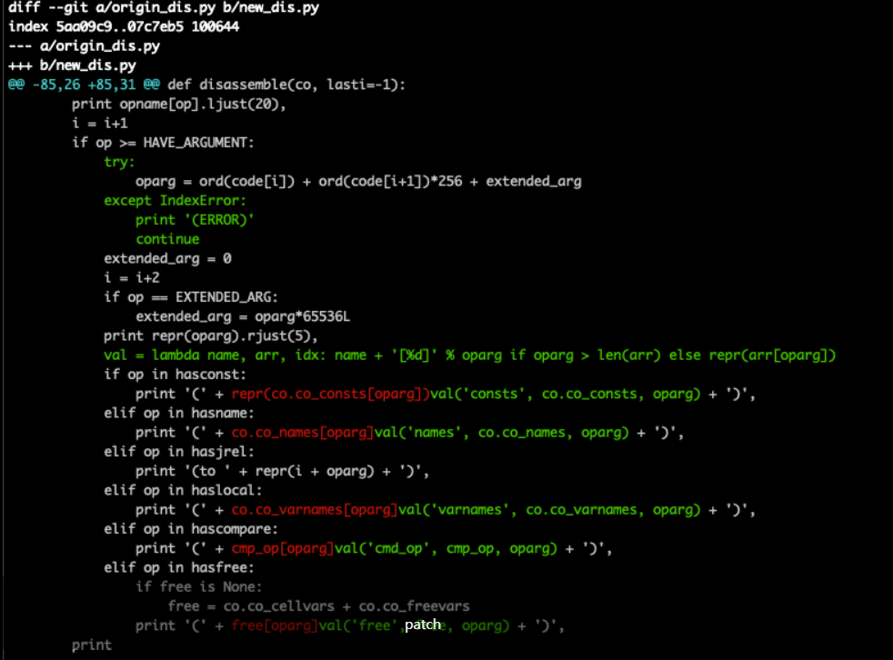
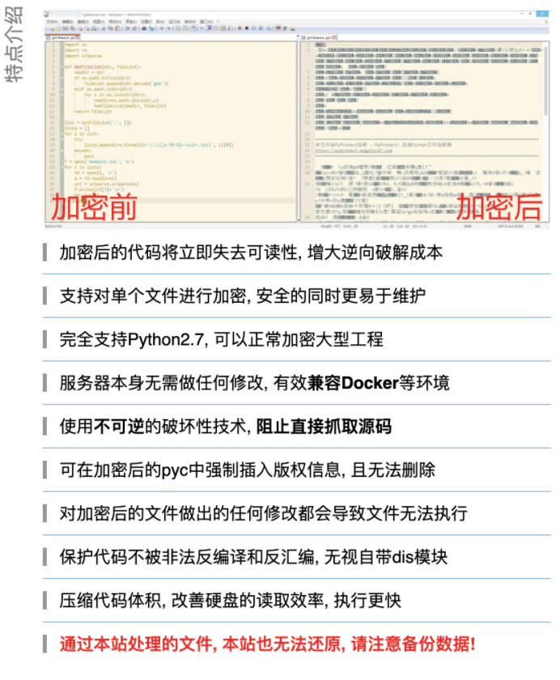
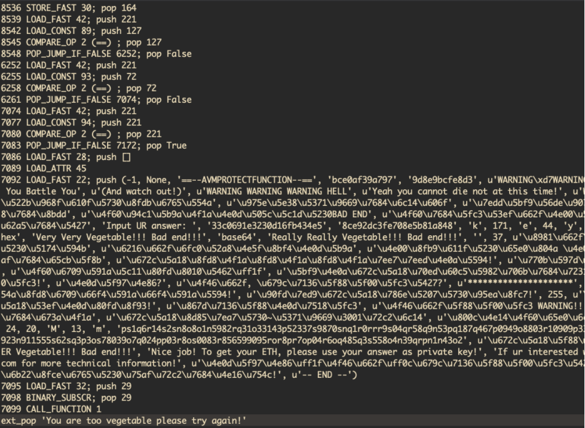

# 如何破解一个Python虚拟机壳并拿走12300元ETH

url：https://evilpan.com/2020/10/11/protected-python/#top


之前在群里看到有人发了一个挑战，号称将 5 ETH 的私钥放在了加密的代码中，只要有人能解密就可以取走，所以我又管不住自己这双手了。

# 前言

某天在群里看到一个大佬看到另一个大佬的帖子而发的帖子的截图，如下所示:




不过当我看到的时候已经过去了大概720小时🙂 在查看该以太币交易记录的时候，发现在充值之后十几小时就被提走了，可能是其他大佬也可能是作者自己。虽然没钱可偷，但幸运的是 pyc 的下载地址依然有效，所以我就下载下来研究了一下。

# 初步分析

首先在专用的实验虚拟机里运行一下，程序执行没有问题:

```
$ python2 ether_v2.pyc Input UR answer: whatever You are too vegetable please try again! 
```

然后看看文件里是否有对应的字符串信息:

```
$ grep vegetable ether_v2.pyc 
```

很好，屁都没有，看来字符串也混淆了。

目前市面上有一些开源的 pyc 还原工具，比如:

- [uncompyle6](https://github.com/rocky/python-uncompyle6)
- [pycdc](https://github.com/zrax/pycdc)
- …

但是看作者的自信，应该是有信心可以抗住的，事实证明也确实可以。

# Python 反汇编

既然没有现成工具能用，那么我们就需要通过自己的方法来对代码逻辑进行还原。要分析代码逻辑第一步至少要把字节码还原出来，使用 dis 模块可以实现:

```
import dis
import marshal
with open('ether_v2.pyc', 'rb') as f:
	magic = f.read(4)
	timestamp = f.read(4)
	code = marshal.load(f)
	dis.disassemble(code)

```

`.pyc`文件本身是字节码的`marshal`序列化格式，在 Python2.7 中加上 8 字节的 pyc 头信息。一般通过上面的代码即可打印出文件中的字节码信息。当然，这个事情并不一般:

```
$ python2 try1.py
Traceback (most recent call last):
  File "try1.py", line 9, in <module>
    dis.disassemble(code)
  File "/usr/lib/python2.7/dis.py", line 64, in disassemble
    labels = findlabels(code)
  File "/usr/lib/python2.7/dis.py", line 166, in findlabels
    oparg = ord(code[i]) + ord(code[i+1])*256
IndexError: string index out of range

```

在 dis 模块中直接异常退出了，有点意思。查看 dis 的源码，查看出错的部分，发现在 `co.co_code`、 `co.co_names`、 `co.co_consts`等多个地方都出现了下标溢出的`IndexError`。不管是什么原因，我们先把这些地方 patch 掉:





这回就能看到输出的 Python 字节码了，如下:

```
$ ./dec.py --pyc ether_v2.pyc
  3           0 JUMP_ABSOLUTE         2764
              3 LOAD_CONST           65535 (consts[65535])
              6 <218>                50673
              9 SET_ADD              18016
             12 IMPORT_NAME           8316 (names[8316])
             15 STOP_CODE           
             16 LOAD_CONST              33 (8)
             19 COMPARE_OP               2 ('==')
             22 POP_JUMP_IF_FALSE       99
             25 LOAD_FAST               28 ('/ * && ')
             28 LOAD_ATTR               45 ('append')
             31 LOAD_FAST                9 ('with ^ raise ')
             34 LOAD_FAST               44 ('with as  - 6 lambda ')
             37 COMPARE_OP               8 ('is')
             40 CALL_FUNCTION            1
             43 POP_TOP             
             44 JUMP_FORWARD          8559 (to 8606)
...

```

不过这些字节码的逻辑看起来很奇怪，看不出哪里奇怪不要紧，我们先来看看正常的 Python 字节码。

# Python ByteCode 101

Python 是一种解释型语言，而 Python 字节码是一种平台无关的中间代码，由 Python 虚拟机动态(PVM)解释执行，这也是 Python 程序可以跨平台的原因。

## 示例

看一个简单的例子`test.py`:

```
#!/usr/bin/env python2

def add(a, b):
    return a - b + 42

def main():
    b = add(3, 4)
    c = add(b, 5)
    result = 'evilpan: ' + str(c)
    print result

if __name__ == '__main__':
    main()

```

使用上面的反汇编程序打印出字节码如下:

```
$ ./dec.py --pyc test.pyc
  3           0 LOAD_CONST               0 (<code object add at 0x7f02ee26f5b0, file "test.py", line 3>)
              3 MAKE_FUNCTION            0
              6 STORE_NAME               0 ('add')

  6           9 LOAD_CONST               1 (<code object main at 0x7f02ee26ff30, file "test.py", line 6>)
             12 MAKE_FUNCTION            0
             15 STORE_NAME               1 ('main')

 12          18 LOAD_NAME                2 ('__name__')
             21 LOAD_CONST               2 ('__main__')
             24 COMPARE_OP               2 ('==')
             27 POP_JUMP_IF_FALSE       40

 13          30 LOAD_NAME                1 ('main')
             33 CALL_FUNCTION            0
             36 POP_TOP
             37 JUMP_FORWARD             0 (to 40)
        >>   40 LOAD_CONST               3 (None)
             43 RETURN_VALUE

```

能看懂英文的话，理解上面的代码应该也没有太大问题，不过值得注意的是有两个 `LOAD_CONST` 指令的参数本身也是代码，即`dis.disassemble`函数的参数，所以我们可以对其也进行反汇编:

```
dis.disassemble(code)
# ...
print("=== 0 ===")
dis.disassemble(code.co_consts[0])
print("=== 1 ===")
dis.disassemble(code.co_consts[1])

```

结果如下:

```
=== 0 ===
  4           0 LOAD_FAST                0 ('a')
              3 LOAD_FAST                1 ('b')
              6 BINARY_SUBTRACT
              7 LOAD_CONST               1 (42)
             10 BINARY_ADD
             11 RETURN_VALUE
=== 1 ===
  7           0 LOAD_GLOBAL              0 ('add')
              3 LOAD_CONST               1 (3)
              6 LOAD_CONST               2 (4)
              9 CALL_FUNCTION            2
             12 STORE_FAST               0 ('b')

  8          15 LOAD_GLOBAL              0 ('add')
             18 LOAD_FAST                0 ('b')
             21 LOAD_CONST               3 (5)
             24 CALL_FUNCTION            2
             27 STORE_FAST               1 ('c')

  9          30 LOAD_CONST               4 ('evilpan: ')
             33 LOAD_GLOBAL              1 ('str')
             36 LOAD_FAST                1 ('c')
             39 CALL_FUNCTION            1
             42 BINARY_ADD
             43 STORE_FAST               2 ('result')

 10          46 LOAD_FAST                2 ('result')
             49 PRINT_ITEM
             50 PRINT_NEWLINE
             51 LOAD_CONST               0 (None)
             54 RETURN_VALUE

```

## 基本概念

上述打印的是 Python 字节码的伪代码，存储时还是二进制格式，这个在下一节说。上面的伪代码虽然大致能猜出意思， 但这并不是严谨的方法。实际上 Python 字节码在[官方文档](https://docs.python.org/2.7/library/dis.html)有比较详细的介绍，包括每个指令的含义以及参数。

> 注意: 字节码的实现和具体Python版本有关

对于常年进行二进制逆向的人而言，可以把 Python 字节码看做是一种特殊的指令集。对于一种指令集，我们实际上需要关心的是指令结构和调用约定。Python 虚拟机 PVM 是一种基于栈的虚拟机，参数也主要通过栈来进行传递，不过与传统 x86 的参数传递顺序相反，是从左到右进行传递的。

每条字节码由两部分组成:

```
opcode + oparg 
```

其中`opcde`占1字节，即PVM支持最多256个类型的指令；

`oparg`占的空间和`opcode`有关，如果`opcode`带参数，即`opcode > dis.HAVE_ARGUMENT`，则`oparg`占**2个字节**；通常`oparg`表示在对应属性中的索引，比如`LOAD_CONST`指令的`oparg`就表示参数在`co_consts`数组中的索引。

> 在Python3中oparg占1个字节，所以再次提醒: 字节码的解析和具体Python版本有关

数组元素的数量是可变的，2字节最多只能表示65536个元素，要是超过这个值怎么办？答案就是 `EXTENDED_ARG`。这是个特殊的`opcode`，值为`dis.EXTENDED_ARG`，遇到这个 opcode 则表示下一条指令的参数值 `next_oparg` 值需要进行拓展:

```
extented_arg = oparg * 65536
next_oparg = next_oparg + extended_arg

```

当然`EXTENDED_ARG`是可以级联的，从而支持任意大小的参数值。

## CodeType

要查看某个 Python 函数的字节码，比如:

```
def func(a):
  return a + 42

```

可以通过`func.__code__`获取。或者直接编译:

```
c = "a = 3; b = 4; c = a + b"
co = compile(c, "", "exec")

```

`func.__code__`和`co`都是下面的 CodeType 类型:

```
class CodeType:
    co_argcount: int
    co_cellvars: Tuple[str, ...]
    co_code: str
    co_consts: Tuple[Any, ...]
    co_filename: str
    co_firstlineno: int
    co_flags: int
    co_freevars: Tuple[str, ...]
    co_lnotab: str
    co_name: str
    co_names: Tuple[str, ...]
    co_nlocals: int
    co_stacksize: int
    co_varnames: Tuple[str, ...]

```

前面介绍的字节码，就是`co_code`中的内容。而字节码中的参数`oparg`则是在对应数组(Tuple)中的位置。了解 PVM 翻译字节码过程最好的方法就是参考 dis 模块中的反汇编函数:

```
def disassemble(co, lasti=-1):
    """Disassemble a code object."""
    code = co.co_code
    labels = findlabels(code)
    linestarts = dict(findlinestarts(co))
    n = len(code)
    i = 0
    extended_arg = 0
    free = None
    while i < n:
        c = code[i]
        op = ord(c)
        if i in linestarts:
            if i > 0:
                print
            print "%3d" % linestarts[i],
        else:
            print '   ',

        if i == lasti: print '-->',
        else: print '   ',
        if i in labels: print '>>',
        else: print '  ',
        print repr(i).rjust(4),
        print opname[op].ljust(20),
        i = i+1
        if op >= HAVE_ARGUMENT:
            oparg = ord(code[i]) + ord(code[i+1])*256 + extended_arg
            extended_arg = 0
            i = i+2
            if op == EXTENDED_ARG:
                extended_arg = oparg*65536L
            print repr(oparg).rjust(5),
            if op in hasconst:
                print '(' + repr(co.co_consts[oparg]) + ')',
            elif op in hasname:
                print '(' + co.co_names[oparg] + ')',
            elif op in hasjrel:
                print '(to ' + repr(i + oparg) + ')',
            elif op in haslocal:
                print '(' + co.co_varnames[oparg] + ')',
            elif op in hascompare:
                print '(' + cmp_op[oparg] + ')',
            elif op in hasfree:
                if free is None:
                    free = co.co_cellvars + co.co_freevars
                print '(' + free[oparg] + ')',
        print

```

其中`hasconst`、`hashname`都是定义在`opcode`模块中的数组，包含对应字节码指令的参数类型，比如`LOAD_CONST`指令就包含在`hasconst`数组中，这只是一种方便的写法。

# 加固与脱壳

通过字节码基本上能还原出原始代码的逻辑，即还原出可阅读的反汇编代码；如果要更进一步，反编译出原始的 Python 代码也是可以的，因为 CodeType 对象中已经有了足够多的信息。

因此，出于保护的目的，就有了针对 python 代码的安全加固的需求，一般而言 python 代码加固有以下几种:

- 源码混淆，比如替换混淆变量名，例如 JavaScript 的 **uglify** 和 Java 的 **Proguard**，目的是让代码变得不可读；
- 字节码混淆，在不提供源代码的前提下，针对特定版本的 Python 对字节码做了额外的执行流混淆和代码数据加密，并在运行时解密，不影响最终程序在标准 Python 解释器中的运行结果；
- 魔改解释器，使用了定制的 Python 解释器，对 opcode 等字节码的属性进行了替换和修改，与混淆后的字节码文件一并提供，并且无法在标准解释器中运行；
- 其他的组合技……

对于我们的目标而言，显然是第二种加固方法，因为输出的 pyc 文件可以在标准的 Python2.7 解释器中运行。查看直接反汇编的字节码，可以明显看出对抗的痕迹:

```
  3           0 JUMP_ABSOLUTE         2764
              3 LOAD_CONST           65535 (consts[65535])
              6 <218>                50673
              9 SET_ADD              18016

```

内部使用了许多跳转指令，并在期间插入各种无效指令，这也是标准的反编译模块会崩溃退出的原因之一。既然无法使用静态分析，那么动态调试就是一个直观的方案，因为 Python 作为一个解释执行的语言，所有字节码最终都是需要通过 PVM 虚拟机去解释的。

## CPython

为了分析 Python 如何解释执行字节码，我下载了默认的解释器 [CPython](https://github.com/python/cpython) 源码进行分析。首先从 `PyEval_EvalCode` 函数为入口找起:

```
PyObject *
PyEval_EvalCode(PyObject *co, PyObject *globals, PyObject *locals)
{
    return PyEval_EvalCodeEx(co,
                      globals, locals,
                      (PyObject **)NULL, 0,
                      (PyObject **)NULL, 0,
                      (PyObject **)NULL, 0,
                      NULL, NULL);
}

```

经过漫长的调用链:

- PyEval_EvalCode
- PyEval_EvalCodeEx
- _PyEval_EvalCodeWithName
- _PyEval_EvalCode
- _PyEval_EvalFrame
- `tstate->interp->eval_frame`
- _PyEval_EvalFrameDefault

最终来到执行的函数`_PyEval_EvalFrameDefault`，该函数大约有 **3000** 行 C 代码，并且其中大量使用了宏来加速运算。前面说过 Python 字节码是基于栈的，这里的 Frame 就是指代某个栈帧，也就是当前执行流的上下文。栈帧中包括字节码、全局变量、本地变量等信息，如下所示:

```
struct _frame {
    PyObject_VAR_HEAD
    struct _frame *f_back;      /* previous frame, or NULL */
    PyCodeObject *f_code;       /* code segment */
    PyObject *f_builtins;       /* builtin symbol table (PyDictObject) */
    PyObject *f_globals;        /* global symbol table (PyDictObject) */
    PyObject *f_locals;         /* local symbol table (any mapping) */
    PyObject **f_valuestack;    /* points after the last local */
    PyObject *f_trace;          /* Trace function */
    int f_stackdepth;           /* Depth of value stack */
    char f_trace_lines;         /* Emit per-line trace events? */
    char f_trace_opcodes;       /* Emit per-opcode trace events? */

    /* Borrowed reference to a generator, or NULL */
    PyObject *f_gen;

    int f_lasti;                /* Last instruction if called */
    /* Call PyFrame_GetLineNumber() instead of reading this field
       directly.  As of 2.3 f_lineno is only valid when tracing is
       active (i.e. when f_trace is set).  At other times we use
       PyCode_Addr2Line to calculate the line from the current
       bytecode index. */
    int f_lineno;               /* Current line number */
    int f_iblock;               /* index in f_blockstack */
    PyFrameState f_state;       /* What state the frame is in */
    PyTryBlock f_blockstack[CO_MAXBLOCKS]; /* for try and loop blocks */
    PyObject *f_localsplus[1];  /* locals+stack, dynamically sized */
};

```

这里的`PyCodeObject`就是字节码对象，和 dis 模块中的对象类似:

```
/* Bytecode object */
struct PyCodeObject {
    PyObject_HEAD
    int co_argcount;            /* #arguments, except *args */
    int co_posonlyargcount;     /* #positional only arguments */
    int co_kwonlyargcount;      /* #keyword only arguments */
    int co_nlocals;             /* #local variables */
    int co_stacksize;           /* #entries needed for evaluation stack */
    int co_flags;               /* CO_..., see below */
    int co_firstlineno;         /* first source line number */
    PyObject *co_code;          /* instruction opcodes */
    PyObject *co_consts;        /* list (constants used) */
    PyObject *co_names;         /* list of strings (names used) */
    PyObject *co_varnames;      /* tuple of strings (local variable names) */
    PyObject *co_freevars;      /* tuple of strings (free variable names) */
    PyObject *co_cellvars;      /* tuple of strings (cell variable names) */
    /* The rest aren't used in either hash or comparisons, except for co_name,
       used in both. This is done to preserve the name and line number
       for tracebacks and debuggers; otherwise, constant de-duplication
       would collapse identical functions/lambdas defined on different lines.
    */
    Py_ssize_t *co_cell2arg;    /* Maps cell vars which are arguments. */
    PyObject *co_filename;      /* unicode (where it was loaded from) */
    PyObject *co_name;          /* unicode (name, for reference) */
    PyObject *co_lnotab;        /* string (encoding addr<->lineno mapping) See
                                   Objects/lnotab_notes.txt for details. */
  // ...
}

```

回到(默认的)`eval_frame`函数，抽取一些关键部分如下:

大部分的代码是对字节码中的 opcode 进行 switch/case 处理，上面截取了几个提到的字节码，比如 LOAD_CONST、JUMP_ABSOLUTE、BINARY_MULTIPLY、EXTENDED_ARG 等，根据代码的执行流程大概知道了 Python 解释器如何对这些字节码进行理解。

## c_tracefunc

在 switch 语句之前有部分代码值得注意，即关于`c_tracefunc`的处理。从代码中看出，Python实际上内置了追踪字节码的功能。我们可以使用 `sys.settrace` 来设置跟踪函数，下面是一个简单的例子:

```
#!/usr/bin/env python2
import sys
import dis
    
def func(a, b):
    c = a + b
    return c * 10

co = func.__code__
dis.disassemble(co)

def mytrace(frame, why, arg):
    print "Trace", frame, why, arg
    return mytrace

print "=== Trace Start ==="
sys.settrace(mytrace)

func(3, 4)

```

输出如下:

```
$ ./demo.py
  6           0 LOAD_FAST                0 (a)
              3 LOAD_FAST                1 (b)
              6 BINARY_ADD
              7 STORE_FAST               2 (c)

  7          10 LOAD_FAST                2 (c)
             13 LOAD_CONST               1 (10)
             16 BINARY_MULTIPLY
             17 RETURN_VALUE
=== Trace Start ===
Trace <frame object at 0x10b8cb218> call None
Trace <frame object at 0x10b8cb218> line None
Trace <frame object at 0x10b8cb218> line None
Trace <frame object at 0x10b8cb218> return 70
Trace <frame object at 0x10b98c050> call None
Trace <frame object at 0x10b98c050> call None

```

Python 的标准库中也提供了 [trace 模块](https://docs.python.org/2/library/trace.html) 来支持字节码跟踪，查看该模块的的源码发现实际上也是用了 `sys.settrace` 或者 `threading.settrace` 来设置跟踪回调。

不过，使用 sys.trace 并不是每条指令都跟踪的，只针对特定事件进行跟踪:

- call: 函数调用
- return: 函数返回
- line: 一行新代码
- exception: 异常事件

而且该代码中也做了对应的防护，使用 trace 启动脚本直接报错:

```
SystemError: A debugger has been found running in your system. Please, unload it from memory and restart.

```

Python 的 trace 功能可以用来实现行覆盖率以及调试器等强大的功能，只是对于我们这次的目标并不适用。

类似的回调还有 `c_profilefunc` ，不过该函数不对 line 事件进行触发。

## LLTRACE

Python 有一个鲜为人知的特性是可以在 Debug 编译时启用底层跟踪 LLTRACE (即 Low Level Trace)，这也是在查看 `ceval.c` 时发现的:

```
    next_instr = first_instr + f->f_lasti + 1;
    stack_pointer = f->f_stacktop;
    assert(stack_pointer != NULL);
    f->f_stacktop = NULL;       /* remains NULL unless yield suspends frame */

#ifdef LLTRACE
    lltrace = PyDict_GetItemString(f->f_globals, "__lltrace__") != NULL;
#endif
#if defined(Py_DEBUG) || defined(LLTRACE)
    filename = PyString_AsString(co->co_filename);
#endif

    why = WHY_NOT;
    err = 0;
    x = Py_None;        /* Not a reference, just anything non-NULL */
    w = NULL;

    if (throwflag) { /* support for generator.throw() */
        why = WHY_EXCEPTION;
        goto on_error;
    }

    for (;;) {
      // 循环解释执行 Python 字节码
    }

```

Low Level Trace 一方面需要编译时启用，另一方面也需要在运行时当前栈帧定义了全局变量`__lltrace__`。

还是实践出真知，先写个简单的测试文件:

```
# test.py
__lltrace__ = 1

def add(a, b):
    return a + b - 42

a = 3
c = add(a, 4)

```

使用 Debug 编译的 Python 运行结果如下:

```
$ /cpython_dbg/bin/python2.7 test.py
0: 124, 0
push 3
3: 124, 1
push 4
6: 23
pop 4
7: 100, 1
push 42
10: 24
pop 42
11: 83
pop -35
ext_pop 4
ext_pop 3
ext_pop <function add at 0x7f95944a0e28>
push -35
33: 90, 3
pop -35
36: 100, 4
push None
39: 83
pop None

```

打印的数字从下面的代码而来:

```
        if (lltrace) {
            if (HAS_ARG(opcode)) {
                printf("%d: %d, %d\n",
                       f->f_lasti, opcode, oparg);
            }
            else {
                printf("%d: %d\n",
                       f->f_lasti, opcode);
            }
        }

```

其中 push/pop 相关的输出来源是如下栈追踪相关的函数:

```
#ifdef LLTRACE
static int
prtrace(PyObject *v, char *str)
{
    printf("%s ", str);
    if (PyObject_Print(v, stdout, 0) != 0)
        PyErr_Clear(); /* Don't know what else to do */
    printf("\n");
    return 1;
}
#define PUSH(v)         { (void)(BASIC_PUSH(v), \
                          lltrace && prtrace(TOP(), "push")); \
                          assert(STACK_LEVEL() <= co->co_stacksize); }
#define POP()           ((void)(lltrace && prtrace(TOP(), "pop")), \
                         BASIC_POP())
#define STACKADJ(n)     { (void)(BASIC_STACKADJ(n), \
                          lltrace && prtrace(TOP(), "stackadj")); \
                          assert(STACK_LEVEL() <= co->co_stacksize); }
#define EXT_POP(STACK_POINTER) ((void)(lltrace && \
                                prtrace((STACK_POINTER)[-1], "ext_pop")), \
                                *--(STACK_POINTER))
#else
#define PUSH(v)                BASIC_PUSH(v)
#define POP()                  BASIC_POP()
#define STACKADJ(n)            BASIC_STACKADJ(n)
#define EXT_POP(STACK_POINTER) (*--(STACK_POINTER))
#endif

```

上面的 lltrace 输出可以记录每条字节码的执行，并且会打印堆栈的变化，因此在追踪和调试字节码上非常有用。

> 更多 LLTRACE 相关内容见: https://github.com/python/cpython/blob/master/Misc/SpecialBuilds.txt

# Python VMP

现在有了 LLTRACE 的功能，但是要实现 `ether_v2.py` 的追踪还需要解决几个问题:

1. LLTRACE 的启用需要在当前栈帧上定义全局变量 `__lltrace__`；
2. LLTRACE 输出的字节码过于简略，缺乏可读性；
3. LLTRACE 输出的字节码是运行的代码，也就是循环展开后(flatten)的代码，进一步影响逆向分析；

所以我使用了一个简单粗暴的方法，即直接修改 CPython 源代码。首先在判断 lltrace 启用的地方修改判断从`f->f_globals` 改为递归搜索 `f->f_back->f_globals`，这样只要在我们的调用栈帧定义变量即可；对于字节码的输出，最好是可以有类似 dis 模块的显示效果，至于平坦化的控制流，可以根据指令 index 再重新进行组合。

## Dynamic Trace

在 LLTRACE 的基础上，我们可以比较简单地修改出一版具有可读性的 Trace 代码，以下面的源码为例:

```
# test.py
__pztrace__ = 1

def validate(s):
    if len(s) != 4:
        return False
    cc = 0
    for i in s:
        cc ^= ord(i)
    if cc == 0:
        return True
    return False

s = raw_input('Your input: ')
if validate(s):
    print 'ok'
else:
    print 'failed'

```

其中`__pztrace__`是我新定义的全局跟踪触发标记，在没有源码的前提下，运行上述字节码可实时打印字节码如下:

```
$ /build/cpython/build/bin/python2.7 test.py
Your input: helloworld
=== pztrace test.py ===
   0 LOAD_GLOBAL 0; push <built-in function len>
   3 LOAD_FAST 0; push 'helloworld'
   6 CALL_FUNCTION 1
ext_pop 'helloworld'
ext_pop <built-in function len>
push 10
   9 LOAD_CONST 1; push 4
  12 COMPARE_OP 3 (!=) ; pop 4
  15 POP_JUMP_IF_FALSE 22; pop True
  18 LOAD_GLOBAL 1; push False
  21 RETURN_VALUE; pop False
ext_pop 'helloworld'
ext_pop <function validate at 0x7fe13a5f4ed0>
push False
  36 POP_JUMP_IF_FALSE 47; pop False
  47 LOAD_CONST 4; push 'failed'
  50 LOAD_BUILD_CLASS; pop 'failed'
failed  51 YIELD_FROM;
  52 LOAD_CONST 5; push None
  55 RETURN_VALUE; pop None

```

将每条字节码后对应的栈操作以及实时数据输出，更加有利于对代码的理解。从上面的字节码输出中可以基本看出实际的操作，而且打印出来的是已经执行到的分支，通过调整输入可以触达不同的分支，如下为输入`abab`的跟踪流程:

由于是实时跟踪，因此上面的字节码是循环展开之后的。对于不熟悉的字节码，比如`FOR_ITER`等，可以辅助参考[Python dis 模块](https://docs.python.org/2.7/library/dis.html)的解释加以理解。

## Get The ETH！

回到我们最初的挑战，使用修改后的 trace 功能去跟踪`ether_v2.pyc`，结果如下:

```
--------------------------------------------------------------------------------
Python version: 2.7.16
Magic code: 03f30d0a
Timestamp: Fri Mar 10 21:08:20 2017
Size: None
=== pztrace pyprotect.angelic47.com ===
   0 JUMP_ABSOLUTE 2764
2764 LOAD_CONST 1; push -1
2767 LOAD_CONST 0; push None
2770 IMPORT_NAME 0; pop None
2773 STORE_FAST 2; pop <module 'marshal' (built-in)>
2776 LOAD_CONST 1; push -1
2779 LOAD_CONST 0; push None
2782 IMPORT_NAME 1; pop None
2785 STORE_FAST 3; pop <module 'sys' (built-in)>
2788 LOAD_CONST 1; push -1
2791 LOAD_CONST 0; push None
2794 IMPORT_NAME 2; pop None
...

```

前面一部分和之前直接使用修改过的 dis 模块反编译结果类似，只不过跳过了中间的垃圾代码。其中`co->co_filename`的名称是`pyprotect.angelic47.com`，访问一下发现正是提供 Python 加密的网页:




介绍上基本和前面的分析吻合，这里先把这个网站放一边，继续往下看代码。由于运行时用户输入，然后返回`You are too vegetable please try again!`，因此直接搜索此字符串:

```
...
6114 LOAD_FAST 42; push 154
6117 LOAD_CONST 75; push 154
6120 COMPARE_OP 2 (==) ; pop 154
6123 POP_JUMP_IF_FALSE 6142; pop True
6126 LOAD_FAST 28; push ['You are too vegetable please try again!']
6129 LOAD_ATTR 44
6132 CALL_FUNCTION 0
ext_pop <built-in method pop of list object at 0x7f1871b1f8d0>
push 'You are too vegetable please try again!'
6135 LOAD_BUILD_CLASS; pop 'You are too vegetable please try again!'
You are too vegetable please try again!

```

这里在指令`6123`的判断中判断为`True`导致跳转到了错误提示打印的分支，反向分析该字符串的来源，如下所示:





该加密流程将字符串本身也在内存中解密，因此我们静态搜索无法搜到相关的字节码逻辑，解密后内存中的字符串表如下所示:

注意打印日志中只输出了目前为止所运行到的代码，也就是说对于未触及的分支是不显示在其中的。为了增加覆盖率，触达新的分支，就需要改变上面的上面执行分支:

```
7092 LOAD_FAST 22; push (字符串表...)
7095 LOAD_FAST 32; push 29
7098 BINARY_SUBSCR; pop 29
7099 CALL_FUNCTION 1
ext_pop 'You are too vegetable please try again!'

```

即需要执行到这里的时候字符串表的索引不是29，进而决定前面指令中`STORE_FAST 32`的结果不能是29，……根据对输入字符串的处理，可以猜测输入的总长度需要是**64字节**，验证一下:

```
$ python2 ether_v2.pyc
Input UR answer: 1111111122222222333333334444444455555555666666667777777788888888
Good! But wrong answer, please try again!

```

确实产生了不同的输出。继续往前分析，可以大概梳理出判断的逻辑，所幸关键代码不是很复杂，手动还原伪代码如下所示:

```
#!/usr/bin/env python2
// pwn.py
import base64
import hashlib

flag = 'bce0af39a7973d8efcb9e8d933c0691e3230d16fb434e5848a18b5e807ef3cd29ec8'
flag = flag.decode('hex')
flag = base64.b64encode(flag) + '\n'
# vOCvOaeXPY78uejZM8BpHjIw0W+0NOWEihi16AfvPNKeyA==\n

pz_list = []
for x in flag:
    pz_list.append(chr(ord(x) ^ 37))

flag = ''.join(pz_list)
# 'SjfSjD@}u|\x12\x1dP@O\x7fh\x1dgUmOlR\x15r\x0e\x15kjr`LML\x14\x13dCSukn@\\d\x18\x18/'

flag_1 = '1111111122222222333333334444444455555555666666667777777788888888'
if len(flag_1) + ord('e') < 44 + ord('y'):
    print 'You are too vegetable please try again!'
    sys.exit(1)
flag_1 = flag_1.decode('hex')


ll = []
for l1, llll in enumerate(flag_1):
    if l1 % 4 == 0:
        ll.append(ord(llll) ^ ord(flag[(l1 >> 4) + 3]) ^ 204)
    elif l1 % 4 == 1:
        ll.append(ord(llll) ^ ord(flag[(l1 >> 4) + 1]) ^ 94)
    elif l1 % 4 == 2:
        ll.append(ord(llll) ^ ord(flag[(l1 >> 4) + 0]) ^ 171)
    else:
        ll.append(ord(llll) ^ ord(flag[(l1 >> 4) + 2]) ^ 37)

print ll

ll = [ i ^ 255 for i in ll ]
print ll

def calc(ll, a, b, o=1):
    s = ll[a:b]
    if o == -1:
        s = s[::-1]
    ret = hashlib.md5(''.join([ chr(i) for i in s ]).encode('hex')).hexdigest()
    print s, ':', ret
    return ret

l1ll1lll = calc(ll, 28, 32)
lllllll1 = calc(ll, 12, 16)
ll1lllll = calc(ll, 4, 8)
ll1lll1l = calc(ll, 24, 28)
lllll1ll = calc(ll, 0, 4)
llll1lll = calc(ll, 16, 20, -1)
l1llllll = calc(ll, 8, 12)
llllll1l = calc(ll, 20, 24)

l1l11lll = l1ll1lll + lllllll1 + ll1lllll + ll1lll1l + lllll1ll + llll1lll + l1llllll + llllll1l 
print l1l11lll 

res = ''
for c in l1l11lll:
    k = c
    if c.islower():
        if c <= 'm':
            k = chr(ord(c) + 13)
        else:
            pass
    if c.isupper():
        pass
    res += k

print res

if res != 'ps1q6r14s2sn8o8o1n5982rq31o33143p52337s9870snq1r0rrr9s04qr58q9n53pq187q467p0949o8803r10909p332413oo3oq914847qo0n29qo81n1s90pq0330os586rr929r34884rqo351s6660q2ss8113923n911555s62sq3p3os78039o7q024pp03r8os0083r856599095ror8pr7op04r6oq485q3s558o4n39qrpn1n43o2':
    print 'Good! But wrong answer, please try again!'
    sys.exit(1)
# ...

```

关键逻辑就是以下几步:

1. 首先判断输入是否为64字节；
2. 将输入与一些魔术字进行异或处理；
3. 将处理后的输入分为8组，每组8字节，并对每组求md5(其中16:20的组还经过了翻转，很调皮)；
4. 将分别求出的MD5再次进行组合;
5. 组合后的MD5再次进行一些字符串处理，最后与魔术字`ps1q6r14s2sn8o8o...`进行比较。

由于每组求md5只需要8字节的求解空间，因此可以在很快的时间内进行爆破获取到原始的正确输入，最终的正确输入即是题干所给的以太坊钱包私钥。

以太坊的私钥长度和比特币一样是256位的随机数，其值需要小于 `secp256k1` 椭圆曲线的阶 n (值为`ffffffff ffffffff ffffffff fffffffe baaedce6 af48a03b bfd25e8c d0364141`)，可以使用 [go-ethereum](https://github.com/ethereum/go-ethereum) 或者 [ethereumjs](https://github.com/ethereumjs/ethereumjs-wallet) 等开源实现来生成和验证合法的钱包公私钥。

```
$ cat private.key
***********
$ geth account import private.key
INFO [10-11|20:14:07.359] Maximum peer count                       ETH=50 LES=0 total=50
INFO [10-11|20:14:07.360] Smartcard socket not found, disabling    err="stat /run/pcscd/pcscd.comm: no such file or directory"
INFO [10-11|20:14:07.438] Set global gas cap                       cap=25000000
Your new account is locked with a password. Please give a password. Do not forget this password.
Password:
Repeat password:
Address: {d0fe5288c5320bb898498fa45fa4f7c324e1e074}

```

[d0fe5288c5320bb898498fa45fa4f7c324e1e074](https://etherscan.io/address/0xd0fe5288c5320bb898498fa45fa4f7c324e1e074) 正是题目所给的以太坊钱包地址，然后直接用私钥转账即可。

## 小结

由于接触 Python 虚拟机不多，因此在阅读理解字节码上颇为花费了一点时间。从加固的代码模式来看，该加固工具应该是自己实现并维护了一个用户态的虚拟机，名为`AVMP`，确实是可以比较有效地防止无脑逆向工程，提高逆向难度。只不过由于 Python 的解释性特性使得代码加固很难得到有效混淆，因此一般商业化的 Python 加固都是直接将深度定制的 Python 解释器一起打包作为输出，不兼容标准解释器。值得一提的是，该 Python 虚拟机加固还实现了变量混淆、反调试等功能，完成度可以说相当高了；另外其作者自称47娘 (angelic47)，似乎还是个女生，真是巾帼不让须眉啊。

# 后记

虚拟机加固(VMP)是当今很常见的一种代码保护方案，不管是 X86 机器码(汇编)，安卓的 DEX 字节码还是 Python 字节码，其本质上是从处理器中抢活干，自身在用户空间实现代码执行的状态机，有的还自己实现一套中间指令集。正如伟人所说 —— 世上本没有 VMP，对抗得深了，自然就成了 VMP。

# LINKS

- https://gist.github.com/stecman/3751ac494795164efa82a683130cabe5
- https://0xec.blogspot.com/2017/03/hacking-cpython-virtual-machine-to.html
- https://rushter.com/blog/python-bytecode-patch/
- https://towardsdatascience.com/understanding-python-bytecode-e7edaae8734d
- https://opensource.com/article/18/4/introduction-python-bytecode
- https://bits.theorem.co/protecting-a-python-codebase-part-3/
- https://etherscan.io/address/0xd0fe5288c5320bb898498fa45fa4f7c324e1e074
- https://www.reddit.com/r/ethereum/comments/3gbhui/how_do_i_generate_an_eth_private_key/
- https://walletgenerator.net/?culture=zh&currency=bitcoin#
- [椭圆曲线加密与NSA后门考古](https://evilpan.com/2020/05/17/ec-crypto/)

