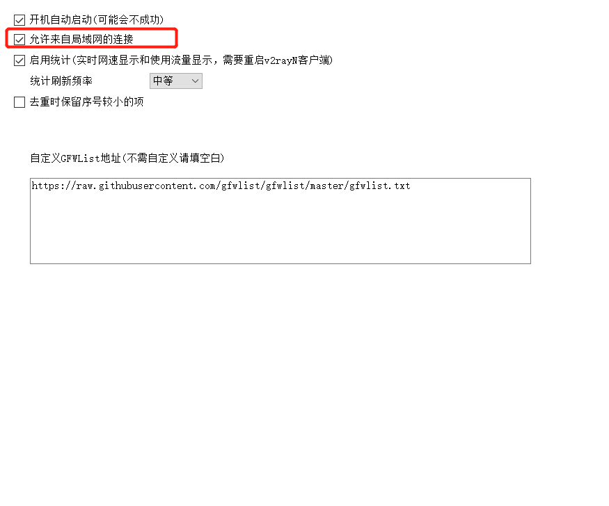
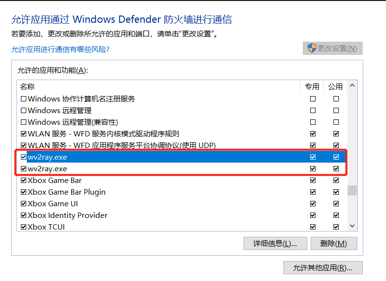

# 记录一次WSL2的网络代理配置

url：https://jiayaoo3o.github.io/2020/06/23/%E8%AE%B0%E5%BD%95%E4%B8%80%E6%AC%A1WSL2%E7%9A%84%E7%BD%91%E7%BB%9C%E4%BB%A3%E7%90%86%E9%85%8D%E7%BD%AE/


目标是在WSL2使用安装在Win10内的V2ray来实现科学上网.

## WSL2获取Win10ip

在Win10 -> WSL2这个方向, 是可以直接通过Localhost来访问的, 但是WSL2 -> Win10这个方向就不能直接访问Localhost了, 需要指定Win10的ip, 想要查看WSL2中Win10的ip, 只需要查看`resolve.conf` :

```
cat /etc/resolv.conf

# This file was automatically generated by WSL. To stop automatic generation of this file, add the following entry to /etc/wsl.conf:
# [network]
# generateResolvConf = false
nameserver 172.18.176.1
```

这个172.18.176.1就是在WSL2中Win10的ip.

想要方便获取这个IP, 可以直接使用下方命令 :

```
cat /etc/resolv.conf|grep nameserver|awk '{print $2}'
```


## WSL2设置环境变量

由于上面已经可以获取到Win10的ip, 这个时候就可以很方便的对各种环境变量进行设置, 因为V2ray的默认http端口为10809, socks5端口为10808, 所以可以直接设置环境变量 :

```
export windows_host=`cat /etc/resolv.conf|grep nameserver|awk '{print $2}'`
export ALL_PROXY=socks5://$windows_host:10808
export HTTP_PROXY=$ALL_PROXY
export http_proxy=$ALL_PROXY
export HTTPS_PROXY=$ALL_PROXY
export https_proxy=$ALL_PROXY
```

git也可以设置为使用代理 :

```
git config --global proxy.https socks5://$windows_host:10808
```

如果想要这些环境变量和设置每次启动终端都生效, 可以在`~/.bashrc`文件最下方添加上述内容 :

```
export windows_host=`cat /etc/resolv.conf|grep nameserver|awk '{print $2}'`
export ALL_PROXY=socks5://$windows_host:10808
export HTTP_PROXY=$ALL_PROXY
export http_proxy=$ALL_PROXY
export HTTPS_PROXY=$ALL_PROXY
export https_proxy=$ALL_PROXY

if [ "`git config --global --get proxy.https`" != "socks5://$windows_host:10808" ]; then
            git config --global proxy.https socks5://$windows_host:10808
fi
```

## 设置V2ray允许局域网连接



## 设置Win10防火墙

这一步是最重要的一步, 也是最坑的一步, 需要在Win10防火墙中允许V2ray进行公用和专用网络的访问! 只要设置这个就可以了, 不需要调整过其他设置!



找到所有带v2ray字眼的应用的选项, 全勾上就可以了. 在WSL2中输入`curl -vv www.google.com`验证是否正确访问谷歌.