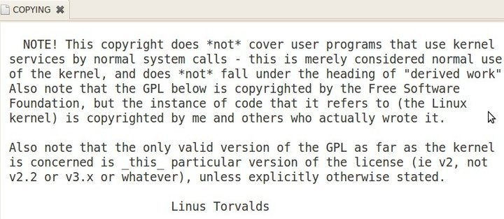
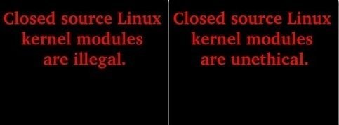
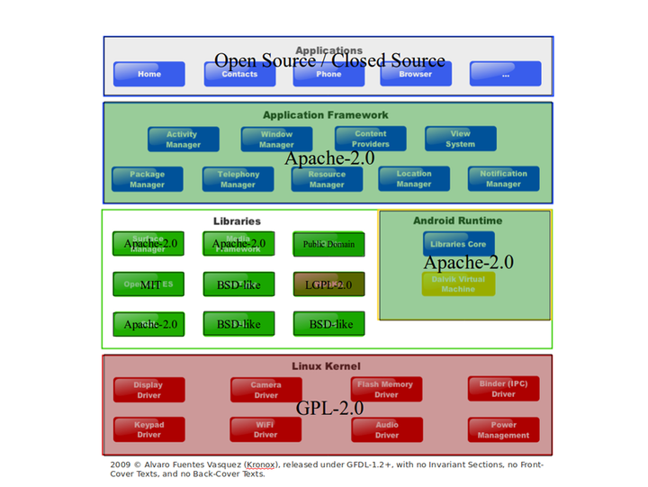
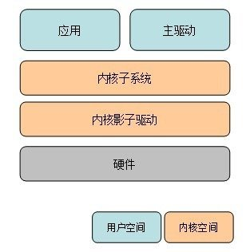
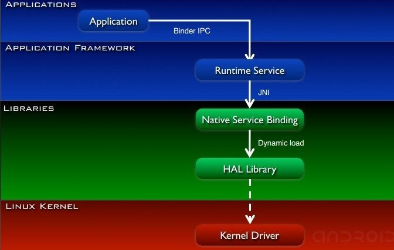

# Android ，在争议中逃离 Linux 内核的 GPL 约束

url：https://www.ifanr.com/92261

为这个题材起名，我思考了许久，GPL 是著名的开放源代码许可协议，Linux 内核开源项目正是在 GPL 的庇佑之下，十多年来在服务器、PC 端以及各种嵌入式设备上成绩斐然，是当之无愧的当代计算机软件的基石，说 GPL 代表着 Linux 的开源精神，毫不为过。然而，现实世界中，GPL 开源乌托邦和商业社会的丛林法则之间存在剧烈的冲突，其中犬牙交错，艰难成长，从中引发的思考，与大家共享。

### **Linux 内核的 GPL 约束**

总所周知，Linux 内核以 GNU 通用公共许可证第二版（GPL V2）的授权使用协议下发行。GNU 通用公共许可证是一种 “Copyleft” 形式的 “版权”，保障任何人都能够对 Linux 内核以及其衍生产品的使用、修改和重新发布的权力，前题是**不能修改发布条款**。什么意思呢，任何 Linux 内核的衍生产品（Derived Work）必须遵循 GPL 协议进行发布。然而问题的核心在于**什么是 Linux 内核的衍生产品**，其中有几个致命问题，业界争论了十年有多。

> 1、使用 Linux 内核的头文件定义，进行系统调用的程序是否会被定性为衍生产品？
>
> 2、链接使用了其他 GPL 的类库的程序是否会被定性为衍生产品？
>
> 3、Linux 内核动态载入的模块 LKM（[Loadable Kernel Modules](http://en.wikipedia.org/wiki/Loadable_kernel_module)）是否会被定性为衍生产品，以 LKM 形式开发的 Linux 驱动程序是不是衍生产品？

如果上述问题答案均为 “是”，GPL 将为 Linux 打造一个的 “**封闭** ” 的开源世界，什么意思呢？一个 Linux GPL 的操作系统核心运行在 “ 内核空间 ” ，上层的类库、框架、服务、应用运行在 “ 用户空间 ” 。用户空间上的任何服务不可避免的需要 Linux 内核的头文件，进行系统调用，因此，中间层服务必须遵循 GPL 进行开放源代码。调用中间服务层的框架或者其他服务使用了 GPL 的类库，因此，也必须是 GPL 的。同理，上层应用也被 “ 传染 ” ，必须是 GPL 的。于是，从内核到驱动到中间服务到上层应用，形成了一个 GPL 一体化软件授权的软件发布整体。可以认为，这个整体上任何开发成果都是 GPL 的，除非极少数的例外程序能够证明自身独立于系统的 GPL 环境。这样的一个 “软件闭包” 排斥的商业化的软件模块以及 “想要钱” 普通开发者，将整个软件世界划分为 “ GPL 与 GPL 兼容的” 的和非 GPL 的，每个开发从业者面临着选择，要么 Linux+GPL ，要么 Linux 与你无关。

重新回到这三个问题，第一个问题，曾经被 Linux 内核的作者 **Linus Torvalds** 以及内核开发人员多次澄清普通系统调用为非 GPL 的作用范围，甚至固化在 Linux 内核的源码 COPYING 文档中，为 Linux 用户空间的程序采用非 GPL 的授权许可证打下了基础。

第二个问题，具有明确的答案，是。这也是为何 GPL 被抨击为具有 “病毒感染” 的特性，一旦程序使用了 GPL 的模块，本身即被传染，程序必须成为 GPL。如果主程序与 GPL 类库是静态链接（Static Link）的关系，业界一般认为主程序必须限定为 GPL。而对主程序动态链接（Dynamic Link）GPL 类库主程序一般认为也必须是 GPL 的，若要打赢官司，必须证明主程序与 GPL 模块之间具有 “独立性和可区分性”（Separate and Independent），才能逃离 GPL 的约束。[GPL ](http://www.gnu.org/licenses/gpl-faq.htm)官方网站上的有这样的 FAQ：

> If a library is released under the GPL (not the LGPL), does that mean that any software which uses it has to be under the GPL or a GPL-compatible license? (#IfLibraryIsGPL)
>
> **Yes, because the software as it is actually run includes the library.**
>
>  如果一个类库以 GPL 的许可证授权进行发布（不是 LGPL），是否意味着任何使用该类库的软件必须以 GPL 或者 GPL 兼容的许可证下进行发布？
>
> 是，因为软件包含了该类库才能运作。

第三个问题，是硬件厂商和 Linux 内核开发社区之间一场旷日持久的争论的中心。最著名的，莫过与图形显示设备厂商 AMD/ATI、NVidia 出自硬件规格保密以及知识产权的考虑，长期以二进制软件包的方式独立发布图形驱动，涉嫌违反了 Linux 内核开放源代码的软件授权协议 GPL，至今仍是 Unity 与 Gnome 3 等依赖于硬件图形加速的新型桌面技术发展上的一大阴影。主要的 Linux 内核维护者 Greg Kroah-Hartman 曾经严厉的批判过，内核中的二进制软件包发布的模块是**非法的**、**不道德的**。

说到此处，可以看到 GPL 下的 Linux，存在着开源精神和商业机密以及知识产权保护相关的商业精神存在尖锐对立，对硬件厂商以及其他商业软件开发者来说，既不能忽视 Linux 广阔的商业市场，也不能放弃产品规格以及知识产权保护，两者都会伤害其立命之本。在早年的一份嵌入式操作系统选型的研究报告指出，Linux 相对于其他的 BSD 的 Unix Like 操作系统，由于 GPL 的约束限制，不具有商业优势。（参见引用 3）。一言以蔽之，业界有 GPL 的恐惧症。

然而，在移动互联网蓬勃发展的今天，一个 Linux 的发布版本，Android 在各种智能嵌入式设备上面大放异彩。据说，Android 之父 Andy Rubin 极度厌恶 GPL（James Bottomley，Linux SCSI 子系统的维护者说其人 “Working from an extreme dislike of the GPL”），然而 Android 向世人展示了采用 GPL 授权代码的手机也能获得巨大的市场成功。

### **Android：把 GPL 局限在内核空间**

下图是[ Openfoundry](http://www.openfoundry.org/) 绘制的 Android 的授权许可证结构，可以看到在 Android 多层软件栈中，仅仅最核心的 Linux 内核使用了 GNU 通用公共许可证，在这个层次上，Google 对 Linux 内核的所有修改必须反馈回 Linux 主版本树（Android 的内核将在 Linux 3.3 版本进行回归，两个版本的 Linux 内核进行融合）。

其上层的类库以及应用框架以及所谓用户空间部分，大部分使用了 “ 温和 ” 的 Apache-2.0 软件许可授权，允许 Android 上的开发商基于 Android 的源代码进行开发而不向社区反馈。基于上文讨论 GPL 的第一个问题，用户空间的类库以及程序使用 Linux 内核的系统调用不被视为是 Linux 内核的衍生产品，因而得以自由采用 Apache-2.0 的软件授权进行发布。GPL 世界和非 GPL 世界的分界线在于一个叫做 Bionic Libc 的类库。Bionic Libc 的关键之处在于如果 Bionic Libc 受到内核 GPL 的 “感染”，将会波及非 GPL 的用户空间的各个模块。

Android 的 Bionic Libc 的类库，采用 BSD 的许可证授权。在 2008 年 Google IO 大会上，一份著名的 PPT：“ Android Anatomy And Physiology ” 讲到 Android 使用 Bionic Libc 类库替换 Linux 常用的 Gnu glibc ，其中一个主要原因是 “ We want to keep GPL out of user-space ”。（这其实有点难理解，毕竟 Gnu glibc 采用的是 LGPL 而非 GPL，并基于上文 GPL 第一点的讨论，使用系统调用的程序不再被视为 Linux 内核的衍生产品，并不需要遵循 GPL，有兴趣者请看下文用户空间驱动部分的分析）。Bionic Libc 充满着非议，Bionic Libc 拷贝内核头文件的行为，并在源码中声明的版权信息均遭到了 “ 侵犯 Linux 内核 GPL 约束 ” 的质疑。这是 Bionic 头文件的版权信息，许多人认为是非法的：

> “This header was automatically generated from a Linux kernel header of the same name, to make information necessary for userspace to call into the kernel available to libc. It contains only constants, structures, and macros generated from the original header, and thus, contains no copyrightable information.”
>
> 头文件由 Linux 内核的同名头文件自动生成，用来获取完成用户空间系统调用的必要的信息。它只包含原头文件中的常数、结构和宏定义，因此，不包含版权信息。

不管如何，从目前的情况看，**让 GPL 止步于内核空间**的做法是成功的，并已经得到很大一部分内核开发者的认同。James Bottomley，Linux SCSI 子系统的维护者在 2011 年 LinuxCon 大会日本站上谈到  Android 的商业成功与 GPL 恐惧的时候说：

> We should also design more “bright line” systems which make the question of GPL compliance clear. The kernel’s user-space ABI is one such system; developers know that user-space code is not considered to be derived from the kernel. Making the boundary easy to understand helps to make the GPL less scary.

> 在遵守 GPL 的问题上，我们必须澄清一些界线。内核的用户空间 ABI（应用二进制接口）就是一种 GPL 的作用边界，能让开发者意识到用户空间的代码，不被定性为内核的衍生产品，如果 GPL 的界线清晰而易懂，可以帮助大家消除对 GPL 的恐惧。

### **缓解 Linux 驱动的 GPL 困境**

Android 的发展离不开硬件设备厂商的支持，硬件设备厂商最关注的是 Linux 驱动的 GPL 约束问题，公开驱动程序源代码将会泄漏设备的硬件规格和泄漏核心知识产权，这是硬件厂商 GPL 恐惧的缘由。Google 不遗余力的为硬件设备厂家排忧艰难，保驾护航。上文提到的 “ Android Anatomy And Physiology ”，文中清晰的讲到 Android 在用户空间与内核空间之间存在着硬件抽象层  HAL（Hardware Abstraction Layer），HAL 类库本质上一种用户空间的驱动，其中的主要用途之一：**规避 GPL**。

### **用户空间的驱动**

Linux 是~~单内核~~宏内核操作系统（Macrokernel），这种操作系统的一大特点是驱动存活在内核，优点是驱动与系统内核共生在相同的地址空间，运作的效率比较高，缺点是当驱动有问题的时候，容易危及内核的工作安全。用户区间驱动的思路是将驱动的主要业务逻辑剥离出来放到用户空间的主驱动模块中，内核中的驱动是个 “影子” 驱动，只有透传控制命令和数据的功能。

Android 的 HAL 相当于上图中的主驱动，其在内核中的驱动相当于上图中的影子驱动。规避 GPL 的硬件厂家把需要保护的商业机密以及知识产权相关的逻辑放在 HAL 层，以二进制包的方式发布，不需要公开源代码。

这种机制看上去很美，然而，同样面临着巨大的争议。HAL 类库与内核驱动之间通过**普通的系统调用**能够完成么？如果不是**普通的系统调用**，用户空间的驱动就违反了上文中的第一条，用户空间的驱动不能获得 GPL 例外的豁免。Edward J. Naughton 2011 年 3 月撰文认为，**普通的系统调用**应被理解为 gnu glibc 向外暴露的系统调用接口，而 Android 通过 Bionic libc 类库暴露了更多的接口，包括原来在内核空间才能使用的接口，其目的是为了让用户空间的驱动能够充分的利用内核和硬件资源。如果情况果真如此，Bionic libc 类库是 Google 的后门，这也可能 Android 抛弃使用 gnu glibc 重写 Bionic libc 的其中一个主要原因。Edward J. Naughton 说：

> Some of the calls exposed by Bionic are ordinarily not available to userspace because they’re excluded by the use of the #ifdef __KERNEL__ … #endif guards. If Google can define any call to the kernel from userspace as a “normal system call” (even those system calls ostensibly guarded by kernel matainers) simply by including it in its new C library, then a “normal system call” becomes whatever Google (or Oracle or Microsoft) wants it to be.
>
> Bionic 暴露了原来在用户空间不能使用的函数调用，这些调用原本在代码中被 __KERNEL__ 的宏定义保护其运行在内核状态。如果 Google 只要将在 Bionic 添加暴露的接口就可以自由的暴露 Linux 系统调用（这些系统调用明显应该由 Linux 内核社区维护），那么难免被其他人效仿。

### **总结**

总得说来，Android 为 GPL 下的 Linux 如何与商业社会并存与共赢提供了一个成功的范本，尝试为 Linux 生态系统上的各种角色划清彼此的作用范围，梳理了各方在版权上的权利和义务，目前看来获得了惊人的商业成功。然而，这种工作模式也面临着巨大的版权争议，理论上存在一种可能，一旦版权模式被否决，将面临被全盘否定的灾难。

>
>
>很高兴的看到随着 Android 的普及，有更多的人开始关注 Linux、开源社区以及自由软件文化，不过文章中的部分说法还是需要澄清的： 首先用来佐证 GPL 约束的三个问题理解有误。第一问题，系统调用 Linux API 作为一个 API，本来就不属于 GPL 这个版权法案的覆盖范围。原因可以参考最近为何 Oracle 的 Java API 官司失败了。内核开发者的标注完全是为了澄清误解，不是特别说明。第二个问题，没错，但仅在链接库只单独按照 GPL 协议发布的情况下。实际情况是几乎全部的桌面及嵌入 Linux 的基础库都按照多种协议发布，或者是带有例外条款的 GPL 协议。于是非 GPL 程序想链接系统库在实际中并不是问题。第三个问题，有些断章取义。闭源模块的分发的确是非法的，除非闭源模块提供者对这一点明确允许了并写明使用范围了（当下 NV 和 AMD 闭源显卡驱动既是如此）；闭源模块的的确是“不道德”的，因为闭源本身和 GPL 推崇的自由软件文化是相抵触的。但同样的，闭源模块并不是被 Linux 内核所禁止的。在 Android 之前以及之后 Linux 有非常多的闭源内核模块存在，嵌入式和桌面平台都有。另外，目前闭源显卡驱动这个问题比较复杂，牵扯交叉授权、硬件设计专利和第三方商业机密的问题，特别现在还有 HDMI 的 HDCP “搅局”，不是硬件厂商一拍脑门就能做的决断。个人通常将此看作是目前 Linux 驱动的特例，而非普遍情况。 至于下面对于 Android 驱动的说明，其中对于 HAL 的描述有些偏颇。硬件抽象层是一个在各种操作系统普遍存在的东西，Windows 也不例外，以前 Linux 和其他 *Nix 系统使用通用的HAL，不过在 Android 开始的那一年已经转向使用 Linux 特有的事件驱动 udev 实现了。HAL 是为了简化驱动开发而普遍存在的设计，并非规避版权。 剩下的论述基于的是被 Oracle 雇佣反对 GPL（准确的说是不懂 GPL）的律师 Edward J. Naughton 之口。且不说他的话有多少可信度，其中技术细节是漏洞不少的。 1. 一方面，为 Linux 开发驱动参考公开且不受 GPL 约束的 Linux API 即可，所用的 C 运行库的授权如何并没什么影响，glibc 有自己的例外条款。 2. Bionic libc 实际上的目的为了精简运行时开销，当初 Android 被设计可以在仅有 128M 内存的设备上长时间运行，那时已有的 glibc embedded 这方面做的不理想，所以 Google 另起炉灶了。 3. 没错，标记 Kernel 的意义是指出该调用由 Linux 内核组维护，但其目的是为了提醒你若是修改了该调用会导致内核不兼容情况，而非意味着违反了内核分发的 GPL 协议。重申：第一条中所指的违法情况是指非 GPL 的用户态组件调用了仅限 GPL 协议的内核符号。Android 使用的 Linux 内核本来就是 fork 出来的，根据特定的设备已经会动态加载闭源组件，通常除了有些显卡的驱动外最多的是通讯模块，于是其外围的、GPL 兼容 BSD 协议的 boinc libc 因此暴露出更多的调用毫无问题：闭源的用户态程序可以调用通过动态加载的闭源内核模块。 Android 所做的事情并非是划时代的，仅仅是在将桌面和服务器软硬件厂商已经划清楚的权利和义务传达给移动领域软硬件厂商。实际上，Android、Linux 社区和厂商的关系远比文章中所叙述的友好的多。尽管 Google 提供了通用的闭源内核态模块供不愿开放内核态驱动源代码的厂商使用，但是几乎全部的 Android 声卡驱动厂商都选择了开发内核态驱动甚至提交合并至上游，显卡驱动近期也在 Nvidia 和三星的带领下走向开放（Tegra 系列和 Exyos 系列显卡驱动为开源）。双方的努力下 Android 内核树已经大量合并入 Linux 内核主线，Linux 3.3 内核已经可以不做特殊更改就在 Android 设备上启动。厂商也慢慢在学会和开源社区合作并开放驱动，因为这样可以大大简化移植到其他基于嵌入式 Linux 平台的移植。 按照 FSF 的解释，GPL 从来都不是一种新的版权模式，完全是在现有版权模式下对于数字领域自由的一种规范和保障。所以不存在“版权模式被否定”的“这个理论上的可能”。 PS: 感兴趣 GPL 究竟是什么朋友可以参考下“自由软件许可证知识测验”：http://linuxtoy.org/archives/free-software-licensing-quiz.html