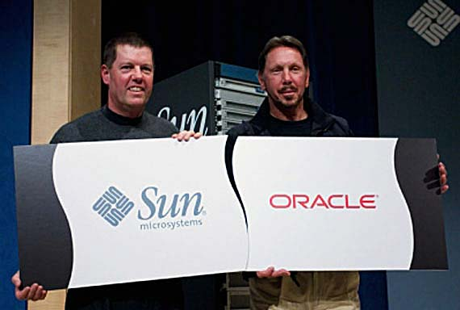
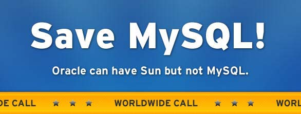

# 为什么GPL是更好的开源许可证?

url：http://www.ruanyifeng.com/blog/2010/02/why_gpl_is_a_better_choice.html


作者： [阮一峰](http://www.ruanyifeng.com/)

日期： [2010年2月27日](http://www.ruanyifeng.com/blog/2010/02/)

1.

让我从一件新闻讲起。

2009年，计算机业界发生了一件大事：甲骨文公司以74亿美元收购SUN公司。



消息宣布后，有一个人坚决反对这笔交易。他叫[Michael Widenius](http://en.wikipedia.org/wiki/Michael_Widenius)，是数据库软件[MySQL](http://www.mysql.com/)的主要创始人。


他为什么要反对呢？因为MySQL现在归SUN公司所有，一旦收购成功，就将属于甲骨文公司所有。但是，后者的主要产品是Oracle数据库，与MySQL是竞争关系。所以，甲骨文公司不可能扶持MySQL的后继开发，甚至有可能杀死MySQL。

Michael Widenius不能接受这个事实，他发起万人签名，提交请愿书，要求欧盟委员会否决这项交易。具体情况可以参见[HelpMysql.org](http://helpmysql.org/)。



2.

去年12月28日，他写了一篇很长的文章"[Help keep the internet free](http://monty-says.blogspot.com/2009/12/help-keep-internet-free.html)"，解释为什么反对这项交易。他是这样写的：

> "If Oracle were allowed to acquire MySQL, we would be looking at less competition among databases, which will mean higher license and support prices."
>
> "如果甲骨文得到了MySQL，数据库市场的竞争将会减少，最终导致更高的价格和收费。"

你觉得这句话对不对？

我觉得不对。我认为，甲骨文公司杀不死MySQL，数据库市场的竞争不可能减少。**这并非由于甲骨文公司不想这样做，而是因为MySQL是无论如何都不可能被杀死的（假定始终存在市场需求的话）。**

3.

为什么MySQL是杀不死的？

答案非常简单。因为它的许可证是GPL。

GPL明确规定，任何源码的衍生产品，如果对外发布，都必须保持同样的许可证。**这就是说，任何人只要发布MySQL的修改版本，他就必须公开源码，并且同意他人可以自由地复制和分发。**

现在让我们假想一下：

第一种情况：甲骨文公司决定中止MySQL的开发，会怎么样？

一定会有其他人接手，继续推出MySQL的后续版本，这是GPL许可证允许的，完全合法。虽然不能再叫MySQL这个名字，但是只要代码完全兼容，名字又有什么关系呢。事实上，Michael Widenius自己的公司，现在的产品[MariaDB](http://askmonty.org/wiki/index.php/MariaDB)就是基于MySQL的。

第二种情况：甲骨文公司决定，MySQL的后续版本不再开源，或者整体并入Oracle数据库，会怎么样？

答案更简单，不可能发生这种情况。因为根据GPL许可证，只要发布基于原代码的新产品，就一定必须开源。

4.

所以，我实际上觉得，Michael Widenius没有竭力反对的必要。不管甲骨文干什么，MySQL都不可能灭绝。

相反的，真正感到倒霉的人，应该是甲骨文公司才对，因为它花钱买来自己无法控制的财产。**任何的代码，只要置于GPL之下，就不再受作者或所有者控制了，想杀也杀不死了。**

5.

如果一个程序员想将自己的代码开源，他有许多种选择，大致可以分成三类：

　　1. 选择GPL许可证，要求衍生代码必须开源。

　　2. 将代码放入"公共领域"（public domain），彻底放弃版权。

　　3. 选择更宽松的许可证，比如BSD和Apache许可证，不要求衍生代码开源。

**许多人认为，选择后两种做法比选择GPL更值得赞扬，因为更加大公无私。但是，这样的看法是错误的，实际上GPL要好于后两种选择。**

让我们再来假想一下，如果MySQL的源码处于公共领域，或者BSD许可证之下，那会怎样？

那样的话，许多站长恐怕都会感到大难临头了。他们不得不做出选择，将来到底是升级到第三方小公司推出的、质量没有保证、支持力量薄弱、互相不兼容的基于MySQL 5.x版本的各种衍生数据库，还是升级到甲骨文公司推出的、与Oracle兼容的、号称具备各种新功能和最佳性能、并且广告满天飞的MySQL 6.0版本。

在BSD许可证或者公共领域代码的情况下，甲骨文公司可以从容地将MySQL 6.0变为闭源产品，推出你只有花钱才能买到的新特性和后继版本，并且只要你复制给他人使用，就要起诉你。使用开源软件的用户，将因此变为依赖甲骨文公司的用户。只有这种情况发生，才真正有必要，竭力反对甲骨文收购SUN公司。

当程序员放弃代码的版权，或者选择BSD许可证，他可能认为自己做出了世界上最无私的行为。很大程度上，事实确实如此。但是，我们要知道，这个世界是一个商业利益占主导的世界。一旦发生像甲骨文拥有MySQL这一类的事情，你的代码的价值将大大削弱，大公司先是免费利用它们，然后再设法推出取代它们的私有产品。你以为自己奉献了爱心，但是实质上变成了为大公司无偿打工。

**从这个角度看，GPL是更好的开源许可证。它保证了自由始终是自由，既无法被剥夺，也不是一种圈套或陷阱。**

6.

有的朋友读到这里，可能会提出疑问。如果GPL许可证真的这么好，那么为什么GNU基金会还推出了[LGPL许可证](http://www.gnu.org/licenses/lgpl-2.1.html)？

所谓LGPL许可证，全称是Lesser General Public License，直译就是"限制更少的GPL许可证"，1991年时与GPL（第二版）同时发布。它近似于BSD许可证，允许将代码用于闭源产品。

这就产生了一个很有趣的问题。为什么像Richard Stallman这种坚持自由丝毫不可侵犯的人，会同意将自己的代码用于闭源产品？

说起来，这其实是他的策略，主要与GNU C library有关。1991年的时候，市场上有很多C语言库可以选择。如果GNU的C库是GPL许可证，那么很多私有软件不会选择它，因为一旦选择了它，就意味产品本身一定要开源。所以为了保证开源软件得到使用和推广，并且闭源软件中有开源的成分，总比一点没有好，所以才诞生了LGPL许可证。

[Richard Stallman](http://www.gnu.org/licenses/why-not-lgpl.html)说得很清楚：

> "After all, there are plenty of other C libraries; using the GPL for ours would have driven proprietary software developers to use another--no problem for them, only for us."
>
> "毕竟，市场上的C库有的是。GPL许可证将迫使私有软件去使用他人的库，这不会给他们带来困扰，只会给我们带来困扰。"

所以，策略是这样的：**整体软件，或者没有替代品的代码库，一定要使用GPL许可证；有替代品的代码库，可以使用限制较少的开源许可证，但是在取到足够市场份额之后，也应该转为GPL许可证。**这就是为什么javascript的代码库，大多数都是类似BSD的许可证，而不是GPL许可证的原因，因为可替代自己的竞争者实在太多了。

总之，如果你想把自己的软件开源，只要不属于上面这种例外情况，GPL就是更好的选择。

（完）

### 文档信息

- 版权声明：自由转载-非商用-非衍生-保持署名（[创意共享3.0许可证](http://creativecommons.org/licenses/by-nc-nd/3.0/deed.zh)）
- 发表日期： 2010年2月27日


## 相关文章

- 2020.08.12: [勒索软件产业化的感想](http://www.ruanyifeng.com/blog/2020/08/ransomware.html)

  1、 最近，我看到一条新闻。

- 2020.07.22: [苹果放弃英特尔芯片，为什么会打击美国计算机产业？](http://www.ruanyifeng.com/blog/2020/07/apple-abandon-Intel-chips-hit-the-us-computer-industry.html)

  今年6月22日，苹果公司在一年一度的全球开发者大会 WWDC 上，宣布彻底放弃英特尔公司（Intel）的 CPU，改用自己设计的 ARM 芯片。

- 2020.06.16: [苹果电脑为什么要换 CPU：Intel 与 ARM 的战争](http://www.ruanyifeng.com/blog/2020/06/cpu-architecture.html)

  三个月前，新款 iPad Pro 发布，支持触摸板和鼠标。

- 2020.06.10: [Epic Games 研究：Fortnite 和游戏行业的未来](http://www.ruanyifeng.com/blog/2020/06/epic-games.html)

  Epic Games 是目前最热门的游戏软件公司，它的网络游戏 Fortnite（堡垒之夜）红遍全球，总游戏时间排名世界第一。

## 留言（44条）

***\*[Michael](http://www.zhengyiyu.com/)\** 说：**

或许用了商业友好的协议，MySQL不会那么封闭，而会有更多的厂商加入，是否会发展的更好呢？

对于GPL的MySQL，除了MySQL自己的人（应该以前算是Sun的雇员吧），我不知道还会有多少社区内的其他人参与了。就算是对于那些天才的independent contributors来说，总得有维护自己生活的手段吧。

***\*tomz\** 说：**

@ruanyf 如果把程序当作一个作品，希望被更多的人看到和学习，那么，就采用BSD许可，这样学习者学到后能马上拿来使用，更有学习动力，并且BSD许可简单，而 GPL总有很多法律的空子可以钻，比如android。尤其是开发人员只有一个人的情况，很多都是作者把程序当作作品来开发的。如果希望大家共同参与到开发中来，并且不希望有闭源的竞争者，那么GPL就是合适的许可证。如果项目以一个人或者一个公司开发为主，希望自己主导版权的选择，那么可以考虑象 firefox那样的MPL、GPL、LGPL三许可，这样版权拥有者集中，便于版权的维权。FSF也是这样的，要求贡献者将版权拥有权授予FSF。象 mySQL，我印象中是不接受外部贡献的（很可能是错误的），这样做的目的也是为了主导版权的变更。

***\*xmonkey\** 说：**

订阅这个blog很久了，也很喜欢ruanyifeng写的很多文章。
感觉最近的几篇blog，包括android／gpl的讨论，预设的立场太明显，偏向性太强了。
我知道这个blog是一个私人blog，输出私人价值观无可厚非。
但是之前却没有这种感觉。而且你真要“输出价值观”的话，换种文风可能更有效：P

这篇blog可能会引来像android那么类似的讨论吧。

***\*Ricky\** 说：**

就是不明白android怎么钻了GPL的空子？
android不是用了Linux Kernel代码么，按照GPL的规定不是应该也使用GPL么，怎么会是ASL的？

***\*[eefadmin](http://www.ee-forum.org/)\** 说：**

好文章。一直想了解一下几种许可证的差别，又没时间去研究它们的文本，谢谢博主此文:-)

***\*[zhaorui](http://zhaorui.cnblogs.com/)\** 说：**

> ```
> 引用xmonkey的发言：
> ```
>
> 感觉最近的几篇blog，包括android／gpl的讨论，预设的立场太明显，偏向性太强了。


我觉得有观点，有预设的立场没有什么关系，大家可以讨论；如果每个人都没有立场，才值得担心。

但是我有一点好奇，在我们伟大的祖国，只要你敢把自己的代码开源，选择什么协议有区别么？

比如我选了GPL，结果被人拿去商业开发，基本上不可能按照协议起诉

***\*[闲耘™](http://blog.xianyun.org/)\** 说：**

我很赞同xmonkey 的观点，感觉阮兄最近的文章非常的无力。

***\*[Sutra](http://shuqun.com/)\** 说：**

把GPL和商业对立起来是错误的，谁说GPL不能商业？

***\*[WindyWinter](http://www.briefdream.com/)\** 说：**

阮兄有个巨大的误解——“这就是说，任何人只要发布MySQL的修改版本，他就必须公开源码，并且同意他人可以自由地复制和分发。”
GPL的规定只对适用于GPL的软件有效，只能约束因GPL而获得软件的修改、发布等权利的人。MySQL虽然发布在GPL下，但SUN对MySQL的权利（版权），并不是由GPL授予，而是由SUN收购了MySQL获得的。现在，Orcale收购了SUN，意味着Orcale获得了MySQL的版权，它可以对MySQL做任何事情，包括停止开发，或者继续开发而后续版本不再发布在GPL下。
也就是说——任何人只要发布MySQL的修改版本，他就必须公开源码，并且同意他人可以自由地复制和分发，除了Orcale。

***\*[lovelywcm](http://wangcongming.info/)\** 说：**

第二种情况：甲骨文公司决定，MySQL的后续版本不再开源，或者整体并入Oracle数据库，会怎么样？

答案更简单，不可能发生这种情况。因为根据GPL许可证，只要发布基于原代码的新产品，就一定必须开源。

\-------------------

纠正一个问题：以上要求是对被授权方而言的。Oracle 作为 MySQL 的所有者，并不受此限制，法律上完全可以将 MySQL 的***后续版本***闭源。


另外，自由/开源/GPL最重要的，是它赋予用户的自由度，而非字面理解，公开源代码。GPL分发也可以是一种商业模式，GPL并不抵触商业。

***\*dybnu\** 说：**

1、反商业，这个是很不怎么样的意识形态的问题
2、GPL具有像病毒一样的感染和自我复制能力。它的存在导致如果你要成为竞争对手，只能另起炉灶，这减少了优良代码的利用率，也导致了竞争成本的高昂。
3、GPL号称自由，本质上却是反自由的，试想一下，别人写出来的代码，（尽管是基于你的开源代码），你怎么可以基于这个协议去无偿占有呢？这简直就是抢劫嘛。这个就像中国的房地产一样，土地只能租，不能卖，土地上的一切衍生品还归土地所有者拥有，不是荒唐么
4、为了使用一些GPL的软件（比如linux内核），并防止被GPL协议感染，不得不写一个与技术实现上无关甚至是多此一举的协议上的兼容层，正如这次的android，又或者换一种方式重新实现，比如BSD下各种基础工具，尤其gcc之类的，实在是很大的浪费。
5、对商业不友好，这也是多年来Linux一直缺乏核心竞争力和杀手级应用的原因。

***\*dybnu\** 说：**

想想为什么令Linus垂涎3尺的ZFS为什么不能在Linux上得到应用却被FreeBSD支持的缘故吧

***\*kyt30\** 说：**

你不想让我占有你的代码，就不要用开源的代码来修改。

bsd不是pd，如果bsd有理想，现阶段这个版权保护扭曲的时期也是乌托邦。

***\*kyt30\** 说：**

补充一下，写代码不是住房这种刚性需求，本来同一个问题就可以有很多种算法，没人逼你一定要用GPL代码。

***\*Denmark\** 说：**

up WindyWinter, lovelywcm

此外,从GPL到LGPL被视作可接受的,但到BSD和Apache是不能接受的..这中间的逻辑很难理解.应该说,恰恰相反,BSD和Apache才是更自由的许可协议.

***\*[ibeyond](http://www.ibeyond.net/)\** 说：**

观点有些不对，请参考一下2004年的XFree86事件吧，事实上，Oracle完全可以关闭MySQL项目。
http://zh.wikipedia.org/zh-cn/XFree86

***\*peterpan\** 说：**

"所以，我实际上觉得，Michael Widenius没有竭力反对的必要。不管甲骨文干什么，MySQL都不可能灭绝。

相反的，真正感到倒霉的人，应该是甲骨文公司才对，因为它花钱买来自己无法控制的财产。任何的代码，只要置于GPL之下，就不再受作者或所有者控制了，想杀也杀不死了。"

笨重繁杂的大型项目，有没有商业公司的倾斜和支持，差别是非常大的。

真正完全集市模式的项目是很少的

***\*[歪歪猪](http://blog.yypig.net/)\** 说：**

MySQL的最大问题是一开始就是双License的，一个是GPL，是免费的，还有一个是收费的。

***\*Ruan YiFeng\** 说：**

> ```
> 引用WindyWinter的发言：
> ```
>
> MySQL虽然发布在GPL下，但SUN对MySQL的权利（版权），并不是由GPL授予，而是由SUN收购了MySQL获得的。现在，Orcale收购了SUN，意味着Orcale获得了MySQL的版权，它可以对MySQL做任何事情，包括停止开发，或者继续开发而后续版本不再发布在GPL下。

啊，你说得对，Orcale可以将MySQL闭源……我没有考虑到这点。唉，这篇文章又出现了重大错误。

外部程序员对MySQL的贡献太少，成了一个致命的问题。如果贡献多一点，Orcale就没法改变授权了。

***\*JSK\** 说：**

提醒：MySQL采取GPL还是BSD/MIT，开源社区都可以fork，除非Oracle有修改历史上所有发布的MySQL版本的发行许可证的权力，否则第二天指不定基于先前开源版本的MySQL的名为OurSQL、YourSQL之类的就会冒出来了...

不过话说，还真没看到哪个大公司手里的有商业利益驱动的开源项目是用BSD/MIT许可的。对于大多数开源项目的founder来说，除非你有十足的自信（或者根本是为了这个打算而创建了项目）今后会被某大企业收购，否则基本不用考虑博主在这里所做的糟糕假设。

***\*yzb\** 说：**

> ```
> 引用Ruan YiFeng的发言：
> ```
>
> 啊，你说得对，Orcale可以将MySQL闭源……我没有考虑到这点。唉，这篇文章又出现了重大错误。
> 外部程序员对MySQL的贡献太少，成了一个致命的问题。如果贡献多一点，Orcale就没法改变授权了。

orcale可以将以后的许可不再采取GPL，但以前的GPL orcale并不能废止。

orcale极可能停止对mysql的支持，mysql的品牌价值得不到体现，就是一种意义上的死亡。

***\*[fisher](http://www.iamfisher.net/)\** 说：**

yifeng 这一组话题，很有点普及的意义。
争议在理性范围内进行，大家都有收获。

***\*blueGene\** 说：**

老阮，你这次又得说错话了？什么叫更好的开源协议？你文中说明的只是GPL这种协议的好处而没有对比的？freeBSD和apache的协议？说GPL是恶魔的不少

***\*roy_hu\** 说：**

> ```
> 引用dybnu的发言：
> ```
>
> 5、对商业不友好，这也是多年来Linux一直缺乏核心竞争力和杀手级应用的原因。

第5条不敢苟同，BSD系统发展的绝对不如Linux。

***\*行者道生\** 说：**

在宣扬普世价值以外，保留一些自己从事专业的东西，有何不可？ 阮兄对这些事情持何种观点都无所谓，重要的是感兴趣的人自可参加讨论评论，包括批评阮兄。

***\*dybnu\** 说：**

> ```
> 引用roy_hu的发言：
> ```
>
> 
> 第5条不敢苟同，BSD系统发展的绝对不如Linux。

BSD 对成功的定义和Linux是本质上不同的。他追求的不是软件的市场占有率，而是代码的占有率。

此外90年代的专利官司让BSD错过了最佳发展时期。

而Google，Sun之类的企业开源的时候更偏好BSD/Apache协议的原因，也是尽可能的不给客户带来法律上的风险和麻烦。这是真正的不作恶。

***\*weihello\** 说：**

你说的不无道理。不过，你太低估这些公司的伎俩了，他们可是在市场上搏杀出来的，不是技术论出身的。

IMO,仅靠GPL是难说的，迟早oracle会耍花招，甚至等到他耍完花招，若干年后你才恍然大悟。 毕竟，数据库市场是oracle的命根子。

***\*[laoguo](http://hi.baidu.com/laoguo2)\** 说：**

宇宙规则之一就是：万事都是有可能的。

所以小小一个人类所指定的GPL规则，破坏它，改变它，都不在话下。
即便是GPL规定了软件所有者不能把软件改为闭源，即便没有XFree86这个先例，有必要的话，Oracle也会而打破这个规矩。万事都是人定的。

各种缩写的规则，只不过是人类意识的外在体现。
人类意识的多元化，才是造成各种协议及其变种缤纷存在的根本原因。

人类意识的进化，其一，就体现在目前的免费协议的不断进化。免费，意味着金钱退出商业流通和服务领域，这，就是进化的趋势。
未来，金钱将退出人类历史舞台，进入物物交换和共享的时代，那个时代，被称为“黄金时代”，那个时代的初期，你我此生之内都会见到。


宇宙规则之二就是：万事万物都在进化和处于变化状态。

所以，如果存在一个规则，号称完美无缺，那么这个规则将渐渐失去生命力，成为落后的代名词。

因为这个世界并不存在绝对的好与坏。只存在变化的相对。

一旦我们把我们的视野专注于一个“看似的光明”，我们就会暂时失明，对其他的真实视而不见。

所以，与其专注于“自己臆造出来的好于坏”，
不如专注于隐藏在每一个，每一个缤纷万千的存在其背后的“爱”。

一个超乎人想象力的硕大的螺旋，在沿着固定的轨迹，螺旋上升，永无止境，就如同河流坚定的流向大海。

越早让自己的意识与之共心跳同呼吸，就越能摆脱各种令自己烦恼的东西。

不对这些最基本的宇宙基本规则有绝对的理解和信任，
就只能在各种对与错之间，荡秋千一般的荡来荡去。

***\*[1mojim](http://withsin.com/)\** 说：**

看了博主的关于海盗湾的几篇文章，非常敬佩。

***\*icy\** 说：**

我感觉Oracle收购Sun有相当一部分原因就是为了MySQL而来。因为他是靠DB吃饭的，MySQL是他最大的一个竞争对手之一。

Sun开源MySQL，对于MySQL是很好的。但是MySQL的资产一旦转移到了Oracle，相当于把MySQL的生死交到了Oracle，在同行业竞争里面，自己的命都被对手买了，这还不要命吗。

Oracle完成这个交易就相当于吸收了MySQL，消亡了这个品牌，以后即使想用到MySQL，也是用Oracle 1x Lite了。

***\*初来乍到\** 说：**

GPL —— 通向奴役之路

***\*楓之舞\** 说：**

但Android算是用混合協議的。內核是Linux的,用的是GPL協議，上面一層用了ASL協議。

> ```
> 引用Ricky的发言：
> ```
>
> 就是不明白android怎么钻了GPL的空子？
> android不是用了Linux Kernel代码么，按照GPL的规定不是应该也使用GPL么，怎么会是ASL的？

***\*Tin\** 说：**

楼主还不明白GPL，其实GPL是没有法律效果的，也就是比如我开发了一个全新IT技术，比如视频编码，直接以GPL形式放在网络，如果别人用你的技术申请专利，这个技术就是他的，而不是你的。所以，真正有法律效果的是专利，也就是说，你不申请专利再怎么用GPL都是无效的（如果你能找出足够的证据来说明这个技术最早是自己开发的这又是一回事了。）

同样，因为MySQL是MySQL AB公司的技术，MySQL AB公司拥有专利。SUN收购了MySQL AB，Oracle收购了SUN，所以MySQL是属于Oracle的，开不开源是Oracle的事，而不是楼主说的GPL的软件就必须开源，这是因为我们没有它的专利或者授权，而对于专利持有人来说，他可以对以后的版本不再开源。

至于楼上的Tomz和Ricky说Android钻了GPL的空子，没有这回事，Android把Linux内核当做底层，上面封装Java。Android炒作倒是真的，打着Linux开放的旗号到处炒作，以GPL形式开放，但是并没有正真完全开源，最后惹得GNU组织把Android赶走。

***\*[Roddy](http://www.kindsoft.net/)\** 说：**

只要想清楚软件拥有者和使用者的区别，所有开源许可都好理解，相当于房东和租客的区别，房东免费把自己房子租给别人使用不等于把房子送给别人。

版权（著作权）：
\1. 程序员A独立开发了B软件，那A自动拥有B的版权，除非A宣布放弃版权。
\2. 程序员C给B软件贡献代码，那C自动拥有贡献部分的代码版权，除非C宣布放弃版权。

使用许可：
\1. A可以采用任意许可（开源、闭源）发布B软件，使用B软件的人必须遵守A指定的许可。
\2. A随时可以变更使用许可。
\3. 许可是针对软件B的使用者的，A无需遵守。

***\*[Roddy](http://kindsoft.net/)\** 说：**

\> 楼主还不明白GPL，其实GPL是没有法律效果的，也就是比如我开发了一个全新IT技术，比如视
\> 频编码，直接以GPL形式放在网络，如果别人用你的技术申请专利，这个技术就是他的，而不是
\> 你的。所以，真正有法律效果的是专利，也就是说，你不申请专利再怎么用GPL都是无效的（如
\> 果你能找出足够的证据来说明这个技术最早是自己开发的这又是一回事了。）

你开发一个视频编码后自动拥有它的知识产权（不是专利，专利是必须申请），这个和GPL许可是没有关系的，如果别人用你的技术申请专利，就是明确的违法行为。
如果你全部独立完成，应该有足够的证据证明这个技术是你开发的，因为别人是你发布软件后才知道这个技术，所以在时间上会比你晚很多。

***\*吕朋\** 说：**

文章讲的很透彻，终于弄明白GPL了

***\*qdujunjie\** 说：**

> ```
> 引用zhaorui的发言：
> ```
>
> 
>
> 
> 我觉得有观点，有预设的立场没有什么关系，大家可以讨论；如果每个人都没有立场，才值得担心。
>
> 但是我有一点好奇，在我们伟大的祖国，只要你敢把自己的代码开源，选择什么协议有区别么？
>
> 比如我选了GPL，结果被人拿去商业开发，基本上不可能按照协议起诉


所以说有健全的法律，才会有人遵循协议，否则都是空谈，选择什么方式开源都一样

***\*Eric\** 说：**

好文章，楼主的文章总是那么通俗易懂。

***\*lalala\** 说：**

mysql推出新版本时是可以选择闭源的。这些开源许可证协议不是代表作者放弃自己的权利。首先作者是拥有这些权利，如果自己没所有权又如何有资格赋予别人权力呢？
只要作品所有作者一致同意，新版本的作品是可以更改许可协议的。旧版本不能更改，不能反悔。
mysql虽然接收了很多作者的代码，但他在接收时要求作者放弃权力。否则mysql是不会接受外来的代码。所以mysql的所有权牢牢掌握在mysql手中。如果它要在下一版本选择闭源，没人有权反对。当然摄于对公司声誉的影响，oracle不大可能把mysql把闭源，尤其是市场上有mariadb之类优秀的替代品的情况下。

***\*hbwhf\** 说：**

如果MySQL的源码处于公共领域，甲骨文公司可以从容地将MySQL 6.0变为闭源产品。但只有MySQL 6.0是闭源产品，而MySQL 5.x还是没有版权的公共领域程序。一定会有其他人接手，从MySQL 5.x开始产生一个不包含甲骨文的代码的分支版本，这个分支版本会继续开源

***\*[625d1eb1](http://local.io/)\** 说：**

GPL和BSD共同的目标是"保护作者利益"，只是多少的区别，不存在谁好谁不好，程序员如果真的很在乎利益，完全可以闭源，不公开，既然拿出去分享了，就一定会有被抄袭的可能(人家改个面目全非,你能怎么样)。换句话说，GPL和BSD是一纸空文，没有实际效力，选择哪个都一样，最终还是会被抄袭。。

GNU提出的"自由软件"，也不是"随意使用"的意思，而是意识上的自由，它反对的是意识上的约束，比如媒体的洗脑(引导舆论操控一个人的行为)。因此，GPL虽然没有实际效力，但思想很深远，而BSD纯粹就是无私奉献的意思。也正是这样，很多程序员都不愿意开源，因为他们不想自己的作品被亵渎。

***\*IFRFSX\** 说：**

GPL是要求提供源代码而不是一定只能公开，也可以作为软件二进制包的附赠品（前提是不可以单独去收费）

***\*打脸了\** 说：**

MySQL被Oracle收购之后正在逐步的封闭（自MySQL 5.5.31以后的所有版本将不再遵循GPL协议）

***\*compa\** 说：**

要理解GPL ,要从GNU 创始人大胡子的故事说起， 他购买了一个打印机，但是坏了一根针，他想改驱动软件，但厂商不给他源码，声称拥有版权copyright， 他作为消费者感到不公平，凭啥我不能改我自己东西的驱动。 所以他创造了GPL , 他管这个叫 copyleft， 也就是反版权的，他要保护使用者的利益。
所以，拿GPL去和apache或BSD一类的copyright去比较是可笑的。 就好像拿消费者保护法去和商标，著作权保护法比较。 这根本不是一个东西嘛。
GPL 保证消费者有权利拿到自己用的软件产品源代码， 作者可以拿GPL软件改了给消费者用，但不能不给源代码， 这完全是站在消费者利益出发