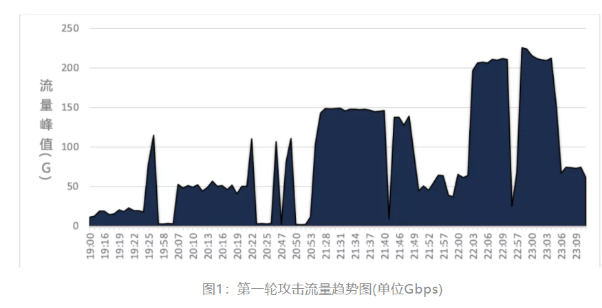
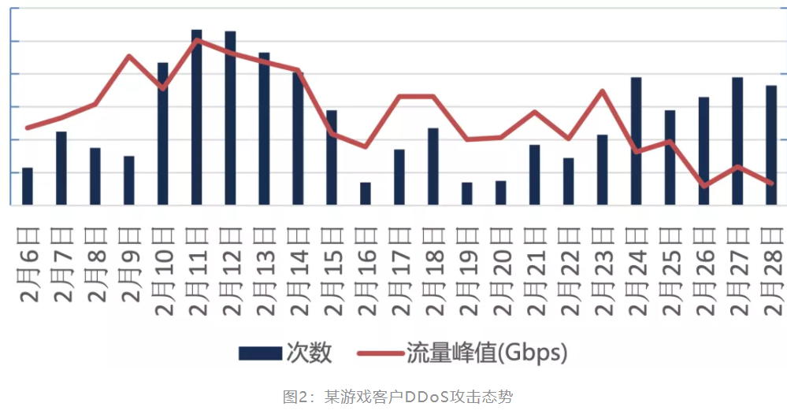
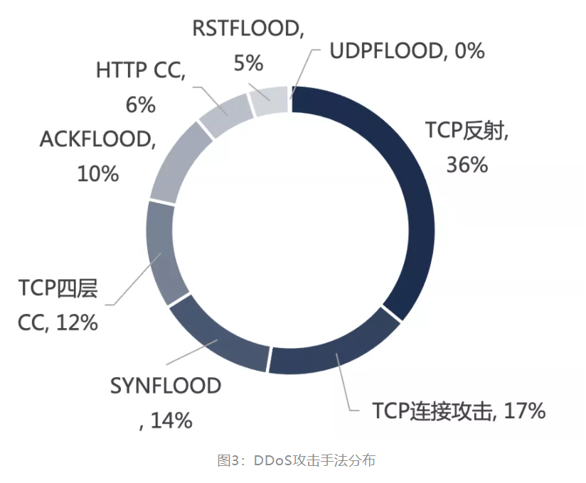
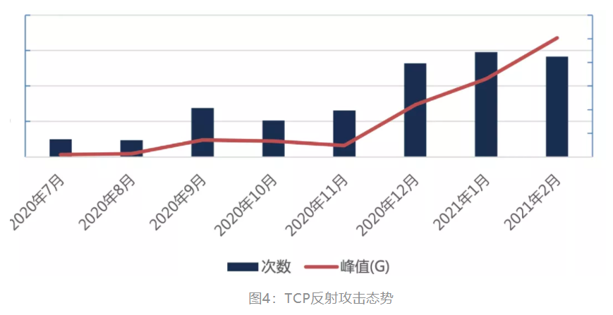
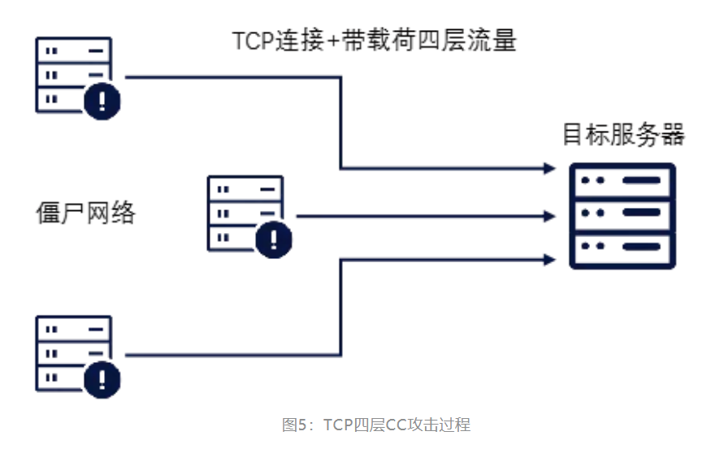
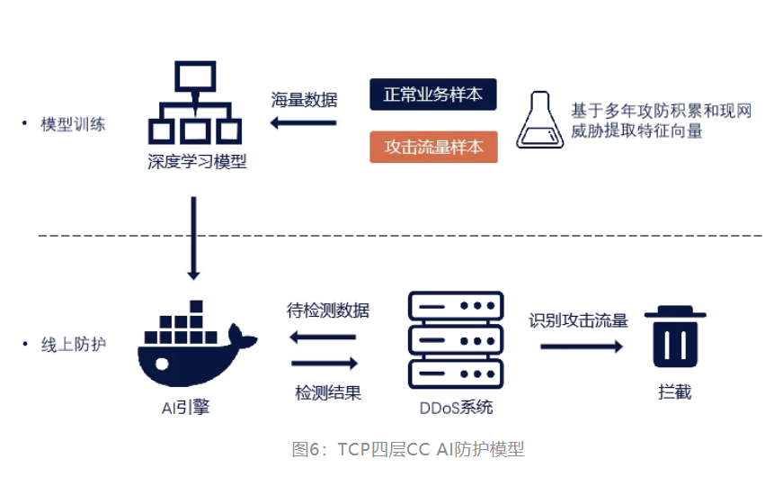
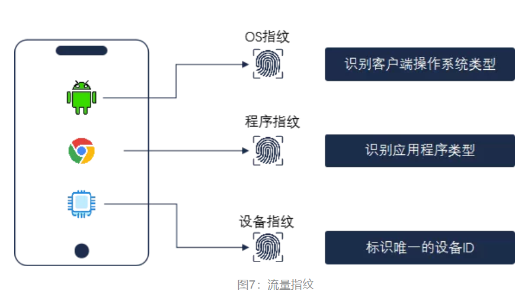
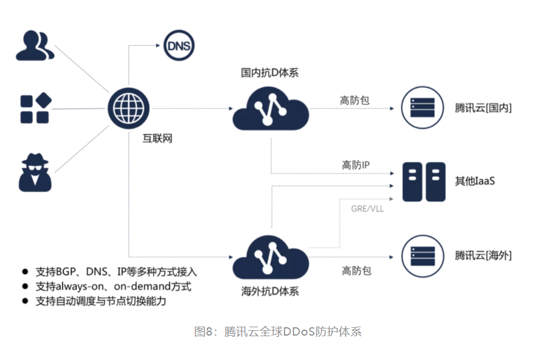

# 游戏业务DDoS攻防对抗案例分享

url：https://mp.weixin.qq.com/s/V6B1_0s8lMGw8Y2Xs6h3wg

>**背景**
>
>
>
>事实证明，每年春节假期，不甘寂寞、蠢蠢欲动的除了熊孩子，往往还有以DDoS为主业的黑客，而愉快的春节假期也随之成为DDoS攻击的高峰期。
>
>
>
>宙斯盾DDoS防护团队其实早已习惯与各种黑客"共度新春"，但2021年春节期间发生在腾讯云某游戏公司客户DDoS攻防大战却比以往的攻击更为凶猛、更加胶着。黑客为达目的，专门针对这个客户的多个游戏业务量身定制了完善的DDoS攻击方案，可谓无所不用其极，誓要将这个客户置于死地……

## 0x01. 突如其来，狼烟四起

2021年2月初，临近农历新年的一个晚上，宙斯盾系统响起一个紧急告警：腾讯云某一游戏客户大量业务IP遭受地毯式DDoS轰炸，数十个IP短时间内同时受到大流量攻击。

很显然这是专门针对该用户的恶意DDoS攻击事件。为此宙斯盾团队联合腾讯云高防产品团队马上联系到用户，与其沟通当前攻击态势及防护应对方案。

经初步分析，第一轮攻击中：每个IP平均攻击流量峰值230G、攻击持续4小时、多种攻击DDoS和CC手法混合、精准打击业务关键端口、选择业务高峰期攻击。这些特性组合起来似乎就是黑客要向我们宣战的号角，预示着更多攻击将接踵而来，一次攻防拉锯战即将开始。

## 0x02. 有备而来，不讲武德

不出所料，在接下来的十多天里，黑客每晚风雨不改、节假日无休地准时"打卡"攻击，露出一副誓要置游戏于死地的狰狞面目。

根据宙斯盾统计，在二十天内，该客户旗下多个游戏共遭受将近1300次DDoS攻击，单次攻击流量峰值更是超过500Gbps。

从攻击带宽大小来看，这个攻击峰值其实算不上很高(早在2018年腾讯云就曾为某客户成功防护峰值1.23Tbps的DDoS攻击)。

但经过团队仔细分析攻击手法和流量构成后确认这帮黑客实际是根据业务特征和弱点，精心策划的针对性的攻击，可谓有备而来。从以下3点可以明显看出：

**1. 熟悉业务，量身定做**

根据统计，现网的攻击者往往更喜欢用UDP反射（占现网80%以上），但我们发现这帮黑客却从未使用。因为他们知道游戏业务是基于TCP协议，所以防护方肯定会在防护系统上禁用UDP，而且云厂商可以与运营商定制ACL，在运营商骨干网直接封禁UDP协议，攻击流量再大往往也是徒劳。

所以黑客很聪明，精力都花在研究TCP攻击上，并为业务量身定制攻击方案。

**2. 深谙攻防，手法刁钻**

黑客在制定TCP攻击方案时无不表现出对DDoS攻防技术的深入理解，挑选的大多是业界公认防护难度最大的攻击手法，包括：TCP反射、TCP连接攻击、TCP四层CC、HTTP CC等(详细数据见图3)。

这些攻击流量大多基于完整的TCP连接或者存在合法的协议栈行为，甚至可以突破传统的DDoS防护策略，对防护方带来巨大的挑战，也对游戏业务乃至平台稳定带来严重的威胁。

**
\3. 兵不厌诈，专攻瓶颈**

TCP是基于连接的协议，所以在TCP攻击防护对抗时，服务器的连接数上线经常会成为防护防的瓶颈，而黑客似乎深知这一点，通过调用大量肉鸡发起低频的连接请求，通过很小的流量来耗尽服务器连接，这无疑使得防护难度大大提升，不得不说这帮黑客实在不讲武德。

面对准备充足、技术能力强的黑客攻击，宙斯盾防护团队如何逐一击破，保障业务和平台稳定的？接下来将详细分享。

**0x03. TCP反射：自研防护算法**

TCP反射实际并不是一种新颖的攻击手法，宙斯盾团队早在2018年就发布了业界首篇技术文章《[无心插柳还是有意为之：TCP反射DDoS攻击手法深入分析2.0](http://mp.weixin.qq.com/s?__biz=MjM5NzE1NjA0MQ==&mid=2651198528&idx=1&sn=35232201e6431fc76bbccde5b3b3644c&chksm=bd2cf1e68a5b78f02460695d299a39425303fc7cf8e72728cb195f8881e9b8492d5251dde0d1&scene=21#wechat_redirect)》，阐述该种手法的原理和危害。

而由于这种攻击手法存在协议栈行为，传统的反向挑战、协议栈行为检查等思路难以奏效，使得这种手法越来越受到黑产的青睐，终于在2020年Q3在云上爆发。

根据宙斯盾统计，TCP反射当前全网攻击次数从原来10+次/天上涨至1400+次/天，流量峰值从原来10+Gbps暴增至500+G，由此可见TCP反射已成为无法忽视的安全难题，且定必愈发泛滥。

**而TCP反射最主要的特点和防护难点在于：**

（1）通过反射可轻松获得大量来源IP合法且具有协议栈行为的流量；

（2）专业防D设备通常旁路部署，只有单向入流量，无法实现双向会话检查；

（3）可反射synack、ack、rst混合，使流量构成更加接近正常业务。

面对此等棘手的攻击，腾讯宙斯盾团队其实早已有备无患，在TCP反射爆发前已经自研业界首个TCP反射防护算法：可以无需人工干预、玩家无感知的前提下精确区分攻击流量和正常流量，实现自动化、智能化的清洗。所以在这次对抗中，TCP反射被有效防护，黑客并未得逞。

**0x04. TCP四层CC：AI+DDoS防护**

其实当下CC主要分为两大类：七层CC(基于HTTP协议)和四层CC(基于TCP协议)。

而由于被攻击的游戏业务并无HTTP，所以宙斯盾团队通过配置HTTP禁用策略即可轻松解决，但对于TCP四层CC，防护难度则直接被”拉满”。

所谓的TCP四层CC就是黑客控制大量肉鸡与目标服务器建立完整TCP连接后发送大量伪造的数据流量，导致耗尽服务器资源达到拒绝服务的目的。

这种攻击手法在TCP的业务场景上更加常见，而防护难点在于业务本身就是基于TCP开发的私有协议，本身并不规范，可用的防护特征和规则很少，难以区分攻击和正常流量。

业界防护TCP四层CC最彻底的方式就是让客户端接入SDK，客户端流量完全交由SDK接管，这样防护系统就可以根据与SDK协商制定的机制，高效识别出恶意流量，完成自动化防护。

但这种方案需要客户端和服务器改造代码接入，必然有一段较长的开发和测试周期，所以”远水救不了近火”。

实际上宙斯盾团队对TCP四层CC已经有多年的防护经验，并且自研了业界首个**基于深度学习的TCP四层CC解决方案：**

（1）利用腾讯自身的海量流量数据优势，采集大量数据对深度学习模型进行训练；

（2）深度学习模型收敛后具备对流量进行自动识别和分类的能力；

（3）现网防护过程中，DDoS系统与AI引擎联动，最终实现TCP四层CC的自动化识别和清洗。

依赖该深度学习方案并结合业务特征定制的策略，宙斯盾对该黑客发起的所有TCP四层CC攻击流量实现了高精度清洗，黑客再次未能得逞。

**0x05. TCP连接攻击：流量指纹识别**

在TCP反射、四层/七层CC都没有攻击效果后，黑客将目光转向TCP连接这个方向上，最终想到一种更“脏”的攻击手法：低频TCP连接攻击。此时防护方面临着4大难题:

（1）攻击肉鸡IP分布全国各地，没有明显集聚，且肉鸡IP不断轮换；

（2）肉鸡连接请求频率极低，与正常玩家接近，甚至比玩家更低；

（3）肉鸡建立请求后会发送极少量伪造的业务数据，攻击行为不明显；

面对诸多不利因素和巨大压力，宙斯盾团队经研究分析后，决定抛开黑名单、限速等传统的DDoS对抗思维，转而通过宙斯盾自研的流量指纹算法实现”绝地翻盘”。

所谓的流量指纹是通过被动式的流量分析，精确地识别客户端的关键信息，包括：操作系统类型、应用程序类型甚至定位到某台终端。

所以虽然肉鸡在流量、行为上已经无限接近正常玩家，但是在宙斯盾指纹识别算法下还是无所遁形，肉鸡和正常玩家被精确识别区分，攻击流量被防护系统精确拦截。

经过对抗，黑客的所有攻击手法被全部防护，业务也恢复了正常。正义的黎明终于到来。

**0x06. 腾讯云海量DDoS防护**

有人可能会说：有没有可能黑客会哪天恼羞成怒，转而发起超大流量的DDoS攻击呢？

当然有可能。面对这种威胁，腾讯云依赖自身超大的带宽优势和多年的攻防对抗经验搭建了覆盖全球的DDoS防御体系，能提供国内累计防护能力5T、海外累计防护能力1.2T的服务。

所以即使这个客户发起超大流量DDoS攻击也只能无功而返。*(腾讯云DDoS防护产品详情见https://cloud.tencent.com/product/ddos)*

**0x07. 重归平静？**

黑客精心定制的攻击方案无法凑效后，其实并未放弃，尝试了例如批量更换肉鸡IP、加大肉鸡IP数量、发起协议泛洪、脉冲攻击等方式，意图掀起波浪，但这些”努力”都被证实只是垂死挣扎。经过多天尝试无果后，最终黑客逐渐失去耐心，放弃攻击。

那是不是就天下太平，重归平静呢？答案似乎很骨感：并不是。所谓“只要有利益就是争斗，有业务的网络就有DDoS”。

无论是业务方还是防护方永远不能奢求哪天黑客会思想品德会突然拔高，放弃DDoS，反倒应该不断锤炼和创新自己，才能在愈发恶劣和复杂的抗D战场中先黑客一步，从容应对。

**宙斯盾DDoS防护团队**

宙斯盾DDoS防护团队基于十余年的DDoS防护技术积累，持续为QQ、微信、王者荣耀、英雄联盟等自研业务提供专业、可靠的DDoS攻击防护解决方案。与腾讯云安全团队合作推出高防产品为云上客户提供专业、可靠的DDoS解决方案。

**附录**

小隐隐于野：基于TCP反射DDoS攻击分析

https://www.cnblogs.com/qcloud1001/p/9039227.html

[无心插柳还是有意为之：TCP反射DDoS攻击手法深入分析2.0](http://mp.weixin.qq.com/s?__biz=MjM5NzE1NjA0MQ==&mid=2651198528&idx=1&sn=35232201e6431fc76bbccde5b3b3644c&chksm=bd2cf1e68a5b78f02460695d299a39425303fc7cf8e72728cb195f8881e9b8492d5251dde0d1&scene=21#wechat_redirect)