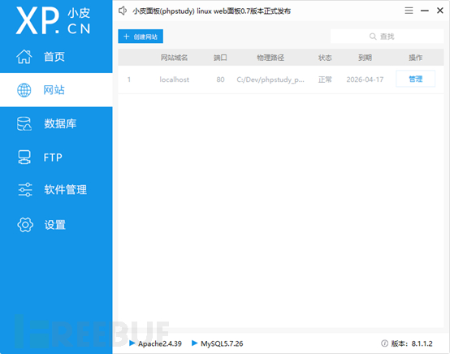

# 渗透神器：burpsuit教程之intruder模块

url：https://www.freebuf.com/articles/web/270618.html


## 0x00 前言

上文介绍了BP的Repeater模块，该模块可以实现对数据包进行修改和重新发送，进而对目标系统进行微调测试。本节将以此为基础为大家演示intruder模块。

## 0x01 Intruder简介

Intruder是可定制的、高度可配的工具，常用于对web应用程序进行自动化攻击，基本流程为设置代理并开启拦截请求，将拦截到的数据包发送到Intruder模块，添加需要攻击的参数，设置参数字典，开始攻击。

就这么直接扔简介怕是一头雾水，接下来通过一个小案例为大家演示它的用法和一些使用技巧

## 0x02 环境搭建

现如今绝大多数系统都要先登录后使用，本次搭建了一个简历的登录页面和验证逻辑，任务是通过BP弄出正确的账号，由于源码较少直接贴图

注意：为了模拟真实环境，源码中的账号和密码已经打了厚码，可以随意填写一组(千万注意要用单引号包围起来)

使用phpstudy创建站点



```
访问http://localhost/login.html
```

查看效果

输入连续10年霸榜的账号：admin 123456

OK，一切运行正常。接下来开始进入主题

## 0x03 为什么需要Intruder

这个问题可以从接下来的内容获取答案

首先打开BP设置代理(用BP自带的浏览器可以忽略此步骤)

访问

```
http://localhost/login.html
```

开启截断，随意输入一组账号密码点击登录

成功拦截到登录请求包，光速发送到Repeater

现在有两种方式爆破账号密码：

1、在浏览器中尝试

2、在BP中修改参数值

无论哪种方式都需要手工进行修改并发送，费时费力，这时候要是有一款能够自动化测试的工具就香了，Intruder也由此而生

## 0x04 Intruder介绍

将登录的请求包发送至Intruder

Intruder下有四个部分，接下来逐个介绍

### 4.1 Target

该部分设置攻击目标，包含目标主机(域名或IP)、目标端口以及是否使用HTTPS协议发送数据包

### 4.2 Positions

该部分主要设置攻击模式以及指明“恶意数据”的位置，每一处恶意代码都用一对$包围，在本例中需要爆破用户名和密码


PS：添加攻击位置仅需鼠标选中数据片段点击右侧添加即可

****

**攻击类型介绍**

狙击手：使用同一组数据对每一个位置都测试一遍，不同位置相互独立


破城槌：在所有的位置同步使用同一组测试数据


音叉：允许为每个位置单独设置一组数据


集束弹：允许为每个位置设置一组数据，不同于音叉，BP会自动对数据进行组合，组合方式类似于笛卡尔积

### 4.3 Payloads

在刚才添加测试数据时已经介绍一半了，不过刚才使用的是直接添加，当数据量较大时这个方法肯定不太行，BP为我们提供了从文件中读取数据的功能

注意文件内容的换行符尽量使用系统标准换行符

有些时候发送的数据要经过一些编码或者其他处理，这时候负载处理器提供规则设定功能，比如将所有的数据包都进行SHA1运算


此外，BP还支持自定义自动编码的字符

### 4.4 Options

该部分为Intruder的设置

请求引擎处，线程数可以根据目标系统的负载能力和实际情况灵活设定


正则匹配支持在响应包中检索内容并标识，正则提取支持从响应包中检索并提取

其余选项可以根据实际情况选择

## 0x05 实战

说了这么多，回到本次的演示环节中，通过Intruder爆破出预设的用户名和密码吧。

准备两份字典分别存储可能的用户名和密码，推荐将正确的账号密码混入其中

通过上面的介绍，爆破密码最好使用集束弹模式

设置测试数据

设置保持默认即可，开始攻击

结果很快就完成了，但是面对繁杂的条目如何挑选想要的结果呢，这里推荐大家一个基础方法就是看数据包状态和长度，由于本次环境响应码都是200，所以重点关注响应数据的长度，点击长度可以对结果进行排序

发现有一项与其他格格不入，点击查看详细数据

嘿嘿，渗透有时候就是这么容易~~~

## 0x06 END

随着攻防对抗不断升级，爆破难度逐渐提高，以后各位还会通过BP拓展插件、浏览器自动化测试、脚本测试等多种途径得到通行证。