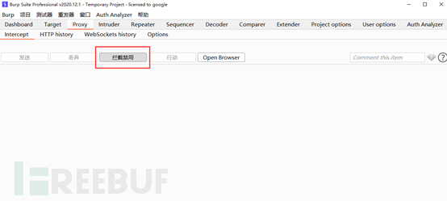

# 渗透神器：burpsuit教程 （入门）

url：https://www.freebuf.com/articles/web/270508.html

## 0x00 前言

Burp Suite (简称BP，下同)是用于攻击web 应用程序的集成平台。它包含了许多工具，并为这些工具设计了许多接口，以促进加快攻击应用程序的过程。

从本节开始将为大家陆续带来BP各个模块的使用说明

## 0x01 中间人攻击

中间人攻击（Man-in-the-MiddleAttack，简称“MITM攻击”）是一种“间接”的入侵攻击，这种攻击模式是通过各种技术手段将受入侵者控制的一台计算机虚拟放置在网络连接中的两台通信计算机之间，这台计算机就称为“中间人”。

## 0x02 核心功能—Proxy

**数据是一切的基础**

Proxy代理模块主要用于拦截浏览器的http会话内容，给其他模块功能提供数据，Proxy模块如下图所示

Proxy模块由四个部分组成，分别是Intercept、HTTP history、Websockets history、options，接下来分别演示使用

### 2.1 Intercept

这个词学汇编和逆向的同学肯定是非常熟悉了，就是截断的意思；这里控制整个代理模块是否使用截断模式。

TIPS：在BP新版本中，增加了专用的浏览器方便进行渗透测试

如果是使用低版本的同学，可以在浏览器中手动设置网络代理

手动修改代理设置是一件很繁琐的事，这里推荐大家使用SwitchyOmega插件方便快速的切换代理设置

当截断模式处于关闭状态时，BP可以视为正常的代理服务器

反之，当截断模式处于开启状态下，所有符合条件的数据包都将被拦截等待处理

当拦截到新的数据包后，对应的标题会高亮显示，此时我们就可以对数据包进行修改了

修改完成后点击发送(Forward)将修改后的数据包发送(放包)，如果看着数据包不舒服可以点击丢弃(Drop)(弃包)

在行动(Action)一栏中存在很多选项，可以将proxy中的数据包发送至其他模块中

### 2.2 HTTP history

这里记录了每一个HTTP数据包，可以通过此功能查看历史数据包

点击过滤器可以设置过滤选项

在记录中可以查看每一个数据包的明细(请求和响应)，并可以发送到其他模块

### 2.3 Websockets history

该功能和HTTP history十分类似，实际中很少用到

查看历史数据包

设置过滤器

### 2.4 options

该部分主要用于配置proxy，接下来逐个演示

**代理监听器**

可以理解为设置数据的来源，可以开启多个

配置CA证书部分比较繁琐，留以后单独出一期

**拦截客户端请求**

该部分用于配置请求数据包的拦截条件，支持多条规则同时匹配

现在增加一条规则：拦截所有目标IP为123.123.123.123的数据包

配置了多条规则后可以很方便的选择开关

自动更新Content-Length选项主要用于修改数据包后可以自动计算长度，在一部分情况下需要关闭该功能(比如想DOS)

**服务器响应拦截和修改**

该部分主要配置响应数据包的拦截条件及自动修改

注意：该功能默认是关闭的，需要手动开启

和请求拦截很类似，允许自定义拦截条件，同时还支持一些常用选项，比如删除JS的表单验证

**匹配和替换**

该选项允许对请求和响应中的数据进行自动查找和替换，十分有用

其他选项看实际需求即可

## 0x03 QA专区

Q：HTTP网站警告证书有xxxxx问题是怎么回事

A：应为BP使用的是自签发证书，浏览器不认，点击信任即可

Q：浏览器提示网站开启了HSTS，无法信任怎么办

A：清除浏览器缓存或者使用BP自带的专用浏览器，前者还需要清除每一个数据包中的HSTS字段

Q：部分请求和响应抓不到怎么办

A：看看过滤器是否包含了该项

Q：其他问题怎么办？

A：点头像看简介->留言