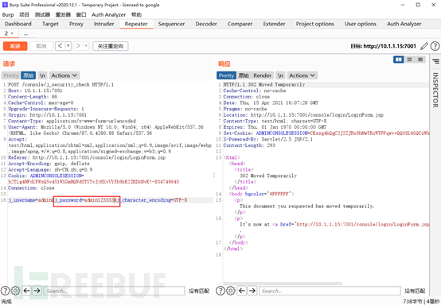

# 渗透神器：burpsuit教程 （汉化+Repeater）

url：https://www.freebuf.com/articles/web/270523.html


### 前言：释疑解惑

《BP使用教程一》发布后，后台收到了许多小伙伴的私信问BP是怎么汉化的，在这里统一为大家解答一下。

BP的汉化依赖于汉化jar包，在启动时引入汉化包即可，废话不多说，直接上命令：

```
java -Dfile.encoding=utf-8 -javaagent:BurpSuiteChs.jar -noverify -javaagent:BurpSuiteLoader.jar -jar burpsuite_pro_v2020.12.1.jar
```

效果如下：

使用这种方法每次启动的时候都需要额外开启一个DOS窗口，万一不小心关了直接GG，特别是当多个类似应用同时开启时，黑框框简直要命，鉴于此为大家提供一种方案可以隐藏DOS窗口

上述启动BP命令可以替代为：

```
set ws=createobject("wscript.shell")

ws.run("cmd /c java -Dfile.encoding=utf-8 -javaagent:BurpSuiteChs.jar -noverify -javaagent:BurpSuiteLoader.jar -jar burpsuite_pro_v2020.12.1.jar"),vbhide
```

将内容保存为xxx.vbs双击就可以了，但是要注意路径不能有空格否则会报错

**注意：先正常安装后再用脚本一键启动**


完整的BP12.1版本已为各位备好

```
链接：https://pan.baidu.com/s/1LPbDDPrOi9GbpEU0MQDbbQ

提取码：9cro
```

解压密码从下图寻找

## 0x00 正文

上回为大家演示了了BP的proxy模块，并将Proxy的截断功能类比为数据来源器。数据有了之后就是对其进行操作了，本节继续演示BP的Repeater模块

## 0x01 简介

Repeater(中继器)模块支持手动修改数据包并重新发送 HTTP 请求，同时还提供了历史记录方便分析数据包。可以通过手动调整HTTP请求来测试目标系统。

## 0x02 使用演示

启动BP并切换至Repeater

页面比较简洁明了，接下来打开个测试站点演示一下。


本次测试目标：

```
10.1.1.15:7001
```

，打开浏览器访问一下

开启截断模式，输入一组账号点击登录

此时BP成功拦截到了登录的HTTP数据包，将数据包发送到Repeater

回到Repeater查看

点击发送即可发送HTTP数据包

在请求和响应栏中有几个选项，分别是

Pretty：格式化后的数据包

原始：原始的HTTP数据包

Render：将HTTP响应渲染成页面

Action：对数据包进行操作

\n：是否显示换行符


修改数据包中的j_password参数为任意值重新发送

当发送了N次后突然想看之前的数据的话，可以通过数据包历史寻找


在Repeater的Action中有几项特有功能，接下来逐个进行演示，**请大家注意分清是请求包还是响应包**

复制数据包网址，省去了自行拼接URL的痛苦

在浏览器中显示：将响应包发送至浏览器渲染页面

注意：此处为了演示效果保留了原始的BP URL


0x03 END

本节对BP的Repeater模块进行了简单的描述，看完后记得多加练习！