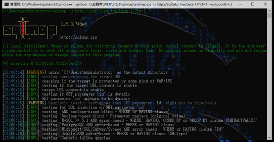

# 渗透工具教程：SQLMap教程-入门

url：https://www.freebuf.com/articles/web/271144.html


## 0x00 简介

SQLMap 是一个开源的SQL注入工具，可以用来进行自动化检测，甚至可以利用 SQL 注入漏洞直接获取目标数据库服务器的权限。它具有功能强大的检测引擎，针对各种不同类型数据库的渗透测试的功能选项，包括获取数据库中存储的数据，访问操作系统文件甚至可以通过外带数据连接的方式执行操作系统命令。

SQLMap支持的五种注入方法：

> 1.基于报错注入，即页面会返回错误信息，或者把注入的语句的结果直接返回在页面中
>
> 2.基于布尔的盲注，即可以根据返回页面判断条件真假的注入
>
> 3.基于时间的盲注，即不能根据页面返回内容判断任何信息，用条件语句查看时间延迟语句是否执行（即页面返回时间是否增加）来判断
>
> 4.联合查询注入，可以使用 union 的情况下的注入
>
> 5.堆查询注入，可以同时执行多条语句的执行时的注入

## 0x01 安装

```
官网：https://sqlmap.org/
```

下载后解压

这里重点关注几项

Tamper目录：存放tamper脚本

Sqlmap.py：sqlmap主程序入口

Sqlmapapi.py：SQLMap的API调用模式

## 0x02 基本使用

**本次以SQLI-labs****靶场为目标进行演示**

**SQLMAP****的语法将会在演示中逐个演示**

进入Less-1，随意上个ID

使用SQLmap自动化探测，命令如下

```
python sqlmap.py -u http://sqlilabs.top/Less-1/?id=1
```

参数说明：

-u / --url：目标URL，注意是漏洞URL不是系统URL

SQLMap检测到后台数据库可能是MySQL，询问我们是否跳过其他数据库的检测，选择Y跳过直接进行下一步

提示是否扫描等级为1风险为1下的所有payload，选择Y

参数ID是可以注入的，是否测试其他参数，由于本次只有一个参数，所以直接跳过即可

扫描结束，sqlmap为我们列举了四种可以注入的类型，分别四报错注入、布尔盲注、时间盲注和联合查询注入。

## 0x03 部分参数

上文使用SQLMap成功检测到了注入点，为了更深入的探测数据库信息，先了解几个常用参数

> --banner：指纹信息
>
> --batch：使用非交互式扫描，SQLMap将不会询问
>
> --dbs：获取数据库列表
>
> --tables：获取所有的数据表
>
> --columns：获取所有字段(列)
>
> --dump：获取行数据
>
> -D：指定数据库
>
> -T：指定数据表
>
> -C：指定字段，用逗号间隔
>
> --user：当前用户
>
> --current-db：当前数据库
>
> --is-dba：是否为DBA(Database Administrator)

## 0x04 获取数据

有了上面的基础，接下来就利用SQLMap获取当前数据库中的所有信息(拖库)

### 4.1 探测当前使用的数据库

当前数据库为：security

### 4.2 探测数据表

根据浏览器显示的信息和表名联合推测使用的数据表为users

### 4.3 获取user表中所有的行

NICE，成功拖库，其他的数据表自然也不在话下

## 0x05 拓展

### 5.1 探测POST请求的URL

对于POST请求的数据包可以使用-r参数从文件中读取数据

进入Less-11，抓取登录数据包

将BP中数据包保存到本地文件

成功检测注入点

### 5.2 探测等级和风险等级

--level：指定探测等级(1-5),级别越高探测的就越全面(不等于效果更好)

--risk：指定允许使用的payload等级(1-5)，级别越高，payload越全，但是风险也随之增长