# 渗透工具：蚁剑(AntSword)教学

url：https://www.freebuf.com/articles/web/270488.html


## 0x00 简介

蚁剑(AntSword)是一款开源的跨平台WebShell管理工具，它主要面向于合法授权的渗透测试安全人员以及进行常规操作的网站管理员。

蚁剑推崇模块化的开发思想，遵循开源，就要开得漂亮的原则，致力于为不同层次的人群提供最简单易懂、方便直接的代码展示及其修改说明，努力让大家可以一起为这个项目贡献出力所能及的点滴，让这款工具真正能让大家用得顺心、舒适，让它能为大家施展出最人性化最适合你的能力！

## 0x01 安装

蚁剑分为加载器和核心模块两部分，核心源码可由加载器自动下载

源码地址：

```
github.com：AntSwordProject/antSword
```

加载器Github地址：

```
github：AntSwordProject/AntSword-Loader
```

加载器Gitee地址：

```
gitee.com：AntSwordProject/AntSword-Loader
```

将加载器和源码下载后解压至磁盘

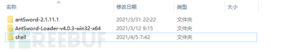

进去加载器目录启动加载器

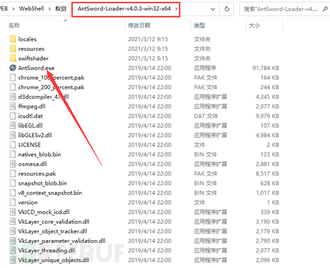

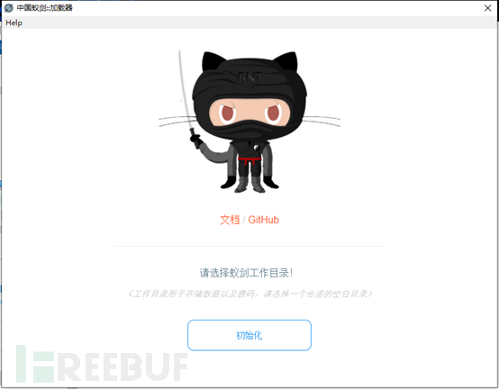点击初始化，选择源码目录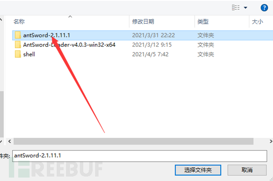

点击选择文件夹，等待初始化完毕后再次打开即可使用

## 0x02 基本使用

使用蚁剑需要一个WEB环境，本次使用PHPStudy搭建测试环境

### 2.1 创建PHP测试站点

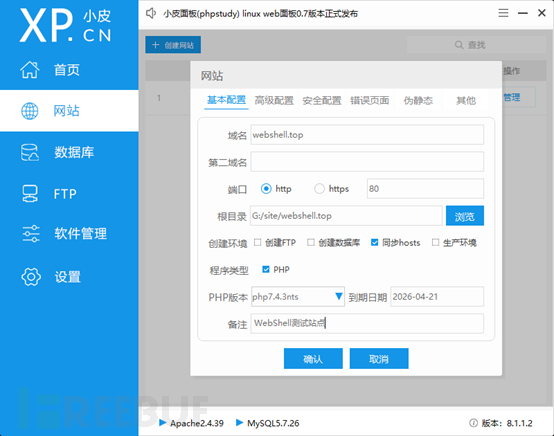

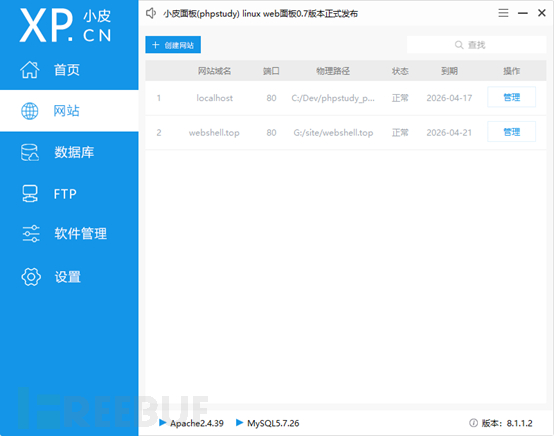浏览器访问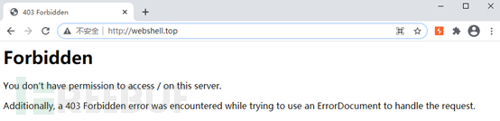

注意：这里如果报403是正常情况(个人取消了PHPstudy默认页面)

### 2.2 制作PHP后门

蚁剑官方为我们提供了制作好的后门

```
项目地址：github:AntSwordProject/AwesomeScript
```

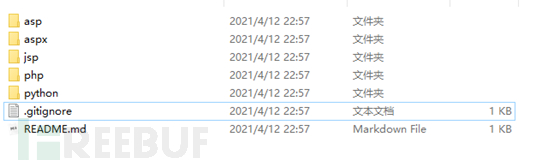官方的脚本均做了不同程度“变异”，在之后的教程中逐渐讲解，本次使用经典的PHP一句话木马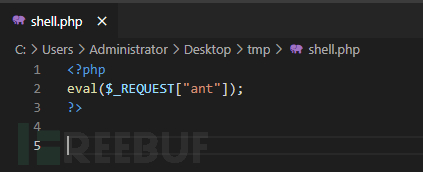

将木马放在站点目录下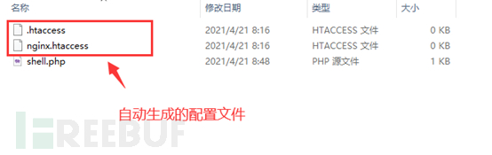

开启浏览器访问木马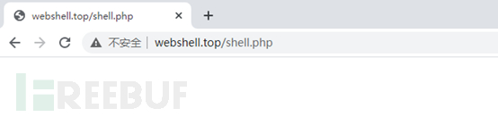

返回空白，打开浏览器开发工具查看数据包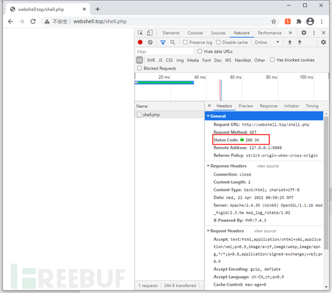

响应码为200，说明脚本正常运行

### 2.3 使用蚁剑连接WebShell

打开蚁剑添加数据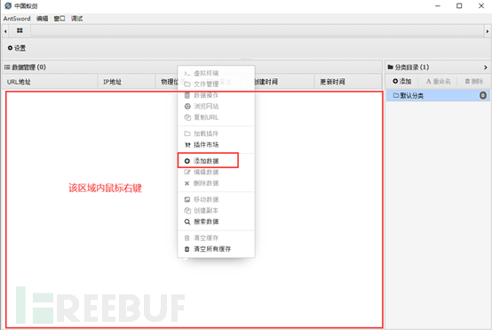

填写连接信息，点击测试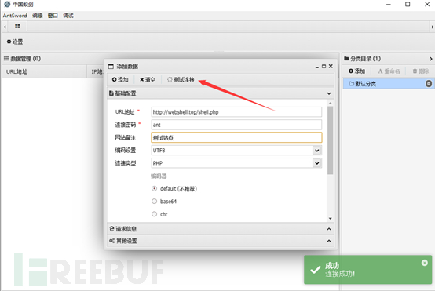

测试正常，点击添加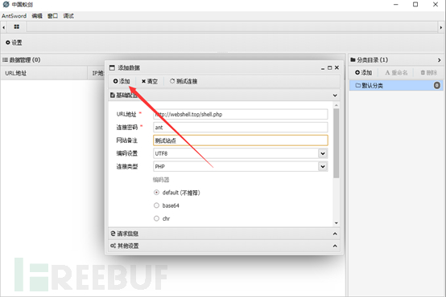

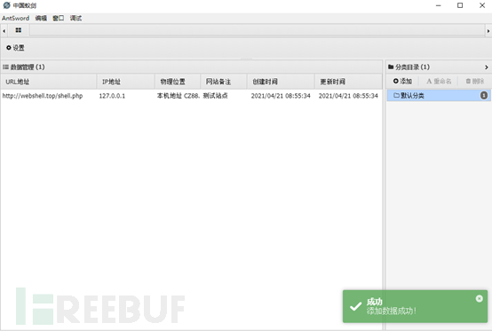选中该项右键查看功能菜单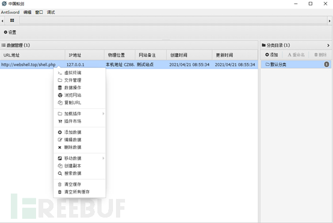

点击虚拟终端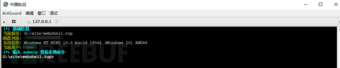

执行dir命令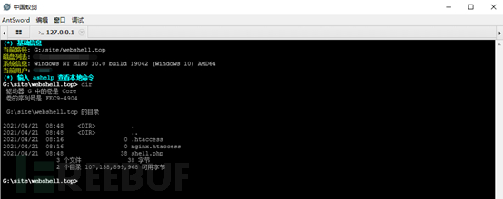

回到主菜单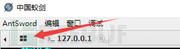

选择文件管理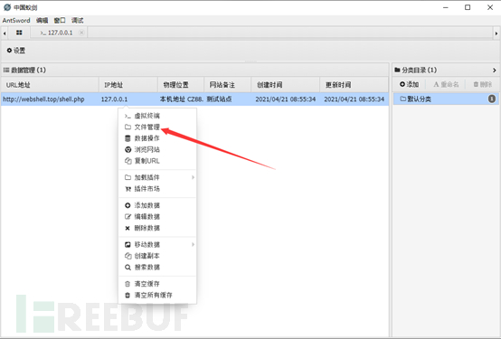

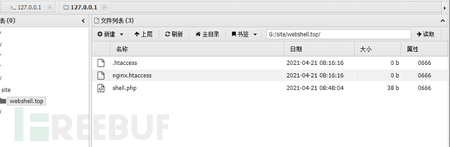双击shell.php查看内容，注意关闭的位置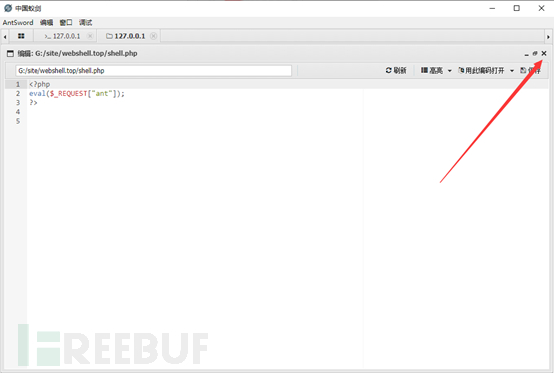

## 0x03 END

本次演示了如何使用蚁剑连接webshell以及虚拟终端和文件管理两大功能，望各位都能连接属于自己的专属shell