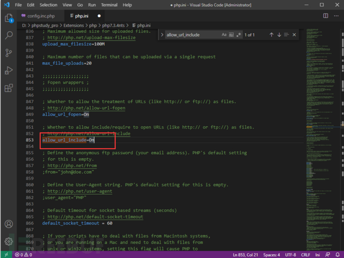

# WEB靶场搭建教程（PHPstudy+SQLllib+DVWA+upload-labs）

url：https://www.freebuf.com/articles/web/270837.html


# WEB靶场搭建教程

## 0x00 简介

渗透测试靶场基于“未知功焉知防”的理念，通过模拟真实的漏洞环境不断地训练和提高使用者的渗透测试技巧和能力，本次为大家带来几款热门的WEB靶场。

## 0x01 PHPstudy

作为一名积极进取的渗透从业者，电脑上肯定不止一个靶场，这时候想让它们乖乖的正常运行彼此不受干扰就不可避免的会进行WEB配置，这时候相信大家看见Apache、Tomcat、Nginx的配置文件就头大，毕竟我们现阶段的学习重心是渗透技巧；所以这里推荐大家一款PHP建站神器—phpstudty

废话不多说，给出如下地址

```
下载地址：https://www.xp.cn/download.html

安装教程：https://www.xp.cn/wenda/389.html

搭建站点：https://www.xp.cn/wenda/394.html
```

提示：安装完成后需要手工修改数据库root账号密码


此外，phpstudy默认的数据库管理工具phpmyadmin作者个人不怎么使用，推荐大家使用navcat进行连接

最后，推荐使用WAMP组合(后续都以WAMP为基础)


## 0x02 搭建SQLi-labs靶场

```
项目地址：https://github.com/Audi-1/sqli-labs/

下载链接：https://codeload.github.com/Audi-1/sqli-labs/zip/refs/heads/master
```

1 下载项目并解压到磁盘上


2 使用phpstudy创建站点


注意：

1. 域名随意设置，但是必填且唯一(即便不用)
2. 如果不想通过域名访问就要保证端口号唯一
3. 如果想通过域名访问就要勾选同步hosts(杀软可能会告警，无视即可)
4. php版本建议使用5.4

3 修改sql-connections目录下的db-creds.inc


4 打开浏览器访问域名，点击Setup/Reset Database初始化数据库


此时数据库已初始化成功，如果看到一堆Error就要检查账号密码是否正确以及数据库服务是否开启

5 测试

回到主页点击Less-1


作者提示我们他希望输入一个数字ID作为参数，那就来一个GET参数试试


靶场运行正常！

## 0x03 搭建DVWA靶场

**有了上面的基础，接下来的步骤直接加速**

```
项目地址：https://codeload.github.com/digininja/DVWA/zip/master
```

1 下载并解压


2 进入config目录，复制其中文件并去掉dist后缀


3 打开config.inc.php


由于部分小伙伴对于数据库并不熟悉，所以推荐大家使用root账号


4 使用phpstudy创建站点


5 访问域名


dvwa的检测程序提示我们部分功能未开启

6 开启URL包含功能

打开PHP配置文件php.ini(注意要打开与站点配置相同版本的)


搜索allow_url_include，可见此时是关闭的


将Off修改为On



7 回到首页重启WEB服务器


8 回到浏览器刷新页面


可见环境检测通过

9 点击Create/Reset Database初始化数据库


10 点击login


dvwa默认账号密码为：admin password

11 成功登录至DVWA靶场


## 0x04 搭建upload-labs靶场

```
项目官网：https://github.com/c0ny1/upload-labs

项目源码：https://codeload.github.com/c0ny1/upload-labs/zip/refs/tags/0.1
```

**说明：该靶场需要修改部分配置，可能会与其他靶场产生冲突，如果不想被莫名其妙的问题在折磨，可以使用作者安装好的环境(使用单独一套WEB配置)，但是需要额外注意端口冲突等问题**

**如果不想自己动手直接快进到本节第六部分**


上面两个都是使用不同域名相同端口区分站点，接下来使用不同端口区分站点

1 下载并解压文件


在根目录下创建upload目录


2 重点看下官网的介绍


PHP版本推荐5.2.17，开启gd2和exif拓展同时设置Apache以moudel方式连接

3 使用phpstudy创建站点


**注意：本次端口号使用23333**

4 开启PHP拓展

检查gd2拓展和exif拓展(点击对应的拓展名即可开启/关闭)


5 设置Apache以moudel方式连接

**注意：当系统存在多个站点时(特别是PHP版本不同)不能设置此选项，该步骤仅作为演示教学**

定位php5apache2_2.dll


打开Apache配置文件httpd.ini


增加配置


重启WEB服务器

6 打开站点测试


OK，可以收工了

## 0x05 END

靶场搭建完毕后就要不断地练习练习再练习

希望各位早日成为红队大佬