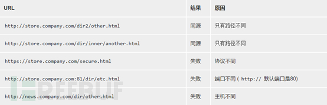
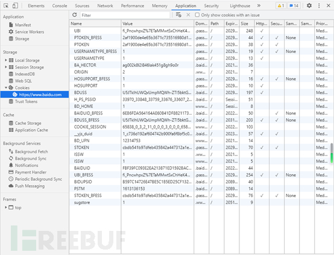
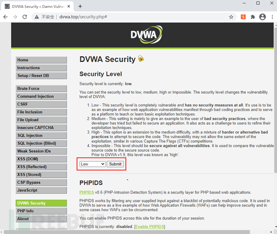
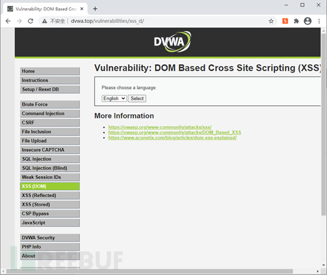
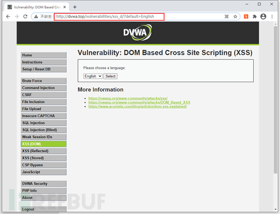
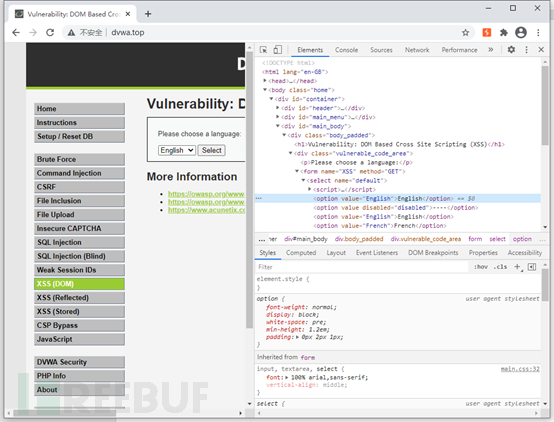
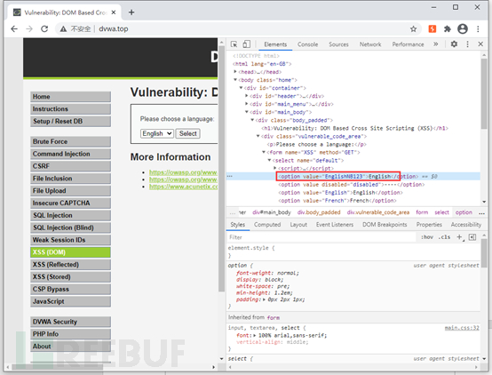
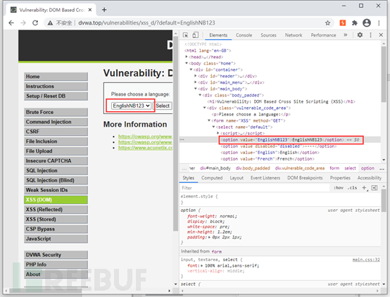
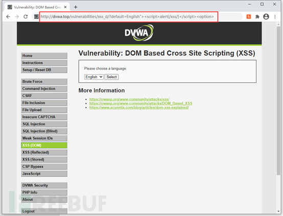
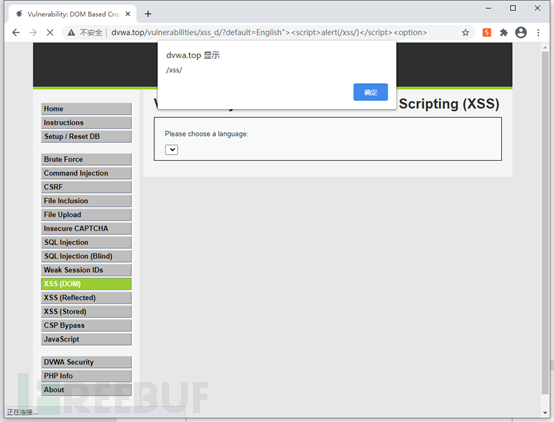

# XSS教程-基础入门

url：https://www.freebuf.com/articles/web/271765.html

# **0x00 简介**

Cross-Site Scripting（跨站脚本攻击）简称XSS，是一种代码注入攻击。攻击者通过在目标网站上注入恶意脚本，使之在用户的浏览器上运行。利用这些恶意脚本，攻击者可获取用户的敏感信息如Cookie、SessionID 等，进而危害数据安全。

附：为什么Cross-Site Scripting的简写不是CSS呢，因为被Cascading Style Sheets这个名称已经广为人知了且又同属计算机行业，所以改名为XSS

# **0x01 原理**

XSS和SQLI、RCE本质上都是注入类漏洞，核心要义都是构造payload逃逸程序原有的处理逻辑进而欺骗目标系统执行恶意代码。

XSS将恶意代码注入到网页中，使用户加载并执行攻击者恶意制造的网页程序。恶意代码通常是JavaScript、Java组件，VBScript，ActiveX，Flash或者就是原生的HTML。

# **0x02 准备知识**

## 2.1 同源策略

同源策略是一个重要的安全策略，它用于限制一个origin的文档或者它加载的脚本如何能与另一个源的资源进行交互。它能帮助阻隔恶意文档，减少可能被攻击的媒介。

如果两个 URL 的 协议、端口 (如果有指定的话)和主机 都相同的话，则这两个 URL 是同源。这个方案也被称为“协议/主机/端口元组”，或者直接是 “元组”。（“元组” 是指一组项目构成的整体，双重/三重/四重/五重/等的通用形式）。

下表给出了与 URL http://store.company.com/dir/page.html 的源进行对比的示例

Internet Explorer 的同源策略有两个主要的差异点：

- **授信范围**（Trust Zones）：两个相互之间高度互信的域名，如公司域名（corporate domains），则不受同源策略限制。
- **端口**：IE 未将端口号纳入到同源策略的检查中，因此 https://company.com:81/index.html 和 https://company.com/index.html  属于同源并且不受任何限制。

这些差异点是不规范的，其它浏览器也未做出支持，但会助于开发基于window RT IE的应用程序。

## 2.2 Cookie属性

name字段：一个cookie的名称

value字段：一个cookie的值

domain字段：可以访问此cookie的域名

path字段：可以访问此cookie的页面路径

Size字段：此cookie大小

http字段：cookie的httponly属性，若此属性为True，则只有在http请求头中会有此cookie信息，而不能通过document.cookie来访问此cookie。

secure字段：设置是否只能通过https来传递此条cookie。

expires/Max-Age字段：设置cookie超时时间。如果设置的值为一个时间，则当到达该时间时此cookie失效。不设置的话默认是session，意思是cookie会和session一起失效，当浏览器关闭（并不是浏览器标签关闭，而是整个浏览器关闭）后，cookie失效。

可以通过浏览器的开发者工具快速便捷的查看cookie

## 2.3 跨域请求

由于网页难免会请求其他源上的资源，所以放宽了政策—允许部分资源标签加载其他页面的内容，但是会被限制访问

常见的可跨域的HTML标签有：script、img、audio、video、embed、iframe、link(css)等

**JSONP跨域**

原理：浏览器不会限制script标签读取远程JS文件，客户端发出请求，浏览器动态生成JS文件内容然后返回，客户端再根据预规定的处理逻辑进行处理即可。

**CORS(跨域资源共享)**

跨源资源共享 (CORS) （或通俗地译为跨域资源共享）是一种基于HTTP 头的机制，该机制通过允许服务器标示除了它自己以外的其它origin（域，协议和端口），这样浏览器可以访问加载这些资源。

原理：服务端在响应头中添加Access-Control-Allow-Origin字段标识允许跨域访问的origin，例如

Access-Control-Allow-Origin: * 允许所有源访问

Access-Control-Allow-Origin: http://example.com 仅允许执行源访问

# 0x03 XSS类型

目前XSS主要被划分为三个类型：

- DOM型XSS：将代码注入到HTML的DOM节点中
- 反射型XSS：点击一次执行一次，不具有持久性，常用于制作钓鱼链接
- 存储型XSS：代码持久在系统中，用户访问了还有恶意代码的页面及被攻击，常见于论坛的回复或帖子内(还记得以前浏览器内遍地飞的小弹窗吗)

**所谓分类不过就是见仁见智，没有所谓的严格定义，怎么习惯怎么来**

# **0x04 实战演示**

本次将以DVWA简单难度为目标进行XSS演示

DVWA环境搭建参考：

[https://mp.weixin.qq.com/s?__biz=MzAxNzY0ODI5MQ==&mid=2247488873&idx=1&sn=e94d09cc59ecbe65d0fd3a2480837ade&chksm=9be30aa5ac9483b38a74f36ba396d91b54bed3dc7d61b5ef321ad523cf1b6ad31c24c45eefa2&token=902591238&lang=zh_CN#rd](https://mp.weixin.qq.com/s?__biz=MzAxNzY0ODI5MQ==&mid=2247488873&idx=1&sn=e94d09cc59ecbe65d0fd3a2480837ade&chksm=9be30aa5ac9483b38a74f36ba396d91b54bed3dc7d61b5ef321ad523cf1b6ad31c24c45eefa2&token=902591238&lang=zh_CN&scene=21#wechat_redirect)

进入DVWA修改难度

进入DOM XSS关卡

点击select

可以看到数据是通过default参数发送的

使用开发者工具查看DOM

修改DOM内容后点击select

可以看到，后台会将value值原封不动的写入option标签中，现在我们构造payload：English"><option>

发送请求

OK，成功

# **0x05 专项特训**

SQL注入可以通过sqlilabs进行针对性训练，同样的XSS也有专项特训

猛戳下方链接进入XSS挑战之旅：

https://sunian19.github.io/2019/12/10/XSS%E6%8C%91%E6%88%98%E4%B9%8B%E6%97%85/

# **0x06 END**

XSS的危害可大可小，关键在于攻击者如何利用它，使用得当即便是self-xss也可以发挥出无穷的威力，但更重要的是坚持不懈的练习.